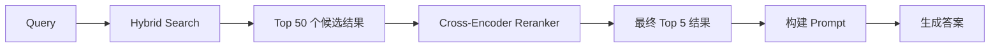
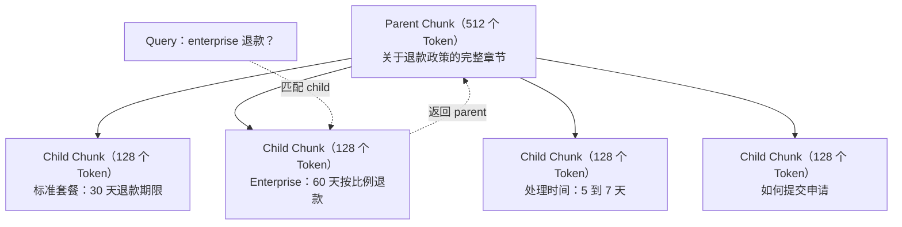
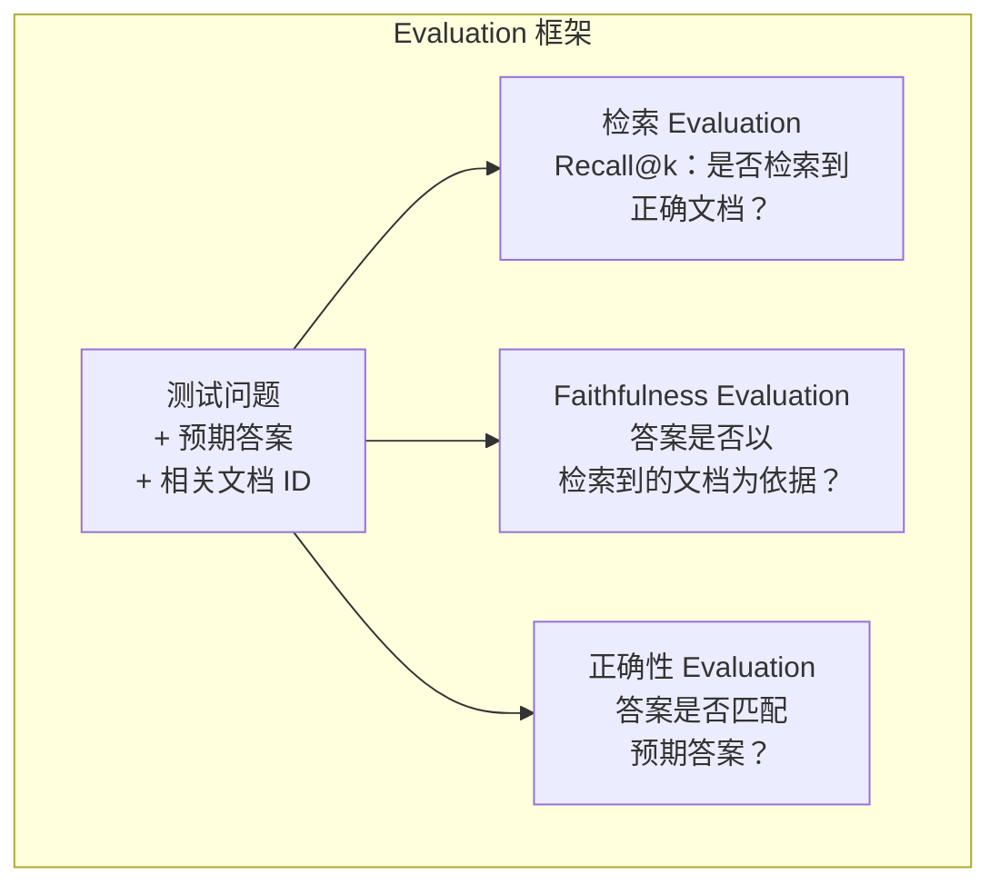

# 高级 RAG（Chunking、Reranking、Hybrid Search）

> 基础 RAG 会检索相似度最高的 top-k 个 Chunk。这种方法适用于简单问题，但面对 multi-hop 推理、含糊的 Query 和大型语料库时就会失效。高级 RAG 决定了一个系统究竟只能处理 10 份文档的演示，还是能够处理 1000 万份文档。

**Type:** Build
**Languages:** Python
**Prerequisites:** Phase 11，Lesson 06（RAG）
**Time:** ~90 分钟
**Related:** Phase 5 · 23（Chunking Strategies for RAG）介绍了全部六种 Chunking 算法，包括 recursive、semantic、sentence、parent-document、late chunking 和 contextual retrieval，并提供 Vectara/Anthropic benchmark。本课将在此基础上进一步讲解 Hybrid Search、Reranking 和 Query Transformation。

## 学习目标

- 实现能够保留文档结构和 Context 的高级 Chunking 策略（semantic、recursive、parent-child）
- 构建 Hybrid Search Pipeline，将 BM25 关键词匹配、semantic Vector Search 和 cross-encoder reranker 结合起来
- 应用 Query Transformation 技术（HyDE、multi-query、step-back），改善含糊或复杂问题的检索效果
- 诊断并修复常见 RAG 故障：检索到错误 Chunk、答案不在 Context 中、multi-hop 推理失败

## 问题

你已经在 Lesson 06 中构建了一个基础 RAG Pipeline。对于小型语料库中的直接问题，它可以正常工作。现在试试以下场景：

**含糊的 Query**：“上个季度的收入是多少？”Semantic Search 返回了关于收入战略、收入预测，以及 CFO 对收入增长看法的 Chunk。它们在语义上都与“收入”相似，却都不包含实际数字。正确的 Chunk 写着“2025 年 Q3 收益为 4720 万美元”，但使用的是“收益”而不是“收入”。Embedding Model 认为“收入战略”比“Q3 收益为 4720 万美元”更接近该 Query。

**Multi-hop 问题**：“哪个团队的客户满意度得分提升最大？”这需要找到每个团队的满意度得分，进行比较并确定最大值。没有任何单个 Chunk 包含完整答案，这些信息分散在各个团队报告中。

**大型语料库问题**：你有 200 万个 Chunk。正确答案位于 Chunk #1,847,293。top-5 检索返回的是 Chunk #14、#89,201、#1,200,000、#44 和 #901,333。它们在 Embedding 空间中很接近，却都不包含答案。在这种规模下，approximate nearest neighbor search 会引入足够大的误差，将相关结果挤出 top-k。

基础 RAG 失败的原因在于，Vector 相似度并不等同于相关性。一个 Chunk 可以在语义上与 Query 相似，却对回答问题毫无帮助。高级 RAG 使用四种技术解决这个问题：Hybrid Search（加入关键词匹配）、Reranking（更仔细地为候选结果评分）、Query Transformation（在搜索前修正 Query）以及更好的 Chunking（以正确的粒度进行检索）。

## 概念

### Hybrid Search：语义 + 关键词

Semantic Search（Vector 相似度）擅长理解含义。“如何取消我的订阅？”可以匹配“终止套餐的步骤”，即使两者没有共享任何词语。但它可能漏掉精确匹配。如果 Embedding Model 将“Error code E-4021”视为噪声，它可能无法匹配包含“E-4021”的 Chunk。

关键词搜索（BM25）正好相反。它非常擅长精确匹配。“E-4021”能够完美匹配。但如果文档写的是“终止你的套餐”，“取消我的订阅”可能返回零个结果。

Hybrid Search 会同时运行两种搜索，然后合并结果。

**BM25**（Best Matching 25）是标准的关键词搜索算法。自 20 世纪 90 年代以来，它一直是搜索引擎的核心算法。其公式如下：

```text
BM25(q, d) = 对 q 中的每个词项 t 求和：
    IDF(t) * (tf(t,d) * (k1 + 1)) / (tf(t,d) + k1 * (1 - b + b * |d| / avgdl))
```

其中，tf(t,d) 是词项 t 在文档 d 中的词频，IDF(t) 是逆文档频率，|d| 是文档长度，avgdl 是平均文档长度，k1 控制词频饱和度（默认值为 1.2），b 控制长度归一化（默认值为 0.75）。

简单来说：当文档包含 Query 词项时，BM25 会给出更高的分数，尤其是这些词项较为罕见时；但重复词项带来的收益会逐渐递减。一个包含“收入”50 次的文档，并不会比只包含一次“收入”的文档相关 50 倍。

### Reciprocal Rank Fusion（RRF）

现在有两个排序列表：一个来自 Vector Search，另一个来自 BM25。应该如何组合它们？标准方法是 Reciprocal Rank Fusion。

```text
RRF_score(d) = 对每个排序 R 求和：
    1 / (k + rank_R(d))
```

其中 k 是一个常量（通常为 60），用于防止排名第一的结果占据绝对优势。

某个文档在 Vector Search 中排名第 1，在 BM25 中排名第 5，其得分为：1/(60+1) + 1/(60+5) = 0.0164 + 0.0154 = 0.0318

某个文档在 Vector Search 中排名第 3，在 BM25 中排名第 2，其得分为：1/(60+3) + 1/(60+2) = 0.0159 + 0.0161 = 0.0320

RRF 会自然地平衡两种信号。在两个列表中都排名靠前的文档会获得最高分。仅在一个列表中排名第 1、但未出现在另一个列表中的文档会获得中等分数。这种方法非常稳健，因为它使用排名而不是原始分数，所以两个系统之间分数分布的差异并不重要。

### Reranking

检索过程无论使用 Vector、关键词还是 Hybrid Search，都很快但不够精确。它使用 bi-encoder：Query 和每个文档分别生成 Embedding，然后进行比较。Embedding 只需计算一次并可缓存，因此能够扩展到数百万份文档。

Reranking 使用 cross-encoder：将 Query 和候选文档一起输入 Model，由 Model 输出相关性分数。Model 可以同时看到两段文本，因此能够捕捉它们之间细粒度的交互。即使 bi-encoder 没有识别出关联，cross-encoder 也能理解“Q3 收益是多少？”与包含“Q3 为 4720 万美元”的 Chunk 高度相关。

代价是：cross-encoder 比 bi-encoder 慢 100 到 1000 倍，因为它需要联合处理 Query 与文档组成的输入对。你无法为 100 万份文档预先计算 cross-encoder 分数。解决方案是先检索更大的候选集（Hybrid Search 的 top-50），然后使用 cross-encoder 进行 Reranking，得到最终的 top-5。



常见的 Reranking Model（2026 年阵容）：
- Cohere Rerank 3.5：托管 API、支持多语言，在混合语料库上带来最佳 recall 提升
- Voyage rerank-2.5：托管 API，在托管选项中延迟最低
- Jina-Reranker-v2 Multilingual：open-weight，支持 100 多种语言
- bge-reranker-v2-m3：open-weight，强大的 baseline
- cross-encoder/ms-marco-MiniLM-L-6-v2：open-weight，可在 CPU 上运行，适合原型开发
- ColBERTv2 / Jina-ColBERT-v2：late-interaction multi-vector reranker，在评分阶段的复杂度为 O(tokens)，而非 O(docs)

### Query Transformation

有时问题不在于检索，而在于 Query 本身。“关于那项新政策变更的内容是什么来着？”是一个非常糟糕的搜索 Query。它没有包含任何具体词项，Embedding 也很模糊。任何检索系统都无法据此找到正确文档。

**Query rewriting**：将用户的 Query 改写为更合适的搜索 Query。LLM 可以完成这项工作：

```text
用户：“关于那项新政策变更的内容是什么来着？”
改写后：“近期的政策变更和更新”
```

**HyDE（Hypothetical Document Embeddings）**：不直接使用 Query 进行搜索，而是先生成一个假设答案，为其创建 Embedding，再搜索相似的真实文档。

```text
Query：“enterprise 的退款政策是什么？”
假设答案：“enterprise 客户在购买后 60 天内可以获得全额退款。
退款金额将根据剩余订阅期按比例计算，并在 5 到 7 个工作日内处理。”
```

为假设答案创建 Embedding，然后搜索与其相似的真实文档。其直觉是：在 Embedding 空间中，假设答案比原始问题更接近真实答案。问题和答案具有不同的语言结构。通过生成假设答案，可以弥合 Embedding 中“问题空间”与“答案空间”之间的差距。

HyDE 会在检索前增加一次 LLM 调用，使延迟增加 500 到 2000ms。当原始 Query 的检索质量较差时，这个代价是值得的。

### Parent-Child Chunking

标准 Chunking 必须进行权衡：小 Chunk 能够实现精确检索，大 Chunk 则能提供足够的 Context。Parent-child Chunking 消除了这种权衡。

为较小的 Chunk（128 个 Token）建立索引以执行检索。当检索到小 Chunk 时，向 Prompt 返回其 parent Chunk（512 个 Token）。小 Chunk 可以精确匹配 Query，而 parent Chunk 能为 LLM 提供足够的 Context，以生成良好的答案。



Query“enterprise 退款？”能够精确匹配 child Chunk C2，但 Prompt 接收到的是完整的 parent Chunk P，其中包含关于处理时间和提交过程的周边 Context。

### Metadata Filtering

运行 Vector Search 前，先按照 metadata 对语料库进行筛选：日期、来源、类别、作者和语言。这可以缩小搜索空间并避免返回不相关结果。

“上个月安全政策发生了什么变化？”应该只搜索过去 30 天内属于安全类别的文档。如果没有 Metadata Filtering，系统会搜索整个语料库，并可能检索到一份两年前的安全文档，仅仅因为它在语义上与 Query 相似。

生产环境中的 RAG 系统会在每个 Chunk 旁存储 metadata：源文档、创建日期、类别、作者和版本。Vector Database 支持在相似度搜索前根据 metadata 进行预筛选，这对于大规模系统的性能至关重要。

### Evaluation

你已经构建了一个 RAG 系统。如何知道它是否有效？可以使用三个指标：

**检索相关性（Recall@k）**：对于一组已知相关文档的测试问题，有多少比例的相关文档会出现在 top-k 结果中？如果某个问题的答案位于 Chunk #47，那么 Chunk #47 是否会出现在 top-5 中？

**Faithfulness**：生成的答案是否以检索到的文档为依据？如果检索到的 Chunk 写着“60 天退款期限”，而 Model 却回答“90 天退款期限”，这就是 Faithfulness 失败。尽管 Context 正确，Model 仍然产生了 hallucination。

**答案正确性**：生成的答案是否与预期答案一致？这是端到端指标，综合反映了检索质量和生成质量。

一个简单的 Faithfulness 检查方法是：提取生成答案中的每项陈述，并验证其含义是否出现在检索到的 Chunk 中。如果答案包含任何检索结果中都不存在的事实，它很可能是 hallucination。



```figure
agentic-rag-loop
```

## 构建实现

### 步骤 1：BM25 实现

```python
import math
from collections import Counter

class BM25:
    def __init__(self, k1=1.2, b=0.75):
        self.k1 = k1
        self.b = b
        self.docs = []
        self.doc_lengths = []
        self.avg_dl = 0
        self.doc_freqs = {}
        self.n_docs = 0

    def index(self, documents):
        self.docs = documents
        self.n_docs = len(documents)
        self.doc_lengths = []
        self.doc_freqs = {}

        for doc in documents:
            words = doc.lower().split()
            self.doc_lengths.append(len(words))
            unique_words = set(words)
            for word in unique_words:
                self.doc_freqs[word] = self.doc_freqs.get(word, 0) + 1

        self.avg_dl = sum(self.doc_lengths) / self.n_docs if self.n_docs else 1

    def score(self, query, doc_idx):
        query_words = query.lower().split()
        doc_words = self.docs[doc_idx].lower().split()
        doc_len = self.doc_lengths[doc_idx]
        word_counts = Counter(doc_words)
        score = 0.0

        for term in query_words:
            if term not in word_counts:
                continue
            tf = word_counts[term]
            df = self.doc_freqs.get(term, 0)
            idf = math.log((self.n_docs - df + 0.5) / (df + 0.5) + 1)
            numerator = tf * (self.k1 + 1)
            denominator = tf + self.k1 * (1 - self.b + self.b * doc_len / self.avg_dl)
            score += idf * numerator / denominator

        return score

    def search(self, query, top_k=10):
        scores = [(i, self.score(query, i)) for i in range(self.n_docs)]
        scores.sort(key=lambda x: x[1], reverse=True)
        return scores[:top_k]
```

### 步骤 2：Reciprocal Rank Fusion

```python
def reciprocal_rank_fusion(ranked_lists, k=60):
    scores = {}
    for ranked_list in ranked_lists:
        for rank, (doc_id, _) in enumerate(ranked_list):
            if doc_id not in scores:
                scores[doc_id] = 0.0
            scores[doc_id] += 1.0 / (k + rank + 1)
    fused = sorted(scores.items(), key=lambda x: x[1], reverse=True)
    return fused
```

### 步骤 3：Hybrid Search Pipeline

```python
def hybrid_search(query, chunks, vector_embeddings, vocab, idf, bm25_index, top_k=5, fusion_k=60):
    query_emb = tfidf_embed(query, vocab, idf)
    vector_results = search(query_emb, vector_embeddings, top_k=top_k * 3)
    bm25_results = bm25_index.search(query, top_k=top_k * 3)
    fused = reciprocal_rank_fusion([vector_results, bm25_results], k=fusion_k)
    return fused[:top_k]
```

### 步骤 4：简单 Reranker

在生产环境中，你会使用 cross-encoder Model。这里我们构建一个 Reranker，根据词语重叠、词项重要性和短语匹配为 Query 与文档的相关性评分。

```python
def rerank(query, candidates, chunks):
    query_words = set(query.lower().split())
    stop_words = {"the", "a", "an", "is", "are", "was", "were", "what", "how",
                  "why", "when", "where", "do", "does", "for", "of", "in", "to",
                  "and", "or", "on", "at", "by", "it", "its", "this", "that",
                  "with", "from", "be", "has", "have", "had", "not", "but"}
    query_terms = query_words - stop_words

    scored = []
    for doc_id, initial_score in candidates:
        chunk = chunks[doc_id].lower()
        chunk_words = set(chunk.split())

        term_overlap = len(query_terms & chunk_words)

        query_bigrams = set()
        q_list = [w for w in query.lower().split() if w not in stop_words]
        for i in range(len(q_list) - 1):
            query_bigrams.add(q_list[i] + " " + q_list[i + 1])
        bigram_matches = sum(1 for bg in query_bigrams if bg in chunk)

        position_boost = 0
        for term in query_terms:
            pos = chunk.find(term)
            if pos != -1 and pos < len(chunk) // 3:
                position_boost += 0.5

        rerank_score = (
            term_overlap * 1.0
            + bigram_matches * 2.0
            + position_boost
            + initial_score * 5.0
        )
        scored.append((doc_id, rerank_score))

    scored.sort(key=lambda x: x[1], reverse=True)
    return scored
```

### 步骤 5：HyDE（Hypothetical Document Embeddings）

```python
def hyde_generate_hypothesis(query):
    templates = {
        "what": "“{query}”的答案如下：根据我们的文档，{topic} 涉及定义该流程如何运作的具体政策和程序。",
        "how": "要处理“{query}”：该流程包含多个步骤。首先，需要发起请求。然后，系统会根据既定规则进行处理。",
        "default": "关于“{query}”：我们的记录提供了与该主题相关的具体信息和政策，可以据此给出完整答案。"
    }
    query_lower = query.lower()
    if query_lower.startswith("what"):
        template = templates["what"]
    elif query_lower.startswith("how"):
        template = templates["how"]
    else:
        template = templates["default"]

    topic_words = [w for w in query.lower().split()
                   if w not in {"what", "is", "the", "how", "do", "does", "a", "an",
                                "for", "of", "to", "in", "on", "at", "by", "and", "or"}]
    topic = " ".join(topic_words) if topic_words else "该主题"

    return template.format(query=query, topic=topic)


def hyde_search(query, chunks, vector_embeddings, vocab, idf, top_k=5):
    hypothesis = hyde_generate_hypothesis(query)
    hypothesis_emb = tfidf_embed(hypothesis, vocab, idf)
    results = search(hypothesis_emb, vector_embeddings, top_k)
    return results, hypothesis
```

### 步骤 6：Parent-Child Chunking

```python
def create_parent_child_chunks(text, parent_size=200, child_size=50):
    words = text.split()
    parents = []
    children = []
    child_to_parent = {}

    parent_idx = 0
    start = 0
    while start < len(words):
        parent_end = min(start + parent_size, len(words))
        parent_text = " ".join(words[start:parent_end])
        parents.append(parent_text)

        child_start = start
        while child_start < parent_end:
            child_end = min(child_start + child_size, parent_end)
            child_text = " ".join(words[child_start:child_end])
            child_idx = len(children)
            children.append(child_text)
            child_to_parent[child_idx] = parent_idx
            child_start += child_size

        parent_idx += 1
        start += parent_size

    return parents, children, child_to_parent
```

### 步骤 7：Faithfulness Evaluation

```python
def evaluate_faithfulness(answer, retrieved_chunks):
    answer_sentences = [s.strip() for s in answer.split(".") if len(s.strip()) > 10]
    if not answer_sentences:
        return 1.0, []

    grounded = 0
    ungrounded = []
    context = " ".join(retrieved_chunks).lower()

    for sentence in answer_sentences:
        words = set(sentence.lower().split())
        stop_words = {"the", "a", "an", "is", "are", "was", "were", "and", "or",
                      "to", "of", "in", "for", "on", "at", "by", "it", "this", "that"}
        content_words = words - stop_words
        if not content_words:
            grounded += 1
            continue

        matched = sum(1 for w in content_words if w in context)
        ratio = matched / len(content_words) if content_words else 0

        if ratio >= 0.5:
            grounded += 1
        else:
            ungrounded.append(sentence)

    score = grounded / len(answer_sentences) if answer_sentences else 1.0
    return score, ungrounded


def evaluate_retrieval_recall(queries_with_relevant, retrieval_fn, k=5):
    total_recall = 0.0
    results = []

    for query, relevant_indices in queries_with_relevant:
        retrieved = retrieval_fn(query, k)
        retrieved_indices = set(idx for idx, _ in retrieved)
        relevant_set = set(relevant_indices)
        hits = len(retrieved_indices & relevant_set)
        recall = hits / len(relevant_set) if relevant_set else 1.0
        total_recall += recall
        results.append({
            "query": query,
            "recall": recall,
            "hits": hits,
            "total_relevant": len(relevant_set)
        })

    avg_recall = total_recall / len(queries_with_relevant) if queries_with_relevant else 0
    return avg_recall, results
```

## 使用实现

使用真实的 cross-encoder 进行 Reranking：

```python
from sentence_transformers import CrossEncoder

reranker = CrossEncoder("cross-encoder/ms-marco-MiniLM-L-6-v2")

def rerank_with_cross_encoder(query, candidates, chunks, top_k=5):
    pairs = [(query, chunks[doc_id]) for doc_id, _ in candidates]
    scores = reranker.predict(pairs)
    scored = list(zip([doc_id for doc_id, _ in candidates], scores))
    scored.sort(key=lambda x: x[1], reverse=True)
    return scored[:top_k]
```

使用 Cohere 的托管 Reranker：

```python
import cohere

co = cohere.Client()

def rerank_with_cohere(query, candidates, chunks, top_k=5):
    docs = [chunks[doc_id] for doc_id, _ in candidates]
    response = co.rerank(
        model="rerank-english-v3.0",
        query=query,
        documents=docs,
        top_n=top_k
    )
    return [(candidates[r.index][0], r.relevance_score) for r in response.results]
```

使用真实 LLM 实现 HyDE：

```python
import anthropic

client = anthropic.Anthropic()

def hyde_with_llm(query):
    response = client.messages.create(
        model="claude-sonnet-5",
        max_tokens=256,
        messages=[{
            "role": "user",
            "content": f"写一段可以很好回答以下问题的简短文字。不要说你不知道，直接写出答案可能呈现的内容。\n\n问题：{query}"
        }]
    )
    return response.content[0].text
```

使用 Weaviate 实现生产级 Hybrid Search：

```python
import weaviate

client = weaviate.connect_to_local()

collection = client.collections.get("Documents")
response = collection.query.hybrid(
    query="enterprise refund policy",
    alpha=0.5,
    limit=10
)
```

alpha 参数控制两者之间的平衡：0.0 = 纯关键词（BM25），1.0 = 纯 Vector，0.5 = 等权重。大多数生产系统使用 0.3 到 0.7 之间的 alpha。

## 交付成果

本课将产出：
- `outputs/prompt-advanced-rag-debugger.md` -- 用于诊断和修复 RAG 质量问题的 Prompt
- `outputs/skill-advanced-rag.md` -- 使用 Hybrid Search 和 Reranking 构建生产级 RAG 的 Skill

## 练习

1. 在示例文档上比较 BM25、Vector Search 和 Hybrid Search。对于 5 个测试 Query，记录哪种方法能将最相关的 Chunk 返回在第 1 位。Hybrid Search 应该至少在 5 个 Query 中赢得 3 个。

2. 实现 Metadata Filtering。为每个文档添加一个“category”字段（security、billing、api、product）。运行 Vector Search 前，将 Chunk 筛选到相关类别。使用“What encryption is used?”进行测试，并验证系统只搜索 security 类别的 Chunk。

3. 使用 Lesson 06 中的简单生成函数构建完整的 HyDE Pipeline。针对全部 5 个测试 Query，比较直接 Query 搜索与 HyDE 搜索的检索质量（top-3 相关性）。HyDE 应该能够改善含糊 Query 的结果。

4. 在示例文档上实现 Parent-child Chunking 策略。使用 `child_size=30` 和 `parent_size=100`。使用 child Chunk 进行搜索，但在 Prompt 中返回 parent Chunk。将生成的答案与使用 `chunk_size=50` 的标准 Chunking 结果进行比较。

5. 创建一个 Evaluation Dataset：包含 10 个已知答案 Chunk 的问题。分别测量以下方法的 Recall@3、Recall@5 和 Recall@10：（a）仅使用 Vector Search；（b）仅使用 BM25；（c）Hybrid Search；（d）Hybrid Search + Reranking。绘制结果，并找出 Reranking 帮助最大的场景。

## 关键术语

| 术语 | 人们通常怎么说 | 它的实际含义 |
|------|----------------|----------------------|
| BM25 | “关键词搜索” | 一种 Probability 排序算法，根据词频、逆文档频率和文档长度归一化为文档评分 |
| Hybrid Search | “两全其美” | 并行运行 Semantic Search（Vector）和关键词搜索（BM25），然后使用 rank fusion 合并结果 |
| Reciprocal Rank Fusion | “合并排序列表” | 对每份文档在所有列表中的 `1/(k + rank)` 求和，以组合多个排序列表 |
| Reranking | “第二轮评分” | 使用计算成本更高的 cross-encoder Model，为初始检索得到的候选集重新评分 |
| Cross-encoder | “联合 Query-文档 Model” | 将 Query 和文档作为单个输入并生成相关性分数的 Model；比 bi-encoder 更准确，但速度太慢，不适合搜索整个语料库 |
| Bi-encoder | “独立 Embedding Model” | 分别为 Query 和文档生成 Embedding 的 Model；由于 Embedding 可以预先计算，所以速度很快，但准确性低于 cross-encoder |
| HyDE | “使用虚构答案搜索” | 为 Query 生成一个假设答案，为其创建 Embedding，然后搜索与它相似的真实文档 |
| Parent-child Chunking | “小范围搜索，大 Context” | 为小 Chunk 建立索引以实现精确检索，但返回更大的 parent Chunk 以提供足够的 Context |
| Metadata Filtering | “先缩小范围，再搜索” | 运行 Vector Search 前，根据属性（日期、来源、类别）筛选文档，以缩小搜索空间 |
| Faithfulness | “答案是否有依据” | 生成的答案是否受到检索文档的支持，而不是根据 Model 的 Training Data 产生 hallucination |

## 延伸阅读

- Robertson & Zaragoza，《The Probabilistic Relevance Framework: BM25 and Beyond》（2009）-- BM25 的权威参考资料，解释了该公式背后的 Probability 基础
- Cormack 等人，《Reciprocal Rank Fusion Outperforms Condorcet and Individual Rank Learning Methods》（2009）-- 最初的 RRF 论文，证明它优于更加复杂的融合方法
- Gao 等人，《Precise Zero-Shot Dense Retrieval without Relevance Labels》（2022）-- HyDE 论文，证明 Hypothetical Document Embeddings 可以在没有任何 Training Data 的情况下改善检索效果
- Nogueira & Cho，《Passage Re-ranking with BERT》（2019）-- 证明在 BM25 结果之上使用 cross-encoder Reranking，可以显著改善检索质量
- [Khattab 等人，《DSPy: Compiling Declarative Language Model Calls into Self-Improving Pipelines》（2023）](https://arxiv.org/abs/2310.03714) -- 将 Prompt 构建和权重选择视为检索 Pipeline 上的优化问题；阅读本文，了解如何“为 LLM 编程”，而不仅仅是“为 LLM 编写 Prompt”。
- [Edge 等人，《From Local to Global: A Graph RAG Approach to Query-Focused Summarization》（Microsoft Research 2024）](https://arxiv.org/abs/2404.16130) -- GraphRAG 论文：使用实体关系提取和 Leiden community detection 实现面向 Query 的摘要；介绍全局检索与局部检索之间的区别。
- [Asai 等人，《Self-RAG: Learning to Retrieve, Generate, and Critique through Self-Reflection》（ICLR 2024）](https://arxiv.org/abs/2310.11511) -- 使用 reflection Token 的自我 Evaluation RAG；代表了静态“检索后生成”模式之外的 Agentic 前沿。
- [LangChain Query Construction 博客](https://blog.langchain.dev/query-construction/) -- 如何在检索前将自然语言 Query 转换为结构化数据库 Query（Text-to-SQL、Cypher）。
