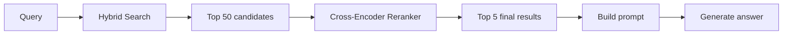
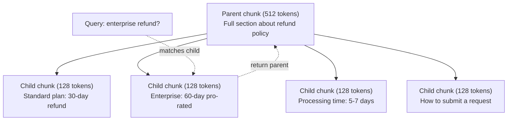
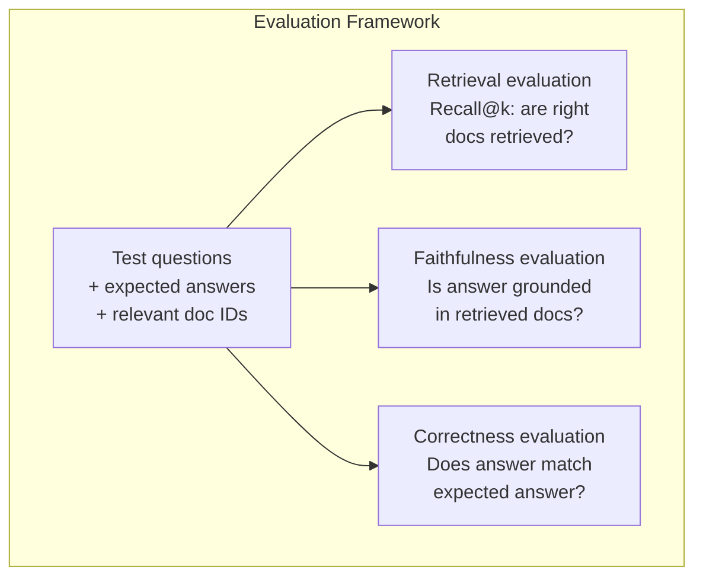

# Advanced RAG（Chunking、Reranking、Hybrid Search）

> Basic RAG 会检索最相似的 top-k chunk。这对简单问题有效。但面对 multi-hop reasoning、模糊 query 和大规模 corpus 时就会失效。Advanced RAG 是能在 10 个文档上运行的 demo 与能在 1000 万个文档上运行的系统之间的差别。

**类型：** 构建
**语言：** Python
**前置要求：** Phase 11, Lesson 06 (RAG)
**时间：** ~90 分钟
**相关：** Phase 5 · 23 (Chunking Strategies for RAG) 覆盖了全部六种 chunking 算法：recursive、semantic、sentence、parent-document、late chunking、contextual retrieval，并包含 Vectara/Anthropic benchmark。本课在此基础上继续：hybrid search、reranking、query transformation。

## 学习目标

- 实现能够保留文档结构和上下文的 advanced chunking 策略（semantic、recursive、parent-child）
- 构建一个 hybrid search pipeline，将 BM25 keyword matching 与 semantic Vector search 和 cross-encoder reranker 结合起来
- 应用 query transformation 技术（HyDE、multi-query、step-back），改善模糊或复杂问题的检索效果
- 诊断并修复常见 RAG 失败：检索到错误 chunk、答案不在 context 中、multi-hop reasoning 崩溃

## 问题

你在 Lesson 06 中构建了一个 basic RAG pipeline。它在小型 corpus 上回答直接问题时表现不错。现在试试这些：

**模糊 query**："What was revenue last quarter?" Semantic search 返回关于 revenue strategy、revenue projections，以及 CFO 对 revenue growth 看法的 chunk。它们都与单词 "revenue" 语义相似。但都不包含实际数字。正确 chunk 写的是 "$47.2M in Q3 2025"，但使用的是 "earnings" 而不是 "revenue"。Embedding model 认为 "revenue strategy" 比 "Q3 earnings were $47.2M" 更接近 query。

**Multi-hop question**："Which team had the highest customer satisfaction score improvement?" 这需要找到每个团队的 satisfaction score，进行比较，并识别最大值。没有任何单个 chunk 包含答案。信息分散在各个团队报告中。

**大规模 corpus 问题**：你有 200 万个 chunk。正确答案在 chunk #1,847,293。你的 top-5 retrieval 拉取了 chunk #14、#89,201、#1,200,000、#44 和 #901,333。它们在 Embedding 空间中接近，但没有一个包含答案。在这种规模下，approximate nearest neighbor search 会引入足够多误差，导致相关结果被挤出 top-k。

Basic RAG 失败的原因是 Vector similarity 不等于相关性。一个 chunk 可以在语义上与 query 相似，却对回答问题没有帮助。Advanced RAG 用四种技术解决这个问题：hybrid search（加入 keyword matching）、reranking（更仔细地给 candidate 打分）、query transformation（在搜索前修正 query），以及更好的 chunking（以合适的粒度检索）。

## 核心概念

### Hybrid Search：Semantic + Keyword

Semantic search（Vector similarity）擅长理解含义。"How do I cancel my subscription?" 即使与 "Steps to terminate your plan" 没有共享单词，也能匹配。但它会漏掉精确匹配。"Error code E-4021" 可能无法匹配包含 "E-4021" 的 chunk，因为 Embedding model 可能把它当作噪声。

Keyword search（BM25）正好相反。它擅长精确匹配。"E-4021" 能完美匹配。但如果文档写的是 "terminate your plan"，"cancel my subscription" 会返回零结果。

Hybrid search 会同时运行两者，然后合并结果。

**BM25**（Best Matching 25）是标准 keyword search 算法。自 1990 年代以来，它一直是搜索引擎的核心。公式：

```
BM25(q, d) = sum over terms t in q:
    IDF(t) * (tf(t,d) * (k1 + 1)) / (tf(t,d) + k1 * (1 - b + b * |d| / avgdl))
```

其中 tf(t,d) 是 term t 在 document d 中的 term frequency，IDF(t) 是 inverse document frequency，|d| 是 document length，avgdl 是 average document length，k1 控制 term frequency saturation（默认 1.2），b 控制 length normalization（默认 0.75）。

通俗地说：当文档包含 query term（尤其是稀有 term）时，BM25 会给文档更高分，但重复 term 的收益会递减。一个包含 "revenue" 50 次的文档，并不比只包含一次的文档相关性高 50 倍。

### Reciprocal Rank Fusion（RRF）

你有两个 ranked list：一个来自 Vector search，一个来自 BM25。如何组合它们？Reciprocal Rank Fusion 是标准做法。

```
RRF_score(d) = sum over rankings R:
    1 / (k + rank_R(d))
```

其中 k 是一个常数（通常为 60），用于防止排名第一的结果占据过大优势。

一个在 Vector search 中排名 #1、在 BM25 中排名 #5 的文档得分为：1/(60+1) + 1/(60+5) = 0.0164 + 0.0154 = 0.0318

一个在 Vector search 中排名 #3、在 BM25 中排名 #2 的文档得分为：1/(60+3) + 1/(60+2) = 0.0159 + 0.0161 = 0.0320

RRF 会自然平衡这两类信号。一个在两个列表中排名都很高的文档会得到最佳得分。一个在某个列表中排名 #1、但在另一个列表中缺失的文档会得到中等分数。这很稳健，因为它使用的是排名，而不是原始分数，因此两个系统之间的分数分布差异不会产生影响。

### Reranking

Retrieval（无论是 Vector、keyword 还是 hybrid）速度快，但不够精确。它使用 bi-encoder：query 和每个 document 独立进行 Embedding，然后比较。Embedding 会提前计算并缓存。这可以扩展到数百万文档。

Reranking 使用 cross-encoder：query 和 candidate document 会一起输入模型，模型输出相关性分数。模型能同时看到两段文本，因此可以捕捉它们之间的细粒度交互。Cross-encoder 能理解 "What were Q3 earnings?" 与包含 "$47.2M in Q3" 的 chunk 高度相关，即使 bi-encoder 漏掉了这种联系。

权衡是：cross-encoder 比 bi-encoder 慢 100-1000 倍，因为它需要联合处理 query-document pair。你无法为一百万个文档预计算 cross-encoder 分数。解决方案是：先检索一个更大的 candidate set（hybrid search 的 top-50），然后用 cross-encoder rerank，得到最终 top-5。



常见 reranking model（2026 阵容）：
- Cohere Rerank 3.5：managed API，多语言，在混合 corpus 上 recall gain 最佳
- Voyage rerank-2.5：managed API，托管选项中 latency 最低
- Jina-Reranker-v2 Multilingual：open-weight，支持 100+ 语言
- bge-reranker-v2-m3：open-weight，强 baseline
- cross-encoder/ms-marco-MiniLM-L-6-v2：open-weight，可在 CPU 上运行，适合 prototyping
- ColBERTv2 / Jina-ColBERT-v2：late-interaction multi-vector reranker，在评分时是 O(tokens) 而不是 O(docs)

### Query Transformation

有时问题不在 retrieval，而在 query 本身。"What was that thing about the new policy change?" 是一个很糟糕的 search query。它没有包含任何具体 term。Embedding 很模糊。没有 retrieval system 能从这样的 query 中找到正确文档。

**Query rewriting**：把用户 query 改写成更好的 search query。LLM 可以做到这一点：

```
User: "What was that thing about the new policy change?"
Rewritten: "Recent policy changes and updates"
```

**HyDE（Hypothetical Document Embeddings）**：不是用 query 搜索，而是先生成一个 hypothetical answer，对它做 Embedding，然后搜索相似的真实文档。

```
Query: "What is the refund policy for enterprise?"
Hypothetical answer: "Enterprise customers are eligible for a full refund
within 60 days of purchase. Refunds are pro-rated based on the remaining
subscription period and processed within 5-7 business days."
```

对 hypothetical answer 做 Embedding，并搜索与它相似的真实文档。直觉是：相比原始问题，hypothetical answer 在 Embedding 空间中更接近真实答案。问题和答案具有不同的语言结构。通过生成 hypothetical answer，你在 Embedding 中架起了 "question space" 和 "answer space" 之间的桥梁。

HyDE 会在 retrieval 前增加一次 LLM 调用。这会增加 500-2000ms latency。当 raw query 的 retrieval 质量较差时，这是值得的。

### Parent-Child Chunking

标准 chunking 迫使你做取舍：小 chunk 用于精确 retrieval，大 chunk 用于提供足够 context。Parent-child chunking 消除了这个取舍。

索引小 chunk（128 tokens）用于 retrieval。当检索到小 chunk 时，把它的 parent chunk（512 tokens）返回给 prompt。小 chunk 能精确匹配 query。parent chunk 为 LLM 生成好答案提供足够 context。



query "enterprise refund?" 会精确匹配 child chunk C2。但 prompt 收到的是完整 parent chunk P，其中包含关于处理时间和提交流程的周边 context。

### Metadata Filtering

在运行 Vector search 之前，按 metadata 过滤 corpus：date、source、category、author、language。这会缩小搜索空间并避免不相关结果。

"What changed in the security policy last month?" 应该只搜索最近 30 天、security category 中的文档。如果没有 metadata filtering，你会搜索整个 corpus，可能检索到一个 2 年前的 security document，只是因为它在语义上相似。

Production RAG 系统会把 metadata 与每个 chunk 一起存储：source document、creation date、category、author、version。Vector database 支持在 similarity search 前按 metadata 进行 pre-filtering，这对大规模性能至关重要。

### Evaluation

你构建了一个 RAG 系统。如何知道它是否有效？三个指标：

**Retrieval relevance（Recall@k）**：对于一组带有已知相关文档的测试问题，相关文档出现在 top-k 结果中的比例是多少？如果某个问题的答案在 chunk #47，chunk #47 是否出现在 top-5 中？

**Faithfulness**：生成答案是否基于检索到的文档？如果检索 chunk 写的是 "60-day refund window"，而模型回答 "90-day refund window"，这就是 faithfulness 失败。模型在拥有正确 context 的情况下仍然 hallucinate。

**Answer correctness**：生成答案是否与 expected answer 匹配？这是端到端指标。它结合了 retrieval quality 和 generation quality。

一个简单的 faithfulness 检查：取生成答案中的每个 claim，并验证它是否（实质上）出现在 retrieved chunk 中。如果答案包含任何 retrieved chunk 中都没有的事实，它很可能是 hallucinated。



## 构建

### 步骤 1：BM25 实现

```python
import math
from collections import Counter

class BM25:
    def __init__(self, k1=1.2, b=0.75):
        self.k1 = k1
        self.b = b
        self.docs = []
        self.doc_lengths = []
        self.avg_dl = 0
        self.doc_freqs = {}
        self.n_docs = 0

    def index(self, documents):
        self.docs = documents
        self.n_docs = len(documents)
        self.doc_lengths = []
        self.doc_freqs = {}

        for doc in documents:
            words = doc.lower().split()
            self.doc_lengths.append(len(words))
            unique_words = set(words)
            for word in unique_words:
                self.doc_freqs[word] = self.doc_freqs.get(word, 0) + 1

        self.avg_dl = sum(self.doc_lengths) / self.n_docs if self.n_docs else 1

    def score(self, query, doc_idx):
        query_words = query.lower().split()
        doc_words = self.docs[doc_idx].lower().split()
        doc_len = self.doc_lengths[doc_idx]
        word_counts = Counter(doc_words)
        score = 0.0

        for term in query_words:
            if term not in word_counts:
                continue
            tf = word_counts[term]
            df = self.doc_freqs.get(term, 0)
            idf = math.log((self.n_docs - df + 0.5) / (df + 0.5) + 1)
            numerator = tf * (self.k1 + 1)
            denominator = tf + self.k1 * (1 - self.b + self.b * doc_len / self.avg_dl)
            score += idf * numerator / denominator

        return score

    def search(self, query, top_k=10):
        scores = [(i, self.score(query, i)) for i in range(self.n_docs)]
        scores.sort(key=lambda x: x[1], reverse=True)
        return scores[:top_k]
```

### 步骤 2：Reciprocal Rank Fusion

```python
def reciprocal_rank_fusion(ranked_lists, k=60):
    scores = {}
    for ranked_list in ranked_lists:
        for rank, (doc_id, _) in enumerate(ranked_list):
            if doc_id not in scores:
                scores[doc_id] = 0.0
            scores[doc_id] += 1.0 / (k + rank + 1)
    fused = sorted(scores.items(), key=lambda x: x[1], reverse=True)
    return fused
```

### 步骤 3：Hybrid Search Pipeline

```python
def hybrid_search(query, chunks, vector_embeddings, vocab, idf, bm25_index, top_k=5, fusion_k=60):
    query_emb = tfidf_embed(query, vocab, idf)
    vector_results = search(query_emb, vector_embeddings, top_k=top_k * 3)
    bm25_results = bm25_index.search(query, top_k=top_k * 3)
    fused = reciprocal_rank_fusion([vector_results, bm25_results], k=fusion_k)
    return fused[:top_k]
```

### 步骤 4：简单 Reranker

在 production 中，你会使用 cross-encoder model。这里我们构建一个 reranker，使用 word overlap、term importance 和 phrase matching 给 query-document relevance 打分。

```python
def rerank(query, candidates, chunks):
    query_words = set(query.lower().split())
    stop_words = {"the", "a", "an", "is", "are", "was", "were", "what", "how",
                  "why", "when", "where", "do", "does", "for", "of", "in", "to",
                  "and", "or", "on", "at", "by", "it", "its", "this", "that",
                  "with", "from", "be", "has", "have", "had", "not", "but"}
    query_terms = query_words - stop_words

    scored = []
    for doc_id, initial_score in candidates:
        chunk = chunks[doc_id].lower()
        chunk_words = set(chunk.split())

        term_overlap = len(query_terms & chunk_words)

        query_bigrams = set()
        q_list = [w for w in query.lower().split() if w not in stop_words]
        for i in range(len(q_list) - 1):
            query_bigrams.add(q_list[i] + " " + q_list[i + 1])
        bigram_matches = sum(1 for bg in query_bigrams if bg in chunk)

        position_boost = 0
        for term in query_terms:
            pos = chunk.find(term)
            if pos != -1 and pos < len(chunk) // 3:
                position_boost += 0.5

        rerank_score = (
            term_overlap * 1.0
            + bigram_matches * 2.0
            + position_boost
            + initial_score * 5.0
        )
        scored.append((doc_id, rerank_score))

    scored.sort(key=lambda x: x[1], reverse=True)
    return scored
```

### 步骤 5：HyDE（Hypothetical Document Embeddings）

```python
def hyde_generate_hypothesis(query):
    templates = {
        "what": "The answer to '{query}' is as follows: Based on our documentation, {topic} involves specific policies and procedures that define how the process works.",
        "how": "To address '{query}': The process involves several steps. First, you need to initiate the request. Then, the system processes it according to the defined rules.",
        "default": "Regarding '{query}': Our records indicate specific details and policies related to this topic that provide a comprehensive answer."
    }
    query_lower = query.lower()
    if query_lower.startswith("what"):
        template = templates["what"]
    elif query_lower.startswith("how"):
        template = templates["how"]
    else:
        template = templates["default"]

    topic_words = [w for w in query.lower().split()
                   if w not in {"what", "is", "the", "how", "do", "does", "a", "an",
                                "for", "of", "to", "in", "on", "at", "by", "and", "or"}]
    topic = " ".join(topic_words) if topic_words else "this topic"

    return template.format(query=query, topic=topic)


def hyde_search(query, chunks, vector_embeddings, vocab, idf, top_k=5):
    hypothesis = hyde_generate_hypothesis(query)
    hypothesis_emb = tfidf_embed(hypothesis, vocab, idf)
    results = search(hypothesis_emb, vector_embeddings, top_k)
    return results, hypothesis
```

### 步骤 6：Parent-Child Chunking

```python
def create_parent_child_chunks(text, parent_size=200, child_size=50):
    words = text.split()
    parents = []
    children = []
    child_to_parent = {}

    parent_idx = 0
    start = 0
    while start < len(words):
        parent_end = min(start + parent_size, len(words))
        parent_text = " ".join(words[start:parent_end])
        parents.append(parent_text)

        child_start = start
        while child_start < parent_end:
            child_end = min(child_start + child_size, parent_end)
            child_text = " ".join(words[child_start:child_end])
            child_idx = len(children)
            children.append(child_text)
            child_to_parent[child_idx] = parent_idx
            child_start += child_size

        parent_idx += 1
        start += parent_size

    return parents, children, child_to_parent
```

### 步骤 7：Faithfulness Evaluation

```python
def evaluate_faithfulness(answer, retrieved_chunks):
    answer_sentences = [s.strip() for s in answer.split(".") if len(s.strip()) > 10]
    if not answer_sentences:
        return 1.0, []

    grounded = 0
    ungrounded = []
    context = " ".join(retrieved_chunks).lower()

    for sentence in answer_sentences:
        words = set(sentence.lower().split())
        stop_words = {"the", "a", "an", "is", "are", "was", "were", "and", "or",
                      "to", "of", "in", "for", "on", "at", "by", "it", "this", "that"}
        content_words = words - stop_words
        if not content_words:
            grounded += 1
            continue

        matched = sum(1 for w in content_words if w in context)
        ratio = matched / len(content_words) if content_words else 0

        if ratio >= 0.5:
            grounded += 1
        else:
            ungrounded.append(sentence)

    score = grounded / len(answer_sentences) if answer_sentences else 1.0
    return score, ungrounded


def evaluate_retrieval_recall(queries_with_relevant, retrieval_fn, k=5):
    total_recall = 0.0
    results = []

    for query, relevant_indices in queries_with_relevant:
        retrieved = retrieval_fn(query, k)
        retrieved_indices = set(idx for idx, _ in retrieved)
        relevant_set = set(relevant_indices)
        hits = len(retrieved_indices & relevant_set)
        recall = hits / len(relevant_set) if relevant_set else 1.0
        total_recall += recall
        results.append({
            "query": query,
            "recall": recall,
            "hits": hits,
            "total_relevant": len(relevant_set)
        })

    avg_recall = total_recall / len(queries_with_relevant) if queries_with_relevant else 0
    return avg_recall, results
```

## 使用

使用真实 cross-encoder 进行 reranking：

```python
from sentence_transformers import CrossEncoder

reranker = CrossEncoder("cross-encoder/ms-marco-MiniLM-L-6-v2")

def rerank_with_cross_encoder(query, candidates, chunks, top_k=5):
    pairs = [(query, chunks[doc_id]) for doc_id, _ in candidates]
    scores = reranker.predict(pairs)
    scored = list(zip([doc_id for doc_id, _ in candidates], scores))
    scored.sort(key=lambda x: x[1], reverse=True)
    return scored[:top_k]
```

使用 Cohere 的 managed reranker：

```python
import cohere

co = cohere.Client()

def rerank_with_cohere(query, candidates, chunks, top_k=5):
    docs = [chunks[doc_id] for doc_id, _ in candidates]
    response = co.rerank(
        model="rerank-english-v3.0",
        query=query,
        documents=docs,
        top_n=top_k
    )
    return [(candidates[r.index][0], r.relevance_score) for r in response.results]
```

使用真实 LLM 实现 HyDE：

```python
import anthropic

client = anthropic.Anthropic()

def hyde_with_llm(query):
    response = client.messages.create(
        model="claude-sonnet-4-20250514",
        max_tokens=256,
        messages=[{
            "role": "user",
            "content": f"Write a short paragraph that would be a good answer to this question. Do not say you don't know. Just write what the answer would look like.\n\nQuestion: {query}"
        }]
    )
    return response.content[0].text
```

使用 Weaviate 进行 production hybrid search：

```python
import weaviate

client = weaviate.connect_to_local()

collection = client.collections.get("Documents")
response = collection.query.hybrid(
    query="enterprise refund policy",
    alpha=0.5,
    limit=10
)
```

alpha 参数控制平衡：0.0 = 纯 keyword（BM25），1.0 = 纯 Vector，0.5 = 等权重。大多数 production 系统使用 0.3 到 0.7 之间的 alpha。

## 交付

本课会产出：
- `outputs/prompt-advanced-rag-debugger.md` -- 用于诊断和修复 RAG 质量问题的 prompt
- `outputs/skill-advanced-rag.md` -- 用于构建具备 hybrid search 和 reranking 的 production-grade RAG 的 skill

## 练习

1. 在 sample document 上比较 BM25、Vector search 和 hybrid search。对于 5 个 test query 中的每一个，记录哪种方法在 position #1 返回最相关 chunk。Hybrid search 应至少在 5 个中赢得 3 个。

2. 实现 metadata filter。为每个 document 添加一个 "category" 字段（security、billing、api、product）。在运行 Vector search 前，只过滤出相关 category 的 chunk。用 "What encryption is used?" 测试，并验证它只搜索 security-category chunk。

3. 使用 Lesson 06 中的简单 generate function 构建完整 HyDE pipeline。在全部 5 个 test query 上比较 direct query search 与 HyDE search 的 retrieval quality（top-3 relevance）。HyDE 应能改善模糊 query 的结果。

4. 在 sample document 上实现 parent-child chunking 策略。使用 child_size=30 和 parent_size=100。用 child chunk 搜索，但在 prompt 中返回 parent chunk。将生成答案与 chunk_size=50 的标准 chunking 进行比较。

5. 创建 evaluation dataset：10 个问题，带已知 answer chunk。分别测量 (a) 仅 Vector search，(b) 仅 BM25，(c) hybrid search，(d) hybrid + reranking 的 Recall@3、Recall@5 和 Recall@10。绘制结果，并识别 reranking 最有帮助的位置。

## 关键术语

| Term | 人们通常怎么说 | 实际含义 |
|------|----------------|----------------------|
| BM25 | "Keyword search" | 一种概率排序算法，根据 term frequency、inverse document frequency 和 document length normalization 给文档打分 |
| Hybrid search | "Best of both worlds" | 并行运行 semantic（Vector）search 和 keyword（BM25）search，然后用 rank fusion 合并结果 |
| Reciprocal Rank Fusion | "Merge ranked lists" | 对每个文档在所有列表中的 1/(k + rank) 求和，从而组合多个 ranked list |
| Reranking | "Second pass scoring" | 使用成本更高的 cross-encoder model，对 initial retrieval 得到的 candidate set 重新打分 |
| Cross-encoder | "Joint query-document model" | 将 query 和 document 作为单个输入并生成相关性分数的模型；比 bi-encoder 更准确，但对 full corpus search 来说太慢 |
| Bi-encoder | "Independent embedding model" | 独立对 query 和 document 做 Embedding 的模型；由于 Embedding 可预计算，因此速度快，但不如 cross-encoder 准确 |
| HyDE | "Search with a fake answer" | 为 query 生成 hypothetical answer，对其做 Embedding，并搜索与它相似的真实文档 |
| Parent-child chunking | "Small search, big context" | 为精确 retrieval 索引小 chunk，但返回更大的 parent chunk 以提供足够 context |
| Metadata filtering | "Narrow before searching" | 在运行 Vector search 前，根据属性（date、source、category）过滤文档以缩小搜索空间 |
| Faithfulness | "Did it stay grounded" | 生成答案是否由 retrieved document 支持，而不是来自模型训练数据的 hallucination |

## 延伸阅读

- Robertson & Zaragoza, "The Probabilistic Relevance Framework: BM25 and Beyond" (2009) -- BM25 的权威参考，解释公式背后的概率基础
- Cormack et al., "Reciprocal Rank Fusion Outperforms Condorcet and Individual Rank Learning Methods" (2009) -- RRF 原始论文，展示它优于更复杂的 fusion 方法
- Gao et al., "Precise Zero-Shot Dense Retrieval without Relevance Labels" (2022) -- HyDE 论文，证明 hypothetical document Embeddings 可以在没有任何训练数据的情况下改善 retrieval
- Nogueira & Cho, "Passage Re-ranking with BERT" (2019) -- 展示在 BM25 之上进行 cross-encoder reranking 能显著提升 retrieval quality
- [Khattab et al., "DSPy: Compiling Declarative Language Model Calls into Self-Improving Pipelines" (2023)](https://arxiv.org/abs/2310.03714) -- 将 prompt construction 和 weight selection 视为 retrieval pipeline 上的 optimization problem；阅读这篇来理解 "program LLMs"，而不是 "prompt LLMs."
- [Edge et al., "From Local to Global: A Graph RAG Approach to Query-Focused Summarization" (Microsoft Research 2024)](https://arxiv.org/abs/2404.16130) -- GraphRAG 论文：entity-relation extraction + Leiden community detection，用于 query-focused summarization；以及 global vs local retrieval 的区别。
- [Asai et al., "Self-RAG: Learning to Retrieve, Generate, and Critique through Self-Reflection" (ICLR 2024)](https://arxiv.org/abs/2310.11511) -- 带 reflection tokens 的自评估 RAG；静态 retrieve-then-generate 之后的 agentic 前沿。
- [LangChain Query Construction blog](https://blog.langchain.dev/query-construction/) -- 如何将 natural-language query 转换为 structured database query（Text-to-SQL、Cypher），作为 pre-retrieval step。
