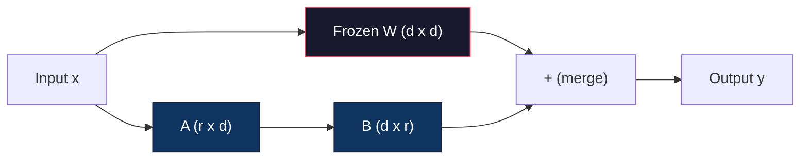
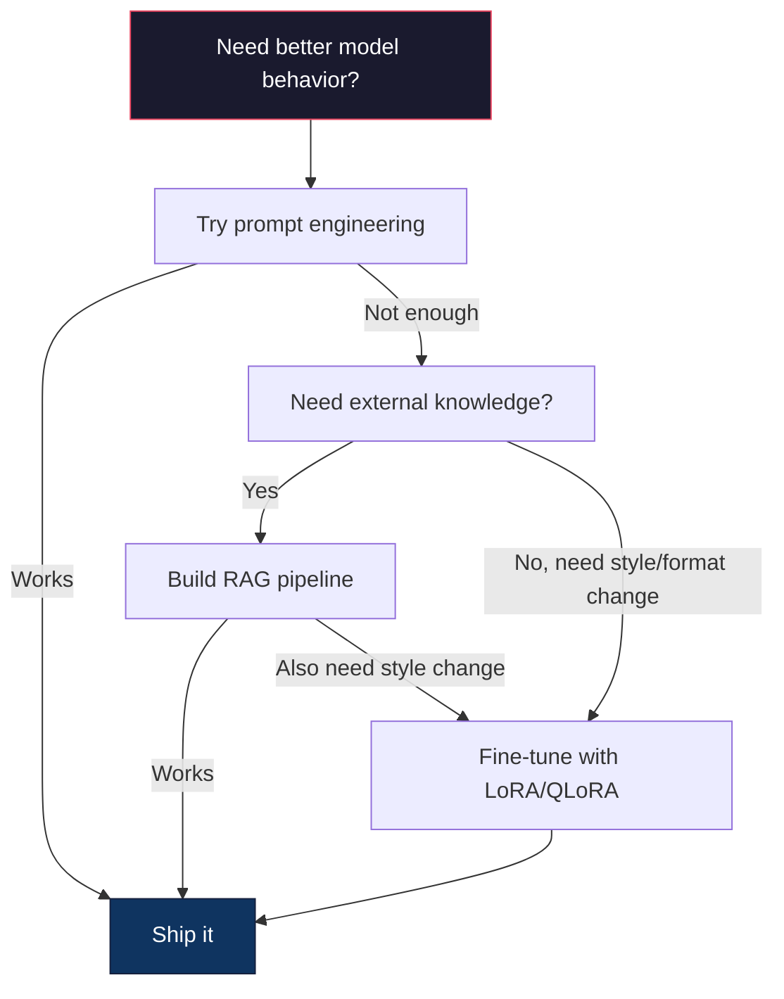

# 使用 LoRA & QLoRA 进行 Fine-Tuning

> 对一个 7B model 做 full fine-tuning 需要 56GB VRAM。你没有这么多。大多数公司也没有。LoRA 通过训练不到 1% 的参数，让你能在 6GB 中 fine-tune 同一个 model。这不是妥协 -- 它在大多数任务上能达到 full fine-tuning 的质量。整个 open-source fine-tuning 生态都建立在这个技巧之上。

**Type:** Build
**Languages:** Python
**Prerequisites:** Phase 10, Lesson 06 (Instruction Tuning / SFT)
**Time:** ~75 minutes
**Related:** Phase 10 从零讲解 SFT/DPO loop。本课会把这些接入 2026 PEFT 工具链（PEFT, TRL, Unsloth, Axolotl, LLaMA-Factory）。

## 学习目标
- 通过将低秩 adapter matrices（A 和 B）注入 pretrained model 的 attention layers 来实现 LoRA
- 计算 LoRA 相比 full fine-tuning 的参数节省：rank r、d_model 维度时，训练的是 2*r*d 个参数，而不是 d^2
- 使用 QLoRA（4-bit quantized base + LoRA adapters）fine-tune 一个 model，使其适配消费级 GPU memory
- 将 LoRA weights 合并回 base model 用于部署，并比较带 adapters 与不带 adapters 的 inference speed

## 问题
你有一个 base model。Llama 3 8B。你希望它用你公司的语气回答客户支持工单。SFT 是答案。但 SFT 有成本问题。

Full fine-tuning 会更新 model 中的每一个参数。Llama 3 8B 有 80 亿个参数。在 fp16 中，每个参数占 2 bytes。仅加载 weights 就需要 16GB。训练期间，你还需要 gradients（16GB）、Adam 的 optimizer states（momentum + variance 需要 32GB）以及 activations。总计：单个 8B model 大约需要 56GB VRAM。

A100 80GB 勉强能装下。两张 A100 在 cloud providers 上每小时花费 $3-4。用 50,000 个样本训练 3 个 epochs 需要 6-10 小时。每次实验就是 $30-40。为了调好 hyperparameters 跑 10 次实验，在部署任何东西之前你已经花了 $400。

把它扩展到 Llama 3 70B，数字会变得荒唐。仅 weights 就要 140GB。你需要一个 cluster。每次实验 $100+。

还有一个更深层的问题。Full fine-tuning 会修改 model 中的每一个 weight。如果你在客户支持数据上 fine-tune，可能会损害 model 的通用能力。这叫 catastrophic forgetting。model 在你的任务上变好，在其他所有事情上变差。

你需要一种方法：训练更少参数、使用更少 memory，并且不会破坏 model 已有知识。

## 概念
### LoRA: Low-Rank Adaptation

Edward Hu 和 Microsoft 的同事在 2021 年 6 月发表了 LoRA。论文的洞察是：fine-tuning 期间的 weight updates 具有低内在 rank。你不需要更新一个 4096x4096 weight matrix 中全部 1670 万个参数。update 中有用的信息可以由 rank 16 或 32 的 Matrix 捕获。

数学如下。一个标准 linear layer 计算：

```
y = Wx
```

其中 W 是一个 d_out x d_in matrix。对于 4096x4096 attention projection，这就是 16,777,216 个参数。

LoRA 冻结 W，并添加一个低秩分解：

```
y = Wx + BAx
```

其中 B 是 (d_out x r)，A 是 (r x d_in)。rank r 远小于 d -- 通常是 8、16 或 32。

对于 4096x4096 layer 上的 r=16：
- 原始参数：4096 x 4096 = 16,777,216
- LoRA 参数：(4096 x 16) + (16 x 4096) = 65,536 + 65,536 = 131,072
- 减少比例：131,072 / 16,777,216 = 0.78%

你训练 0.78% 的参数，却获得 95-100% 的质量。



A 使用随机 Gaussian 初始化。B 初始化为零。这意味着 LoRA contribution 从零开始 -- model 从原始行为开始训练，然后逐步学习 adaptation。

### The Scaling Factor: Alpha

LoRA 引入一个 scaling factor alpha，用来控制低秩 update 对 output 的影响程度：

```
y = Wx + (alpha / r) * BAx
```

当 alpha = r 时，scaling 是 1x。当 alpha = 2r（常见默认值）时，scaling 是 2x。这个 hyperparameter 独立于 base learning rate 控制 LoRA path 的 learning rate。

实践建议：
- alpha = 2 * rank 是常见社区约定（原始论文在多数实验中使用 alpha = rank）
- alpha = rank 提供 1x scaling，保守但稳定
- 更高的 alpha 意味着每一步更大的 updates，可能加快收敛，也可能导致不稳定

### Where to Apply LoRA

一个 Transformer 有许多 linear layers。你不需要给所有 layer 添加 LoRA。原始论文测试了不同组合：

| Target Layers | Trainable Params (7B) | Quality |
|--------------|----------------------|---------|
| q_proj only | 4.7M | 好 |
| q_proj + v_proj | 9.4M | 更好 |
| q_proj + k_proj + v_proj + o_proj | 18.9M | 对 attention 最好 |
| All linear (attention + MLP) | 37.7M | 边际收益，参数量 2x |

大多数任务的甜点位：q_proj + v_proj。这会瞄准 self-attention 中的 query 和 value projections，它们控制 model 关注什么以及提取什么信息。添加 MLP layers 对代码生成等复杂任务有帮助，但会让参数量翻倍，对简单任务则收益递减。

### Rank Selection

rank r 控制 adaptation 的表达能力：

| Rank | Trainable Params (per layer) | Best For |
|------|---------------------------|----------|
| 4 | 32,768 | 简单 classification、sentiment |
| 8 | 65,536 | 单领域 Q&A、summarization |
| 16 | 131,072 | 多领域任务、instruction following |
| 32 | 262,144 | 复杂 reasoning、代码生成 |
| 64 | 524,288 | 大多数任务收益递减 |
| 128 | 1,048,576 | 很少值得使用 |

Hu et al. 表明，对于简单任务，r=4 已经能捕获大部分 adaptation。r=8 和 r=16 是实践中最常见的选择。超过 r=64 很少改善质量，并开始失去 LoRA 的 memory 优势。

### QLoRA: 4-Bit Quantization + LoRA

Tim Dettmers 和 University of Washington 的同事在 2023 年 5 月发表了 QLoRA。思路是：把冻结的 base model quantize 到 4-bit precision，然后在其上附加 fp16 的 LoRA adapters。

这会显著改变 memory 公式：

| Method | Weight Memory (7B) | Training Memory (7B) | GPU Required |
|--------|-------------------|---------------------|-------------|
| Full fine-tune (fp16) | 14GB | ~56GB | 1x A100 80GB |
| LoRA (fp16 base) | 14GB | ~18GB | 1x A100 40GB |
| QLoRA (4-bit base) | 3.5GB | ~6GB | 1x RTX 3090 24GB |

QLoRA 有三项技术贡献：

**NF4 (Normal Float 4-bit)**：一种专门为 Neural Network weights 设计的新 data type。Neural Network weights 大致服从 normal distribution。NF4 将其 16 个 quantization levels 放在 standard normal distribution 的 quantiles 上。对于 normally distributed data，这在信息论意义上是最优的。相比 uniform 4-bit quantization（INT4）或标准 Float4，它损失的信息更少。

**Double quantization**：quantization constants 本身也占 memory。每 64 个 weights 的 block 需要一个 fp32 scale factor（4 bytes）。对于 7B model，这会额外占 0.4GB。Double quantization 将这些 constants quantize 到 fp8，把 overhead 降到 0.1GB。虽小但会累积。

**Paged optimizers**：训练期间，长序列上的 optimizer states（Adam 的 momentum 和 variance）可能超过 GPU memory。Paged optimizers 使用 NVIDIA unified memory，在 GPU memory 耗尽时自动把 optimizer states page 到 CPU RAM，并在需要时 page 回来。这能避免 OOM crashes，代价是一些 throughput。

### The Quality Question

减少参数或 quantize base 会损害质量吗？多篇论文的结果：

| Method | MMLU (5-shot) | MT-Bench | HumanEval |
|--------|--------------|----------|-----------|
| Full fine-tune (Llama 2 7B) | 48.3 | 6.72 | 14.6 |
| LoRA r=16 | 47.9 | 6.68 | 14.0 |
| QLoRA r=16 (NF4) | 47.5 | 6.61 | 13.4 |
| QLoRA r=64 (NF4) | 48.1 | 6.70 | 14.2 |

LoRA 在 r=16 时，在大多数 benchmarks 上与 full fine-tuning 相差不到 1%。QLoRA 在 r=16 时又损失零点几个百分点。QLoRA 在 r=64 时基本匹配 full fine-tuning，同时少用 90% memory。

### Real-World Costs

在 50,000 个样本上 fine-tune Llama 3 8B（3 epochs）：

| Method | GPU | Time | Cost |
|--------|-----|------|------|
| Full fine-tune | 2x A100 80GB | 8 hours | ~$32 |
| LoRA r=16 | 1x A100 40GB | 4 hours | ~$8 |
| QLoRA r=16 | 1x RTX 4090 24GB | 6 hours | ~$5 |
| QLoRA r=16 (Unsloth) | 1x RTX 4090 24GB | 2.5 hours | ~$2 |
| QLoRA r=16 | 1x T4 16GB | 12 hours | ~$4 |

在单张消费级 GPU 上运行 QLoRA 的成本不到一顿午餐。这就是为什么 open-weight fine-tuning 社区在 2023 年爆发，也是为什么下面每个 training framework 在 2026 年都默认提供 QLoRA。

### The 2026 PEFT stack

| Framework | What it is | Pick when |
|-----------|-----------|-----------|
| **Hugging Face PEFT** | 规范的 LoRA/QLoRA/DoRA/IA3 library | 你想要原始控制权，并且 training loop 已经基于 `transformers.Trainer` |
| **TRL** | HF 的 reinforcement-from-feedback trainers（SFT, DPO, GRPO, PPO, ORPO） | 你在 SFT 后需要 DPO/GRPO；构建在 PEFT 之上 |
| **Unsloth** | forward/backward pass 的 Triton-kernel 重写 | 你想要 2-5x 加速 + 一半 VRAM 且无 accuracy loss；Llama/Mistral/Qwen 系列 |
| **Axolotl** | PEFT + TRL + DeepSpeed + Unsloth 之上的 YAML-config wrapper | 你想要可复现、版本控制的 training runs |
| **LLaMA-Factory** | PEFT + TRL 之上的 GUI/CLI/API | 你想要 zero-code fine-tuning；支持 100+ model families |
| **torchtune** | Native PyTorch recipes，无 `transformers` 依赖 | 你想要最少依赖，且组织已经标准化使用 PyTorch |

经验法则：研究用途或一次性实验 → PEFT。可重复的生产 pipeline → 启用 Unsloth kernels 的 Axolotl。一次性原型 → LLaMA-Factory。

### Merging Adapters

训练后，你有两样东西：冻结的 base model 和一个小型 LoRA adapter（通常 10-100MB）。你可以：

1. **保持分离**：加载 base model，在其上加载 adapter。为不同任务切换 adapters。这就是用一个 base model 服务多个 fine-tuned variants 的方式。

2. **永久合并**：计算 W' = W + (alpha/r) * BA，并把结果保存为一个新的 full model。merged model 与原始 model 大小相同。没有 inference overhead。没有 adapter 需要管理。

如果服务多个任务（客户支持 adapter、代码 adapter、翻译 adapter），保持分离。如果部署单个专用 model，则合并。

用于组合多个 adapters 的高级 merging 技术：

- **TIES-Merging**（Yadav et al. 2023）：裁剪小 magnitude 参数，解决 sign conflicts，然后合并。减少 adapters 之间的干扰。
- **DARE**（Yu et al. 2023）：在 merging 前随机丢弃 adapter parameters，并重新缩放剩余部分。组合能力时出人意料地有效。
- **Task arithmetic**：直接加减 adapter weights。把一个 "code" adapter 和一个 "math" adapter 相加，通常会得到一个两者都擅长的 model。

### When NOT to Fine-Tune

Fine-tuning 是第三个选项，不是第一个。

**第一：prompt engineering。** 写一个更好的 system prompt。加入 few-shot examples。使用 chain-of-thought。这没有成本，只需几分钟。如果 prompting 已经能达到 80%，你可能不需要 fine-tune。

**第二：RAG。** 如果 model 需要了解你的特定数据（documents、knowledge base、product catalog），retrieval 比把它烘进 weights 更便宜，也更易维护。见 Lesson 06。

**第三：fine-tuning。** 当你需要 model 采用特定 style、format 或 reasoning pattern，而 prompting 无法实现时使用它。当你需要一致的 structured output 时。当你需要把一个更大的 model distill 到更小的 model 时。当 latency 很重要，且你承担不起 few-shot prompting 带来的额外 tokens 时。



## 构建它
我们用纯 PyTorch 从零实现 LoRA。没有 libraries。没有魔法。你会构建 LoRA layer，将它注入 model，训练它，并把 weights 合并回去。

### 步骤 1： The LoRA Layer

```python
import torch
import torch.nn as nn
import math

class LoRALayer(nn.Module):
    def __init__(self, in_features, out_features, rank=8, alpha=16):
        super().__init__()
        self.rank = rank
        self.alpha = alpha
        self.scaling = alpha / rank

        self.A = nn.Parameter(torch.randn(in_features, rank) * (1 / math.sqrt(rank)))
        self.B = nn.Parameter(torch.zeros(rank, out_features))

    def forward(self, x):
        return (x @ self.A @ self.B) * self.scaling
```

A 使用缩放后的随机值初始化。B 初始化为零。乘积 BA 从零开始，所以 model 以原始行为开始。

### 步骤 2： LoRA-Wrapped Linear Layer

```python
class LinearWithLoRA(nn.Module):
    def __init__(self, linear, rank=8, alpha=16):
        super().__init__()
        self.linear = linear
        self.lora = LoRALayer(
            linear.in_features, linear.out_features, rank, alpha
        )

        for param in self.linear.parameters():
            param.requires_grad = False

    def forward(self, x):
        return self.linear(x) + self.lora(x)
```

原始 linear layer 被冻结。只有 LoRA 参数（A 和 B）是可训练的。

### 步骤 3： Inject LoRA into a Model

```python
def inject_lora(model, target_modules, rank=8, alpha=16):
    for param in model.parameters():
        param.requires_grad = False

    lora_layers = {}
    for name, module in model.named_modules():
        if isinstance(module, nn.Linear):
            if any(t in name for t in target_modules):
                parent_name = ".".join(name.split(".")[:-1])
                child_name = name.split(".")[-1]
                parent = dict(model.named_modules())[parent_name]
                lora_linear = LinearWithLoRA(module, rank, alpha)
                setattr(parent, child_name, lora_linear)
                lora_layers[name] = lora_linear
    return lora_layers
```

首先，冻结 model 中的每个参数。然后遍历 model tree，找到与你的 target names 匹配的 linear layers，并用 LoRA-wrapped 版本替换它们。LoRA A 和 B matrices 是整个 model 中唯一可训练的参数。

### 步骤 4： Count Parameters

```python
def count_parameters(model):
    total = sum(p.numel() for p in model.parameters())
    trainable = sum(p.numel() for p in model.parameters() if p.requires_grad)
    frozen = total - trainable
    return {
        "total": total,
        "trainable": trainable,
        "frozen": frozen,
        "trainable_pct": 100 * trainable / total if total > 0 else 0
    }
```

### 步骤 5： Merge Weights Back

```python
def merge_lora_weights(model):
    for name, module in model.named_modules():
        if isinstance(module, LinearWithLoRA):
            with torch.no_grad():
                merged = (
                    module.lora.A @ module.lora.B
                ) * module.lora.scaling
                module.linear.weight.data += merged.T
            parent_name = ".".join(name.split(".")[:-1])
            child_name = name.split(".")[-1]
            if parent_name:
                parent = dict(model.named_modules())[parent_name]
            else:
                parent = model
            setattr(parent, child_name, module.linear)
```

合并后，LoRA layers 消失。model 与原始 model 大小相同，adaptation 被烘进 weights。没有 inference overhead。

### 步骤 6： Simulated QLoRA Quantization

```python
def quantize_to_nf4(tensor, block_size=64):
    blocks = tensor.reshape(-1, block_size)
    scales = blocks.abs().max(dim=1, keepdim=True).values / 7.0
    scales = torch.clamp(scales, min=1e-8)
    quantized = torch.round(blocks / scales).clamp(-8, 7).to(torch.int8)
    return quantized, scales

def dequantize_from_nf4(quantized, scales, original_shape):
    dequantized = quantized.float() * scales
    return dequantized.reshape(original_shape)
```

这通过将 weights 映射到每 64 个元素 block 内的 16 个离散 levels 来模拟 4-bit quantization。生产级 QLoRA 使用 bitsandbytes library 在 GPU 上实现真正的 NF4。

### 步骤 7： Training Loop

```python
def train_lora(model, data, epochs=5, lr=1e-3, batch_size=4):
    optimizer = torch.optim.AdamW(
        [p for p in model.parameters() if p.requires_grad], lr=lr
    )
    criterion = nn.MSELoss()

    losses = []
    for epoch in range(epochs):
        epoch_loss = 0.0
        n_batches = 0
        indices = torch.randperm(len(data["inputs"]))

        for i in range(0, len(indices), batch_size):
            batch_idx = indices[i:i + batch_size]
            x = data["inputs"][batch_idx]
            y = data["targets"][batch_idx]

            output = model(x)
            loss = criterion(output, y)

            optimizer.zero_grad()
            loss.backward()
            optimizer.step()

            epoch_loss += loss.item()
            n_batches += 1

        avg_loss = epoch_loss / n_batches
        losses.append(avg_loss)

    return losses
```

### 步骤 8： Full Demo

```python
def demo():
    torch.manual_seed(42)
    d_model = 256
    n_classes = 10

    model = nn.Sequential(
        nn.Linear(d_model, 512),
        nn.ReLU(),
        nn.Linear(512, 512),
        nn.ReLU(),
        nn.Linear(512, n_classes),
    )

    n_samples = 500
    x = torch.randn(n_samples, d_model)
    y = torch.randint(0, n_classes, (n_samples,))
    y_onehot = torch.zeros(n_samples, n_classes).scatter_(1, y.unsqueeze(1), 1.0)

    data = {"inputs": x, "targets": y_onehot}

    params_before = count_parameters(model)

    lora_layers = inject_lora(
        model, target_modules=["0", "2"], rank=8, alpha=16
    )

    params_after = count_parameters(model)

    losses = train_lora(model, data, epochs=20, lr=1e-3)

    merge_lora_weights(model)
    params_merged = count_parameters(model)

    return {
        "params_before": params_before,
        "params_after": params_after,
        "params_merged": params_merged,
        "losses": losses,
    }
```

这个 demo 创建一个小 model，将 LoRA 注入两个 layers，训练它，并把 weights 合并回去。参数计数从 full trainable 降到 LoRA training 期间约 1% trainable，然后在合并后回到原始 architecture。

## 使用它
在 Hugging Face 生态中，对真实 model 使用 LoRA 大约只需要 20 行：

```python
from transformers import AutoModelForCausalLM, AutoTokenizer
from peft import LoraConfig, get_peft_model, TaskType

model = AutoModelForCausalLM.from_pretrained("meta-llama/Llama-3.1-8B")
tokenizer = AutoTokenizer.from_pretrained("meta-llama/Llama-3.1-8B")

lora_config = LoraConfig(
    task_type=TaskType.CAUSAL_LM,
    r=16,
    lora_alpha=32,
    lora_dropout=0.05,
    target_modules=["q_proj", "v_proj"],
)

model = get_peft_model(model, lora_config)
model.print_trainable_parameters()
```

对于 QLoRA，添加 bitsandbytes quantization：

```python
from transformers import BitsAndBytesConfig

bnb_config = BitsAndBytesConfig(
    load_in_4bit=True,
    bnb_4bit_quant_type="nf4",
    bnb_4bit_compute_dtype=torch.bfloat16,
    bnb_4bit_use_double_quant=True,
)

model = AutoModelForCausalLM.from_pretrained(
    "meta-llama/Llama-3.1-8B",
    quantization_config=bnb_config,
    device_map="auto",
)

model = get_peft_model(model, lora_config)
```

就这样。同一个 training loop。同一个 data pipeline。base model 现在以 4-bit 存在，LoRA adapters 以 fp16 训练，整个过程能装进 6GB。

使用 Hugging Face Trainer 训练：

```python
from transformers import TrainingArguments, Trainer
from datasets import load_dataset

dataset = load_dataset("tatsu-lab/alpaca", split="train[:5000]")

training_args = TrainingArguments(
    output_dir="./lora-llama",
    num_train_epochs=3,
    per_device_train_batch_size=4,
    gradient_accumulation_steps=4,
    learning_rate=2e-4,
    fp16=True,
    logging_steps=10,
    save_strategy="epoch",
    optim="paged_adamw_8bit",
)

trainer = Trainer(
    model=model,
    args=training_args,
    train_dataset=dataset,
)

trainer.train()

model.save_pretrained("./lora-adapter")
```

保存的 adapter 是 10-100MB。base model 保持不变。你可以在 Hugging Face Hub 上分享 adapters，而无需重新分发完整 model。

## 交付它
本课产出：
- `outputs/prompt-lora-advisor.md` -- 一个 prompt，帮助你为特定任务决定 LoRA rank、target modules 和 hyperparameters
- `outputs/skill-fine-tuning-guide.md` -- 一个 skill，教 agents 判断何时以及如何 fine-tune 的 decision tree

## 练习
1. **Rank ablation study。** 使用 ranks 2、4、8、16、32 和 64 运行 demo。绘制 final loss vs. rank。找到收益递减点，即 rank 翻倍不再让 loss 减半的位置。对于 256-dim features 上的简单 classification 任务，这应该在 r=8-16 附近。

2. **Target module comparison。** 修改 inject_lora，使其分别只 target layer "0"、只 target layer "2"、只 target layer "4" 以及全部三层。每个 variant 训练 20 epochs。比较 convergence speed 和 final loss。这对应真实场景中选择 target q_proj、v_proj 或所有 linear layers 的决策。

3. **Quantization error analysis。** 获取 trained model 在 quantize_to_nf4 / dequantize_from_nf4 前后的 weight matrices。计算 mean squared error、max absolute error，以及 original 与 reconstructed weights 之间的 correlation。尝试 block_size 取值 32、64、128 和 256。

4. **Multi-adapter serving。** 在 data 的不同子集（even indices vs odd indices）上训练两个 LoRA adapters。保存两个 adapters。只加载一次 base model，然后切换 adapters，并验证它们对同一 input 产生不同 outputs。这就是生产系统用一个 base 服务多个 fine-tuned models 的方式。

5. **Merge vs. unmerged inference。** 比较同样 100 个 inputs 上 LoRA model 在 merge_lora_weights 前后的 output。验证 outputs 相同（在 1e-5 的 floating-point tolerance 内）。然后 benchmark 两者的 inference speed -- merged 应该稍快，因为它是单次 matrix multiply，而不是两次。

## 关键术语
| Term | What people say | What it actually means |
|------|----------------|----------------------|
| LoRA | "Efficient fine-tuning" | Low-Rank Adaptation：冻结 base weights，训练两个小 matrices A 和 B，其乘积近似完整 weight update |
| QLoRA | "Fine-tune on a laptop" | Quantized LoRA：以 4-bit NF4 加载 base model，在其上用 fp16 训练 LoRA adapters，从而让 7B fine-tuning 能在 6GB VRAM 中完成 |
| Rank (r) | "How much the model can learn" | A 和 B matrices 的内部维度；控制表达能力与参数量之间的权衡 |
| Alpha | "LoRA learning rate" | 应用于 LoRA output 的 scaling factor；alpha/r 会缩放 adaptation 对 final output 的贡献 |
| NF4 | "4-bit quantization" | Normal Float 4：一种 4-bit data type，其 quantization levels 位于 normal distribution quantiles 上，对 Neural Network weights 最优 |
| Adapter | "The small trained part" | 作为单独文件保存的 LoRA A 和 B matrices（10-100MB），可以加载到 base model 的任意副本之上 |
| Target modules | "Which layers to LoRA" | 注入 LoRA adapters 的特定 linear layers（q_proj、v_proj 等） |
| Merging | "Bake it in" | 计算 W + (alpha/r) * BA 并替换原始 weight，从而消除 inference 时的 adapter overhead |
| Paged optimizers | "Don't OOM during training" | 当 GPU memory 耗尽时，将 optimizer states（Adam momentum、variance）offload 到 CPU |
| Catastrophic forgetting | "Fine-tuning broke everything else" | 更新所有 weights 导致 model 丢失先前学到的能力 |

## 延伸阅读
- Hu et al., "LoRA: Low-Rank Adaptation of Large Language Models" (2021) -- 介绍低秩分解方法的原始论文，在 GPT-3 175B 上测试，rank 低至 4
- Dettmers et al., "QLoRA: Efficient Finetuning of Quantized Language Models" (2023) -- 引入 NF4、double quantization 和 paged optimizers，使单张 48GB GPU 上 fine-tune 65B 成为可能
- PEFT library documentation (huggingface.co/docs/peft) -- Hugging Face 生态中 LoRA、QLoRA 及其他 parameter-efficient 方法的标准 library
- Yadav et al., "TIES-Merging: Resolving Interference When Merging Models" (2023) -- 在不降低质量的情况下组合多个 LoRA adapters 的技术
- [Rafailov et al., "Direct Preference Optimization: Your Language Model is Secretly a Reward Model" (NeurIPS 2023)](https://arxiv.org/abs/2305.18290) -- DPO 推导；SFT 之后的 preference-tuning 阶段，无需 reward model。
- [TRL documentation](https://huggingface.co/docs/trl/) -- `SFTTrainer`、`DPOTrainer`、`KTOTrainer` 以及与 PEFT/bitsandbytes/Unsloth 集成面的官方参考。
- [Unsloth documentation](https://docs.unsloth.ai/) -- fused kernels，可让 fine-tuning throughput 翻倍并将 memory 减半；TRL 下方的 performance layer。
- [Axolotl documentation](https://axolotl-ai-cloud.github.io/axolotl/) -- YAML-configured multi-GPU SFT/DPO/QLoRA trainer；相对于手写 scripts 的 config-as-code 替代方案。
