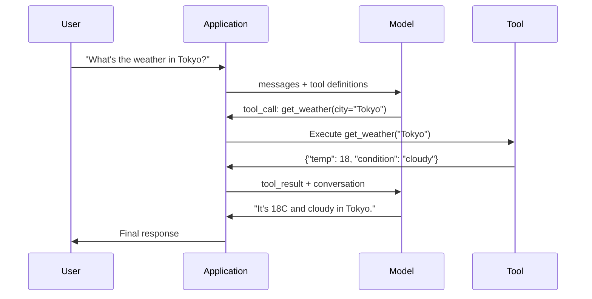

# Function Calling 与 Tool Use

> LLMs 本身不能做任何事。它们生成文本。这就是全部能力。它们不能查看天气、查询数据库、发送电子邮件、运行代码或读取文件。你见过的每一个“AI agent”，本质上都是一个 LLM 生成 JSON，说明要调用哪个 function，然后由你的代码真正执行调用。模型是大脑。Tools 是双手。Function calling 是连接它们的神经系统。

**Type:** Build
**Languages:** Python
**Prerequisites:** Phase 11 Lesson 03 (Structured Outputs)
**Time:** ~75 minutes
**Related:** Phase 11 · 14 (Model Context Protocol) — 当一个 tool 需要跨 host 共享时，应从 inline function-calling 升级为 MCP server。本课覆盖 inline 场景；MCP 覆盖 protocol 场景。

## 学习目标
- 实现一个 function calling loop：定义 tool schemas、解析模型的 tool-call JSON、执行 functions，并返回结果
- 设计带有清晰 descriptions 和 typed parameters 的 tool schemas，使模型能够可靠调用
- 构建一个 multi-turn agent loop，通过串联多次 function calls 来回答复杂查询
- 处理 function calling 边界情况：parallel tool calls、error propagation，以及防止无限 tool loops

## 问题
你构建了一个 chatbot。用户问：“What's the weather in Tokyo right now?”

模型回答：“I don't have access to real-time weather data, but based on the season, Tokyo is likely around 15 degrees Celsius...”

这是披着免责声明外衣的 hallucination。模型并不知道天气。它永远不会知道。天气每小时都在变化。模型的训练数据已经是几个月前的了。

正确答案需要调用 OpenWeatherMap API，获取当前温度，并返回真实数值。模型不能调用 APIs。你的代码可以。缺失的一环是：一个结构化 protocol，让模型可以说“我需要用这些 arguments 调用 weather API”，并让你的代码执行它，再把结果喂回模型。

这就是 Function Calling。模型输出结构化 JSON，描述要用什么 arguments 调用哪个 function。你的 application 执行 function。结果回到 conversation 中。模型使用结果生成最终答案。

没有 Function Calling，LLMs 是百科全书。有了它，它们就变成了 agents。

## 概念
### The Function Calling Loop

每一次 tool-use 交互都遵循同一个 5 步循环。



Step 1：用户发送 message。Step 2：模型接收 message 以及 tool definitions（描述可用 functions 的 JSON Schema）。Step 3：模型不直接返回文本，而是输出一个 tool call，也就是包含 function name 和 arguments 的结构化 JSON object。Step 4：你的代码执行 function 并捕获结果。Step 5：结果返回给模型，模型现在拥有真实数据，可以生成最终答案。

模型从不执行任何东西。它只决定调用什么，以及用什么 arguments 调用。你的代码才是 executor。

### Tool Definitions：JSON Schema Contract

每个 tool 都由一个 JSON Schema 定义，它告诉模型这个 function 做什么、接收哪些 arguments，以及这些 arguments 必须是什么类型。

```json
{
  "type": "function",
  "function": {
    "name": "get_weather",
    "description": "Get current weather for a city. Returns temperature in Celsius and conditions.",
    "parameters": {
      "type": "object",
      "properties": {
        "city": {
          "type": "string",
          "description": "City name, e.g. 'Tokyo' or 'San Francisco'"
        },
        "units": {
          "type": "string",
          "enum": ["celsius", "fahrenheit"],
          "description": "Temperature units"
        }
      },
      "required": ["city"]
    }
  }
}
```

`description` fields 至关重要。模型会读取它们，以决定何时以及如何使用 tool。像“gets weather”这样含糊的 description，比“Get current weather for a city. Returns temperature in Celsius and conditions.”产生更差的 tool selection。description 是用于 tool selection 的 prompt。

### Provider Comparison

每个主流 provider 都支持 function calling，但 API surface 有所不同。

| Provider | API Parameter | Tool Call Format | Parallel Calls | Forced Calling |
|----------|--------------|-----------------|---------------|----------------|
| OpenAI (GPT-5, o4) | `tools` | `tool_calls[].function` | Yes (multiple per turn) | `tool_choice="required"` |
| Anthropic (Claude 4.6/4.7) | `tools` | `content[].type="tool_use"` | Yes (multiple blocks) | `tool_choice={"type":"any"}` |
| Google (Gemini 3) | `function_declarations` | `functionCall` | Yes | `function_calling_config` |
| Open-weight (Llama 4, Qwen3, DeepSeek-V3) | Native `tools` on Llama 4; Hermes or ChatML on others | Mixed | Model-dependent | Prompt-based or `tool_choice` if supported |

到 2026 年，三家 closed providers 已经收敛到几乎相同的、基于 JSON Schema 的格式。Llama 4 自带一个 native `tools` field，形状与 OpenAI 匹配。Open-weight fine-tunes 仍然各不相同，其中 Hermes format（NousResearch）是 third-party fine-tunes 中最常见的格式。对于跨 hosts 共享的 tools，优先使用 MCP（Phase 11 · 14），而不是 inline function-calling，因为 server 对所有 host 都相同。

### Tool Choice: Auto, Required, Specific

你可以控制模型何时使用 tools。

**Auto**（默认）：模型自行决定是调用 tool 还是直接回答。“What's 2+2?”会直接回答。“What's the weather?”会调用 tool。

**Required**：模型必须至少调用一个 tool。当你知道用户意图需要 tool 时使用它。它可以防止模型不查询真实数据而直接猜测。

**Specific function**：强制模型调用某个特定 function。`tool_choice={"type":"function", "function": {"name": "get_weather"}}` 保证 weather tool 会被调用，无论 query 是什么。将它用于 routing，即 upstream logic 已经判断出需要哪个 tool 的场景。

### Parallel Function Calling

GPT-4o 和 Claude 可以在单个 turn 中调用多个 functions。用户问：“What's the weather in Tokyo and New York?”模型会同时输出两个 tool calls：

```json
[
  {"name": "get_weather", "arguments": {"city": "Tokyo"}},
  {"name": "get_weather", "arguments": {"city": "New York"}}
]
```

你的代码执行两者（理想情况下并发执行），返回两个结果，然后模型合成一个统一回答。这会把 round trips 从 2 次减少到 1 次。对于每个 query 需要 5-10 次 tool calls 的 agents，parallel calling 可将 latency 降低 60-80%。

### Structured Outputs 与 Function Calling 对比

Lesson 03 覆盖了 structured outputs。Function calling 使用同一套 JSON Schema 机制，但目的不同。

**Structured outputs**：强制模型以特定形状生成数据。输出就是最终产物。示例：从文本中提取 product info 为 `{name, price, in_stock}`。

**Function calling**：模型声明执行某个 action 的意图。输出是中间步骤。示例：`get_weather(city="Tokyo")`，模型是在请求一个 action，而不是生成最终答案。

当你需要 data extraction 时，使用 structured outputs。当你需要模型与 external systems 交互时，使用 function calling。

### Security: 不可妥协的规则

Function calling 是你能赋予 LLM 的最危险能力。模型选择要执行什么。如果你的 tool set 包含 database queries，模型就会构造 queries。如果它包含 shell commands，模型就会编写它们。

**Rule 1: Never pass model-generated SQL directly to a database.** 模型可能且确实会生成 DROP TABLE、UNION injections，或者返回每一行的 queries。始终 parameterize。始终 validate。始终使用 operations allowlist。

**Rule 2: Allowlist functions.** 模型只能调用你显式定义的 functions。永远不要构建一个通用的“按 name 执行任意 function”的 tool。如果你有 50 个 internal functions，只暴露用户需要的 5 个。

**Rule 3: Validate arguments.** 模型可能传入一个 city name：`"; DROP TABLE users; --"`。执行前要根据预期的 types、ranges 和 formats 验证每个 argument。

**Rule 4: Sanitize tool results.** 如果 tool 返回 sensitive data（API keys、PII、internal errors），在将其发回模型之前先过滤。模型会把 tool results 原样包含在它的 response 中。

**Rule 5: Rate limit tool calls.** 处于循环中的模型可能调用 tools 数百次。设置一个最大值（每个 conversation 10-20 次 calls 是合理的）。打断无限 loops。

### Error Handling

Tools 会失败。APIs 会超时。Databases 会宕机。Files 不存在。模型需要知道 tool 何时失败以及为什么失败。

将 errors 作为结构化 tool results 返回，而不是抛出 exceptions：

```json
{
  "error": true,
  "message": "City 'Toky' not found. Did you mean 'Tokyo'?",
  "code": "CITY_NOT_FOUND"
}
```

模型读取这个结果，调整 arguments，并重试。Models 很擅长从结构化 error messages 中自我纠正。它们不擅长从空 response 或泛泛的“something went wrong”错误中恢复。

### MCP: Model Context Protocol

MCP 是 Anthropic 面向 tool interoperability 的 open standard。它不是让每个 application 定义自己的 tools，而是提供一个 universal protocol：tools 由 MCP servers 提供，并由 MCP clients（如 Claude Code、Cursor 或你的 application）消费。

一个 MCP server 可以向任何兼容 client 暴露 tools。Postgres MCP server 让任何 MCP-compatible agent 获得 database access。GitHub MCP server 让任何 agent 获得 repository access。Tools 定义一次，到处使用。

MCP 之于 function calling，就像 HTTP 之于 networking。它标准化 transport layer，使 tools 变得 portable。

## 构建它
### 步骤 1： Define the Tool Registry

构建一个 registry，用于存储 tool definitions 及其 implementations。每个 tool 都有一个 JSON Schema definition（模型看到的内容）和一个 Python function（你的代码执行的内容）。

```python
import json
import math
import time
import hashlib


TOOL_REGISTRY = {}


def register_tool(name, description, parameters, function):
    TOOL_REGISTRY[name] = {
        "definition": {
            "type": "function",
            "function": {
                "name": name,
                "description": description,
                "parameters": parameters,
            },
        },
        "function": function,
    }
```

### 步骤 2： Implement 5 Tools

构建一个 calculator、weather lookup、web search simulator、file reader 和 code runner。

```python
def calculator(expression, precision=2):
    allowed = set("0123456789+-*/.() ")
    if not all(c in allowed for c in expression):
        return {"error": True, "message": f"Invalid characters in expression: {expression}"}
    try:
        result = eval(expression, {"__builtins__": {}}, {"math": math})
        return {"result": round(float(result), precision), "expression": expression}
    except Exception as e:
        return {"error": True, "message": str(e)}


WEATHER_DB = {
    "tokyo": {"temp_c": 18, "condition": "cloudy", "humidity": 72, "wind_kph": 14},
    "new york": {"temp_c": 22, "condition": "sunny", "humidity": 45, "wind_kph": 8},
    "london": {"temp_c": 12, "condition": "rainy", "humidity": 88, "wind_kph": 22},
    "san francisco": {"temp_c": 16, "condition": "foggy", "humidity": 80, "wind_kph": 18},
    "sydney": {"temp_c": 25, "condition": "sunny", "humidity": 55, "wind_kph": 10},
}


def get_weather(city, units="celsius"):
    key = city.lower().strip()
    if key not in WEATHER_DB:
        suggestions = [c for c in WEATHER_DB if c.startswith(key[:3])]
        return {
            "error": True,
            "message": f"City '{city}' not found.",
            "suggestions": suggestions,
            "code": "CITY_NOT_FOUND",
        }
    data = WEATHER_DB[key].copy()
    if units == "fahrenheit":
        data["temp_f"] = round(data["temp_c"] * 9 / 5 + 32, 1)
        del data["temp_c"]
    data["city"] = city
    return data


SEARCH_DB = {
    "python function calling": [
        {"title": "OpenAI Function Calling Guide", "url": "https://platform.openai.com/docs/guides/function-calling", "snippet": "Learn how to connect LLMs to external tools."},
        {"title": "Anthropic Tool Use", "url": "https://docs.anthropic.com/en/docs/tool-use", "snippet": "Claude can interact with external tools and APIs."},
    ],
    "MCP protocol": [
        {"title": "Model Context Protocol", "url": "https://modelcontextprotocol.io", "snippet": "An open standard for connecting AI models to data sources."},
    ],
    "weather API": [
        {"title": "OpenWeatherMap API", "url": "https://openweathermap.org/api", "snippet": "Free weather API with current, forecast, and historical data."},
    ],
}


def web_search(query, max_results=3):
    key = query.lower().strip()
    for db_key, results in SEARCH_DB.items():
        if db_key in key or key in db_key:
            return {"query": query, "results": results[:max_results], "total": len(results)}
    return {"query": query, "results": [], "total": 0}


FILE_SYSTEM = {
    "data/config.json": '{"model": "gpt-4o", "temperature": 0.7, "max_tokens": 4096}',
    "data/users.csv": "name,email,role\nAlice,alice@example.com,admin\nBob,bob@example.com,user",
    "README.md": "# My Project\nA tool-use agent built from scratch.",
}


def read_file(path):
    if ".." in path or path.startswith("/"):
        return {"error": True, "message": "Path traversal not allowed.", "code": "FORBIDDEN"}
    if path not in FILE_SYSTEM:
        available = list(FILE_SYSTEM.keys())
        return {"error": True, "message": f"File '{path}' not found.", "available_files": available, "code": "NOT_FOUND"}
    content = FILE_SYSTEM[path]
    return {"path": path, "content": content, "size_bytes": len(content), "lines": content.count("\n") + 1}


def run_code(code, language="python"):
    if language != "python":
        return {"error": True, "message": f"Language '{language}' not supported. Only 'python' is available."}
    forbidden = ["import os", "import sys", "import subprocess", "exec(", "eval(", "__import__", "open("]
    for pattern in forbidden:
        if pattern in code:
            return {"error": True, "message": f"Forbidden operation: {pattern}", "code": "SECURITY_VIOLATION"}
    try:
        local_vars = {}
        exec(code, {"__builtins__": {"print": print, "range": range, "len": len, "str": str, "int": int, "float": float, "list": list, "dict": dict, "sum": sum, "min": min, "max": max, "abs": abs, "round": round, "sorted": sorted, "enumerate": enumerate, "zip": zip, "map": map, "filter": filter, "math": math}}, local_vars)
        result = local_vars.get("result", None)
        return {"success": True, "result": result, "variables": {k: str(v) for k, v in local_vars.items() if not k.startswith("_")}}
    except Exception as e:
        return {"error": True, "message": f"{type(e).__name__}: {e}"}
```

### 步骤 3： Register All Tools

```python
def register_all_tools():
    register_tool(
        "calculator", "Evaluate a mathematical expression. Supports +, -, *, /, parentheses, and decimals. Returns the numeric result.",
        {"type": "object", "properties": {"expression": {"type": "string", "description": "Math expression, e.g. '(10 + 5) * 3'"}, "precision": {"type": "integer", "description": "Decimal places in result", "default": 2}}, "required": ["expression"]},
        calculator,
    )
    register_tool(
        "get_weather", "Get current weather for a city. Returns temperature, condition, humidity, and wind speed.",
        {"type": "object", "properties": {"city": {"type": "string", "description": "City name, e.g. 'Tokyo' or 'San Francisco'"}, "units": {"type": "string", "enum": ["celsius", "fahrenheit"], "description": "Temperature units, defaults to celsius"}}, "required": ["city"]},
        get_weather,
    )
    register_tool(
        "web_search", "Search the web for information. Returns a list of results with title, URL, and snippet.",
        {"type": "object", "properties": {"query": {"type": "string", "description": "Search query"}, "max_results": {"type": "integer", "description": "Maximum results to return", "default": 3}}, "required": ["query"]},
        web_search,
    )
    register_tool(
        "read_file", "Read the contents of a file. Returns the file content, size, and line count.",
        {"type": "object", "properties": {"path": {"type": "string", "description": "Relative file path, e.g. 'data/config.json'"}}, "required": ["path"]},
        read_file,
    )
    register_tool(
        "run_code", "Execute Python code in a sandboxed environment. Set a 'result' variable to return output.",
        {"type": "object", "properties": {"code": {"type": "string", "description": "Python code to execute"}, "language": {"type": "string", "enum": ["python"], "description": "Programming language"}}, "required": ["code"]},
        run_code,
    )
```

### 步骤 4： Build the Function Calling Loop

这是核心 engine。它模拟模型决定调用哪个 tool，执行该 tool，并将结果喂回去。

```python
def simulate_model_decision(user_message, tools, conversation_history):
    msg = user_message.lower()

    if any(word in msg for word in ["weather", "temperature", "forecast"]):
        cities = []
        for city in WEATHER_DB:
            if city in msg:
                cities.append(city)
        if not cities:
            for word in msg.split():
                if word.capitalize() in [c.title() for c in WEATHER_DB]:
                    cities.append(word)
        if not cities:
            cities = ["tokyo"]
        calls = []
        for city in cities:
            calls.append({"name": "get_weather", "arguments": {"city": city.title()}})
        return calls

    if any(word in msg for word in ["calculate", "compute", "math", "what is", "how much"]):
        for token in msg.split():
            if any(c in token for c in "+-*/"):
                return [{"name": "calculator", "arguments": {"expression": token}}]
        if "+" in msg or "-" in msg or "*" in msg or "/" in msg:
            expr = "".join(c for c in msg if c in "0123456789+-*/.() ")
            if expr.strip():
                return [{"name": "calculator", "arguments": {"expression": expr.strip()}}]
        return [{"name": "calculator", "arguments": {"expression": "0"}}]

    if any(word in msg for word in ["search", "find", "look up", "google"]):
        query = msg.replace("search for", "").replace("look up", "").replace("find", "").strip()
        return [{"name": "web_search", "arguments": {"query": query}}]

    if any(word in msg for word in ["read", "file", "open", "cat", "show"]):
        for path in FILE_SYSTEM:
            if path.split("/")[-1].split(".")[0] in msg:
                return [{"name": "read_file", "arguments": {"path": path}}]
        return [{"name": "read_file", "arguments": {"path": "README.md"}}]

    if any(word in msg for word in ["run", "execute", "code", "python"]):
        return [{"name": "run_code", "arguments": {"code": "result = 'Hello from the sandbox!'", "language": "python"}}]

    return []


def execute_tool_call(tool_call):
    name = tool_call["name"]
    args = tool_call["arguments"]

    if name not in TOOL_REGISTRY:
        return {"error": True, "message": f"Unknown tool: {name}", "code": "UNKNOWN_TOOL"}

    tool = TOOL_REGISTRY[name]
    func = tool["function"]
    start = time.time()

    try:
        result = func(**args)
    except TypeError as e:
        result = {"error": True, "message": f"Invalid arguments: {e}"}

    elapsed_ms = round((time.time() - start) * 1000, 2)
    return {"tool": name, "result": result, "execution_time_ms": elapsed_ms}


def run_function_calling_loop(user_message, max_iterations=5):
    conversation = [{"role": "user", "content": user_message}]
    tool_definitions = [t["definition"] for t in TOOL_REGISTRY.values()]
    all_tool_results = []

    for iteration in range(max_iterations):
        tool_calls = simulate_model_decision(user_message, tool_definitions, conversation)

        if not tool_calls:
            break

        results = []
        for call in tool_calls:
            result = execute_tool_call(call)
            results.append(result)

        conversation.append({"role": "assistant", "content": None, "tool_calls": tool_calls})

        for result in results:
            conversation.append({"role": "tool", "content": json.dumps(result["result"]), "tool_name": result["tool"]})

        all_tool_results.extend(results)
        break

    return {"conversation": conversation, "tool_results": all_tool_results, "iterations": iteration + 1 if tool_calls else 0}
```

### 步骤 5： Argument Validation

构建一个 validator，在执行前根据 JSON Schema 检查 tool call arguments。

```python
def validate_tool_arguments(tool_name, arguments):
    if tool_name not in TOOL_REGISTRY:
        return [f"Unknown tool: {tool_name}"]

    schema = TOOL_REGISTRY[tool_name]["definition"]["function"]["parameters"]
    errors = []

    if not isinstance(arguments, dict):
        return [f"Arguments must be an object, got {type(arguments).__name__}"]

    for required_field in schema.get("required", []):
        if required_field not in arguments:
            errors.append(f"Missing required argument: {required_field}")

    properties = schema.get("properties", {})
    for arg_name, arg_value in arguments.items():
        if arg_name not in properties:
            errors.append(f"Unknown argument: {arg_name}")
            continue

        prop_schema = properties[arg_name]
        expected_type = prop_schema.get("type")

        type_checks = {"string": str, "integer": int, "number": (int, float), "boolean": bool, "array": list, "object": dict}
        if expected_type in type_checks:
            if not isinstance(arg_value, type_checks[expected_type]):
                errors.append(f"Argument '{arg_name}': expected {expected_type}, got {type(arg_value).__name__}")

        if "enum" in prop_schema and arg_value not in prop_schema["enum"]:
            errors.append(f"Argument '{arg_name}': '{arg_value}' not in {prop_schema['enum']}")

    return errors
```

### 步骤 6： Run the Demo

```python
def run_demo():
    register_all_tools()

    print("=" * 60)
    print("  Function Calling & Tool Use Demo")
    print("=" * 60)

    print("\n--- Registered Tools ---")
    for name, tool in TOOL_REGISTRY.items():
        desc = tool["definition"]["function"]["description"][:60]
        params = list(tool["definition"]["function"]["parameters"].get("properties", {}).keys())
        print(f"  {name}: {desc}...")
        print(f"    params: {params}")

    print(f"\n--- Argument Validation ---")
    validation_tests = [
        ("get_weather", {"city": "Tokyo"}, "Valid call"),
        ("get_weather", {}, "Missing required arg"),
        ("get_weather", {"city": "Tokyo", "units": "kelvin"}, "Invalid enum value"),
        ("calculator", {"expression": 123}, "Wrong type (int for string)"),
        ("unknown_tool", {"x": 1}, "Unknown tool"),
    ]
    for tool_name, args, label in validation_tests:
        errors = validate_tool_arguments(tool_name, args)
        status = "VALID" if not errors else f"ERRORS: {errors}"
        print(f"  {label}: {status}")

    print(f"\n--- Tool Execution ---")
    direct_tests = [
        {"name": "calculator", "arguments": {"expression": "(10 + 5) * 3 / 2"}},
        {"name": "get_weather", "arguments": {"city": "Tokyo"}},
        {"name": "get_weather", "arguments": {"city": "Mars"}},
        {"name": "web_search", "arguments": {"query": "python function calling"}},
        {"name": "read_file", "arguments": {"path": "data/config.json"}},
        {"name": "read_file", "arguments": {"path": "../etc/passwd"}},
        {"name": "run_code", "arguments": {"code": "result = sum(range(1, 101))"}},
        {"name": "run_code", "arguments": {"code": "import os; os.system('rm -rf /')"}},
    ]
    for call in direct_tests:
        result = execute_tool_call(call)
        print(f"\n  {call['name']}({json.dumps(call['arguments'])})")
        print(f"    -> {json.dumps(result['result'], indent=None)[:100]}")
        print(f"    time: {result['execution_time_ms']}ms")

    print(f"\n--- Full Function Calling Loop ---")
    test_queries = [
        "What's the weather in Tokyo?",
        "Calculate (100 + 250) * 0.15",
        "Search for MCP protocol",
        "Read the config file",
        "Run some Python code",
        "Tell me a joke",
    ]
    for query in test_queries:
        print(f"\n  User: {query}")
        result = run_function_calling_loop(query)
        if result["tool_results"]:
            for tr in result["tool_results"]:
                print(f"    Tool: {tr['tool']} ({tr['execution_time_ms']}ms)")
                print(f"    Result: {json.dumps(tr['result'], indent=None)[:90]}")
        else:
            print(f"    [No tool called -- direct response]")
        print(f"    Iterations: {result['iterations']}")

    print(f"\n--- Parallel Tool Calls ---")
    multi_city_query = "What's the weather in tokyo and london?"
    print(f"  User: {multi_city_query}")
    result = run_function_calling_loop(multi_city_query)
    print(f"  Tool calls made: {len(result['tool_results'])}")
    for tr in result["tool_results"]:
        city = tr["result"].get("city", "unknown")
        temp = tr["result"].get("temp_c", "N/A")
        print(f"    {city}: {temp}C, {tr['result'].get('condition', 'N/A')}")

    print(f"\n--- Security Checks ---")
    security_tests = [
        ("read_file", {"path": "../../etc/passwd"}),
        ("run_code", {"code": "import subprocess; subprocess.run(['ls'])"}),
        ("calculator", {"expression": "__import__('os').system('ls')"}),
    ]
    for tool_name, args in security_tests:
        result = execute_tool_call({"name": tool_name, "arguments": args})
        blocked = result["result"].get("error", False)
        print(f"  {tool_name}({list(args.values())[0][:40]}): {'BLOCKED' if blocked else 'ALLOWED'}")
```

## 使用它
### OpenAI Function Calling

```python
# from openai import OpenAI
#
# client = OpenAI()
#
# tools = [{
#     "type": "function",
#     "function": {
#         "name": "get_weather",
#         "description": "Get current weather for a city",
#         "parameters": {
#             "type": "object",
#             "properties": {
#                 "city": {"type": "string"},
#                 "units": {"type": "string", "enum": ["celsius", "fahrenheit"]}
#             },
#             "required": ["city"]
#         }
#     }
# }]
#
# response = client.chat.completions.create(
#     model="gpt-4o",
#     messages=[{"role": "user", "content": "Weather in Tokyo?"}],
#     tools=tools,
#     tool_choice="auto",
# )
#
# tool_call = response.choices[0].message.tool_calls[0]
# args = json.loads(tool_call.function.arguments)
# result = get_weather(**args)
#
# final = client.chat.completions.create(
#     model="gpt-4o",
#     messages=[
#         {"role": "user", "content": "Weather in Tokyo?"},
#         response.choices[0].message,
#         {"role": "tool", "tool_call_id": tool_call.id, "content": json.dumps(result)},
#     ],
# )
# print(final.choices[0].message.content)
```

OpenAI 将 tool calls 返回为 `response.choices[0].message.tool_calls`。每个 call 都有一个 `id`，你在返回结果时必须包含它。模型使用这个 ID 将 results 匹配到 calls。GPT-4o 可以在单个 response 中返回多个 tool calls，需要遍历并执行所有 call。

### Anthropic Tool Use

```python
# import anthropic
#
# client = anthropic.Anthropic()
#
# response = client.messages.create(
#     model="claude-sonnet-4-20250514",
#     max_tokens=1024,
#     tools=[{
#         "name": "get_weather",
#         "description": "Get current weather for a city",
#         "input_schema": {
#             "type": "object",
#             "properties": {
#                 "city": {"type": "string"},
#                 "units": {"type": "string", "enum": ["celsius", "fahrenheit"]}
#             },
#             "required": ["city"]
#         }
#     }],
#     messages=[{"role": "user", "content": "Weather in Tokyo?"}],
# )
#
# tool_block = next(b for b in response.content if b.type == "tool_use")
# result = get_weather(**tool_block.input)
#
# final = client.messages.create(
#     model="claude-sonnet-4-20250514",
#     max_tokens=1024,
#     tools=[...],
#     messages=[
#         {"role": "user", "content": "Weather in Tokyo?"},
#         {"role": "assistant", "content": response.content},
#         {"role": "user", "content": [{"type": "tool_result", "tool_use_id": tool_block.id, "content": json.dumps(result)}]},
#     ],
# )
```

Anthropic 将 tool calls 返回为带有 `type: "tool_use"` 的 content blocks。tool result 放在带有 `type: "tool_result"` 的 user message 中。注意关键区别：Anthropic 使用 `input_schema` 定义 tool parameters，而 OpenAI 使用 `parameters`。

### MCP Integration

```python
# MCP servers expose tools over a standardized protocol.
# Any MCP-compatible client can discover and call these tools.
#
# Example: connecting to a Postgres MCP server
#
# from mcp import ClientSession, StdioServerParameters
# from mcp.client.stdio import stdio_client
#
# server_params = StdioServerParameters(
#     command="npx",
#     args=["-y", "@modelcontextprotocol/server-postgres", "postgresql://localhost/mydb"],
# )
#
# async with stdio_client(server_params) as (read, write):
#     async with ClientSession(read, write) as session:
#         await session.initialize()
#         tools = await session.list_tools()
#         result = await session.call_tool("query", {"sql": "SELECT count(*) FROM users"})
```

MCP 将 tool implementation 与 tool consumption 解耦。Postgres server 了解 SQL。GitHub server 了解 API。你的 agent 只是 discovery 并调用 tools，它不需要为每个 integration 编写 provider-specific code。

## 交付它
本课会产出 `outputs/prompt-tool-designer.md`，这是一个用于设计 tool definitions 的可复用 prompt template。给它一个关于你希望 tool 做什么的 description，它会生成完整的 JSON Schema definition，包括 descriptions、types 和 constraints。

它还会产出 `outputs/skill-function-calling-patterns.md`，这是一个用于在 production 中实现 function calling 的 decision framework，覆盖 tool design、error handling、security 和 provider-specific patterns。

## 练习
1. **Add a 6th tool: database query.** 实现一个 simulated SQL tool，使用 in-memory table。该 tool 接收 table name 和 filter conditions（不是 raw SQL）。验证 table name 位于 allowlist 中，并且 filter operators 仅限于 `=`、`>`、`<`、`>=`、`<=`。将匹配 rows 作为 JSON 返回。

2. **Implement retry with error feedback.** 当 tool call 失败时（例如 city not found），把 error message 喂回 model decision function，并让它修正 arguments。记录每个 call 需要多少次 retries。为每个 tool call 设置最多 3 次 retries。

3. **Build a multi-step agent.** 某些 queries 需要串联 tool calls：“Read the config file and tell me what model is configured, then search the web for that model's pricing.” 实现一个 loop，持续运行直到模型决定不再需要 tools，并把累积 results 传入每个 decision step。限制为 10 次 iterations，以防止 infinite loops。

4. **Measure tool selection accuracy.** 创建 30 个带有 expected tool names 的 test queries。在全部 30 个 queries 上运行你的 decision function，并衡量它选择正确 tool 的比例。识别哪些 queries 最容易导致 tools 之间的混淆。

5. **Implement tool call caching.** 如果同一个 tool 在 60 秒内以相同 arguments 被调用，则返回 cached result，而不是重新执行。使用以 `(tool_name, frozenset(args.items()))` 为 key 的 dictionary。衡量包含 20 个 queries 的 conversation 中的 cache hit rates。

## 关键术语
| Term | What people say | What it actually means |
|------|----------------|----------------------|
| Function calling | “Tool use” | 模型输出结构化 JSON，描述要用特定 arguments 调用的 function，由你的代码执行，而不是模型执行 |
| Tool definition | “Function schema” | 一个 JSON Schema object，描述 tool 的 name、purpose、parameters 和 types，模型读取它来决定何时以及如何使用该 tool |
| Tool choice | “Calling mode” | 控制模型必须调用 tool（required）、可以调用 tool（auto），还是必须调用特定 tool（named） |
| Parallel calling | “Multi-tool” | 模型在单个 turn 中输出多个 tool calls，从而减少 round trips，GPT-4o 和 Claude 都支持这一点 |
| Tool result | “Function output” | 执行 tool 后得到的 return value，作为 message 发回模型，使它能在 response 中使用真实数据 |
| Argument validation | “Input checking” | 在执行 tool 前，验证模型生成的 arguments 是否匹配预期 types、ranges 和 constraints |
| MCP | “Tool protocol” | Model Context Protocol，即 Anthropic 的 open standard，用于通过 servers 暴露 tools，让任何兼容 client 都能发现并调用 |
| Agent loop | “ReAct loop” | model-decides-tool、code-executes-tool、result-feeds-back 的迭代循环，直到模型拥有足够信息作出回答 |
| Tool poisoning | “Prompt injection via tools” | 一种攻击，其中 tool results 包含会操纵模型行为的 instructions，因此要 sanitize 所有 tool outputs |
| Rate limiting | “Call budget” | 设置每个 conversation 中 tool calls 的最大数量，以防止 infinite loops 和失控的 API costs |

## 延伸阅读
- [OpenAI Function Calling Guide](https://platform.openai.com/docs/guides/function-calling) — 使用 GPT-4o 进行 tool use 的权威参考，包括 parallel calls、forced calling 和 structured arguments
- [Anthropic Tool Use Guide](https://docs.anthropic.com/en/docs/tool-use) — Claude 的 tool use 实现，包括 input_schema、multi-tool responses 和 tool_choice configuration
- [Model Context Protocol Specification](https://modelcontextprotocol.io) — 跨 AI applications 的 tool interoperability open standard，包含 server/client architecture
- [Schick et al., 2023 — “Toolformer: Language Models Can Teach Themselves to Use Tools”](https://arxiv.org/abs/2302.04761) — 关于训练 LLMs 决定何时以及如何调用 external tools 的基础论文
- [Patil et al., 2023 — “Gorilla: Large Language Model Connected with Massive APIs”](https://arxiv.org/abs/2305.15334) — 针对 1,645 个 APIs 的准确 API calls 对 LLMs 进行 fine-tuning，并减少 hallucination
- [Berkeley Function Calling Leaderboard](https://gorilla.cs.berkeley.edu/leaderboard.html) — 实时 benchmark，对比 GPT-4o、Claude、Gemini 和 open models 的 function calling accuracy
- [Yao et al., “ReAct: Synergizing Reasoning and Acting in Language Models” (ICLR 2023)](https://arxiv.org/abs/2210.03629) — Thought-Action-Observation loop，它是每次 tool call 外层的 agent loop；本课结束之处，正是 Phase 14 接续之处。
- [Anthropic — Building effective agents (Dec 2024)](https://www.anthropic.com/research/building-effective-agents) — 从单一 tool-use primitive 构建出的五种可组合 patterns（prompt chaining、routing、parallelization、orchestrator-workers、evaluator-optimizer）。
