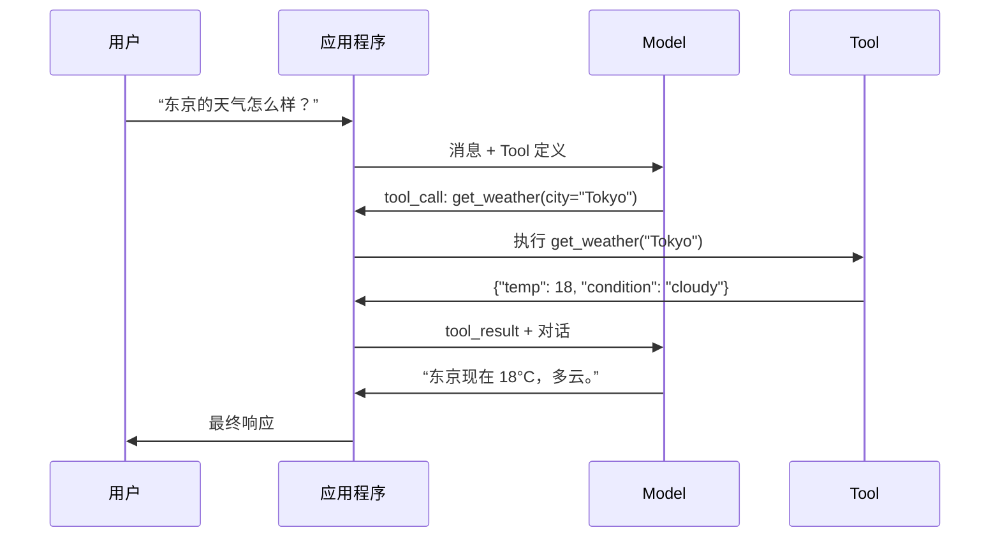

# Function Calling 与 Tool Use

> LLMs 什么也做不了。它们只会生成文本。这就是它们的全部能力。它们无法查看天气、查询数据库、发送电子邮件、运行代码或读取文件。你见过的每一个“AI Agent”，本质上都是一个 LLM 在生成 JSON，用来说明应调用哪个 function，然后由你的代码真正执行调用。Model 是大脑，Tools 是双手，而 Function calling 是连接两者的神经系统。

**Type:** Build
**Languages:** Python
**Prerequisites:** Phase 11 Lesson 03 (Structured Outputs)
**Time:** ~75 分钟
**Related:** Phase 11 · 14 (Model Context Protocol) — 当一个 Tool 需要跨 host 共享时，应从内联 Function calling 升级为 MCP server。本课介绍内联场景；MCP 介绍协议场景。

## 学习目标

- 实现 Function calling 循环：定义 Tool schema、解析 Model 的 Tool-call JSON、执行 function，并返回结果
- 设计具有清晰描述和类型化参数的 Tool schema，使 Model 能够可靠调用
- 构建能够串联多个 function call、回答复杂查询的多轮 Agent 循环
- 处理 Function calling 的边界情况：并行 Tool call、错误传播，以及防止无限 Tool 循环

## 问题

你构建了一个聊天机器人。用户问：“东京现在的天气怎么样？”

Model 回答：“我无法访问实时天气数据，但根据季节判断，东京的气温可能在 15 摄氏度左右……”

这是一段披着免责声明外衣的幻觉。Model 不知道天气。它永远也不会知道。天气每小时都在变化，而 Model 的 Training data 已经过时数月。

正确答案需要调用 OpenWeatherMap API，获取当前温度并返回真实数值。Model 无法调用 API，但你的代码可以。缺失的部分是一个结构化协议：让 Model 能够表达“我需要使用这些参数调用天气 API”，再由你的代码执行调用并把结果反馈给它。

这就是 Function calling。Model 输出结构化 JSON，描述要调用哪个 function 以及使用哪些参数。你的应用程序执行该 function，再把结果放回对话中。Model 使用这个结果生成最终答案。

没有 Function calling，LLMs 只是百科全书。有了它，LLMs 就能成为 Agents。

## 概念

### Function Calling 循环

每次 Tool-use 交互都遵循相同的 5 步循环。



第 1 步：用户发送消息。第 2 步：Model 接收消息以及 Tool 定义，也就是描述可用 function 的 JSON Schema。第 3 步：Model 不再返回文本，而是输出一个 Tool call，即包含 function 名称和参数的结构化 JSON 对象。第 4 步：你的代码执行该 function 并获取结果。第 5 步：结果被送回 Model，此时 Model 已经拥有真实数据，可以生成最终答案。

Model 从不执行任何内容。它只决定调用什么，以及使用哪些参数。你的代码才是执行者。

### Tool 定义：JSON Schema 契约

每个 Tool 都由一个 JSON Schema 定义，它会告诉 Model 该 function 的作用、接受哪些参数，以及这些参数必须采用什么类型。

```json
{
  "type": "function",
  "function": {
    "name": "get_weather",
    "description": "获取城市的当前天气。返回摄氏温度和天气状况。",
    "parameters": {
      "type": "object",
      "properties": {
        "city": {
          "type": "string",
          "description": "城市名称，例如 'Tokyo' 或 'San Francisco'"
        },
        "units": {
          "type": "string",
          "enum": ["celsius", "fahrenheit"],
          "description": "温度单位"
        }
      },
      "required": ["city"]
    }
  }
}
```

`description` 字段至关重要。Model 会读取它们，以决定何时以及如何使用 Tool。与“获取天气”这种模糊描述相比，“获取城市的当前天气。返回摄氏温度和天气状况。”能带来更准确的 Tool 选择。description 本身就是用于 Tool 选择的 Prompt。

### Provider 对比

所有主流 Provider 都支持 Function calling，但 API 接口有所不同。

| Provider | API 参数 | Tool Call 格式 | 并行调用 | 强制调用 |
|----------|--------------|-----------------|---------------|----------------|
| OpenAI (GPT-5, o4) | `tools` | `tool_calls[].function` | 是（每轮可调用多个） | `tool_choice="required"` |
| Anthropic (Claude 4.6/4.7) | `tools` | `content[].type="tool_use"` | 是（多个 block） | `tool_choice={"type":"any"}` |
| Google (Gemini 3) | `function_declarations` | `functionCall` | 是 | `function_calling_config` |
| Open-weight (Llama 4, Qwen3, DeepSeek-V3) | Llama 4 原生支持 `tools`；其他 Model 使用 Hermes 或 ChatML | 混合 | 取决于 Model | 基于 Prompt，或在支持时使用 `tool_choice` |

到 2026 年，三家闭源 Provider 已经收敛到几乎相同的、基于 JSON Schema 的格式。Llama 4 提供了原生 `tools` 字段，其结构与 OpenAI 一致。Open-weight Fine-tuning Model 仍然各不相同，其中 Hermes 格式（NousResearch）在第三方 Fine-tuning Model 中最为常见。对于需要跨 host 共享的 Tools，应优先选择 MCP（Phase 11 · 14），而不是内联 Function calling，这样所有 host 都可以使用同一个 server。

### Tool Choice：Auto、Required、Specific

你可以控制 Model 何时使用 Tools。

**Auto**（默认）：Model 自行决定是调用 Tool 还是直接响应。“2+2 等于多少？”会直接回答；“天气怎么样？”则会调用 Tool。

**Required**：Model 必须调用至少一个 Tool。当你确定用户意图需要 Tool 时使用该模式。它能防止 Model 猜测答案，而不去查询真实数据。

**Specific function**：强制 Model 调用指定的 function。无论查询内容是什么，`tool_choice={"type":"function", "function": {"name": "get_weather"}}` 都能保证调用天气 Tool。该模式适合路由场景，也就是上游逻辑已经确定需要使用哪个 Tool。

### 并行 Function Calling

GPT-4o 和 Claude 可以在单轮中调用多个 function。用户问：“东京和纽约的天气怎么样？”Model 会同时输出两个 Tool call：

```json
[
  {"name": "get_weather", "arguments": {"city": "Tokyo"}},
  {"name": "get_weather", "arguments": {"city": "New York"}}
]
```

你的代码执行这两个调用（最好并发执行），返回两个结果，然后由 Model 合成为一个响应。这会将往返次数从 2 次减少到 1 次。对于每次查询需要调用 5-10 个 Tools 的 Agents，并行调用可以将延迟降低 60%-80%。

### Structured Outputs 与 Function Calling

Lesson 03 介绍了 Structured Outputs。Function calling 使用相同的 JSON Schema 机制，但目的不同。

**Structured Outputs**：强制 Model 以特定结构生成数据。输出本身就是最终产物。例如，从文本中提取产品信息，并表示为 `{name, price, in_stock}`。

**Function calling**：Model 声明执行某项操作的意图。输出只是中间步骤。例如，`get_weather(city="Tokyo")` 表示 Model 正在请求执行操作，而不是生成最终答案。

需要提取数据时使用 Structured Outputs。需要让 Model 与外部系统交互时使用 Function calling。

### 安全：不可妥协的规则

Function calling 是你能赋予 LLM 的最危险能力。Model 会选择执行什么。如果 Tool 集合中包含数据库查询，Model 就会构造查询。如果其中包含 shell 命令，Model 就会编写命令。

**规则 1：绝不要将 Model 生成的 SQL 直接传给数据库。** Model 可能生成 DROP TABLE、UNION 注入，或者返回每一行数据的查询，而且它确实会这样做。始终使用参数化查询。始终进行验证。始终使用操作 allowlist。

**规则 2：对 function 使用 allowlist。** Model 只能调用你明确定义的 function。绝不要构建一个“按名称执行任意 function”的通用 Tool。如果内部有 50 个 function，只暴露用户所需的 5 个。

**规则 3：验证参数。** Model 可能传入 `"; DROP TABLE users; --"` 这样的城市名称。执行前，应根据预期类型、范围和格式验证每个参数。

**规则 4：清理 Tool 结果。** 如果 Tool 返回敏感数据，例如 API key、PII 或内部错误，应先过滤再发送给 Model。Model 可能会逐字把 Tool 结果包含在响应中。

**规则 5：限制 Tool call 速率。** 循环中的 Model 可能调用 Tools 数百次。设置最大次数，每次对话允许 10-20 次调用通常比较合理。必须中断无限循环。

### 错误处理

Tools 会失败。API 会超时。数据库会宕机。文件可能不存在。Model 需要知道 Tool 是否失败，以及失败原因。

将错误作为结构化 Tool 结果返回，而不是抛出异常：

```json
{
  "error": true,
  "message": "未找到城市 'Toky'。你是否想输入 'Tokyo'？",
  "code": "CITY_NOT_FOUND"
}
```

Model 会读取错误、调整参数并重试。Models 擅长根据结构化错误消息进行自我修正，但不擅长从空响应或笼统的“出现问题”错误中恢复。

### MCP：Model Context Protocol

MCP 是 Anthropic 为 Tool 互操作性制定的开放标准。每个应用程序不再需要分别定义自己的 Tools，而是由 MCP 提供通用协议：Tools 由 MCP servers 提供，并由 MCP clients 使用，例如 Claude Code、Cursor 或你的应用程序。

一个 MCP server 可以向任何兼容 client 暴露 Tools。Postgres MCP server 能为任何兼容 MCP 的 Agent 提供数据库访问能力。GitHub MCP server 能为任何 Agent 提供 repository 访问能力。Tools 只需定义一次，即可随处使用。

MCP 之于 Function calling，就像 HTTP 之于网络通信。它对传输层进行标准化，使 Tools 具备可移植性。

```figure
mx-tool-call-loop
```

## 手动构建

### 第 1 步：定义 Tool Registry

构建一个用于存储 Tool 定义及其实现的 registry。每个 Tool 都包含一个 JSON Schema 定义（Model 所看到的内容）和一个 Python function（代码实际执行的内容）。

```python
import json
import math
import time
import hashlib


TOOL_REGISTRY = {}


def register_tool(name, description, parameters, function):
    TOOL_REGISTRY[name] = {
        "definition": {
            "type": "function",
            "function": {
                "name": name,
                "description": description,
                "parameters": parameters,
            },
        },
        "function": function,
    }
```

### 第 2 步：实现 5 个 Tools

构建计算器、天气查询、模拟 web 搜索、文件读取器和代码运行器。

```python
def calculator(expression, precision=2):
    allowed = set("0123456789+-*/.() ")
    if not all(c in allowed for c in expression):
        return {"error": True, "message": f"表达式中包含无效字符：{expression}"}
    try:
        result = eval(expression, {"__builtins__": {}}, {"math": math})
        return {"result": round(float(result), precision), "expression": expression}
    except Exception as e:
        return {"error": True, "message": str(e)}


WEATHER_DB = {
    "tokyo": {"temp_c": 18, "condition": "cloudy", "humidity": 72, "wind_kph": 14},
    "new york": {"temp_c": 22, "condition": "sunny", "humidity": 45, "wind_kph": 8},
    "london": {"temp_c": 12, "condition": "rainy", "humidity": 88, "wind_kph": 22},
    "san francisco": {"temp_c": 16, "condition": "foggy", "humidity": 80, "wind_kph": 18},
    "sydney": {"temp_c": 25, "condition": "sunny", "humidity": 55, "wind_kph": 10},
}


def get_weather(city, units="celsius"):
    key = city.lower().strip()
    if key not in WEATHER_DB:
        suggestions = [c for c in WEATHER_DB if c.startswith(key[:3])]
        return {
            "error": True,
            "message": f"未找到城市 '{city}'。",
            "suggestions": suggestions,
            "code": "CITY_NOT_FOUND",
        }
    data = WEATHER_DB[key].copy()
    if units == "fahrenheit":
        data["temp_f"] = round(data["temp_c"] * 9 / 5 + 32, 1)
        del data["temp_c"]
    data["city"] = city
    return data


SEARCH_DB = {
    "python function calling": [
        {"title": "OpenAI Function Calling Guide", "url": "https://platform.openai.com/docs/guides/function-calling", "snippet": "了解如何将 LLMs 连接到外部 Tools。"},
        {"title": "Anthropic Tool Use", "url": "https://docs.anthropic.com/en/docs/tool-use", "snippet": "Claude 可以与外部 Tools 和 APIs 交互。"},
    ],
    "MCP protocol": [
        {"title": "Model Context Protocol", "url": "https://modelcontextprotocol.io", "snippet": "一种用于连接 AI Models 与数据源的开放标准。"},
    ],
    "weather API": [
        {"title": "OpenWeatherMap API", "url": "https://openweathermap.org/api", "snippet": "提供当前、预报和历史数据的免费天气 API。"},
    ],
}


def web_search(query, max_results=3):
    key = query.lower().strip()
    for db_key, results in SEARCH_DB.items():
        if db_key in key or key in db_key:
            return {"query": query, "results": results[:max_results], "total": len(results)}
    return {"query": query, "results": [], "total": 0}


FILE_SYSTEM = {
    "data/config.json": '{"model": "gpt-4o", "temperature": 0.7, "max_tokens": 4096}',
    "data/users.csv": "name,email,role\nAlice,alice@example.com,admin\nBob,bob@example.com,user",
    "README.md": "# 我的项目\n一个从零构建的 Tool-use Agent。",
}


def read_file(path):
    if ".." in path or path.startswith("/"):
        return {"error": True, "message": "不允许路径遍历。", "code": "FORBIDDEN"}
    if path not in FILE_SYSTEM:
        available = list(FILE_SYSTEM.keys())
        return {"error": True, "message": f"未找到文件 '{path}'。", "available_files": available, "code": "NOT_FOUND"}
    content = FILE_SYSTEM[path]
    return {"path": path, "content": content, "size_bytes": len(content), "lines": content.count("\n") + 1}


def run_code(code, language="python"):
    if language != "python":
        return {"error": True, "message": f"不支持语言 '{language}'。目前仅支持 'python'。"}
    forbidden = ["import os", "import sys", "import subprocess", "exec(", "eval(", "__import__", "open("]
    for pattern in forbidden:
        if pattern in code:
            return {"error": True, "message": f"禁止执行的操作：{pattern}", "code": "SECURITY_VIOLATION"}
    try:
        local_vars = {}
        exec(code, {"__builtins__": {"print": print, "range": range, "len": len, "str": str, "int": int, "float": float, "list": list, "dict": dict, "sum": sum, "min": min, "max": max, "abs": abs, "round": round, "sorted": sorted, "enumerate": enumerate, "zip": zip, "map": map, "filter": filter, "math": math}}, local_vars)
        result = local_vars.get("result", None)
        return {"success": True, "result": result, "variables": {k: str(v) for k, v in local_vars.items() if not k.startswith("_")}}
    except Exception as e:
        return {"error": True, "message": f"{type(e).__name__}: {e}"}
```

### 第 3 步：注册所有 Tools

```python
def register_all_tools():
    register_tool(
        "calculator", "计算数学表达式。支持 +、-、*、/、括号和小数。返回数值结果。",
        {"type": "object", "properties": {"expression": {"type": "string", "description": "数学表达式，例如 '(10 + 5) * 3'"}, "precision": {"type": "integer", "description": "结果中的小数位数", "default": 2}}, "required": ["expression"]},
        calculator,
    )
    register_tool(
        "get_weather", "获取城市的当前天气。返回温度、天气状况、湿度和风速。",
        {"type": "object", "properties": {"city": {"type": "string", "description": "城市名称，例如 'Tokyo' 或 'San Francisco'"}, "units": {"type": "string", "enum": ["celsius", "fahrenheit"], "description": "温度单位，默认为 celsius"}}, "required": ["city"]},
        get_weather,
    )
    register_tool(
        "web_search", "在 web 上搜索信息。返回包含标题、URL 和摘要的结果列表。",
        {"type": "object", "properties": {"query": {"type": "string", "description": "搜索查询"}, "max_results": {"type": "integer", "description": "返回结果的最大数量", "default": 3}}, "required": ["query"]},
        web_search,
    )
    register_tool(
        "read_file", "读取文件内容。返回文件内容、大小和行数。",
        {"type": "object", "properties": {"path": {"type": "string", "description": "相对文件路径，例如 'data/config.json'"}}, "required": ["path"]},
        read_file,
    )
    register_tool(
        "run_code", "在沙箱环境中执行 Python 代码。设置 'result' 变量以返回输出。",
        {"type": "object", "properties": {"code": {"type": "string", "description": "要执行的 Python 代码"}, "language": {"type": "string", "enum": ["python"], "description": "编程语言"}}, "required": ["code"]},
        run_code,
    )
```

### 第 4 步：构建 Function Calling 循环

这是核心引擎。它模拟 Model 决定调用哪个 Tool、执行 Tool，并将结果反馈回去。

```python
def simulate_model_decision(user_message, tools, conversation_history):
    msg = user_message.lower()

    if any(word in msg for word in ["weather", "temperature", "forecast"]):
        cities = []
        for city in WEATHER_DB:
            if city in msg:
                cities.append(city)
        if not cities:
            for word in msg.split():
                if word.capitalize() in [c.title() for c in WEATHER_DB]:
                    cities.append(word)
        if not cities:
            cities = ["tokyo"]
        calls = []
        for city in cities:
            calls.append({"name": "get_weather", "arguments": {"city": city.title()}})
        return calls

    if any(word in msg for word in ["calculate", "compute", "math", "what is", "how much"]):
        for token in msg.split():
            if any(c in token for c in "+-*/"):
                return [{"name": "calculator", "arguments": {"expression": token}}]
        if "+" in msg or "-" in msg or "*" in msg or "/" in msg:
            expr = "".join(c for c in msg if c in "0123456789+-*/.() ")
            if expr.strip():
                return [{"name": "calculator", "arguments": {"expression": expr.strip()}}]
        return [{"name": "calculator", "arguments": {"expression": "0"}}]

    if any(word in msg for word in ["search", "find", "look up", "google"]):
        query = msg.replace("search for", "").replace("look up", "").replace("find", "").strip()
        return [{"name": "web_search", "arguments": {"query": query}}]

    if any(word in msg for word in ["read", "file", "open", "cat", "show"]):
        for path in FILE_SYSTEM:
            if path.split("/")[-1].split(".")[0] in msg:
                return [{"name": "read_file", "arguments": {"path": path}}]
        return [{"name": "read_file", "arguments": {"path": "README.md"}}]

    if any(word in msg for word in ["run", "execute", "code", "python"]):
        return [{"name": "run_code", "arguments": {"code": "result = 'Hello from the sandbox!'", "language": "python"}}]

    return []


def execute_tool_call(tool_call):
    name = tool_call["name"]
    args = tool_call["arguments"]

    if name not in TOOL_REGISTRY:
        return {"error": True, "message": f"未知 Tool：{name}", "code": "UNKNOWN_TOOL"}

    tool = TOOL_REGISTRY[name]
    func = tool["function"]
    start = time.time()

    try:
        result = func(**args)
    except TypeError as e:
        result = {"error": True, "message": f"参数无效：{e}"}

    elapsed_ms = round((time.time() - start) * 1000, 2)
    return {"tool": name, "result": result, "execution_time_ms": elapsed_ms}


def run_function_calling_loop(user_message, max_iterations=5):
    conversation = [{"role": "user", "content": user_message}]
    tool_definitions = [t["definition"] for t in TOOL_REGISTRY.values()]
    all_tool_results = []

    for iteration in range(max_iterations):
        tool_calls = simulate_model_decision(user_message, tool_definitions, conversation)

        if not tool_calls:
            break

        results = []
        for call in tool_calls:
            result = execute_tool_call(call)
            results.append(result)

        conversation.append({"role": "assistant", "content": None, "tool_calls": tool_calls})

        for result in results:
            conversation.append({"role": "tool", "content": json.dumps(result["result"]), "tool_name": result["tool"]})

        all_tool_results.extend(results)
        break

    return {"conversation": conversation, "tool_results": all_tool_results, "iterations": iteration + 1 if tool_calls else 0}
```

### 第 5 步：参数验证

构建一个验证器，在执行前根据 JSON Schema 检查 Tool call 参数。

```python
def validate_tool_arguments(tool_name, arguments):
    if tool_name not in TOOL_REGISTRY:
        return [f"未知 Tool：{tool_name}"]

    schema = TOOL_REGISTRY[tool_name]["definition"]["function"]["parameters"]
    errors = []

    if not isinstance(arguments, dict):
        return [f"参数必须是对象，实际得到 {type(arguments).__name__}"]

    for required_field in schema.get("required", []):
        if required_field not in arguments:
            errors.append(f"缺少必需参数：{required_field}")

    properties = schema.get("properties", {})
    for arg_name, arg_value in arguments.items():
        if arg_name not in properties:
            errors.append(f"未知参数：{arg_name}")
            continue

        prop_schema = properties[arg_name]
        expected_type = prop_schema.get("type")

        type_checks = {"string": str, "integer": int, "number": (int, float), "boolean": bool, "array": list, "object": dict}
        if expected_type in type_checks:
            if not isinstance(arg_value, type_checks[expected_type]):
                errors.append(f"参数 '{arg_name}'：预期为 {expected_type}，实际得到 {type(arg_value).__name__}")

        if "enum" in prop_schema and arg_value not in prop_schema["enum"]:
            errors.append(f"参数 '{arg_name}'：'{arg_value}' 不在 {prop_schema['enum']} 中")

    return errors
```

### 第 6 步：运行 Demo

```python
def run_demo():
    register_all_tools()

    print("=" * 60)
    print("  Function Calling 与 Tool Use Demo")
    print("=" * 60)

    print("\n--- 已注册的 Tools ---")
    for name, tool in TOOL_REGISTRY.items():
        desc = tool["definition"]["function"]["description"][:60]
        params = list(tool["definition"]["function"]["parameters"].get("properties", {}).keys())
        print(f"  {name}: {desc}...")
        print(f"    参数：{params}")

    print(f"\n--- 参数验证 ---")
    validation_tests = [
        ("get_weather", {"city": "Tokyo"}, "有效调用"),
        ("get_weather", {}, "缺少必需参数"),
        ("get_weather", {"city": "Tokyo", "units": "kelvin"}, "无效的 enum 值"),
        ("calculator", {"expression": 123}, "类型错误（应为 string，实际为 int）"),
        ("unknown_tool", {"x": 1}, "未知 Tool"),
    ]
    for tool_name, args, label in validation_tests:
        errors = validate_tool_arguments(tool_name, args)
        status = "有效" if not errors else f"错误：{errors}"
        print(f"  {label}: {status}")

    print(f"\n--- Tool 执行 ---")
    direct_tests = [
        {"name": "calculator", "arguments": {"expression": "(10 + 5) * 3 / 2"}},
        {"name": "get_weather", "arguments": {"city": "Tokyo"}},
        {"name": "get_weather", "arguments": {"city": "Mars"}},
        {"name": "web_search", "arguments": {"query": "python function calling"}},
        {"name": "read_file", "arguments": {"path": "data/config.json"}},
        {"name": "read_file", "arguments": {"path": "../etc/passwd"}},
        {"name": "run_code", "arguments": {"code": "result = sum(range(1, 101))"}},
        {"name": "run_code", "arguments": {"code": "import os; os.system('rm -rf /')"}},
    ]
    for call in direct_tests:
        result = execute_tool_call(call)
        print(f"\n  {call['name']}({json.dumps(call['arguments'])})")
        print(f"    -> {json.dumps(result['result'], indent=None)[:100]}")
        print(f"    耗时：{result['execution_time_ms']}ms")

    print(f"\n--- 完整 Function Calling 循环 ---")
    test_queries = [
        "What's the weather in Tokyo?",
        "Calculate (100 + 250) * 0.15",
        "Search for MCP protocol",
        "Read the config file",
        "Run some Python code",
        "Tell me a joke",
    ]
    for query in test_queries:
        print(f"\n  用户：{query}")
        result = run_function_calling_loop(query)
        if result["tool_results"]:
            for tr in result["tool_results"]:
                print(f"    Tool：{tr['tool']}（{tr['execution_time_ms']}ms）")
                print(f"    结果：{json.dumps(tr['result'], indent=None)[:90]}")
        else:
            print(f"    [未调用 Tool——直接响应]")
        print(f"    迭代次数：{result['iterations']}")

    print(f"\n--- 并行 Tool Call ---")
    multi_city_query = "What's the weather in tokyo and london?"
    print(f"  用户：{multi_city_query}")
    result = run_function_calling_loop(multi_city_query)
    print(f"  Tool call 数量：{len(result['tool_results'])}")
    for tr in result["tool_results"]:
        city = tr["result"].get("city", "unknown")
        temp = tr["result"].get("temp_c", "N/A")
        print(f"    {city}: {temp}C, {tr['result'].get('condition', 'N/A')}")

    print(f"\n--- 安全检查 ---")
    security_tests = [
        ("read_file", {"path": "../../etc/passwd"}),
        ("run_code", {"code": "import subprocess; subprocess.run(['ls'])"}),
        ("calculator", {"expression": "__import__('os').system('ls')"}),
    ]
    for tool_name, args in security_tests:
        result = execute_tool_call({"name": tool_name, "arguments": args})
        blocked = result["result"].get("error", False)
        print(f"  {tool_name}({list(args.values())[0][:40]}): {'已阻止' if blocked else '已允许'}")
```

## 使用框架

### OpenAI Function Calling

```python
# from openai import OpenAI
#
# client = OpenAI()
#
# tools = [{
#     "type": "function",
#     "function": {
#         "name": "get_weather",
#         "description": "获取城市的当前天气",
#         "parameters": {
#             "type": "object",
#             "properties": {
#                 "city": {"type": "string"},
#                 "units": {"type": "string", "enum": ["celsius", "fahrenheit"]}
#             },
#             "required": ["city"]
#         }
#     }
# }]
#
# response = client.chat.completions.create(
#     model="gpt-4o",
#     messages=[{"role": "user", "content": "Weather in Tokyo?"}],
#     tools=tools,
#     tool_choice="auto",
# )
#
# tool_call = response.choices[0].message.tool_calls[0]
# args = json.loads(tool_call.function.arguments)
# result = get_weather(**args)
#
# final = client.chat.completions.create(
#     model="gpt-4o",
#     messages=[
#         {"role": "user", "content": "Weather in Tokyo?"},
#         response.choices[0].message,
#         {"role": "tool", "tool_call_id": tool_call.id, "content": json.dumps(result)},
#     ],
# )
# print(final.choices[0].message.content)
```

OpenAI 通过 `response.choices[0].message.tool_calls` 返回 Tool call。每个调用都有一个 `id`，返回结果时必须包含这个 ID。Model 使用该 ID 将结果与调用相匹配。GPT-4o 可以在单个响应中返回多个 Tool call，因此需要遍历并执行所有调用。

### Anthropic Tool Use

```python
# import anthropic
#
# client = anthropic.Anthropic()
#
# response = client.messages.create(
#     model="claude-sonnet-5",
#     max_tokens=1024,
#     tools=[{
#         "name": "get_weather",
#         "description": "获取城市的当前天气",
#         "input_schema": {
#             "type": "object",
#             "properties": {
#                 "city": {"type": "string"},
#                 "units": {"type": "string", "enum": ["celsius", "fahrenheit"]}
#             },
#             "required": ["city"]
#         }
#     }],
#     messages=[{"role": "user", "content": "Weather in Tokyo?"}],
# )
#
# tool_block = next(b for b in response.content if b.type == "tool_use")
# result = get_weather(**tool_block.input)
#
# final = client.messages.create(
#     model="claude-sonnet-5",
#     max_tokens=1024,
#     tools=[...],
#     messages=[
#         {"role": "user", "content": "Weather in Tokyo?"},
#         {"role": "assistant", "content": response.content},
#         {"role": "user", "content": [{"type": "tool_result", "tool_use_id": tool_block.id, "content": json.dumps(result)}]},
#     ],
# )
```

Anthropic 将 Tool call 作为 `type: "tool_use"` 的内容 block 返回。Tool 结果放在 `type: "tool_result"` 的用户消息中。注意这个关键区别：Anthropic 使用 `input_schema` 定义 Tool 参数，而 OpenAI 使用 `parameters`。

### MCP 集成

```python
# MCP servers 通过标准化协议暴露 Tools。
# 任何兼容 MCP 的 client 都可以发现并调用这些 Tools。
#
# 示例：连接到 Postgres MCP server
#
# from mcp import ClientSession, StdioServerParameters
# from mcp.client.stdio import stdio_client
#
# server_params = StdioServerParameters(
#     command="npx",
#     args=["-y", "@modelcontextprotocol/server-postgres", "postgresql://localhost/mydb"],
# )
#
# async with stdio_client(server_params) as (read, write):
#     async with ClientSession(read, write) as session:
#         await session.initialize()
#         tools = await session.list_tools()
#         result = await session.call_tool("query", {"sql": "SELECT count(*) FROM users"})
```

MCP 将 Tool 实现与 Tool 使用解耦。Postgres server 了解 SQL，GitHub server 了解 API。你的 Agent 只需发现并调用 Tools，不需要为每项集成编写特定于 Provider 的代码。

## 交付成果

本课会生成 `outputs/prompt-tool-designer.md`，这是一个用于设计 Tool 定义的可复用 Prompt 模板。向它描述希望 Tool 完成的工作，它就会生成包含描述、类型和约束的完整 JSON Schema 定义。

本课还会生成 `outputs/skill-function-calling-patterns.md`，这是一个用于在生产环境中实现 Function calling 的决策框架，涵盖 Tool 设计、错误处理、安全性和特定于 Provider 的模式。

## 练习

1. **添加第 6 个 Tool：数据库查询。** 使用内存表实现一个模拟 SQL Tool。该 Tool 接受表名和筛选条件，而不是原始 SQL。验证表名是否位于 allowlist 中，并将筛选运算符限制为 `=`、`>`、`<`、`>=`、`<=`。以 JSON 返回匹配的行。

2. **实现带错误反馈的重试。** 当 Tool call 失败时，例如未找到城市，将错误消息反馈给 Model 决策 function，让它修正参数。记录每次调用的重试次数。将每个 Tool call 的最大重试次数设置为 3。

3. **构建多步骤 Agent。** 某些查询需要串联多个 Tool call：“读取配置文件并告诉我配置了哪个 Model，然后在 web 上搜索该 Model 的定价。”实现一个循环，持续运行直到 Model 决定不再需要 Tools，并在每个决策步骤中传入累积结果。最多允许 10 次迭代，以防止无限循环。

4. **测量 Tool 选择准确率。** 创建 30 个测试查询，并为每个查询指定预期 Tool 名称。对全部 30 个查询运行决策 function，测量它选择正确 Tool 的比例。找出最容易导致 Tools 之间混淆的查询。

5. **实现 Tool call 缓存。** 如果 60 秒内使用相同参数调用了同一个 Tool，则返回缓存结果，而不是重新执行。使用以 `(tool_name, frozenset(args.items()))` 为 key 的 dictionary。在包含 20 个查询的对话中测量缓存命中率。

## 关键术语

| 术语 | 人们常说的名称 | 实际含义 |
|------|----------------|----------------------|
| Function calling | “Tool use” | Model 输出结构化 JSON，描述要使用特定参数调用的 function。执行者是你的代码，而不是 Model |
| Tool definition | “Function schema” | 描述 Tool 名称、用途、参数和类型的 JSON Schema 对象。Model 读取它，以决定何时以及如何使用该 Tool |
| Tool choice | “Calling mode” | 控制 Model 必须调用 Tool（required）、可以调用 Tool（auto），还是必须调用指定 Tool（named） |
| Parallel calling | “Multi-tool” | Model 在单轮中输出多个 Tool call，从而减少往返次数。GPT-4o 和 Claude 都支持这种方式 |
| Tool result | “Function output” | 执行 Tool 得到的返回值，它会作为消息发送回 Model，使 Model 可以在响应中使用真实数据 |
| Argument validation | “Input checking” | 执行 Tool 前，验证 Model 生成的参数是否符合预期类型、范围和约束 |
| MCP | “Tool protocol” | Model Context Protocol，即 Anthropic 的开放标准，用于通过 server 暴露 Tools，使任何兼容 client 都可以发现并调用它们 |
| Agent loop | “ReAct loop” | 反复执行“Model 决定 Tool、代码执行 Tool、结果反馈给 Model”的循环，直到 Model 获得足够信息来响应 |
| Tool poisoning | “通过 Tools 进行 Prompt injection” | 一种攻击方式：Tool 结果中包含操纵 Model 行为的指令。必须清理所有 Tool 输出 |
| Rate limiting | “Call budget” | 设置每次对话允许的最大 Tool call 数量，以防止无限循环和 API 成本失控 |

## 延伸阅读

- [OpenAI Function Calling Guide](https://platform.openai.com/docs/guides/function-calling) — 使用 GPT-4o 进行 Tool use 的权威参考，涵盖并行调用、强制调用和结构化参数
- [Anthropic Tool Use Guide](https://docs.anthropic.com/en/docs/tool-use) — Claude 的 Tool use 实现，涵盖 input_schema、多 Tool 响应和 tool_choice 配置
- [Model Context Protocol Specification](https://modelcontextprotocol.io) — 面向 AI 应用程序 Tool 互操作性的开放标准，采用 server/client 架构
- [Schick et al., 2023 — “Toolformer: Language Models Can Teach Themselves to Use Tools”](https://arxiv.org/abs/2302.04761) — 关于 Training LLMs 判断何时以及如何调用外部 Tools 的奠基论文
- [Patil et al., 2023 — “Gorilla: Large Language Model Connected with Massive APIs”](https://arxiv.org/abs/2305.15334) — 针对 1,645 个 APIs 对 LLMs 进行 Fine-tuning，以提高 API 调用准确率并减少幻觉
- [Berkeley Function Calling Leaderboard](https://gorilla.cs.berkeley.edu/leaderboard.html) — 对比 GPT-4o、Claude、Gemini 和 Open Models 的 Function calling 准确率实时基准
- [Yao et al., “ReAct: Synergizing Reasoning and Acting in Language Models” (ICLR 2023)](https://arxiv.org/abs/2210.03629) — 围绕每次 Tool call 构建外层 Agent loop 的 Thought-Action-Observation 循环；本课结束之处，正是 Phase 14 开始之处。
- [Anthropic — Building effective agents (Dec 2024)](https://www.anthropic.com/research/building-effective-agents) — 基于单一 Tool-use 原语构建的五种可组合模式：Prompt chaining、routing、parallelization、orchestrator-workers 和 evaluator-optimizer。
