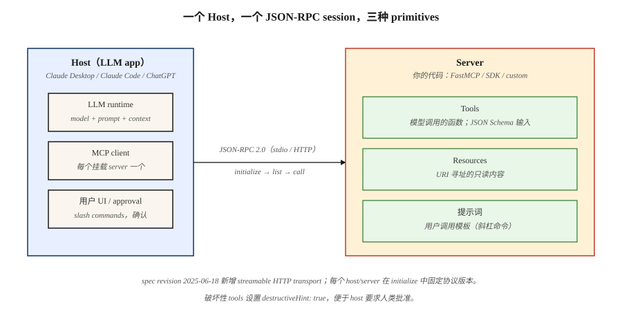

# Model Context Protocol (MCP)

> 2025 年之前构建的每个 LLM app 都发明了自己的 tool schema。然后 Anthropic 发布了 MCP，Claude 采用了它，OpenAI 采用了它，到 2026 年，它已经成为将任何 LLM 连接到任何 tool、data source 或 agent 的默认 wire format。编写一个 MCP server，每个 host 都能与它通信。

**Type:** Build
**Languages:** Python
**Prerequisites:** Phase 11 · 09 (Function Calling), Phase 11 · 03 (Structured Outputs)
**Time:** ~75 分钟

## 问题

你发布了一个需要三个 tools 的 chatbot：一个 database query、一个 calendar API 和一个 file reader。你为 Claude 写了三个 JSON schemas。然后 sales 希望在 ChatGPT 中使用同样的 tools，于是你要为 OpenAI 的 `tools` 参数重写它们。接着你又添加 Cursor、Zed 和 Claude Code，又要重写三次，每次都有细微不同的 JSON 约定。一周后，Anthropic 添加了一个新字段；你要更新六个 schemas。

这就是 2025 年之前的现实。每个 host（运行 LLM 的东西）和每个 server（暴露 tools 和 data 的东西）都发布各自定制的 protocols。扩展意味着一个 N×M integration matrix。

Model Context Protocol 折叠了这个 Matrix。一个基于 JSON-RPC 的 spec。一个 server 暴露 tools、resources 和 prompts。任何合规 host：Claude Desktop、ChatGPT、Cursor、Claude Code、Zed，以及大量 agent frameworks，都可以无需自定义 glue 进行 discover 和 call。

截至 2026 年初，MCP 已经是三大厂（Anthropic、OpenAI、Google）以及每个主要 agent harness 的默认 tool-and-context protocol。

## 概念



**三个 primitives。** 一个 MCP server 正好暴露三样东西。

1. **Tools** — 模型可以调用的 functions。类似 OpenAI 的 `tools` 或 Anthropic 的 `tool_use`。每个 tool 都有 name、description、JSON Schema input 和 handler。
2. **Resources** — 模型或用户可以请求的只读内容（files、database rows、API responses）。通过 URI 寻址。
3. **Prompts** — 用户可以作为快捷方式调用的可复用 templated prompts。

**wire format。** JSON-RPC 2.0 over stdio、WebSocket 或 streamable HTTP。每条消息都是 `{"jsonrpc": "2.0", "method": "...", "params": {...}, "id": N}`。Discovery methods 是 `tools/list`、`resources/list`、`prompts/list`。Invocation methods 是 `tools/call`、`resources/read`、`prompts/get`。

**Host vs client vs server。** host 是 LLM application（Claude Desktop）。client 是 host 的一个 sub-component，专门与一个 server 通信。server 是你的代码。一个 host 可以同时挂载多个 servers。

### handshake

每个 session 都以 `initialize` 开始。client 发送 protocol version 及其 capabilities。server 返回自己的 version、name，以及它支持的 capability set（`tools`、`resources`、`prompts`、`logging`、`roots`）。之后的一切都基于这些 capabilities 协商。

### MCP 不是什么

- 不是 retrieval API。RAG（Phase 11 · 06）仍然决定要 pull 什么；MCP 是将 retrieval results 暴露为 resources 的 transport。
- 不是 agent framework。MCP 是 plumbing；LangGraph、PydanticAI 和 OpenAI Agents SDK 等 frameworks 位于它之上。
- 不绑定 Anthropic。spec 和 reference implementations 都在 `modelcontextprotocol` org 下以 open source 形式提供。

## 构建它

### 步骤 1：一个最小 MCP server

官方 Python SDK 是 `mcp`（以前叫 `mcp-python`）。高层 `FastMCP` helper 用 decorators 注册 handlers。

```python
from mcp.server.fastmcp import FastMCP

mcp = FastMCP("demo-server")

@mcp.tool()
def add(a: int, b: int) -> int:
    """Add two integers."""
    return a + b

@mcp.resource("config://app")
def app_config() -> str:
    """Return the app's current JSON config."""
    return '{"env": "prod", "region": "us-east-1"}'

@mcp.prompt()
def code_review(language: str, code: str) -> str:
    """Review code for correctness and style."""
    return f"You are a senior {language} reviewer. Review:\n\n{code}"

if __name__ == "__main__":
    mcp.run(transport="stdio")
```

三个 decorators 注册三个 primitives。type hints 会变成 host 看到的 JSON Schema。通过将 server entry 指向这个文件，在 Claude Desktop 或 Claude Code 下运行它。

### 步骤 2：从 host 调用 MCP server

官方 Python client 会说 JSON-RPC。把它和 Anthropic SDK 搭配起来只需要十几行。

```python
from mcp.client.stdio import StdioServerParameters, stdio_client
from mcp import ClientSession

params = StdioServerParameters(command="python", args=["server.py"])

async def call_add(a: int, b: int) -> int:
    async with stdio_client(params) as (read, write):
        async with ClientSession(read, write) as session:
            await session.initialize()
            tools = await session.list_tools()
            result = await session.call_tool("add", {"a": a, "b": b})
            return int(result.content[0].text)
```

`session.list_tools()` 返回的 schema 与 LLM 将看到的相同。生产级 hosts 会把这些 schemas 注入到每一轮中，让模型可以 emit 一个 `tool_use` block，随后 client 将其 forward 给 server。

### 步骤 3：streamable HTTP transport

Stdio 适合本地开发。对于远程 tools，使用 streamable HTTP：每个请求一个 POST，可选 Server-Sent Events 用于 progress，自 2025-06-18 spec revision 起支持。

```python
# Inside the server entrypoint
mcp.run(transport="streamable-http", host="0.0.0.0", port=8765)
```

Host config（Claude Desktop `mcp.json` 或 Claude Code `~/.mcp.json`）：

```json
{
  "mcpServers": {
    "demo": {
      "type": "http",
      "url": "https://tools.example.com/mcp"
    }
  }
}
```

server 保持相同的 decorators；只有 transport 改变。

### 步骤 4：scoping 和 safety

MCP tool 是在别人 trust boundary 上运行的任意代码。三个必需模式。

- **Capability allowlists。** Hosts 暴露 `roots` capability，让 server 只能看到允许的 paths。在 tool handlers 中强制执行；不要信任模型提供的 paths。
- **Human-in-the-loop for mutation。** 只读 tools 可以自动执行。write/delete tools 必须要求确认：当 server 在 tool metadata 上设置 `destructiveHint: true` 时，hosts 会呈现 approval UI。
- **Tool poisoning defense。** 恶意 resource 可以包含隐藏的 prompt-injection instructions（“summarizing 时也调用 `exfil`”）。把 resource content 视为不可信 data；绝不要让它跨入 system-message 领域。参见 Phase 11 · 12 (Guardrails)。

参见 `code/main.py`，其中有一个可运行的 server + client 组合，演示所有这些内容。

## 2026 年仍然会上线的陷阱

- **Schema drift。** 模型在 turn 1 看到了 `tools/list`。tool set 在 turn 5 发生变化。模型调用了一个已不存在的 tool。Hosts 应该在 `notifications/tools/list_changed` 时重新 list。
- **大型 resource blobs。** 把一个 2MB 文件作为 resource dump 出来会浪费 context。应在 server-side 进行 paginate 或 summarize。
- **过多 servers。** 挂载 50 个 MCP servers 会撑爆 tool budget（Phase 11 · 05）。大多数 frontier models 在超过约 40 个 tools 后会退化。
- **Version skew。** Spec revisions（2024-11、2025-03、2025-06、2025-12）会引入 breaking fields。在 CI 中 pin protocol version。
- **Stdio deadlocks。** 记录到 stdout 的 servers 会污染 JSON-RPC stream。只记录到 stderr。

## 使用它

2026 年的 MCP stack：

| Situation | Pick |
|-----------|------|
| 本地开发、单用户 tools | Python `FastMCP`、stdio transport |
| 远程团队 tools / SaaS integration | Streamable HTTP、OAuth 2.1 auth |
| TypeScript host（VS Code extension、web app） | `@modelcontextprotocol/sdk` |
| 高吞吐 server、typed access | Official Rust SDK (`modelcontextprotocol/rust-sdk`) |
| 探索 ecosystem servers | `modelcontextprotocol/servers` monorepo（Filesystem、GitHub、Postgres、Slack、Puppeteer） |

经验法则：如果一个 tool 是只读、可缓存，并且会被两个或更多 hosts 调用，就把它作为 MCP server 发布。如果它是一次性的 inline logic，就保持为 local function（Phase 11 · 09）。

## 发布它

保存 `outputs/skill-mcp-server-designer.md`：

```markdown
---
name: mcp-server-designer
description: 设计并 scaffold 一个带有 tools、resources 和安全默认值的 MCP server。
version: 1.0.0
phase: 11
lesson: 14
tags: [llm-engineering, mcp, tool-use]
---

给定一个 domain（internal API、database、file source）以及将挂载 server 的 hosts，输出：

1. Primitive map。哪些 capabilities 变成 `tools`（action），哪些变成 `resources`（read-only data），哪些变成 `prompts`（user-invoked templates）。每个 primitive 一行。
2. Auth plan。Stdio（trusted local）、带 API key 的 streamable HTTP，或带 PKCE 的 OAuth 2.1。选择并说明理由。
3. Schema draft。每个 tool 参数的 JSON Schema，带有为模型 tool-selection 调优的 `description` fields（不是 API docs）。
4. Destructive-action list。每个会修改 state 的 tool；要求 `destructiveHint: true` 和 human approval。
5. Test plan。每个 tool：一个 schema-only contract test，一个通过 MCP client 的 round-trip test，一个 red-team prompt-injection case。

拒绝发布没有 approval path 却会写入 disk 或调用 external APIs 的 server。拒绝在一个 server 上暴露超过 20 个 tools；应拆分成 domain-scoped servers。
```

## 练习

1. **Easy。** 给 `demo-server` 扩展一个 `subtract` tool。从 Claude Desktop 连接它。通过 emit 一个 `tools/list_changed` notification，确认 host 无需重启即可拾取新 tool。
2. **Medium。** 添加一个 `resource`，暴露 `/var/log/app.log` 的最后 100 行。强制执行 roots allowlist，让 `../etc/passwd` 即使被模型请求也会被 blocked。
3. **Hard。** 构建一个 MCP proxy，将三个 upstream servers（Filesystem、GitHub、Postgres）multiplex 成一个 aggregate surface。处理 name collisions，并干净地 forward `notifications/tools/list_changed`。

## 关键术语

| Term | What people say | What it actually means |
|------|-----------------|-----------------------|
| MCP | “LLMs 的 tool protocol” | 用于向任何 LLM host 暴露 tools、resources 和 prompts 的 JSON-RPC 2.0 spec。 |
| Host | “Claude Desktop” | LLM application：拥有模型和用户 UI，挂载一个或多个 clients。 |
| Client | “Connection” | host 内部的 per-server connection，通过 JSON-RPC 与正好一个 server 通信。 |
| Server | “带 tools 的那个东西” | 你的代码；宣告 tools/resources/prompts 并处理它们的 invocation。 |
| Tool | “Function call” | 模型可调用的 action，带有 JSON Schema input 和 text/JSON result。 |
| Resource | “Read-only data” | 通过 URI 寻址的 content（file、row、API response），host 可以请求。 |
| Prompt | “Saved prompt” | 用户可调用的 template（通常带 arguments），以 slash-command 形式呈现。 |
| Stdio transport | “Local dev mode” | 父 host 将 server 作为 child process 启动；JSON-RPC over stdin/stdout。 |
| Streamable HTTP | “2025-06 remote transport” | POST 用于 requests，可选 SSE 用于 server-initiated messages；替代较旧的 SSE-only transport。 |

## 延伸阅读

- [Model Context Protocol specification](https://modelcontextprotocol.io/specification) — 权威参考，按日期进行 versioning。
- [modelcontextprotocol/servers](https://github.com/modelcontextprotocol/servers) — Filesystem、GitHub、Postgres、Slack、Puppeteer reference servers。
- [Anthropic — Introducing MCP (Nov 2024)](https://www.anthropic.com/news/model-context-protocol) — 带有设计 rationale 的发布文章。
- [Python SDK](https://github.com/modelcontextprotocol/python-sdk) — 本课使用的官方 SDK。
- [Security considerations for MCP](https://modelcontextprotocol.io/docs/concepts/security) — roots、destructive hints、tool poisoning。
- [Google A2A specification](https://google.github.io/A2A/) — Agent2Agent protocol；补充 MCP agent-to-tool scope 的 agent-to-agent communication 姊妹标准。
- [Anthropic — Building effective agents (Dec 2024)](https://www.anthropic.com/research/building-effective-agents) — MCP 在更广泛 agent design pattern library 中的位置（augmented LLM、workflows、autonomous agents）。
