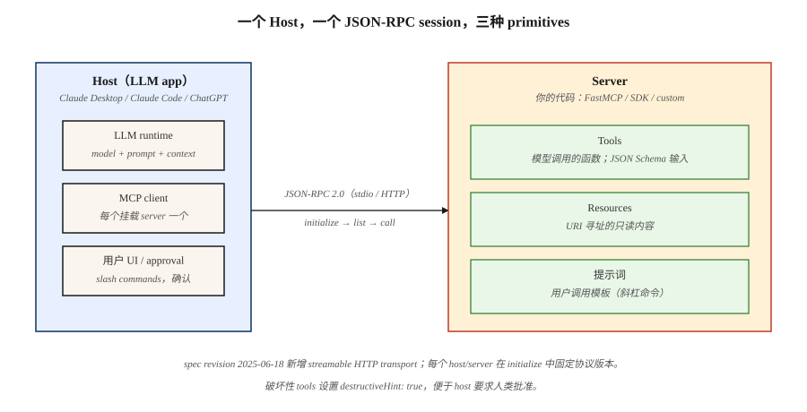

# 模型上下文协议（Model Context Protocol, MCP）

> MCP 为 AI Host 提供了统一的协议，用于动态发现和调用工具（Tools）、资源（Resources）与提示模板（Prompts）。2026-07-28 修订版使该协议彻底无状态化：能力声明与版本上下文随每一个请求独立传递，不再依赖连接绑定的握手。

**Type:** Build
**Languages:** Python
**Prerequisites:** Phase 11 · 09 (函数调用), Phase 11 · 03 (结构化输出)
**Time:** ~75 分钟

## 学习目标

- 明确区分 MCP Host、Client、Server、传输层（Transport）与 Server 原语（Primitives）。
- 构建携带 MCP 2026-07-28 规范必填元数据的 JSON-RPC 请求。
- 使用 `server/discover` 检查版本、身份与能力声明。
- 从 Tools、Resources 和 Prompts 返回具备类型标识与缓存感知的合规结果。
- 解释现代无状态 MCP 如何与握手时代的 Legacy Server 实现双时代互操作。
- 为 Server 确立安全的状态边界、传输策略与人工审批通道。

## 问题背景

你的应用需要数据库查询、日历操作与文件读取功能。若没有统一的通信协议，每一个 AI Host 都必须为完全相同的能力编写专有的发现、调用、错误处理、传输与鉴权粘合代码。

MCP 折叠了这一庞大的 N×M 集成矩阵。Server 暴露出标准的 JSON-RPC 接口；任何合规的 Client 均可发现该接口、将其呈现给模型或用户、执行调用并解析结果，无需为具体 Server 定制适配器。

但有一个关键边界至关重要：MCP 负责标准化通信协议本身。它不负责决定模型应该调用哪个工具，不负责把不可信内容自动变安全，也不会将无状态请求自动转换为持久应用状态。你的 Host 和 Server 依然需要对这些核心决策负责。

## 核心概念



### 三大 Server 原语

1. **Tools（工具）**：可调用的动作。每个工具包含名称、描述、JSON Schema 输入约束及执行函数。
2. **Resources（资源）**：具名且按 URI 寻址的内容，供 Client 读取。
3. **Prompts（提示模板）**：可复用的结构化模板，供 Host 展现给用户快捷触发。

Host 指 AI 宿主应用程序（例如 Claude Desktop）。Host 内的 MCP Client 专职与特定的 Server 通信。传输层负责在两者之间搬运 JSON-RPC 报文。

### 无状态请求取代传统握手

MCP 2026-07-28 彻底移除了 `initialize` 和 `notifications/initialized`，也移除了协议层面的 Session。每一个请求均在 `params._meta` 中携带解析它所需的完整上下文：

```json
{
  "jsonrpc": "2.0",
  "id": 1,
  "method": "tools/list",
  "params": {
    "_meta": {
      "io.modelcontextprotocol/protocolVersion": "2026-07-28",
      "io.modelcontextprotocol/clientCapabilities": {},
      "io.modelcontextprotocol/clientInfo": {
        "name": "lesson-client",
        "version": "1.0.0"
      }
    }
  }
}
```

协议版本与 Client 能力为强制必填项，Client 身份为推荐项。缺失 `_meta`、缺少必填字段或字段类型错误均属于参数畸形，返回 Invalid Params 错误码（`-32602`）。若版本字符串合法但 Server 无法支持，返回 `UnsupportedProtocolVersionError`（`-32022`）。Server 可以在完全没有历史协商记录的前提下独立处理任何有效请求。

无状态绝不意味着应用不能保持业务状态。它仅意味着状态不再隐蔽在底层 MCP 连接或 `Mcp-Session-Id` 之中。如果工作流需要跨调用连续性，由 Server 生成不透明的状态句柄（Opaque Handle），Client 在后续调用中将其作为普通的 Tool 参数传入。

### 服务发现与版本协商

所有现代 Server 均必须实现 `server/discover`。其返回结果广播支持的协议版本、能力集合与 Server 身份：

```json
{
  "jsonrpc": "2.0",
  "id": 1,
  "result": {
    "resultType": "complete",
    "supportedVersions": ["2026-07-28"],
    "capabilities": {
      "tools": {},
      "resources": {},
      "prompts": {}
    },
    "ttlMs": 3600000,
    "cacheScope": "public",
    "_meta": {
      "io.modelcontextprotocol/serverInfo": {
        "name": "demo-server",
        "version": "1.0.0"
      }
    }
  }
}
```

Client 也可以直接调用业务方法并处理版本错误，但调用 discover 能使能力展示与版本协商更加显式透明。遇到不受支持版本时返回 `-32022`，其附加数据包含 Server 支持的 `supported` 版本数组以及被拒绝的 `requested` 版本。

在 stdio 模式下，双时代（dual-era）Client 使用 `server/discover` 发起探测。发现成功或收到如 `-32022` 等已被识别的现代错误，均证明对方为现代 Server；唯有非现代错误或超时才允许回退到 2025-11-25 的旧版 `initialize` 握手。Legacy 行为仅作为兼容补偿，绝不是现代默认。

### 显式的结果结构

2026-07-28 核心规范中的每个成功结果都携带 `resultType`：

- `complete`：表示操作已彻底完成。
- `input_required`：表示 Server 需要通过多轮请求模式（MRTR）发起补充交互。核心规范中仅允许从 `tools/call`、`resources/read` 或 `prompts/get` 返回此类型。

Client 必须将缺少 `resultType` 的旧版响应当作 complete 处理。

列表和读取操作的结果还附带 `ttlMs`（毫秒生存时间）和 `cacheScope`（缓存范围）。确定性的 `tools/list` 排序加上新鲜度提示，使 Client 能够安全缓存服务发现结果，大幅提升模型 Prompt Cache 的稳定性。`cacheScope: public` 允许跨上下文共享缓存，`private` 则严格限制在发起请求的私有上下文内。

### 线缆格式与传输层

MCP 在 stdio 或 Streamable HTTP 上运行 JSON-RPC 2.0：

- 请求（Request）：包含 `jsonrpc`、`id`、`method` 和 `params`。
- 响应（Response）：包含相匹配的 `id` 以及 `result` 或 `error`。
- 通知（Notification）：无 `id`，不需要任何响应。

现代 Streamable HTTP 暴露单个仅接受 POST 的端点。每个 JSON-RPC 消息对应一次独立的 POST。请求 POST 接收单个 JSON 对象，或接收以最终响应结尾的请求作用域 SSE 流。被接受的通知 POST 返回无响应体的 HTTP 202。

2026-07-28 规范中**不存在**独立的 MCP GET 订阅流、DELETE 注销端点、`Mcp-Session-Id` 或基于 `Last-Event-ID` 的断点重放。长周期的变更通知推送统一使用 `subscriptions/listen` POST 请求，其响应保持长连接 SSE 流开启。

```figure
mcp-nxm-collapse
```

## 动手实践

### 步骤 1：注册 Server 表面

在 `code/main.py` 中，纯靠 Python 标准库实现服务注册与报文解析：

```python
server = MCPServer("demo-server")

@server.tool(
    "add",
    "Add two integers.",
    {
      "type": "object",
      "properties": {
        "a": {"type": "integer"},
        "b": {"type": "integer"}
      },
      "required": ["a", "b"]
    }
)
def add(a: int, b: int) -> dict:
    return {"sum": a + b}
```

### 步骤 2：为每个请求附加元数据

```python
def request(method, params=None):
    body_params = dict(params or {})
    body_params["_meta"] = {
        "io.modelcontextprotocol/protocolVersion": "2026-07-28",
        "io.modelcontextprotocol/clientCapabilities": {},
        "io.modelcontextprotocol/clientInfo": {
            "name": "demo-client",
            "version": "1.0.0"
        }
    }
    return {
        "jsonrpc": "2.0",
        "id": 1,
        "method": method,
        "params": body_params
    }
```

### 步骤 3：HTTP 镜像头映射

远程调用通过 HTTP POST 发起时，需镜像指定头部：

```http
POST /mcp HTTP/1.1
Content-Type: application/json
Accept: application/json, text/event-stream
MCP-Protocol-Version: 2026-07-28
Mcp-Method: tools/call
Mcp-Name: add
```

请求头与请求体不一致时，立即返回 HTTP 400 与错误码 `-32020`。

运行测试命令：

```bash
cd phases/11-llm-engineering/14-model-context-protocol
python3 code/main.py
cd code
python3 -m unittest discover tests -v
```

## 交付物

本课交付 `outputs/skill-mcp-server-designer.md`。它能将特定业务领域转化为符合现代无状态 MCP 规范的架构方案，涵盖发现契约、逐请求元数据、确定性缓存列表、显式状态句柄、传输头校验及审批策略。

## 继续深入 MCP 生产级体系

本课为你建立了统一的协议心智。在 Phase 13 中，以下四节核心进阶课将覆盖更为严密的生产边界：

1. [MCP Tool Contracts 与内容](../../../13-tools-and-protocols/28-mcp-tool-contracts-and-content/docs/en.md)：涵盖严格的输入 Schema、结构化内容、路由元数据、分页鉴权以及协议与业务错误的区分。
2. [MCP 可靠性、取消与流控](../../../13-tools-and-protocols/29-mcp-reliability-cancellation-and-flow-control/docs/en.md)：涵盖请求取消、持久任务取消、截止期限、幂等性、背压及重连机制。
3. [MCP Registry 供应链、准入、漂移与回滚](../../../13-tools-and-protocols/30-mcp-registry-supply-chain-and-drift/docs/en.md)：涵盖命名空间证明、产物可信来源、不可变锁定、实时漂移、准入凭证与回滚策略。
4. [MCP 一致性工程](../../../13-tools-and-protocols/31-mcp-conformance-versioning-and-operations/docs/en.md)：涵盖黄金标准与反向测试用例、严格版本时代、代理网络证据、脱敏以及发布安全门禁。

## 核心专业术语

| 术语 | 规范定义 |
|------|---------|
| MCP | 用于向 AI Host 暴露服务发现、工具、资源、提示模板与扩展的 JSON-RPC 协议 |
| Host | 拥有大模型与用户交互界面、挂载一个或多个 MCP Client 的 AI 应用程序 |
| Client | 代表 Host 与单个具体 Server 执行 MCP 通信的连接器组件 |
| 无状态 MCP (Stateless MCP) | 每个请求携带版本与能力元数据，不存在与底层物理连接绑定的协议状态 |
| `server/discover` | 强制实现的 Server 方法，用于公布支持版本、能力集与身份标识 |
| `resultType` | 区分成功结果状态的鉴别字段（如 `complete` 或 `input_required`） |
| 显式状态句柄 (State handle) | 由 Server 签发、作为普通业务参数传递的应用层唯一标识符 |
| Streamable HTTP | 单一 POST 端点架构，返回常规 JSON 或请求作用域的 SSE 响应 |
| MRTR (多轮请求模式) | 嵌入在响应结果中的输入请求，完成后由客户端重新发起原始操作重试 |

## 延伸阅读

- [MCP 2026-07-28 核心变更](https://modelcontextprotocol.io/specification/2026-07-28/changelog)
- [MCP 服务发现规范](https://modelcontextprotocol.io/specification/2026-07-28/server/discover)
- [MCP Streamable HTTP 传输规范](https://modelcontextprotocol.io/specification/2026-07-28/basic/transports/streamable-http)
- [MCP 多轮请求模式 (MRTR)](https://modelcontextprotocol.io/specification/2026-07-28/basic/patterns/mrtr)
