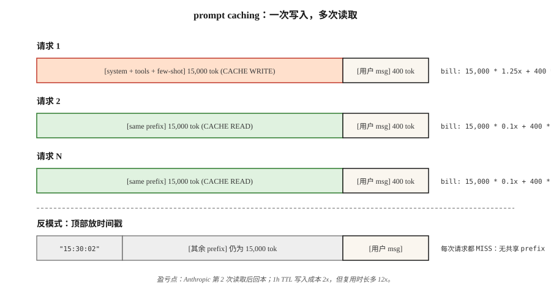

# Prompt Caching 和 Context Caching

> 你的 system prompt 有 4,000 个 Token。你的 RAG context 有 20,000 个 Token。每次请求你都会同时发送两者。你也会为两者付费——每一次。Prompt caching 让 provider 在其侧保持该 prefix 热启，并在复用时按正常费率的 10% 向你计费。使用得当，它可以将推理成本降低 50–90%，并将 first-token latency 降低 40–85%。

**Type:** Build
**Languages:** Python
**前置要求:** Phase 11 · 01 (Prompt Engineering), Phase 11 · 05 (Context Engineering), Phase 11 · 11 (Caching and Cost)
**Time:** ~60 分钟

## 问题

一个 coding agent 在对话的每一轮都会向 Claude 发送相同的 15,000-Token system prompt。按 $3/M input tokens 计算，二十轮仅 input 成本就是 $0.90——这还不包括用户的任何实际消息。再乘以每天 10,000 次对话，永不变化的文本账单就会达到 $9,000/天。

你不能在不影响质量的情况下缩短 prompt。你也不能避免发送它——model 每一轮都需要它。唯一的做法是：不要再为 provider 已经见过的 prefix 支付全价。

这个做法就是 prompt caching。Anthropic 在 2024 年 8 月推出了它（并在 2025 年推出了 1-hour extended-TTL 变体），OpenAI 在当年稍晚自动化了它，Google 则随 Gemini 1.5 一起推出了显式 context caching。如今三者都在其 frontier models 上将它作为一等功能提供。

## 概念



**机制。** 当一个请求的 prefix 与近期请求中的某个 prefix 匹配时，provider 会直接使用前一次运行的 KV-cache，而不是重新 encoding 这些 Token。第一次你支付一小部分写入溢价，之后每次都获得大幅读取折扣。

**2026 年的三种 provider 风格。**

| Provider | API 风格 | 命中折扣 | 写入溢价 | 默认 TTL | 最小可缓存 |
|---------|-----------|--------------|---------------|-------------|---------------|
| Anthropic | 在 content blocks 上显式使用 `cache_control` markers | input 费用减免 90% | 25% surcharge | 5 分钟（可扩展到 1 小时） | 1,024 tokens (Sonnet/Opus), 2,048 (Haiku) |
| OpenAI | 自动 prefix detection | input 费用减免 50% | 无 | 最多 1 小时（best-effort） | 1,024 tokens |
| Google (Gemini) | 显式 `CachedContent` API | 按存储计费；读取约为正常价格的 25% | 每 token·hour 收取存储费 | 用户设置（默认 1 小时） | 4,096 tokens (Flash), 32,768 (Pro) |

**不变量。** 三者都只缓存 prefixes。如果请求之间有任何一个 Token 不同，那么从第一个不同 Token 之后的一切都会 miss。把*稳定*部分放在顶部，把*可变*部分放在底部。

### 对 cache 友好的布局

```
[system prompt]          <-- 缓存这个
[tool definitions]       <-- 缓存这个
[few-shot examples]      <-- 缓存这个
[retrieved documents]    <-- 如果会复用就缓存，否则不要
[conversation history]   <-- 缓存到上一轮为止
[current user message]   <-- 永远不要缓存（每次都不同）
```

违反这个顺序——把 user message 放在 system prompt 上方，或者把动态 retrievals 夹在 few-shots 中间——cache 就永远不会命中。

### break-even 计算

Anthropic 的 25% 写入溢价意味着，一个 cached block 至少要被读取两次，才能实现净省钱。1 次写入 + 1 次读取，平均每次请求成本为 0.675x（节省 32%）；1 次写入 + 10 次读取，平均为 0.205x（节省 80%）。经验法则：缓存任何你预计在 TTL 内至少复用 3 次的内容。

```figure
prompt-cache-hit
```

## 构建它

### 步骤 1： 使用显式 markers 的 Anthropic prompt caching

```python
import anthropic

client = anthropic.Anthropic()

SYSTEM = [
    {
        "type": "text",
        "text": "You are a senior Python reviewer. Follow the rubric exactly.\n\n" + RUBRIC_15K_TOKENS,
        "cache_control": {"type": "ephemeral"},
    }
]

def review(code: str):
    return client.messages.create(
        model="claude-opus-4-7",
        max_tokens=1024,
        system=SYSTEM,
        messages=[{"role": "user", "content": code}],
    )
```

`cache_control` marker 告诉 Anthropic 将该 block 存储 5 分钟。在这个窗口内复用会命中；过期后复用会再次写入。

**Response usage fields:**

```python
response = review(code_a)
response.usage
# InputTokensUsage(
#     input_tokens=120,
#     cache_creation_input_tokens=15023,   # 按 1.25x 付费
#     cache_read_input_tokens=0,
#     output_tokens=340,
# )

response_b = review(code_b)
response_b.usage
# cache_creation_input_tokens=0
# cache_read_input_tokens=15023           # 按 0.1x 付费
```

在 CI 中检查这两个字段——如果 `cache_read_input_tokens` 在多次请求中始终为零，说明你的 cache keys 正在漂移。

### 步骤 2: 一小时 extended TTL

对于长时间运行的 batch jobs，5 分钟默认值会在 job 之间过期。设置 `ttl`：

```python
{"type": "text", "text": RUBRIC, "cache_control": {"type": "ephemeral", "ttl": "1h"}}
```

1-hour TTL 的写入溢价成本是 2x（相对 baseline 增加 50%，而不是 25%），但对于任何复用 prefix 超过 5 次的 batch，它都会很快回本。

### 步骤 3： OpenAI 自动 caching

OpenAI 没有需要你配置的内容。任何超过 1,024 tokens 且匹配近期请求的 prefix，都会自动获得 50% 折扣。

```python
from openai import OpenAI
client = OpenAI()

resp = client.chat.completions.create(
    model="gpt-5",
    messages=[
        {"role": "system", "content": SYSTEM_PROMPT},   # 长且稳定
        {"role": "user", "content": user_msg},
    ],
)
resp.usage.prompt_tokens_details.cached_tokens  # 获得折扣的部分
```

同样适用对 cache 友好的布局规则。有两件事会破坏 OpenAI 的 cache，但不会破坏 Anthropic 的：更改 `user` 字段（它被用作 cache key 组成部分），以及重排 tools。

### 步骤 4： Gemini 显式 context caching

Gemini 将 cache 视为你创建并命名的一等对象：

```python
from google import genai
from google.genai import types

client = genai.Client()

cache = client.caches.create(
    model="gemini-3-pro",
    config=types.CreateCachedContentConfig(
        display_name="rubric-v3",
        system_instruction=RUBRIC,
        contents=[FEW_SHOT_EXAMPLES],
        ttl="3600s",
    ),
)

resp = client.models.generate_content(
    model="gemini-3-pro",
    contents=["Review this code:\n" + code],
    config=types.GenerateContentConfig(cached_content=cache.name),
)
```

只要 cache 存活，Gemini 就会按 token·hour 收取存储费，并以约正常 input 费率 25% 的价格读取。当你需要在多天内跨许多 sessions 复用同一个巨大 prompt 时，这种形态是合适的。

### 步骤 5： 在生产中衡量 hit rate

参见 `code/main.py`，其中有一个模拟的三 provider 记账器，会跟踪 write/read/miss 计数，并计算每 1K requests 的混合成本。将部署门禁绑定到目标 hit rate 上——大多数生产 Anthropic 配置在 warmup 后应看到 >80% read fraction。

## 2026 年仍然会被发上线的陷阱

- **顶部的动态 timestamps。** system prompt 顶部的 `"Current time: 2026-04-22 15:30:02"`。每个请求都会 miss。把 timestamps 移到 cache breakpoint 下方。
- **Tool reordering。** 以稳定顺序序列化 tools——deploy 之间的一次 dict reshuffle 会破坏每一次命中。
- **自由文本近似重复。** "You are helpful." vs "You are a helpful assistant."——一个 byte 不同 = 完整 miss。
- **太小的 blocks。** Anthropic 强制 1,024-Token 下限（Haiku 为 2,048）。更小的 blocks 会静默地不被缓存。
- **盲目的成本 dashboards。** 将 "input tokens" 拆分为 cached 与 uncached。否则流量下降会看起来像一次 cache 胜利。

## 使用它

2026 年的 caching stack：

| Situation | Pick |
|-----------|------|
| 拥有稳定 10k+ system prompt 且多轮交互的 agent | Anthropic `cache_control` with 5-min TTL |
| 复用某个 prefix 30+ 分钟的 batch job | Anthropic with `ttl: "1h"` |
| GPT-5 上的 serverless endpoints，无自定义 infra | OpenAI automatic（只需让你的 prefix 稳定且足够长） |
| 对巨大 code/doc corpus 进行多日复用 | Gemini explicit `CachedContent` |
| 跨 provider fallback | 在各 provider 间保持 cacheable prefix layout 完全一致，这样任何命中都可用 |

与 semantic caching（Phase 11 · 11）结合，用于 user-message 层：prompt caching 处理 *Token 完全相同*的复用，semantic caching 处理*语义完全相同*的复用。

## 交付它

保存 `outputs/skill-prompt-caching-planner.md`：

```markdown
---
name: prompt-caching-planner
description: 设计对 cache 友好的 prompt layout，并选择合适的 provider caching mode。
version: 1.0.0
phase: 11
lesson: 15
tags: [llm-engineering, caching, cost]
---

给定一个 prompt（system + tools + few-shot + retrieval + history + user）和一个 usage profile（requests per hour, TTL needed, provider），输出：

1. Layout。重排后的 sections，并标记单个 cache breakpoint；解释哪些 sections 是 stable，哪些是 volatile。
2. Provider mode。Anthropic cache_control、OpenAI automatic 或 Gemini CachedContent。根据 TTL 和 reuse pattern 说明理由。
3. Break-even。TTL 内每次写入的预期读取次数；用数学计算说明相对 no-cache 的净成本。
4. Verification plan。CI 断言第二个 identical request 上 cache_read_input_tokens > 0；dashboard 按 cached vs uncached tokens 拆分。
5. Failure modes。列出该设置中 cache 最可能 miss 的三个原因（dynamic timestamp、tool reorder、near-duplicate text），以及你将如何预防每一个。

拒绝交付将 dynamic field 放在 breakpoint 上方的 cache plan。拒绝在没有足以让 2x write premium 回本的 reuse count 时启用 1h TTL。
```

## 练习

1. **Easy。** 取一个针对 Claude 的 10-turn conversation，其中包含 5,000-Token system prompt。先不使用 `cache_control` 运行，再使用它运行。报告两种情况下的 input-token 账单。
2. **Medium。** 编写一个 test harness：给定 prompt template 和 request log，计算每个 provider 的预期 hit rate 和 dollar savings（Anthropic 5m、Anthropic 1h、OpenAI automatic、Gemini explicit）。
3. **Hard。** 构建一个 layout optimizer：给定一个 prompt 和一组标记为 `stable=True/False` 的 fields，重写 prompt，将单个 cache breakpoint 放在最大的 cache-friendly 位置，同时不丢失信息。在真实 Anthropic endpoint 上验证。

## 关键术语

| Term | 人们的说法 | 它实际的含义 |
|------|-----------------|-----------------------|
| Prompt caching | “让长 prompts 变便宜” | 复用 provider-side KV-cache 来匹配 prefixes；对重复 input tokens 提供 50-90% 折扣。 |
| `cache_control` | “Anthropic marker” | Content-block attribute，用于声明“到这里为止的一切都可缓存”；`{"type": "ephemeral"}`。 |
| Cache write | “支付溢价” | 填充 cache 的第一个请求；Anthropic 按约 1.25x input rate 计费，OpenAI 免费。 |
| Cache read | “折扣” | 后续匹配 prefix 的请求；按 10% (Anthropic)、50% (OpenAI)、约 25% (Gemini) 计费。 |
| TTL | “它存活多久” | cache 保持 warm 的秒数；Anthropic 默认 5m（可扩展 1h），OpenAI best-effort 最多 1h，Gemini 由用户设置。 |
| Extended TTL | “1-hour Anthropic cache” | `{"type": "ephemeral", "ttl": "1h"}`；2x write premium，但对于 batch reuse 值得。 |
| Prefix match | “为什么我的 cache miss 了” | 只有从开头到 breakpoint 的每个 Token 都 byte-identical 时，cache 才会命中。 |
| Context caching (Gemini) | “显式的那个” | Google 的命名型、按存储计费的 cache object；最适合对 large corpora 进行多日复用。 |

## 延伸阅读

- [Anthropic — Prompt caching](https://docs.anthropic.com/en/docs/build-with-claude/prompt-caching) — `cache_control`、1h TTL、break-even tables。
- [OpenAI — Prompt caching](https://platform.openai.com/docs/guides/prompt-caching) — 自动 prefix matching。
- [Google — Context caching](https://ai.google.dev/gemini-api/docs/caching) — `CachedContent` API 和 storage pricing。
- [Anthropic engineering — Prompt caching for long-context workloads](https://www.anthropic.com/news/prompt-caching) — 原始发布文章，包含 latency numbers。
- Phase 11 · 05 (Context Engineering) — 如何切分 prompt，让 cache 可以落地。
- Phase 11 · 11 (Caching and Cost) — 将 prompt caching 与 user messages 上的 semantic cache 配对。
- [Pope et al., "Efficiently Scaling Transformer Inference" (2022)](https://arxiv.org/abs/2211.05102) — prompt caching 暴露给用户的 KV-cache memory model；解释为什么读取 cached prefix 比重新计算便宜约 10×。
- [Agrawal et al., "SARATHI: Efficient LLM Inference by Piggybacking Decodes with Chunked Prefills" (2023)](https://arxiv.org/abs/2308.16369) — prefill 是 prompt caching shortcut 的阶段；本文解释了为什么 cache hit 会显著降低 TTFT，而 TPOT 不受影响。
- [Leviathan et al., "Fast Inference from Transformers via Speculative Decoding" (2023)](https://arxiv.org/abs/2211.17192) — prompt caching 与 speculative decoding、Flash Attention、MQA/GQA 一起，都是弯折推理成本曲线的杠杆；阅读本文了解另外三者。
