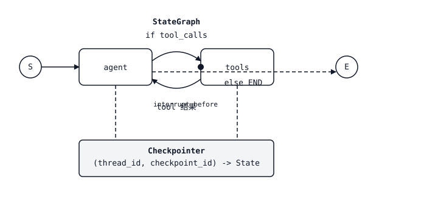

# LangGraph — Agent 的 State Machines

> 手写的 ReAct loop 是一个 `while True`。用 LangGraph 写的 ReAct loop 是一个 graph，你可以对它 checkpoint、interrupt、branch，并进行 time-travel。agent 本身没有变，变化的是包在它外面的 harness。

**Type:** Build
**Languages:** Python
**前置要求:** Phase 11 · 09 (Function Calling), Phase 11 · 14 (Model Context Protocol)
**Time:** ~75 minutes

## 问题

你发布了一个 function-calling agent。它前三轮运行正常，然后出了问题：model 尝试调用一个返回 500 的 tool，user 在任务中途改变主意，或者 agent 在没有 human 签核的情况下决定为订单退款。`while True:` loop 没有 hook。你不能暂停它，不能回退它，也不能分叉出“如果 model 当时选择了另一个 tool 会怎样”。一旦你把它从 demo 推向真实环境，agent 就变成了一个 black box：要么成功，要么失败。

一旦你看清这一点，下一步就很明显。agent 本来就是一个 state machine：system prompt 加 message history，加 pending tool calls，再加 next action。把这个 state machine 显式化：用 nodes 表示“model 思考”“tool 运行”“human 批准”，用 edges 表示它们之间的 conditional transitions。一旦 graph 显式化，harness 就自动获得四种能力：checkpointing（在 step 之间保存 state）、interrupts（暂停等待 human）、streaming（stream tokens 和 intermediate events），以及 time-travel（回退到之前的 state，并尝试不同 branch）。

LangGraph 就是提供这种 abstraction 的 library。它不是 LangChain 意义上的 agent framework（“这里有一个 AgentExecutor，祝你好运”）。它是一个 graph runtime，拥有一等的 state、一等的 persistence 和一等的 interrupts。agent loop 是你画出来的东西，而不是你手写出来的东西。

## 概念



一个 `StateGraph` 有三样东西。

1. **State.** 一个 typed dict（TypedDict 或 Pydantic model），会在 graph 中流动。每个 node 都接收完整 state，并返回一个 partial update，LangGraph 会用每个 field 对应的 *reducer* 来 merge 它们：对于应该累积的 list 使用 `operator.add`，默认则覆盖。
2. **Nodes.** Python functions `state -> partial_state`。每个 node 是一个离散 step：“call the model”“run tools”“summarize”。
3. **Edges.** nodes 之间的 transitions。Static edges 指向固定位置。Conditional edges 接收一个 router function `state -> next_node_name`，让 graph 可以根据 model output 分支。

你会 compile 这个 graph。Compile 会绑定 topology，附加一个 checkpointer（可选，但对 production 至关重要），并返回一个 runnable。你用 initial state 和 `thread_id` 调用它。每个 execution step 都会持久化一个以 `(thread_id, checkpoint_id)` 为 key 的 checkpoint。

### 四种超能力

**Checkpointing.** 每次 node transition 都会把新的 state 写入 store（测试用 in-memory，prod 用 Postgres/Redis/SQLite）。用同一个 `thread_id` 再次调用 graph 即可 resume。graph 会从暂停的位置继续。

**Interrupts.** 用 `interrupt_before=["human_review"]` 标记一个 node，execution 会在该 node 运行前停止。state 会被持久化。你的 API 向 user 返回“awaiting approval”。之后对同一个 `thread_id` 发起带有 `Command(resume=...)` 的请求即可 resume execution。

**Streaming.** `graph.stream(state, mode="updates")` 会在 state deltas 发生时 yield 它们。`mode="messages"` 会 stream model nodes 内部的 LLM tokens。`mode="values"` 会 yield full snapshots。你可以选择在 UI 中展示哪一种。

**Time-travel.** `graph.get_state_history(thread_id)` 返回完整 checkpoint log。把任意之前的 `checkpoint_id` 传给 `graph.invoke`，你就能从那个点 fork。它很适合 debugging（“如果 model 当时选择 tool B 会怎样？”），也适合 regression tests，用来 replay production traces。

### Reducers 才是重点

每个 state field 都有一个 reducer。多数默认行为都没问题：新值覆盖旧值。但 message lists 需要 `operator.add`，这样新的 messages 会 append，而不是 replace。Parallel edges 会通过 reducer merge 它们的 updates。如果两个 nodes 都更新 `messages`，而你忘了 `Annotated[list, add_messages]`，第二个会静默胜出，你会丢掉半轮内容。reducer 是这个 library 里唯一微妙的东西；把它写对，其余部分就能自然组合。

### 四个 nodes 的 ReAct graph

一个 production ReAct agent 由四个 nodes 和两条 edges 组成：

1. `agent` — 用当前 message history 调用 LLM。返回 assistant message（其中可能包含 tool_calls）。
2. `tools` — 执行最后一条 assistant message 中的所有 tool_calls，并把 tool results 作为 tool messages append 进去。
3. 从 `agent` 出发的一条 conditional edge：如果最后一条 message 有 tool_calls，则 route 到 `tools`，否则到 `END`。
4. 从 `tools` 回到 `agent` 的一条 static edge。

就是这样。你用大约 40 行代码，就能获得完整 ReAct loop（Thought → Action → Observation → Thought → …），同时具备 checkpointing、interrupts 和 streaming。

### StateGraph vs Send（fanout）

`Send(node_name, state)` 允许一个 node dispatch parallel subgraphs。例子：agent 决定同时 query 三个 retrievers。每个 `Send` 都会 spawn 一次 target node 的 parallel execution；它们的 outputs 会通过 state reducer merge。这就是 LangGraph 在不使用 threading primitives 的情况下表达 orchestrator-workers pattern 的方式。

### Subgraphs

一个 compiled graph 可以作为另一个 graph 中的 node。outer graph 看到的是一个 single node；inner graph 拥有自己的 state 和自己的 checkpoints。这就是团队构建 supervisor-worker agents 的方式：supervisor graph 将 user intent route 到某个 domain worker subgraph。

## 构建它

### 步骤 1： state and nodes

```python
from typing import Annotated, TypedDict
from langchain_core.messages import AnyMessage, HumanMessage, AIMessage
from langgraph.graph import StateGraph, END
from langgraph.graph.message import add_messages
from langgraph.prebuilt import ToolNode
from langgraph.checkpoint.memory import MemorySaver

class State(TypedDict):
    messages: Annotated[list[AnyMessage], add_messages]

def agent_node(state: State) -> dict:
    response = llm.invoke(state["messages"])
    return {"messages": [response]}

def should_continue(state: State) -> str:
    last = state["messages"][-1]
    return "tools" if getattr(last, "tool_calls", None) else END

tool_node = ToolNode(tools=[search_web, read_file])

graph = StateGraph(State)
graph.add_node("agent", agent_node)
graph.add_node("tools", tool_node)
graph.set_entry_point("agent")
graph.add_conditional_edges("agent", should_continue, {"tools": "tools", END: END})
graph.add_edge("tools", "agent")

app = graph.compile(checkpointer=MemorySaver())
```

`add_messages` 是让 message list 累积而不是覆盖的 reducer。忘记它是最常见的 LangGraph bug。

### 步骤 2： run with a thread

```python
config = {"configurable": {"thread_id": "user-42"}}
for event in app.stream(
    {"messages": [HumanMessage("find the Anthropic headquarters address")]},
    config,
    stream_mode="updates",
):
    print(event)
```

每个 update 都是一个 dict `{node_name: state_delta}`。你的 frontend 可以把这些 stream 到 UI，让 users 看到“agent 正在思考…正在调用 search_web…拿到结果…正在回答。”

### 步骤 3: 添加 human-in-the-loop interrupt

标记一个 node，让 execution 在它运行之前暂停。

```python
app = graph.compile(
    checkpointer=MemorySaver(),
    interrupt_before=["tools"],  # pause before every tool call
)

state = app.invoke({"messages": [HumanMessage("delete the production database")]}, config)
# state["__interrupt__"] is set. Inspect proposed tool calls.
# If approved:
from langgraph.types import Command
app.invoke(Command(resume=True), config)
# If denied: write a rejection message and resume
app.update_state(config, {"messages": [AIMessage("Blocked by human reviewer.")]})
```

state、checkpoint 和 thread 都会跨 interrupt 持久存在。除了 execution 期间，没有任何东西只存在于 memory 中。

### 步骤 4: 用于调试的 time-travel

```python
history = list(app.get_state_history(config))
for snapshot in history:
    print(snapshot.values["messages"][-1].content[:80], snapshot.config)

# Fork from a prior checkpoint
target = history[3].config  # three steps back
for event in app.stream(None, target, stream_mode="values"):
    pass  # replay from that point forward
```

把 `None` 作为 input 传入，会从给定 checkpoint replay；传入一个 value，则会在 resume 前把它作为 update append 到该 checkpoint 的 state 上。这就是你在不重新运行整段 conversation 的情况下复现一次坏的 agent run 的方式。

### 步骤 5：为生产环境替换 checkpointer

```python
from langgraph.checkpoint.postgres import PostgresSaver

with PostgresSaver.from_conn_string("postgresql://...") as checkpointer:
    checkpointer.setup()
    app = graph.compile(checkpointer=checkpointer)
```

SQLite、Redis 和 Postgres 都已提供。`MemorySaver` 用于 tests。任何需要跨 restarts 持久存在的东西，都应该使用真正的 store。

## 技能

> 你把 agents 构建为 graphs，而不是 `while True` loops。

在使用 LangGraph 之前，先做一个 60 秒设计：

1. **命名 nodes。** 每个离散 decision 或 side-effecting action 都是一个 node。“Agent thinks”“tool runs”“reviewer approves”“response streams”。如果你列不出它们，这个任务还不具备 agent 形状。
2. **声明 state。** 使用最小 TypedDict，并为每个 list field 配 reducer。不要把所有东西都塞进 `messages`；把 task-specific fields（一个 working `plan`、一个 `budget` counter、一个 `retrieved_docs` list）提升到 top level。
3. **画出 edges。** 除非下一步依赖 model output，否则使用 static。每条 conditional edge 都需要一个带 named branches 的 router function。
4. **一开始就选择 checkpointer。** tests 用 `MemorySaver`，其他场景用 Postgres/Redis/SQLite。不要在没有 checkpointer 的情况下发布——没有 checkpointer 就没有 resume、没有 interrupt、没有 time-travel。
5. **在 tools 运行前决定 interrupts，而不是运行后。** Approvals 应该放在进入 side-effecting node 的 edge 上，这样你能在造成影响前 cancel；validation 应该放在 model 输出之后的 edge 上，这样你能低成本 reject bad calls。
6. **默认 stream。** UI 用 `mode="updates"`，model nodes 内部的 token-level streaming 用 `mode="messages"`，eval 期间的 full snapshots 用 `mode="values"`。

拒绝发布没有 checkpointer 的 LangGraph agent。拒绝发布在 side effect 之后才 interrupt 的 LangGraph agent。拒绝发布 `messages` field 没有使用 `add_messages` 作为 reducer 的 LangGraph agent。

## 练习

1. **Easy.** 用 calculator tool 和 web-search tool 实现上面的四 node ReAct graph。验证对于一个 two-turn conversation，`list(app.get_state_history(config))` 至少返回四个 checkpoints。
2. **Medium.** 添加一个在 `agent` 之前运行的 `planner` node，并向 state 写入结构化的 `plan: list[str]`。让 `agent` 把 plan steps 标记为 done。如果 `plan` 在 checkpoint resume 后丢失（reducer 错误），测试应失败。
3. **Hard.** 构建一个 supervisor graph，使用 `Send` 在三个 subgraphs（`researcher`、`writer`、`reviewer`）之间 route。每个 subgraph 都有自己的 state 和 checkpointer。在 outer graph 上添加 `interrupt_before=["writer"]`，让 human 可以批准 research brief。确认从 prior checkpoint 进行 time-travel 只会重新运行 forked branch。

## 关键术语

| Term | What people say | What it actually means |
|------|-----------------|-----------------------|
| StateGraph | “LangGraph graph” | 你在 compile 前向其中添加 nodes 和 edges 的 builder object。 |
| Reducer | “field 如何 merge” | 当 node 返回某个 field 的 update 时应用的函数 `(old, new) -> merged`；默认是 overwrite，`add_messages` 会 append。 |
| Thread | “一个 conversation ID” | 一个 `thread_id` 字符串，用于限定一个 session 的所有 checkpoints。 |
| Checkpoint | “一个 paused state” | node transition 后完整 graph state 的持久化 snapshot，以 `(thread_id, checkpoint_id)` 为 key。 |
| Interrupt | “暂停等待 human” | `interrupt_before` / `interrupt_after` 会在 node boundary 停止 execution；用 `Command(resume=...)` resume。 |
| Time-travel | “从之前的 step fork” | `graph.invoke(None, config_with_old_checkpoint_id)` 会从该 checkpoint 向前 replay。 |
| Send | “Parallel subgraph dispatch” | node 可以返回的 constructor，用于 spawn N 个 target node 的 parallel executions。 |
| Subgraph | “作为 node 的 compiled graph” | 在另一个 graph 中作为 node 使用的 compiled StateGraph；保留自己的 state scope。 |

## 延伸阅读

- [LangGraph documentation](https://langchain-ai.github.io/langgraph/) — StateGraph、reducers、checkpointers 和 interrupts 的权威参考。
- [LangGraph concepts: state, reducers, checkpointers](https://langchain-ai.github.io/langgraph/concepts/low_level/) — 本课使用的 mental model，直接来自官方来源。
- [LangGraph Persistence and Checkpoints](https://langchain-ai.github.io/langgraph/concepts/persistence/) — 关于 Postgres/SQLite/Redis stores、checkpoint namespaces 和 thread IDs 的细节。
- [LangGraph Human-in-the-loop](https://langchain-ai.github.io/langgraph/concepts/human_in_the_loop/) — `interrupt_before`、`interrupt_after`、`Command(resume=...)` 和 edit-state pattern。
- [Yao et al., "ReAct: Synergizing Reasoning and Acting in Language Models" (ICLR 2023)](https://arxiv.org/abs/2210.03629) — 每个 LangGraph agent 都实现的 pattern；阅读它可以理解 reasoning trace 的依据。
- [Anthropic — Building effective agents (Dec 2024)](https://www.anthropic.com/research/building-effective-agents) — 说明应该在何时选择哪些 graph shapes（chain、router、orchestrator-workers、evaluator-optimizer）。
- Phase 11 · 09 (Function Calling) — 每个 LangGraph agent node 复用的 tool-call primitive。
- Phase 11 · 14 (Model Context Protocol) — 外部 tool discovery，可通过 MCP adapter 接入 LangGraph `ToolNode`。
- Phase 11 · 17 (Agent framework tradeoffs) — 何时选择 LangGraph，而不是 CrewAI、AutoGen 或 Agno。
