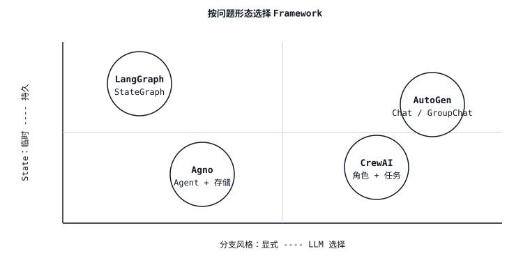

# Agent Framework 取舍 — LangGraph vs CrewAI vs AutoGen vs Agno

> 每个 framework 都在展示同一个 demo（research agent 生成一份报告），也都隐藏着同一个 bug（state schema 与 orchestration layer 相互冲突）。选择那个其 abstraction 与你的问题形态匹配的 framework；其他一切都是你要写两遍的胶水代码。

**类型：** 学习
**语言：** Python
**前置要求：** Phase 11 · 09 (Function Calling), Phase 11 · 16 (LangGraph)
**时间：** 约 45 分钟

## 问题

你有一个任务，需要不止一次 LLM 调用。也许它是一个 research workflow（plan、search、summarize、cite）。也许它是一个 code-review pipeline（parse diff、critique、patch、validate）。也许它是一个 multi-turn assistant，可以预订航班、写邮件，并提交费用报告。于是你选择了一个 framework。

三天后，你发现这个 framework 的 abstraction 开始泄漏。CrewAI 给你 roles，但当“researcher”需要把结构化 plan 交给“writer”时，它会和你对着干。AutoGen 给你 agents 之间的 chat，但没有一等公民的 state，所以你的 checkpoint 只是 conversation log 的一个 pickle。LangGraph 给你 state graph，但会强迫你在还不知道 agent 会做什么之前，就命名每一个 transition。Agno 给你一个 single-agent primitive，但当你试图 fan out 到三个并发 worker 时，它会尖叫。

解决办法不是“选择最好的 framework”。而是把 framework 的 core abstraction 与你的问题形态匹配起来。本课会画出这张地图。

## 概念

四个 framework 主导了 2026 年的格局。它们的 core abstraction 并不相同。

| Framework | Core abstraction | 最适合 | 最不适合 |
|-----------|------------------|----------|-----------|
| **LangGraph** | `StateGraph` — typed state、nodes、conditional edges、checkpointer。 | 具有显式 state 和 human-in-the-loop interrupt 的 workflow；需要 time-travel debugging 的 production agents。 | topology 未知的松散、role-driven brainstorming。 |
| **CrewAI** | `Crew` — roles（goal、backstory）、tasks、process（sequential 或 hierarchical）。 | 具有短线性/层级 plan 的 role-playing 或 persona-driven workflow。 | 超出 crew turn history 的任何 stateful 场景；复杂 branching。 |
| **AutoGen** | `ConversableAgent` pair — 两个或多个 agents 轮流发言，直到满足 exit condition。 | multi-agent *dialogue*（teacher-student、proposer-critic、actor-reviewer），其中 thinking 从 chat 中涌现。 | 具有已知 DAG 的 deterministic workflow；任何需要跨重启持久化 state 的场景。 |
| **Agno** | `Agent` — 一个 LLM + tools + memory，可组合成 teams。 | 快速构建 single agents 和轻量 teams；强 Multimodal 能力和内置 storage drivers。 | 具有 custom reducers 的深层、显式 branching graphs。 |

### “abstraction”到底是什么意思

一个 framework 的 core abstraction，就是你在白板上讲解架构时画出来的那个东西。

- **LangGraph** → 你画一个 graph。Nodes 是步骤，edges 是 transitions，每个点上的 state object 都是 typed。心智模型是 state machine。
- **CrewAI** → 你画一个组织结构图。每个 role 都有 job description，manager 负责路由 tasks。心智模型是一支小型专家团队。
- **AutoGen** → 你画一个 Slack DM。两个 agents 互相发消息；如果需要 moderator，就加入第三个。心智模型是 chat。
- **Agno** → 你画一个单独的盒子，外面挂着 tools。把多个盒子放在一起就是 team。心智模型是“自带电池的 agent”。

### state 问题

state 是大多数 framework 选择在 production 中失效的地方。

- **LangGraph.** Typed state（`TypedDict` 或 Pydantic model）、per-field reducers、一等公民 checkpointer（SQLite/Postgres/Redis）。Resume、interrupt 和 time-travel 都是免费获得的能力。*（见 Phase 11 · 16。）*
- **CrewAI.** State 通过 `context` 字段以字符串形式在 tasks 之间流动，或通过 `output_pydantic` 以结构化形式流动。开箱即用没有 durable per-crew store；如果 crew 必须在重启后继续存活，你需要自己接上。
- **AutoGen.** State 是 chat history 和任何用户定义的 `context`。Conversation transcripts 可以持久化；任意 workflow state 不会持久化，除非你编写 adapters。
- **Agno.** 内置 storage drivers（SQLite、Postgres、Mongo、Redis、DynamoDB），通过 `storage=` 绑定到 `Agent` — conversation sessions 和 user memories 会自动持久化。它不是完整的 graph checkpointer；而是 session store。

### branching 问题

每个非平凡 agent 都会 branching。谁来决定 branch 很重要。

- **LangGraph** — 由你通过 conditional edges 决定。Routing 是一个带命名 branches 的 Python function。Branches 在 compiled graph 中是一等公民；checkpointer 会记录走了哪条 branch。
- **CrewAI** — 在 hierarchical mode 中由 manager 决定；在 sequential mode 中由你在构建时决定。Routing 隐含在 task list 中；除了 manager 的 prompt 之外，没有一等公民的“if”。
- **AutoGen** — agents 通过 chat 决定。Branching 从下一位发言者中涌现。`GroupChatManager` 选择下一位 speaker；你可以手写 `speaker_selection_method`，但默认是 LLM-driven。
- **Agno** — agent 通过下一步调用哪个 tool 来决定。Teams 有 coordinator/router/collaborator mode；除此之外的 branching 是 developer 的责任。

### observability 问题

- **LangGraph** — 通过 LangSmith 或任意 OTel exporter 支持 OpenTelemetry。每个 node transition 都是一个 trace span；checkpoints 同时也是可 replay 的 traces。LangSmith 是 first-party 选项；Langfuse/Phoenix 也有 adapters。
- **CrewAI** — 自 2025 年末起支持一等公民 OpenTelemetry；集成 Langfuse、Phoenix、Opik、AgentOps。
- **AutoGen** — 通过 `autogen-core` 集成 OpenTelemetry；AgentOps 和 Opik 有 connectors。Tracing granularity 是 per-agent-message，而不是 per-node。
- **Agno** — 内置 `monitoring=True` flag，并支持 OpenTelemetry exporters；与 Langfuse 对 session traces 有紧密集成。

### 成本和延迟

四个 framework 都会增加 per-call overhead（framework logic、validation、serialization）。按 overhead 从低到高大致排序：Agno ≈ LangGraph < CrewAI ≈ AutoGen。差异主要取决于 framework 额外做了多少 LLM routing。CrewAI 的 hierarchical manager 会花费 tokens 来决定下一步谁执行；AutoGen 的 `GroupChatManager` 也是如此。LangGraph 只有在你写 `llm.invoke` 的地方才会花 tokens。Agno 的 single-agent path 很薄。

当每次运行的成本很重要时，优先选择 explicit routing（LangGraph edges、AutoGen `speaker_selection_method`），而不是 LLM-selected routing。

### Interoperability

- **LangGraph** ↔ **LangChain** tools、retrievers、LLMs。一等公民 MCP adapter（tools 作为 MCP servers 导入）。
- **CrewAI** ↔ tools 继承自 `BaseTool`；LangChain tools、LlamaIndex tools 和 MCP tools 都可以适配进来。通过 `allow_delegation=True` 支持 crew-to-crew delegation。
- **AutoGen** → `FunctionTool` 包装任意 Python callable；有 MCP adapter。与 AG2 ecosystem 在 agent-to-agent patterns 上紧密耦合。
- **Agno** → `@tool` decorator 或 BaseTool subclass；MCP adapter；tools 可以在 agents 和 teams 之间共享。

## 技能

> 你可以用一句话解释，为什么某个 framework 适合某个 agent 问题。

构建前 checklist：

1. **画出形态。** 这是一个 graph（typed state、named transitions）吗？一个 role play（specialists hand off work）吗？一个 chat（agents talk until done）吗？还是一个带 tools 的 single agent？
2. **决定谁来 branching。** Developer-decided branching → LangGraph。Manager-agent-decided → CrewAI hierarchical。Chat-emergent → AutoGen。Tool-call-decided → Agno。
3. **检查 state budget。** 你是否需要 resume-from-checkpoint？Time-travel？Human interrupts mid-run？如果需要，LangGraph 是默认选择；Agno sessions 覆盖 conversation-scoped state。
4. **检查 cost budget。** LLM-selected routing 每一轮都会额外花 tokens。如果 agent 每天运行数千次，优先选择 explicit routing。
5. **为 framework overhead 做预算。** 每个 framework 都是一个额外 dependency。如果任务只是两次 LLM 调用加一个 tool，写 30 行 plain Python；没有 framework 比任何 framework 都便宜。

在你能画出 graph、org chart、chat 或 agent box 之前，拒绝伸手去拿 framework。也拒绝选择一个会迫使你为了真正需要的东西而对抗其 state model 的 framework。

## 决策 Matrix

| 问题形态 | 首选 framework | 原因 |
|---------------|---------------------|-----|
| 具有 typed state、human approvals、long-running 的 workflow DAG | LangGraph | 一等公民 state、checkpointer、interrupts、time-travel。 |
| 具有明确 roles 的 research / writing pipeline | CrewAI (sequential) 或 LangGraph subgraphs | 在 CrewAI 中表达 role-per-task 很便宜；当 branching 变复杂时，用 LangGraph 扩展。 |
| Proposer-critic 或 teacher-student dialogue | AutoGen | Two-agent chat 是它的原生形态。 |
| 带 tools、sessions、memory 的 single agent | Agno | 最薄的设置，内置 storage 和 memory。 |
| 具有 reducers 的数千个 parallel fanouts | LangGraph + `Send` | 唯一拥有一等公民 parallel dispatch primitive 的选择。 |
| 快速 prototype，不承诺使用 framework | Plain Python + provider SDK | 没有 framework 才是最快的 framework。 |

## 练习

1. **简单。** 取同一个任务 — “research Anthropic's headquarters, write a 200-word brief, cite sources” — 并分别用 LangGraph（四个 nodes：plan、search、write、cite）和 CrewAI（三个 roles：researcher、writer、editor）实现它。报告每次运行的 token cost 和代码行数。
2. **中等。** 用 AutoGen（researcher ↔ writer chat，editor 通过 `GroupChat` 加入）和 Agno（一个带 `search_tools` 和 `write_tools` 的 single agent，加上 session store）构建同一个任务。按以下维度对四种实现排序：(a) 每次运行成本，(b) crash 后 resume 的能力，(c) 在 write step 之前注入 human approval 的能力。
3. **困难。** 构建一个 decision-tree script `pick_framework.py`，它接收一个简短的问题描述（JSON：`{has_typed_state, has_roles, has_dialogue, has_parallel_fanout, needs_resume}`），并返回推荐结果和一句话理由。用你自己设计的六个案例验证它。

## 关键术语

| Term | 人们的说法 | 它实际上的含义 |
|------|-----------------|-----------------------|
| Orchestration | “agents 如何协调” | 决定下一个运行哪个 node/role/agent 的层。 |
| Durable state | “重启后 resume” | 在进程死亡后仍然存在、附着在 checkpoint 或 session store 上的 state。 |
| LLM-selected routing | “让 model 决定” | 一个 planner LLM 每一轮选择下一步；灵活，但每次决策都要付 tokens。 |
| Explicit routing | “developer 决定” | 一个 Python function 或 static edge 选择下一步；便宜且可审计。 |
| Crew | “一个 CrewAI team” | Roles + tasks + process（sequential 或 hierarchical）绑定成一个 single runnable。 |
| GroupChat | “AutoGen 的 multi-agent chat” | N 个 agents 之间由 speaker selector 管理的 conversation。 |
| Team (Agno) | “Multi-agent Agno” | 在一组 agents 上进行 route / coordinate / collaborate 的 mode。 |
| StateGraph | “LangGraph 的 graph” | Typed-state、node、conditional-edge、checkpointer primitive。 |

## 延伸阅读

- [LangGraph documentation](https://langchain-ai.github.io/langgraph/) — StateGraph、checkpointers、interrupts、time-travel。
- [CrewAI documentation](https://docs.crewai.com/) — Crews、Flows、Agents、Tasks、Processes。
- [AutoGen documentation](https://microsoft.github.io/autogen/) — ConversableAgent、GroupChat、teams、tools。
- [Agno documentation](https://docs.agno.com/) — Agent、Team、Workflow、storage、memory。
- [Anthropic — Building effective agents (Dec 2024)](https://www.anthropic.com/research/building-effective-agents) — framework-agnostic pattern library（prompt chaining、routing、parallelization、orchestrator-workers、evaluator-optimizer）。
- [Yao et al., "ReAct: Synergizing Reasoning and Acting" (ICLR 2023)](https://arxiv.org/abs/2210.03629) — 每个 framework 都会包装起来的 primitive。
- [Wu et al., "AutoGen: Enabling Next-Gen LLM Applications via Multi-Agent Conversation" (2023)](https://arxiv.org/abs/2308.08155) — AutoGen 的 design paper。
- [Park et al., "Generative Agents: Interactive Simulacra of Human Behavior" (UIST 2023)](https://arxiv.org/abs/2304.03442) — CrewAI-style persona stacks 所构建其上的 role-play foundation。
- Phase 11 · 16 (LangGraph) — 本课用于 benchmark 的 framework。
- Phase 11 · 19 (Reflexion) — 一种可以干净映射到 LangGraph、但很难映射到 CrewAI 的 pattern。
- Phase 11 · 22 (Production observability) — 如何为你选择的任意 framework 做 instrumentation。
