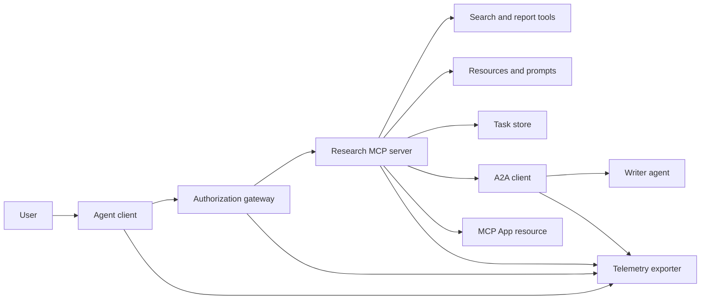
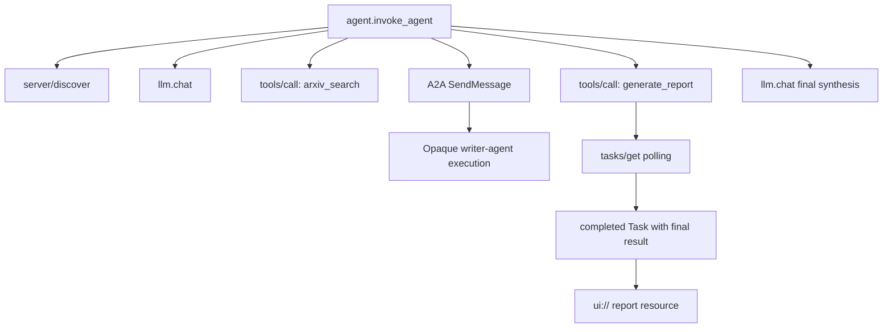
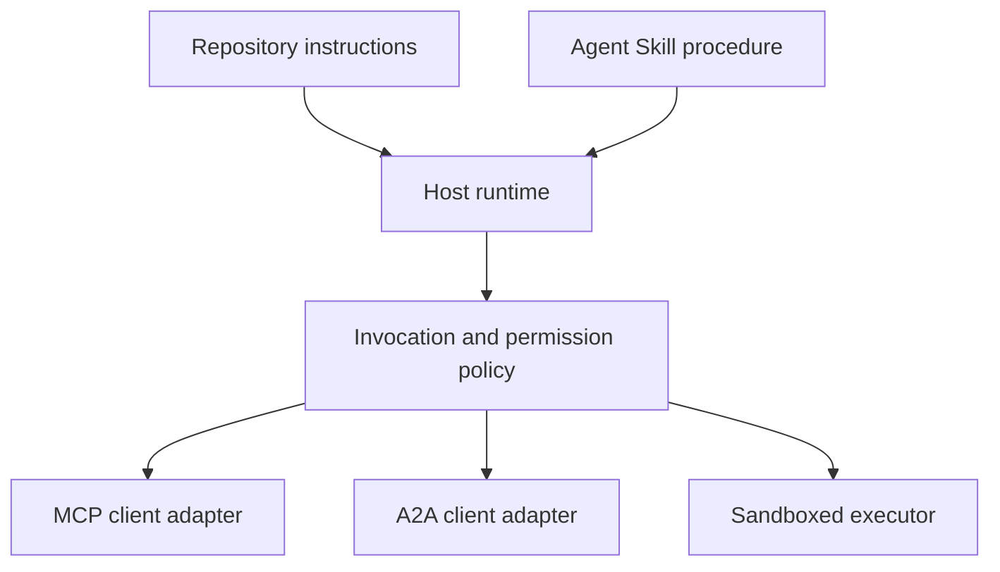

# 综合项目：无状态 Tool 生态系统

> 生产级 Agent 系统是一组边界，而不是一堆功能。本综合项目将易于阅读的进程内模拟，与真实部署仍然需要的协议客户端、授权服务器、sandbox 和 telemetry exporter 区分开来。

**Type:** Build
**Languages:** Python（stdlib、进程内模拟）
**Prerequisites:** Phase 13 · 01 至 22，使用 MCP revision `2026-07-28`
**Time:** ~120 分钟

## 学习目标

- 将 Tool 调用、任务型结果、委派工作、UI 资源、授权策略和 trace 记录组合为一个流程。
- 在每个 MCP 请求中携带协议版本、客户端身份和 capabilities，而不是依赖连接 session。
- 在使用服务器之前先发现它，并通过官方 Tasks extension 驱动长时间运行的工作。
- 区分协议形态的模拟与 MCP、A2A、OAuth 或 OpenTelemetry 实现。
- 将每个模拟边界映射到必须替换它的生产组件。
- 让 `AGENTS.md`、Agent Skill、runtime adapter、Tool 和安全策略各司其职。
- 说明哪些声明可以通过本地输出验证，哪些需要实时集成测试。

## 问题

设计一个研究与报告系统。用户请求查找关于 Agent 协议的论文。系统搜索论文目录、委派摘要工作、生成报告、返回 UI 资源，并记录贯穿系统的路径。

这句话隐藏了若干相互独立的契约：

- 面向 Model 的 Tool schema；
- 无状态请求 envelope 和服务器发现契约；
- 针对参与者、scope 和 Tool 身份的 gateway 决策；
- 长时间运行操作契约；
- 委派协议；
- host 到 App 的 bridge；
- trace 传播与导出；
- 可复用的操作流程。

`code/main.py` 使用普通 Python 函数和 dictionary，让这些边界保持可见。它不会打开 transport、联系 arXiv、执行 OAuth、调用 A2A 服务器、渲染 MCP App 或导出 telemetry。这样既能轻松检查控制流，又不会把模拟描述成合规服务。

## 概念

### 目标架构



该架构是公开协议模式的概念性组合，并非对任何产品私有内部实现的声明。

### 目标 trace



在真实实现中，每一跳都会传播 trace Context。Span 名称和属性必须遵循所选 instrumentation 版本支持的 OpenTelemetry semantic conventions。仅有共享的 trace identifier，并不能证明 parentage、导出或 backend 摄取正确。

### 当前协议表面

使用当前协议定义的方法名，而不是凭记忆使用旧草案中的名称：

| 边界 | 当前表面 | 综合项目模拟的内容 |
|---|---|---|
| MCP 发现 | 强制的 `server/discover` | 直接返回版本、capabilities 和服务器身份的函数 |
| MCP 请求 Context | 每个 `params._meta` 中的版本、capabilities 和客户端身份 | 传递给每次模拟调用的全新请求 metadata |
| MCP Tool 调用 | `tools/call` | 直接分派 Python 函数 |
| MCP task 轮询 | 带有 `tasks/get` 的 `io.modelcontextprotocol/tasks` | 一个工作中的 handle，随后是携带最终结果的已完成 task |
| A2A 委派 | gRPC 和 JSON-RPC 中的 `SendMessage`；HTTP+JSON 中的 `POST /message:send` | 一个嵌套 span，不进行远程调用或人为延迟 |
| MCP App 调用服务器 Tool | `app.callServerTool({ name, arguments })` | 不含实时 bridge 的 HTML 字符串 |
| OAuth 授权 | Authorization server、protected-resource metadata、audience 和 scope 验证 | 静态 Token 查找和 scope 成员关系检查 |
| OpenTelemetry | SDK、propagator、exporter，以及 collector 或 backend | 内存中的 span dictionary |

协议名称只是第一层。生产测试必须在真实 wire 上验证 serialization、authentication failure、cancellation、timeout、retry 和版本兼容性。

### 无状态 MCP 改变了集成边界

Revision `2026-07-28` 移除了协议 session，以及 `initialize` / `notifications/initialized` handshake。它还移除了 `Mcp-Session-Id`。每个请求都携带以下带 namespace 的 `_meta` 字段：

```json
{
  "io.modelcontextprotocol/protocolVersion": "2026-07-28",
  "io.modelcontextprotocol/clientCapabilities": {
    "extensions": {
      "io.modelcontextprotocol/tasks": {}
    }
  },
  "io.modelcontextprotocol/clientInfo": {
    "name": "capstone-client",
    "version": "1.0.0"
  }
}
```

服务器必须实现 `server/discover`。普通结果使用 `resultType: "complete"`；task handle 使用 `resultType: "task"`。每个结果都应在 `_meta.io.modelcontextprotocol/serverInfo` 中标识服务器。

Task extension 包含 `tasks/get`、`tasks/update` 和 `tasks/cancel`。Tool 最初可以返回 `resultType: "task"`；`tasks/get` 本身返回 `resultType: "complete"`，已完成的 `Task` 则包含最终结果。旧的 `tasks/result` 和 `tasks/list` 方法不属于当前 extension。客户端必须在可能收到 task handle 的同一请求中声明 `io.modelcontextprotocol/tasks`。如果没有声明，服务器将返回 `-32021`，其中 `requiredCapabilities` 的结构为缺失的客户端 capability 对象，包括 `extensions.io.modelcontextprotocol/tasks`。

### 安全态势

预期部署采用纵深防御：

- 当客户端类型要求时，使用带 PKCE 的 OAuth 授权；
- 对已签发的 access token 进行 resource 和 audience 绑定；
- gateway RBAC 检查所请求的 Tool 和 scope；
- upstream credential 保存在 Model 可见 Context 之外；
- 固定或经过审查的 Tool 描述 manifest；
- 针对不可信输入、敏感数据和后果重大的操作执行 Rule of Two 审查；
- execution sandbox 的 filesystem、process、network、credential 和 resource 限制在 Skill 之外强制执行。

该 demo 仅实现静态 Token、scope 检查和描述 hash。它适用于展示策略流程，不适用于安全验证。

### Skill 是流程，而不是 transport

Agent Skill 可以告诉 runtime 如何执行研究工作流、应当期待哪些 Tool 契约、要保存哪些证据，以及何时停止。它无法让 MCP 服务器凭空存在、建立 A2A 兼容性、授予 scope 或创建 sandbox。



当流程引用配套文件时，应交付完整的 Skill 目录。这个较早综合项目中的扁平 artifact 是课程 blueprint，并不能证明 host 会保留可移植 bundle。第 24 至 27 课将构建并测试完整的 bundle 生命周期。

### 课程 artifact metadata 是本地 adapter

课程目录和 installer 识别名为 `skill-*.md` 的扁平文件，但这是 repository 约定，而不是可移植 Agent Skills package 契约。其最小 frontmatter parser 只读取顶层 key。因此，本课将可移植身份字段和课程目录字段保持在同一层级：

```yaml
---
name: ecosystem-blueprint
description: Produce a full Phase 13 ecosystem architecture for a product need.
version: "1.0.0"
phase: "13"
lesson: "23"
tags: [mcp, capstone, ecosystem, architecture, a2a, otel]
---
```

`name` 和 `description` 是可移植身份字段。`version`、`phase`、`lesson` 和 `tags` 是课程特有的目录扩展。课程 parser 要求 `tags` 使用 inline list，以便 `--tag capstone` 能够匹配它。

可移植的目录 Skill 可以使用可选的 `metadata` map 存放字符串值的扩展数据。但这并不意味着 `metadata` 可以与此 repository 的目录 schema 互换。如果这个扁平文件把 `version` 或 `tags` 嵌套在 `metadata` 下，最小 parser 会跳过这些缩进 key，目录会记录空版本，tag 过滤也无法找到该 artifact。生产 host 应使用安全的 YAML parser，并验证其自行记录的 schema。

### 模拟与生产

| 层级 | `code/main.py` | 生产替代方案 | 所需证据 |
|---|---|---|---|
| 发现 | `server_discover()` 加静态 `TOOLS` | `server/discover`，随后使用支持 cache 的 `tools/list` | Wire transcript、确定性顺序和 schema 验证 |
| Authentication | 以 Token 为 key 的 dictionary | OAuth 授权和 resource server 验证 | Issuer、audience、scope、expiry 和 failure 测试 |
| Authorization | Scope 成员关系 | 绑定参与者、Tool、目标和 tenant 的 gateway 策略 | Allow 和 deny 审计案例 |
| 搜索 | 静态论文 fixture | Search API 或 MCP 服务器 | 来源 provenance、ranking 和 error 测试 |
| Tasks | 本地 handle 加立即执行的 `tasks/get` | 带有 `tasks/get`、`tasks/update`、`tasks/cancel` 和 TTL 的持久化 `io.modelcontextprotocol/tasks` store | State-transition、input、cancellation 和 recovery 测试 |
| 委派 | Sleep 加嵌套 span | A2A 客户端和远程 Agent Card | Contract、timeout、retry 和 opacity 测试 |
| App | HTML 字符串和 URI | MCP Apps 资源和 `App` bridge | CSP、permissions、Tool 调用和浏览器测试 |
| Telemetry | 内存 list | OTel SDK 和 exporter | Collector receipt 和 trace-parent 断言 |
| Sandbox | 无 | 由 host 强制执行的隔离 executor | Escape、egress、secret 和 resource-limit 测试 |

此表定义了交接边界。本地运行结果为绿色，只能验证模拟。

### Phase 13 导图

| 课程 | 贡献 |
|---|---|
| 01-05 | Tool interface、调用、schema、结构化结果和确定性验证 |
| 06-14 | 无状态 MCP 请求 envelope、发现、transport、资源、Prompt、extension 和 Apps |
| 15-18 | Poisoning 防御、OAuth、gateway、registry 和生产 authentication |
| 19 | A2A message 和 task 委派 |
| 20 | OpenTelemetry GenAI trace 设计 |
| 21 | Model provider routing |
| 22 | 可移植 Skill 契约和 runtime 边界 |

```figure
t3-capstone-chain
```

## 动手构建

运行进程内 harness：

```bash
cd phases/13-tools-and-protocols/23-capstone-tool-ecosystem
python3 code/main.py
```

检查以下六项：

1. `server/discover` 声明 revision `2026-07-28` 和 Tasks extension。
2. Alice 可以读取并生成报告，而 Bob 的 write scope 调用被拒绝。
3. 一次 orchestrator 运行中的每个本地 span 都共享同一个 trace identifier，并记录 parent span identifier。
4. 报告开始时是一个 task handle。`tasks/get` 返回已完成的 task，其最终结果包含文本和一个 `ui://` 引用。
5. 被委派的 writer 保持不透明，因为 orchestrator 只记录边界 span。
6. 没有任何输出声称发生过网络连接、OAuth exchange、collector 导出、浏览器渲染或 sandbox 执行。

脚本运行两次，因此会生成两个 root trace。审计条目只存在于当前进程，并会在下次运行时重置。

## 实际应用

每次将一层提升到生产实现：

1. 用真实的 `server/discover` 和 `tools/list` 调用替换 `server_discover()` 和静态 Tool list。在每个请求中发送版本、身份和 capabilities。
2. 用 authorization server 和 protected resource 验证替换静态 Token。
3. 实现 `io.modelcontextprotocol/tasks` extension，并测试 `tasks/get`、`tasks/update`、`tasks/cancel`、timeout、TTL 和重启恢复。不要添加 `tasks/result` 或 `tasks/list`。
4. 用能够解析 Agent Card 并发送 message 的 A2A 客户端替换委派 stub。
5. 使用官方 SDK 构建 App，并通过 `app.callServerTool` 调用服务器 Tool。
6. 将 span 导出到测试 collector，并在 receiver 端断言 parentage。
7. 在第 26 课的 sandbox 契约内运行 Tool 和脚本。
8. 将流程打包为完整目录 bundle，并通过第 27 课的 release gate。

每次提升都需要一个跨越新边界的集成测试。wire 变为真实实现后，不要删除底层策略测试。

## 交付成果

本课生成 `outputs/skill-ecosystem-blueprint.md`，这是一个旧版单文件课程 artifact。它要求产出一页式架构，涵盖 primitive、安全、委派、telemetry、打包和最棘手的运维风险。其顶层目录字段会由 repository 的真实目录 parser 和 installer parser 进行验证。

由于它不是目录 bundle，因此无法携带 reference、script、asset 或 eval fixture。在本课程之外发布可复用 Skill 时，请使用第 22 课以及第 24 至 27 课介绍的 package 格式。

## 练习

1. 运行 `code/main.py`。区分输出能够证明的事实与仍然需要集成证据的生产声明。
2. 添加第二个静态 backend，并为两个同名 Tool 定义冲突规则。然后用真实的 `tools/list` 调用替换两个 list。
3. 用 A2A 测试服务器替换 writer stub。记录 Agent Card、message request、timeout 路径和返回的 artifact。
4. 添加一个能够在进程重启后保留数据的 task store。证明客户端可以使用 `tasks/get` 恢复、遵守 `pollIntervalMs`，并且无需 `tasks/result` 即可读取已完成 task 的最终结果。
5. 构建最小 MCP App，并在具有严格 CSP 和明确 permissions 的浏览器中验证 `app.callServerTool`。
6. 通过 OTel SDK 将模拟 span 导出到本地 collector。断言 receipt、trace identifier、parentage 和 error status。
7. 为 repository 范围的维护规则编写 `AGENTS.md`，并为可复用的研究流程单独创建 Skill bundle。解释为什么这两个文件都不会授予 Tool authority。

## 关键术语

| 术语 | 人们常说的含义 | 它的实际含义 |
|---|---|---|
| 综合项目 | “所有内容都连接起来了” | 分阶段集成，其中模拟边界和实时边界始终保持明确 |
| 协议形态的模拟 | “它基本上就是 MCP” | 类似某种协议，但没有实现其 wire 契约的本地数据和调用 |
| Tasks extension | “长时间运行的 Tool 调用” | 可选的 `io.modelcontextprotocol/tasks` 生命周期，具有持久身份、轮询、客户端输入、最终结果和取消语义 |
| 不透明边界 | “另一个 Agent 会处理它” | 调用方看到的是声明的 interface 和 artifact，而不是私有 reasoning 或内部 state |
| Runtime adapter | “Skill 集成” | 将可移植流程映射到发现、调用、Tool、策略和 Context 的 host 代码 |
| 集成证据 | “它通过了” | 用于证明真实边界已被跨越的 transcript、artifact 或 receiver 端观察结果 |

## 延伸阅读

- [MCP specification 2026-07-28](https://modelcontextprotocol.io/specification/2026-07-28)：了解无状态请求、发现、Tool、授权和 transport 行为。
- [MCP 2026-07-28 key changes](https://modelcontextprotocol.io/specification/2026-07-28/changelog)：了解 session 移除、每请求 metadata、MRTR、extension 和弃用项。
- [MCP Tasks extension](https://tasks.extensions.modelcontextprotocol.io/specification/draft/tasks)：了解 `tasks/get`、`tasks/update`、`tasks/cancel`，以及由终止状态 task 携带的最终结果。
- [MCP Apps SDK](https://github.com/modelcontextprotocol/ext-apps/blob/main/docs/overview.md)：了解 `App` 和 `app.callServerTool`。
- [A2A protocol](https://a2a-protocol.org/latest/)：了解 Agent Card、message 传递、task、artifact 和 transport binding。
- [OpenTelemetry GenAI semantic conventions](https://opentelemetry.io/docs/specs/semconv/gen-ai/)：了解 trace 和 attribute 约定。
- [Agent Skills specification](https://agentskills.io/specification)：了解流程层使用的可移植 package 契约。
