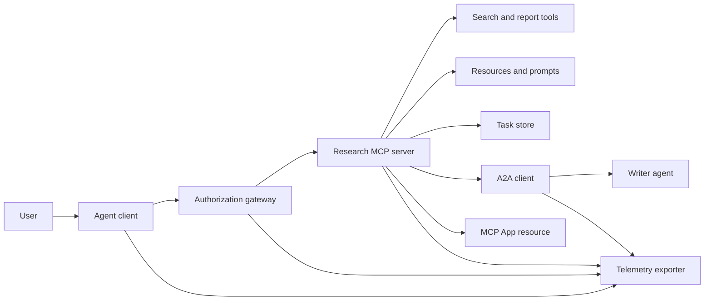
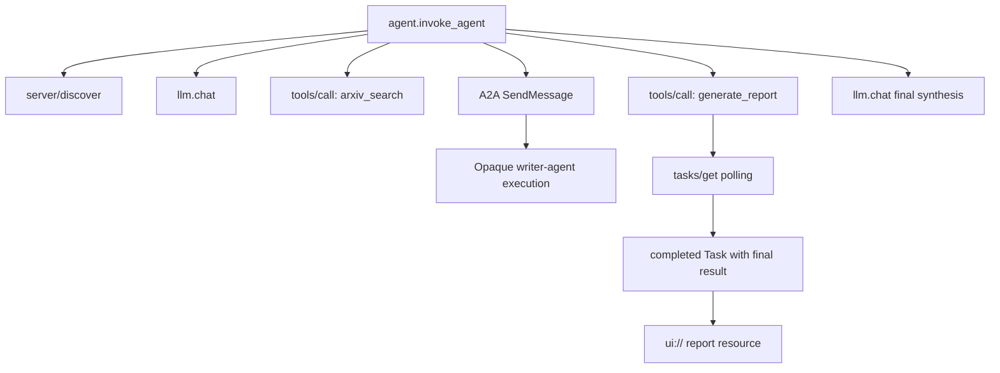
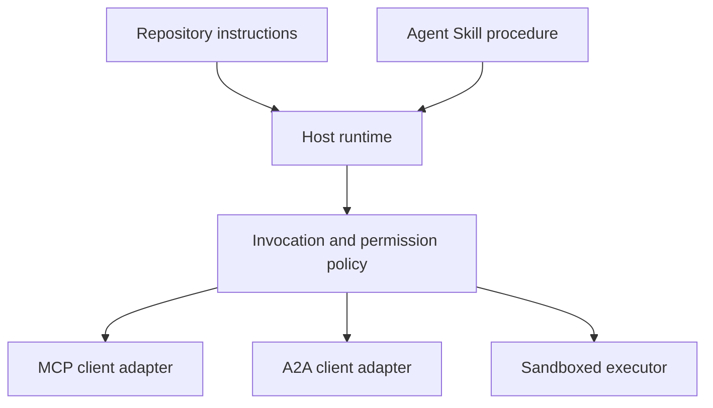

# 综合实战项目：无状态工具生态系统

> 生产级 agent 系统是一组清晰边界的集合，而非特性的简单堆砌。本实战项目将清晰易读的进程内模拟，与真实部署中必不可少的协议客户端、授权服务器、执行沙箱及遥测导出器严格解耦。

**Type:** Build
**Languages:** Python (stdlib, in-process simulation)
**Prerequisites:** Phase 13 · 01 through 22, using MCP revision `2026-07-28`
**Time:** ~120 minutes

## 学习目标

- 将 tool 调用、任务级结果、跨 agent 委托、UI 资源、授权策略及分布式追踪记录有机融合成单一流水线。
- 在每个 MCP 请求中严格携带协议版本、客户端身份与 capabilities，彻底告别对传输层会话的依赖。
- 在调用前主动执行服务发现，并通过官方 Tasks 扩展稳健驱动长耗时工作。
- 清晰区分符合协议形态的本地模拟（protocol-shaped simulation）与真正的 MCP、A2A、OAuth 及 OpenTelemetry 生产实现。
- 将模拟器中的每一个抽象边界精确映射到必须在生产中将其替换的物理组件。
- 确保 `AGENTS.md`、Agent Skill、运行时适配器、tools 及安全策略各自坚守正确的架构职责。
- 明确指出哪些技术断言可直接由本地输出证明，哪些必须依赖真实的端到端集成测试。

## 问题

设计一个学术研究与报告生成系统：用户请求检索关于 agent 通信协议的论文。系统检索论文目录、委托撰写总结、生成分析报告、返回 UI 交互资源，并完整记录系统执行的链路踪迹。

这句话看似简单，实则隐藏了多个彼此独立的契约：

- 面向模型的 tool schema 声明；
- 无状态请求信封与服务发现契约；
- 针对主体（actor）、scope 和 tool 身份的网关决策；
- 长周期任务操作契约；
- 跨 agent 委托协作协议（A2A）；
- 宿主与前端应用（MCP App）之间的通信桥梁；
- 链路追踪的上下文传播与导出；
- 可复用的标准化操作规程（Skill）。

`code/main.py` 利用纯 Python 函数与字典使上述边界清晰可见。它不开启网络监听、不真实请求 arXiv、不执行实际 OAuth 握手、不调用远程 A2A 服务、不渲染 MCP App，也不向外导出遥测数据。这使得控制流极易单步排查与理解，同时避免将本地模拟误导为符合规范的生产服务。

## 概念

### 目标架构


```mermaid
flowchart LR
  U[User] --> C[Agent client]
  C --> G[Authorization gateway]
  G --> M[Research MCP server]
  M --> T[Search and report tools]
  M --> R[Resources and prompts]
  M --> Q[Task store]
  M --> A[A2A client]
  A --> W[Writer agent]
  M --> UI[MCP App resource]
  C --> O[Telemetry exporter]
  G --> O
  M --> O
  A --> O
```

该架构是对公开标准协议模式的概念性组合，并非任何单一专有产品的私有内部实现。

### 目标分布式追踪链路


```mermaid
flowchart TD
  I[agent.invoke_agent] --> SD[server/discover]
  I --> L1[llm.chat]
  I --> S[tools/call: arxiv_search]
  I --> D[A2A SendMessage]
  D --> X[Opaque writer-agent execution]
  I --> G[tools/call: generate_report]
  G --> K[tasks/get polling]
  K --> V[completed Task with final result]
  V --> UI[ui:// report resource]
  I --> L2[llm.chat final synthesis]
```

在真实生产落地中，每一个网络跳步（hop）都必须正确传播追踪上下文。Span 名称与属性必须严格遵循所选用的 OpenTelemetry 语义约定（Semantic Conventions）版本。单纯拥有相同的 Trace ID 并不能证明父子关系构建、数据导出或后端成功摄取是正确的。

### 当前协议交互表面

使用当前最新规范定义的方法名，绝不能沿用旧草案中的记忆：

| 边界 | 当前标准交互表面 | 本实战项目的本地模拟实现 |
|---|---|---|
| MCP 服务发现 | 强制性的 `server/discover` | 返回版本、capabilities 和服务器身份的直接函数 |
| MCP 请求上下文 | 每个 `params._meta` 均携带版本、capabilities 及客户端信息 | 传递给每次模拟调用的全新请求元数据 |
| MCP 工具调用 | `tools/call` | Python 本地函数直接分发 |
| MCP 任务轮询 | `io.modelcontextprotocol/tasks` 扩展与 `tasks/get` | 先返回处理中的任务句柄，后返回内联最终结果的完成任务 |
| A2A 跨代理委托 | gRPC 和 JSON-RPC 中为 `SendMessage`；HTTP+JSON 中为 `POST /message:send` | 无远程调用与人为延迟的单层嵌套 Span |
| MCP App 调用宿主工具 | `app.callServerTool({ name, arguments })` | 无实时通信桥梁的纯 HTML 字符串 |
| OAuth 鉴权 | 授权服务器、受保护资源元数据、Audience 与 Scope 校验 | 静态 Token 字典查找与 Scope 集合判断 |
| OpenTelemetry | SDK、传播器（Propagator）、导出器（Exporter）及收集器（Collector） | 纯内存 Span 字典数组 |

协议名称仅仅是最外层的表象。生产测试必须覆盖真实网络线缆上的序列化反序列化、认证失败、取消中断、超时重试以及协议多版本兼容。

### 无状态 MCP 重构了集成边界

`2026-07-28` 修订版本彻底移除了协议 session 以及 `initialize` / `notifications/initialized` 握手阶段。同时废除了 `Mcp-Session-Id`。每个请求都在 `params._meta` 中携带如下命名空间字段：

```json
{
  "io.modelcontextprotocol/protocolVersion": "2026-07-28",
  "io.modelcontextprotocol/clientCapabilities": {
    "extensions": {
      "io.modelcontextprotocol/tasks": {}
    }
  },
  "io.modelcontextprotocol/clientInfo": {
    "name": "capstone-client",
    "version": "1.0.0"
  }
}
```

服务端必须实现 `server/discover`。常规结果使用 `resultType: "complete"`；返回任务句柄时使用 `resultType: "task"`。每个结果都应在 `_meta.io.modelcontextprotocol/serverInfo` 中表明服务器自身身份。

Tasks 扩展包含 `tasks/get`、`tasks/update` 以及 `tasks/cancel`。Tool 首次调用可以返回 `resultType: "task"`；而后续轮询的 `tasks/get` 本身返回 `resultType: "complete"`，且完成态的 `Task` 对象中直接内联最终的业务输出。旧版草案中的 `tasks/result` 与 `tasks/list` 已被彻底移除。客户端必须在可能接收任务句柄的同一个请求中声明支持 `io.modelcontextprotocol/tasks` 扩展；若未声明，服务端将返回 `-32021` 错误，并在 `requiredCapabilities` 中明确指出缺失的扩展项。

### 安全态势（Security Posture）

预期的生产部署环境必须采用纵深防御：

- 针对需要保护的客户端类型强制采用带 PKCE 的 OAuth 授权；
- 为签发的 Access Token 强制实施资源（Resource）与受众（Audience）绑定；
- 网关基于角色严格核验被调用的 tool 与 scope 权限；
- 访问上游 API 的关键凭据严禁暴露在模型可见的上下文内；
- 严格锁定并审查 tool 描述元数据清单（Manifest）；
- 针对不可信输入、敏感数据与重大外部影响全面落实“两人法则”（Rule of Two）；
- 在隔离的执行沙箱中限制文件系统、进程、网络、凭证和资源消耗，该限制在 Skill 外部强制生效。

本课示例代码仅实现了静态 Token、Scope 校验以及描述哈希，旨在阐明策略流向，不能代替生产安全验证。

### Skills 是操作规程，而非网络传输

Agent Skill 用于告诉运行时如何推进研究工作流、预期匹配哪些 tool 契约、留存哪些过程审计证据以及何时终止任务。但它无法凭空创造出 MCP server、建立 A2A 协议连通、签发授权 Scope，或搭建代码沙箱。


```mermaid
flowchart TD
  RI[Repository instructions] --> H[Host runtime]
  SK[Agent Skill procedure] --> H
  H --> P[Invocation and permission policy]
  P --> MCP[MCP client adapter]
  P --> A2A[A2A client adapter]
  P --> EX[Sandboxed executor]
```

当操作规程需要引用配套资源文件时，必须以完整的 Skill 目录形式分发。本课早期交付的单文件构件属于课程演示蓝图，不能作为宿主支持通用程序包的证明。第 24 至 27 课将全面构建并测试完整的目录套件生命周期。

### 课程产物元数据是本地适配器

本课程的目录索引与安装器能够识别名为 `skill-*.md` 的扁平单文件，但这属于本仓库的特定工程约定，而非通用的 Agent Skills 跨平台标准规范。课程的极简 frontmatter 解析器仅能读取顶层一级键名。因此，本课将可移植标准字段与课程专有字段保持在同级展开：

```yaml
---
name: ecosystem-blueprint
description: Produce a full Phase 13 ecosystem architecture for a product need.
version: "1.0.0"
phase: "13"
lesson: "23"
tags: [mcp, capstone, ecosystem, architecture, a2a, otel]
---
```

`name` 与 `description` 是可移植标准的核心身份字段。`version`、`phase`、`lesson` 和 `tags` 是面向课程编目的扩展字段。安装器强制要求将 `tags` 写为单行内联数组，以便 `--tag capstone` 准确匹配。

标准的可移植目录 Skill 可以使用可选的 `metadata` 字典存放自定义扩展数据。但在本仓库的单文件中，如果将 `version` 或 `tags` 嵌套缩进写入 `metadata` 内部，极简解析器会直接忽略，导致无法提取版本号且标签过滤失效。生产宿主应当使用严谨安全的 YAML 解析器并校验其正式声明的 Schema。

### 本地模拟与真实生产环境对比

| 架构分层 | `code/main.py` 实现 | 生产落地替换方案 | 必须出示的验收证据 |
|---|---|---|---|
| 服务发现 | `server_discover()` 加静态 `TOOLS` | `server/discover` 配合带缓存的 `tools/list` | 报文轨迹、确定性排序与 Schema 校验 |
| 身份认证 | 基于 Token 的内存字典 | 独立的 OAuth 授权服务器与资源服务器验证 | 签发者、受众、Scope、过期与故障降级测试 |
| 授权鉴权 | Scope 集合成员判定 | 绑定主体、tool、目标和租户的网关策略 | 允许与拒绝分支的完整审计日志用例 |
| 论文检索 | 静态论文测试夹具（Fixtures） | 真实检索 API 或专门的 MCP Server | 数据溯源、排序打分与网络异常测试 |
| 异步任务 | 本地句柄加立即 `tasks/get` | 持久化 `io.modelcontextprotocol/tasks` 存储，实现 get/update/cancel 与 TTL | 状态迁移、用户输入、取消及宕机恢复测试 |
| 跨 Agent 委托 | 本地 Sleep 加嵌套 Span | 真实的 A2A 客户端与远程 Agent Card | 契约校验、超时重试与不透明执行测试 |
| 前端交互 App | HTML 字符串与 URI 协议头 | MCP Apps 资源与官方 `App` 通信桥梁 | CSP 安全策略、权限受控、tool 调用与浏览器渲染测试 |
| 链路遥测 | 内存 Python 字典列表 | 完整的 OTel SDK 与远程导出器（Exporter） | 收集端接收凭证与父子 Span 关联断言 |
| 执行沙箱 | 无 | 宿主强制隔离的安全沙箱执行器 | 沙箱逃逸、出站网络、敏感凭证与资源上限测试 |

该对比表构成了工程交接的清晰边界。本地测试全绿仅证明模拟器逻辑通畅。

### Phase 13 全景知识图谱

| 课次区间 | 核心贡献与架构职责 |
|---|---|
| 01-05 | Tool 接口标准、模型调用、Schema 设计、结构化输出及确定性校验 |
| 06-14 | 无状态 MCP 请求信封、服务发现、底层传输、资源、Prompt、扩展及 Apps |
| 15-18 | 防投毒安全防线、OAuth 鉴权、网关路由、Registry 准入及生产部署落地 |
| 19 | A2A 协议：跨代理的消息传递与异步任务协作 |
| 20 | 基于 OpenTelemetry 的 GenAI 分布式链路追踪设计 |
| 21 | 面向大模型供应商的智能路由与降级分流层 |
| 22 | 可移植 Agent Skill 契约规范与运行时安全边界 |

```figure
t3-capstone-chain
```

## 动手构建

运行进程内综合实战模拟脚本：

```bash
cd phases/13-tools-and-protocols/23-capstone-tool-ecosystem
python3 code/main.py
```

重点审查以下六大关键特征：

1. `server/discover` 正确向外声明了 `2026-07-28` 协议版本以及 Tasks 扩展能力。
2. Alice 能够顺利读取论文并生成报告，而 Bob 仅持有写入 Scope 的请求被网关坚决拒绝。
3. 同一编排执行轮次下的所有本地 Span 均共享唯一的 Trace ID，并准确记录了父级 Span ID。
4. 报告生成操作首先返回任务句柄。随后的 `tasks/get` 返回已完成的任务，其最终结果同时包含总结文本与 `ui://` 资源引用。
5. 被委托的撰写 agent 保持其执行黑盒不透明性，编排器仅记录外部跨边界调用 Span。
6. 控制台输出没有冒充发生了真实网络请求、OAuth 换标、遥测收集器网络导出、浏览器渲染或沙箱隔离。

脚本会连续执行两次，分别生成两条独立的根追踪链路。审计日志完全保存在本地内存中，进程退出即重置。

## 使用它

按部就班将模拟层替换为生产级真实组件：

1. 将 `server_discover()` 和静态 tool 列表替换为标准的 `server/discover` 与 `tools/list` 网络请求。在每个请求中完整携带协议版本、客户端身份与 capabilities。
2. 将静态 Token 字典替换为遵循 RFC 标准的独立授权服务器与受保护资源验证中间件。
3. 完整接入 `io.modelcontextprotocol/tasks` 扩展，测试 `tasks/get`、`tasks/update`、`tasks/cancel`、超时时间、TTL 清理及进程重启恢复。坚决不增加已废弃的 `tasks/result` 或 `tasks/list`。
4. 将委托撰写的桩代码替换为能够动态解析 Agent Card 并发送消息的真实 A2A 客户端。
5. 使用官方 SDK 开发前端交互 App，通过 `app.callServerTool` 规范发起反向工具调用。
6. 将 Span 导出至测试收集器（Collector），在收集端核验 Trace ID 与父子关系。
7. 将所有的工具调用和脚本执行纳入第 26 课规范的沙箱安全容器中运行。
8. 将操作规程打包为标准的目录级 Skill 套件，并通过第 27 课的发布准入门禁。

每替换一层，都必须为其编写跨越该真实物理边界的集成测试。切勿在接通真实网络后删除低层级的本地策略测试。

## 交付它

本课交付 `outputs/skill-ecosystem-blueprint.md`。这是一份单文件架构蓝图，要求在一页篇幅内完整阐述基本构件选型、安全态势、跨代理委托、可观测性遥测、包结构编排以及最严峻的运维风险。其顶层元数据可直接被课程目录和安装工具正常解析。

由于它是单文件蓝图，因此无法携带 references、scripts、assets 或 eval 测试用例。在课程之外构建可复用的生产级 skill 时，务必采用第 22 课及第 24 至 27 课所教授的标准目录程序包格式。

## 课后深练习

1. 运行 `code/main.py`。仔细甄别控制台输出中已在本地得到验证的事实，与在生产中仍需出示真实集成测试证据的断言。
2. 在模拟器中增加第二个静态后端，定义两个同名 tool 发生命名冲突时的解决规则。随后将两处硬编码列表替换为真实的 `tools/list` 调用。
3. 将撰写 agent 的桩代码替换为真实的 A2A 测试服务器。记录并审查 Agent Card、消息请求报文、超时异常分支以及返回的成果物。
4. 为任务状态开发可跨进程重启持久化的存储层。证明客户端能够通过 `tasks/get` 恢复执行、遵守 `pollIntervalMs` 轮询间隔，并在不依赖 `tasks/result` 的前提下直接读取已完成任务的最终产物。
5. 构建一个极简的 MCP App，在配置了严格 CSP 和显式权限策略的真实浏览器环境中验证 `app.callServerTool` 的连通性。
6. 将模拟生成的 Span 通过 OpenTelemetry SDK 导出到本地真实运行的 Collector 实例中。在收集端断言验证数据接收状态、Trace ID 连续性、父子继承关系与错误标记。
7. 分别编写一份用于规范全局研发规范的 `AGENTS.md`，以及一份用于指导文献调研的独立 Skill 程序包。深入阐述为什么这两份说明性文件均不具备直接调用工具的授权特权。

## 关键术语

| 术语 | 通俗说法 | 精确工程含义 |
|---|---|---|
| 实战项目（Capstone） | "把所有东西串起来" | 分阶段构建的集成系统，其本地模拟与真实线上边界保持绝对清晰 |
| 协议形态模拟（Protocol-shaped simulation） | "差不多就是个 MCP" | 在本地构建的与协议数据结构高度相似的代码，但未实现底层的网络传输契约 |
| Tasks 扩展 | "长耗时 tool 调用" | 可选的 `io.modelcontextprotocol/tasks` 扩展规范，定义了持久化标识、轮询、客户端补全、最终结果与取消机制 |
| 不透明边界（Opacity boundary） | "丢给另一个 agent 处理" | 调用方仅能看到公开声明的接口与交付成果，无法窥探其内部思维链与私有状态 |
| 运行时适配器（Runtime adapter） | "接入 Skill 的胶水代码" | 宿主层负责将通用可移植的操作规程映射到服务发现、交互调用、工具权限、安全策略及上下文管理的代码 |
| 集成证据（Integration evidence） | "测试跑通了" | 完整的报文日志、交付产物或接收端实测数据，确凿证明系统跨越了真实的物理边界 |

## 延伸阅读

- [MCP 2026-07-28 核心规范](https://modelcontextprotocol.io/specification/2026-07-28) - 深入掌握无状态请求、服务发现、工具调用、鉴权及底层传输规范。
- [MCP 2026-07-28 关键变更日志](https://modelcontextprotocol.io/specification/2026-07-28/changelog) - 了解会话移除、逐请求元数据、MRTR、官方扩展及废弃特性的演进细节。
- [MCP Tasks 扩展规范草案](https://tasks.extensions.modelcontextprotocol.io/specification/draft/tasks) - 学习 `tasks/get`、`tasks/update`、`tasks/cancel` 及任务终态结果的完整流转机制。
- [MCP Apps 官方 SDK](https://github.com/modelcontextprotocol/ext-apps/blob/main/docs/overview.md) - 掌握 `App` 类及 `app.callServerTool` 的前端集成细节。
- [A2A 跨代理协议最新规范](https://a2a-protocol.org/latest/) - 了解 Agent Cards、消息传递、任务协作、工件交付及网络传输绑定的权威标准。
- [OpenTelemetry GenAI 语义约定](https://opentelemetry.io/docs/specs/semconv/gen-ai/) - 遵循行业统一的 AI 链路追踪与属性命名标准。
- [Agent Skills 规范官方文档](https://agentskills.io/specification) - 掌握本实战项目中规程抽象层所依赖的可移植包结构契约。
