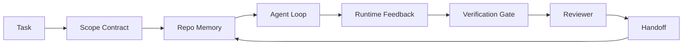

# Agent Workbench Engineering：为什么能力强的模型仍会失败

> 仅有能力强的模型并不够。可靠的 agent 需要一个 workbench：instructions、state、scope、feedback、verification、review 和 handoff。去掉这些，即使是 frontier model 也会产出不适合发布的工作。

**Type:** Learn + Build
**Languages:** Python (stdlib)
**Prerequisites:** Phase 14 · 01 (Agent Loop), Phase 14 · 26 (Failure Modes)
**Time:** ~45 minutes

## 学习目标
- 区分模型能力与执行可靠性。
- 说出决定 agent 能否交付的七个 workbench surfaces。
- 在一个小型 repo 任务上比较 prompt-only 运行与 workbench-guided 运行。
- 产出一份 failure-mode 报告，将每个缺失的 surface 映射到它造成的症状。

## 问题
你把一个 frontier model 放进真实 repo，让它添加输入验证。它打开四个文件，写出看似合理的代码，宣布成功，然后停止。你运行测试。两个失败了。第三个被改动的文件与验证完全无关。没有任何记录说明 agent 假设了什么、最先尝试了什么，或者还有什么待完成。

模型并不是不懂 Python。它是不懂这项工作。它不知道什么才算完成、允许写入哪里、哪些测试具有权威性，也不知道下一次 session 应该如何接手。

这不是模型 bug。这是 workbench bug。agent 周围的 surface 缺少必要部分，无法把一次性的生成转化为可靠、可恢复的工程工作。

## 概念
workbench 是任务期间包裹模型的运行环境。它有七个 surfaces：

| Surface | 它承载什么 | 缺失时的失败 |
|---------|------------|--------------|
| Instructions | 启动规则、禁止动作、完成定义 | Agent 猜测交付意味着什么 |
| State | 当前任务、已触碰文件、blockers、下一步动作 | 每个 session 都从零开始 |
| Scope | 允许文件、禁止文件、验收标准 | 修改泄漏到无关代码 |
| Feedback | 捕获进 loop 的真实命令输出 | Agent 在 400 上宣布成功 |
| Verification | Tests、lint、smoke run、scope check | “看起来不错”进入 main |
| Review | 由不同角色执行的第二遍检查 | Builder 批改自己的作业 |
| Handoff | 改了什么、为什么改、还剩什么 | 下一个 session 重新发现一切 |

workbench 独立于模型。你可以替换模型并保留这些 surfaces。你不能替换 surfaces 还保持可靠性。



这个 loop 闭合在 state 文件上，而不是 chat history 上。Chat 是易失的。repo 才是 system of record。

### Workbench 与 prompt engineering

Prompting 告诉模型这一轮你想要什么。workbench 告诉模型如何跨轮次、跨 session 地完成工作。大多数 agent 失败故事，其实是披着 prompt-engineering 外衣的 workbench 失败。

### Workbench 与 framework 对比

framework 提供 runtime（LangGraph、AutoGen、Agents SDK）。workbench 给 agent 在那个 runtime 中提供一个工作场所。两者都需要。这个 mini-track 讲的是第二个。

### 从 primitives 出发推理，而不是从 vendor taxonomies 出发

现在有大量关于 “harness engineering” 的文章。Addy Osmani、OpenAI、Anthropic、LangChain、Martin Fowler、MongoDB、HumanLayer、Augment Code、Thoughtworks、walkinglabs awesome list，以及 Medium 和 Hacker News 上持续不断的文章都在讨论它。它们对于 harness 的边界、scope 中包含什么、使用哪套词汇并不一致。我们不需要选边站。七个 surfaces 是一个 UX layer；每个 workbench 底下，都是同一组支撑任何可靠 backend 的 distributed-systems primitives。

先暂时拿掉 agent 这个标签。一次 agent run 是跨越时间、进程和机器的计算。要让它可靠，你需要任何 production system 都需要的同样 primitives。

| Primitive | 它是什么 | 它为 agent 承载什么 |
|-----------|----------|---------------------|
| Function | 类型化 handler。尽可能保持纯。拥有自己的 inputs 和 outputs。 | 一次 tool call、一次 rule check、一个 verification step、一次模型调用 |
| Worker | 拥有一个或多个 functions 和 lifecycle 的长生命周期进程 | builder、reviewer、verifier、一个 MCP server |
| Trigger | 调用 function 的事件源 | Agent loop tick、HTTP request、queue message、cron、file change、hook |
| Runtime | 决定什么在哪里运行、使用什么 timeouts 和 resources 的边界 | Claude Code 的 process、LangGraph 的 runtime、一个 worker container |
| HTTP / RPC | caller 与 worker 之间的网络线缆 | Tool-call protocol、MCP request、model API |
| Queue | trigger 与 worker 之间的持久 buffer；back-pressure、retry、idempotency | task board、feedback log、review inbox |
| Session persistence | 在 crashes、restarts、model swaps 后仍保留的 state | `agent_state.json`、checkpoints、KV stores、repo 本身 |
| Authorization policy | 谁能以什么 scope 调用什么 function | allowed/forbidden files、approval boundaries、MCP capability lists |

现在把七个 workbench surfaces 映射到这些 primitives 上。

- **Instructions** — policy + function metadata。Rules 是 checks（functions）。router（`AGENTS.md`）是附着在 runtime startup 上的 policy。
- **State** — session persistence。runtime 每一步都会读取的 keyed store。File、KV 或 DB；persistence semantics 重要，storage backend 不重要。
- **Scope** — 每个任务的 authorization policy。allowed/forbidden globs 是 ACL。需要 approvals 是 permission lattice。
- **Feedback** — 写入 queue 的 invocation log。每次 shell call 都是一条 record，持久、可重放。
- **Verification** — 一个 function。对 inputs 确定性。由 task close 触发。失败时关闭。
- **Review** — 一个独立 worker，对 builder artifacts 具备 read-only authz，对 review reports 具备 write-only authz。
- **Handoff** — 由 session-end trigger 发出的持久 record。下一个 session 的 startup trigger 会读取它。

agent loop 本身就是一个 worker，它消费 events（user message、tool result、timer tick），调用 functions（先是模型，然后是模型选择的 tools），写 records（state、feedback），并发出 triggers（verify、review、handoff）。没有神秘之处；形状与 job processor 相同。

### 流行模式，转换为 primitives

每一种流行的 harness pattern 都可以归约为八个 primitives。下面是翻译表。

| Vendor or community pattern | 它实际是什么 |
|------------------------------|--------------|
| Ralph Loop（Claude Code、Codex、agentic_harness book）— 当 agent 试图过早停止时，把原始意图重新注入一个新的 context window | 一个将 task 以干净 context 重新入队的 trigger；session persistence 负责把目标向前传递 |
| Plan / Execute / Verify (PEV) | 三个 workers，每个角色一个，通过 state 和 phases 之间的 queue 通信 |
| Harness-compute separation（OpenAI Agents SDK，April 2026）— 将 control plane 与 execution plane 分开 | 对 control-plane / data-plane 的重新表述。比 agent 标签早几十年就存在 |
| Open Agent Passport（OAP，March 2026）— 在执行前根据声明式 policy 签名并审计每次 tool call | 由 pre-action worker 强制执行的 authorization policy，并带有 signed audit queue |
| Guides and Sensors（Birgitta Böckeler / Thoughtworks）— feedforward rules + feedback observability | Authorization policy + verification functions + observability traces |
| Progressive compaction, 5-stage（Claude Code reverse engineering，April 2026） | 一个 state-management worker，像 cron 一样在 session persistence 上运行，使其保持在 budget 内 |
| Hooks / middleware（LangChain、Claude Code）— 拦截 model 和 tool calls | 包裹 runtime invocation path 的 triggers + functions |
| Skills as Markdown with progressive disclosure（Anthropic、Flue） | 一个 function registry，其中 function metadata 会 just-in-time 加载到 context 中 |
| Sandbox agents（Codex、Sandcastle、Vercel Sandbox） | compute plane：具备隔离 filesystem、network 和 lifecycle 的 runtime |
| MCP servers | 通过稳定 RPC 暴露 functions 的 workers，capability lists 作为 authorization |

该表中的每一项，都是 agent 社区到达一个早已在 distributed systems 中有名字的 primitive，然后给它起了新名字。作为营销标签有用；作为工程词汇没有用。

### receipts 实际上说明了什么

harness-over-model 的说法现在有了数据支撑。值得了解，因为这也是反驳“只要等更聪明的模型就好”的唯一诚实论据。

- Terminal Bench 2.0 — 同一个模型，仅 harness change 就让一个 coding agent 从 top 30 之外提升到第五名（LangChain，*Anatomy of an Agent Harness*）。
- Vercel — 删除了其 agent 80% 的 tools；success rate 从 80% 跳到 100%（MongoDB）。
- Harvey — legal agents 仅通过 harness optimization 就让 accuracy 翻倍以上（MongoDB）。
- 88% 的 enterprise AI agent projects 未能进入 production。失败集中在 runtime，而不是 reasoning（preprints.org，*Harness Engineering for Language Agents*，March 2026）。
- 一项 2025 benchmark study 在三个流行 open-source frameworks 上报告了约 50% 的 task completion；long-context WebAgent 在 long-context conditions 下从 40-50% 跌到 10% 以下，主要由于 infinite loops 和 goal loss（2026 年初的 writeups 中被广泛讨论）。

要点不是“harness 永远胜出”。模型会随着时间吸收 harness tricks。要点是今天，承重的工程在模型周围，而不是模型内部；承担这些负载的 primitives，正是每个 production system 一直都需要的东西。

### vendor writeups 止步的地方

这一部分你不需要客气。

- LangChain 的 *Anatomy of an Agent Harness* 枚举了十一个组件 — prompts、tools、hooks、sandboxes、orchestration、memory、skills、subagents，以及一个 runtime “dumb loop”。它没有命名 queues、作为 deployment unit 的 workers、trigger semantics、作为独立关注点的 session persistence，或 authorization policy。它把 harness 当作一个你配置的对象，而不是一个你部署的系统。
- Addy Osmani 的 *Agent Harness Engineering* 提出了 `Agent = Model + Harness` 的框架和 ratchet pattern，但没有进一步说明 harness 是由什么构成的。它读起来像一种立场，而不是一份 spec。
- Anthropic 和 OpenAI 对 surfaces 讨论得最深，但仍停留在各自 runtime 内。April 2026 Agents SDK 中的 “harness-compute separation” announcement 是第一个明确认可 control-plane / data-plane 分离的 vendor piece。那是一个 primitive idea，不是新东西。
- agentic_harness book 将 harness 视为 config object（Jaymin West 的 *Agentic Engineering*，chapter 6），其中最有力的一句话是“the harness is the primary security boundary in an agentic system”。这只是 authorization policy 的重新表述。
- Hacker News threads 一直抵达同一个地方。April 2026 thread *The agent harness belongs outside the sandbox* 认为 harness 应该位于“更像是一个处在一切之外、并基于 context 和 user 授权访问的 hypervisor”。这再次是作为独立平面的 authorization policy。

你不需要反对这些文章中的任何一篇，也能看出缺口。它们在写一个已经存在的系统的 UX 描述。我们要写的是系统。当系统构建正确时，七个 surfaces 会自然从 primitives 中涌现。当系统构建错误时，再多 `AGENTS.md` 润色也修不好缺失的 queue。

所以，当你在其他地方听到 “harness engineering” 时，把它翻译成 primitives。Prompts 和 rules 是 policy 与 functions。Scaffolding 是 runtime。Guardrails 是 authorization + verification。Hooks 是 triggers。Memory 是 session persistence。Ralph Loop 是 requeue。Subagents 是 workers。Sandboxes 是 compute planes。词汇会变；工程不会。workbench 是 agent-facing UX；而能够挺过下一次 vendor reframe 的 harness，本质上是 functions、workers、triggers、runtimes、queues、persistence 和 policy 被正确连接在一起。

```figure
wb-seven-surfaces
```

## 构建它
`code/main.py` 会把一个微型 repo task 运行两次。第一次是 prompt only，第二次接入七个 surfaces。相同模型，相同任务。脚本会统计失败运行中缺失了哪些 surfaces，并打印 failure-mode report。

repo task 刻意设计得很小：给一个单文件 FastAPI-style handler 添加输入验证，并写一个通过的 test。

运行它：

```
python3 code/main.py
```

输出：两次运行的 side-by-side log，一个总结 prompt-only run 的 `failure_modes.json`，以及 workbench run 的一行 verdict。

agent 是一个极小的 rule-based stub；重点是 surfaces，而不是模型。在这个 mini-track 的其余部分，你会把每个 surface 重建为真实、可复用的 artifact。

## 使用它
三个地方已经在现实中存在 workbench surfaces，哪怕没人这样称呼它们：

- **Claude Code, Codex, Cursor.** `AGENTS.md` 和 `CLAUDE.md` 是 instructions surface。Slash commands 是 scope。Hooks 是 verification。
- **LangGraph, OpenAI Agents SDK.** Checkpoints 和 session stores 是 state surface。Handoffs 是 handoff surface。
- **真实 repo 上的 CI。** Tests、lint 和 type-check 是 verification。PR template 是 handoff。CODEOWNERS 是 review。

Workbench engineering 是一种纪律：把这些 surfaces 显式化、可复用化，而不是让每个团队自己重新发现它们。

## 交付它
`outputs/skill-workbench-audit.md` 是一个可移植 skill，用来审计现有 repo 的七个 workbench surfaces，并报告哪些缺失、哪些部分具备、哪些健康。把它放到任何 agent setup 旁边；它会告诉你先修什么。

## 练习
1. 选择一个你已经运行 agent 的 repo。把七个 surfaces 从 0（缺失）到 2（健康）打分。你最弱的 surface 是什么？
2. 扩展 `main.py`，让 prompt-only run 也产生一个假的“success”声明。验证 verification gate 会抓住它。
3. 为你自己的产品添加第八个 surface。说明为什么它不能归并到现有七个之一。
4. 用另一个会 hallucinate 额外文件写入的 stub agent 重新运行脚本。哪个 surface 最先抓住它？
5. 将 Phase 14 · 26 中五个行业反复出现的 failure modes 映射到七个 surfaces。每个 surface 设计来吸收哪种 mode？

## 关键术语
| Term | What people say | What it actually means |
|------|----------------|------------------------|
| Workbench | “那套 setup” | 围绕模型设计的 engineered surfaces，使工作可靠 |
| Surface | “一个 doc” 或 “一个 script” | agent 每一轮读取或写入的命名、machine-readable input |
| System of record | “那些 notes” | chat history 消失后 agent 视为 truth 的文件 |
| Definition of done | “Acceptance” | 一个客观、file-backed 的 checklist，agent 无法伪造 |
| Workbench audit | “Repo readiness check” | 在工作开始前遍历七个 surfaces，标记缺失部分 |

## 延伸阅读
把这些当作数据点，而不是权威。每一篇都是部分 taxonomy。在决定是否采用某个概念前，先把它翻译回 primitive（function、worker、trigger、runtime、HTTP/RPC、queue、persistence、policy）。

Vendor framings:

- [Addy Osmani, Agent Harness Engineering](https://addyosmani.com/blog/agent-harness-engineering/) — `Agent = Model + Harness` 和 ratchet pattern；基础设施部分较薄
- [LangChain, The Anatomy of an Agent Harness](https://blog.langchain.com/the-anatomy-of-an-agent-harness/) — 十一个组件：prompts、tools、hooks、orchestration、sandboxes、memory、skills、subagents、runtime；省略 queues、deployment、authz
- [OpenAI, Harness engineering: leveraging Codex in an agent-first world](https://openai.com/index/harness-engineering/) — Codex 团队对其 runtime 周围 surfaces 的看法
- [OpenAI, Unrolling the Codex agent loop](https://openai.com/index/unrolling-the-codex-agent-loop/) — 将 agent loop 归约为 function calls 上的一个 `while`
- [Anthropic, Effective harnesses for long-running agents](https://www.anthropic.com/engineering/effective-harnesses-for-long-running-agents) — 特定 runtime 内的 long-horizon surfaces
- [Anthropic, Harness design for long-running application development](https://www.anthropic.com/engineering/harness-design-long-running-apps) — 应用型设计笔记
- [LangChain Deep Agents harness capabilities](https://docs.langchain.com/oss/python/deepagents/harness) — runtime config surface

有可用细节的 practitioner 文章：

- [Martin Fowler / Birgitta Böckeler, Harness engineering for coding agent users](https://martinfowler.com/articles/harness-engineering.html) — guides（feedforward）+ sensors（feedback）；最清晰的 control-theory framing
- [HumanLayer, Skill Issue: Harness Engineering for Coding Agents](https://www.humanlayer.dev/blog/skill-issue-harness-engineering-for-coding-agents) — “这不是模型问题，而是 configuration 问题”
- [MongoDB, The Agent Harness: Why the LLM Is the Smallest Part of Your Agent System](https://www.mongodb.com/company/blog/technical/agent-harness-why-llm-is-smallest-part-of-your-agent-system) — 证据：Vercel 80% 到 100%，Harvey 2x accuracy，Terminal Bench Top 30 到 Top 5
- [Augment Code, Harness Engineering for AI Coding Agents](https://www.augmentcode.com/guides/harness-engineering-ai-coding-agents) — constraint-first walkthrough
- [Sequoia podcast, Harrison Chase on Context Engineering Long-Horizon Agents](https://sequoiacap.com/podcast/context-engineering-our-way-to-long-horizon-agents-langchains-harrison-chase/) — runtime concerns 高于 model concerns

书籍、论文与 reference implementations：

- [Jaymin West, Agentic Engineering — Chapter 6: Harnesses](https://www.jayminwest.com/agentic-engineering-book/6-harnesses) — book-length treatment，将 harness 视为 primary security boundary
- [preprints.org, Harness Engineering for Language Agents (March 2026)](https://www.preprints.org/manuscript/202603.1756) — 将其作为 control / agency / runtime 的学术 framing
- [walkinglabs/awesome-harness-engineering](https://github.com/walkinglabs/awesome-harness-engineering) — 跨 context、evaluation、observability、orchestration 的 curated reading list
- [ai-boost/awesome-harness-engineering](https://github.com/ai-boost/awesome-harness-engineering) — 另一份 curated list（tools、evals、memory、MCP、permissions）
- [andrewgarst/agentic_harness](https://github.com/andrewgarst/agentic_harness) — production-ready reference implementation，带 Redis-backed memory 和 eval suite
- [HKUDS/OpenHarness](https://github.com/HKUDS/OpenHarness) — 内置 personal agent 的 open agent harness

值得阅读其分歧而非共识的 Hacker News 讨论：

- [HN: Effective harnesses for long-running agents](https://news.ycombinator.com/item?id=46081704)
- [HN: Improving 15 LLMs at Coding in One Afternoon. Only the Harness Changed](https://news.ycombinator.com/item?id=46988596)
- [HN: The agent harness belongs outside the sandbox](https://news.ycombinator.com/item?id=47990675) — 主张将 authorization 作为独立平面

Cross-references inside this curriculum:

- Phase 14 · 23 — OpenTelemetry GenAI conventions：sensors literature 指向的 observability layer
- Phase 14 · 26 — 七个 surfaces 设计来吸收的 failure modes catalog
- Phase 14 · 27 — 位于 authorization-policy primitive 上的 prompt injection defenses
- Phase 14 · 29 — Production runtimes（queue、event、cron）：本课中的 primitives 在 deployment 中的位置
