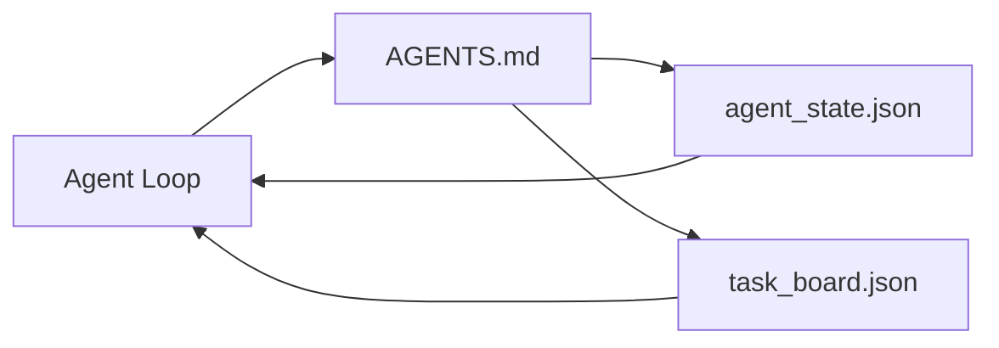

# 最小化 Agent Workbench

> 最小且实用的 Workbench 只需要三个文件：根指令 Router、状态文件和任务看板。其他所有内容都在此基础上逐层添加。如果一个 repo 连这三个文件都容纳不了，任何 Model 都救不了它。

**Type:** Build
**Languages:** Python (stdlib)
**Prerequisites:** Phase 14 · 31（为什么能力强大的 Model 仍会失败）
**Time:** ~45 分钟

## 学习目标

- 定义构成最小可用 Workbench 的三个文件。
- 解释为什么简短的根 Router 优于冗长的单体 `AGENTS.md`。
- 构建一个 Agent 能在每轮开始时读取、结束时写入的状态文件。
- 构建一个不依赖聊天历史、能够支持多 Session 工作的任务看板。

## 问题

大多数团队通过编写一份 3000 行的 `AGENTS.md` 来构建 Workbench，然后便认为工作已经完成。Model 加载它，忽略那些无法概括的部分，最后仍然在一贯失败的地方失败。

你需要采用相反的做法：一个极小的根文件，仅在相关时才将 Agent 路由到更深层的文件。Agent 在行动前读取、行动后写入的持久状态。一个明确说明哪些任务正在进行、哪些被阻塞、下一项是什么的任务看板。

三个文件。每个文件各司其职。每个文件都应具备足够的机器可读性，以便日后演进成真正的系统。

## 概念



### AGENTS.md 是 Router，不是手册

优秀的 `AGENTS.md` 应当简短。它会将 Agent 指向：

- 状态文件（你当前在哪里）。
- 任务看板（还剩什么）。
- 更深入的规则（位于 `docs/agent-rules.md`）。
- 验证命令（如何确认它有效）。

任何更长的内容都应放在更深层的文档中，仅在需要时加载。冗长的手册会被忽略，简短的 Router 才会得到遵循。

### agent_state.json 是 System of Record

状态包含：当前任务 id、修改过的文件、已作出的假设、阻塞项和下一步行动。Agent 每轮都会读取它。下一个 Session 会读取它，而不是重放聊天记录。

状态存储在文件中，因为聊天历史并不可靠。Session 会结束，对话会被裁剪，而文件不会。

### task_board.json 是队列

任务看板包含每个任务及其状态 `todo | in_progress | done | blocked`。当状态为空时，Agent 从这个队列中领取任务；当你想了解 Agent 是否按计划推进时，也会查看这个队列。

看板中的任务包含 id、目标、负责人（`builder`、`reviewer` 或 `human`）和验收标准。看板有意保持精简：当它增长到一屏无法显示时，说明你遇到的是规划问题，而不是看板问题。

### 三个文件是下限，不是上限

后续课程会加入范围契约、反馈 Runner、验证关卡、Reviewer Checklist 和 handoff packet。这里的三个文件是所有这些机制的基础假设。

```figure
wb-three-files
```

## 动手构建

`code/main.py` 会将最小化 Workbench 写入空 repo，并演示单轮 Agent 操作：

1. 读取 `agent_state.json`。
2. 如果状态为空，则从 `task_board.json` 领取下一个任务。
3. 在范围内修改单个文件。
4. 写回更新后的状态。

运行：

```
python3 code/main.py
```

该脚本会在自身旁边创建 `workdir/`，写入这三个文件，运行一轮操作并打印 diff。再次运行它，观察第二轮如何从第一轮结束的位置继续。

## 实际使用

在生产级 Agent 产品内部，同样的三个文件会以不同名称出现：

- **Claude Code：**使用 `AGENTS.md` 或 `CLAUDE.md` 作为 Router，使用类似 `.claude/state.json` 的存储保存状态，使用 Hook 管理看板。
- **Codex / Cursor：**使用 Workspace Rule 作为 Router，使用 Session Memory 保存状态，使用聊天侧边栏中的排队任务作为看板。
- **自定义 Python Agent：**就是你刚刚编写的这些文件。

名称会改变，形态不会。

## 真实生产环境中的模式

当在最小化 Workbench 之上叠加三种模式时，它就能应对真实 monorepo。三种模式相互独立；只选择你的 repo 真正需要的模式。

**使用就近优先规则的嵌套 `AGENTS.md`。** OpenAI 在其主 repo 的不同子组件中提供了 88 个 `AGENTS.md` 文件，每个子组件一个。Codex、Cursor、Claude Code 和 Copilot 都会从当前工作文件向 repo 根目录逐层查找，并拼接沿途发现的每个 `AGENTS.md`。子目录文件会扩展根文件。Codex 还提供 `AGENTS.override.md`，用于替换而不是扩展；这种覆盖机制是 Codex 特有的，进行跨 Tool 工作时应避免使用。Augment Code 的测量结果揭示了关键结论：最好的 `AGENTS.md` 带来的质量提升相当于将 Model 从 Haiku 升级到 Opus；最差的文件则会让输出质量低于完全没有文件的情况。

**即使看似覆盖全面，也要拒绝的反模式。** 相互冲突的指令会悄无声息地让 Agent 从交互模式退化为贪心模式（ICLR 2026 AMBIG-SWE：解决率从 48.8% 降至 28%）；应给优先级编号，而不是将它们平铺堆叠。无法验证的风格规则（“遵循 Google Python Style Guide”）如果没有对应的执行命令，会让 Agent 自行编造合规结果；每条风格规则都应配上准确的 lint 命令。将风格放在命令之前会掩埋验证路径；命令在前，风格在后。面向人类而不是 Agent 编写内容会浪费 Context 预算；简洁本身就是一种优势。

**跨 Tool symlink。** 使用单个根文件和 symlink（`ln -s AGENTS.md CLAUDE.md`、`ln -s AGENTS.md .github/copilot-instructions.md`、`ln -s AGENTS.md .cursorrules`），可以让每个 Coding Agent 共享同一个 Source of Truth。Nx 的 `nx ai-setup` 能够基于单一配置，为 Claude Code、Cursor、Copilot、Gemini、Codex 和 OpenCode 自动完成这项工作。

## 交付成果

`outputs/skill-minimal-workbench.md` 会为任何新 repo 生成三文件 Workbench：一份根据项目调整的 `AGENTS.md` Router、一份包含正确 key 的 `agent_state.json`，以及一份以当前 backlog 初始化的 `task_board.json`。

## 练习

1. 为 `agent_state.json` 添加 `last_run` 时间戳。如果该文件早于 24 小时，除非 Operator 确认，否则拒绝运行。
2. 为任务看板添加 `priority` 字段，并修改任务领取器，使其始终选择优先级最高的 `todo`。
3. 将 `task_board.json` 迁移到 JSON Lines，使每个任务占一行，并让版本控制中的 diff 保持整洁。
4. 编写一个 `lint_workbench.py`：当 `AGENTS.md` 超过 80 行或引用不存在的文件时执行失败。
5. 判断丢失三个文件中的哪一个会造成最大损害，并为你的答案辩护。

## 关键术语

| 术语 | 人们通常怎么说 | 实际含义 |
|------|----------------|------------------------|
| Router | `AGENTS.md` | 将 Agent 指向更深层文档和文件的简短根文件 |
| State file | “笔记” | 记录 Agent 当前进度的机器可读文件，每轮都会写入 |
| Task board | “Backlog” | 包含状态、负责人和验收条件的 JSON 工作队列 |
| System of record | “Source of Truth” | 聊天记录消失后，Workbench 视为权威来源的文件 |

## 延伸阅读

- [agents.md — 开放规范](https://agents.md/) — 已被 Cursor、Codex、Claude Code、Copilot、Gemini、OpenCode 采用
- [Augment Code，优秀的 AGENTS.md 相当于升级 Model，糟糕的 AGENTS.md 还不如完全没有文档](https://www.augmentcode.com/blog/how-to-write-good-agents-dot-md-files) — 实测质量提升
- [Blake Crosley，AGENTS.md 模式：哪些内容真正改变 Agent 行为](https://blakecrosley.com/blog/agents-md-patterns) — 哪些方法经验证有效，哪些无效
- [Datadog Frontend，使用 AGENTS.md 引导 Monorepo 中的 AI Agent](https://dev.to/datadog-frontend-dev/steering-ai-agents-in-monorepos-with-agentsmd-13g0) — 嵌套优先级的实际应用
- [Nx Blog，教会你的 AI Agent 如何在 Monorepo 中工作](https://nx.dev/blog/nx-ai-agent-skills) — 跨六种 Tool 的单一来源生成
- [The Prompt Shelf，AGENTS.md 最佳实践：结构、范围和真实示例](https://thepromptshelf.dev/blog/agents-md-best-practices/) — 能经受 Review 的章节顺序
- [Anthropic，Claude Code subagent](https://code.claude.com/docs/en/sub-agents)
- Phase 14 · 31 — 这个最小化方案所吸收的失败模式
- Phase 14 · 34 — 本课预览的持久状态 schema
