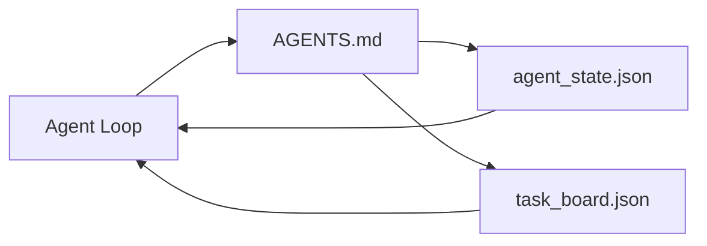

# 最小 Agent Workbench

> 最小可用的 workbench 只有三个文件：一个根 instructions router、一个 state file，以及一个 task board。其他所有东西都叠加在它们之上。如果一个 repo 承载不了这三者，就没有哪个模型能拯救它。

**Type:** Build
**Languages:** Python (stdlib)
**Prerequisites:** Phase 14 · 31（为什么强大的模型仍然失败）
**Time:** ~45 分钟

## 学习目标
- 定义构成 minimum viable workbench 的三个文件。
- 解释为什么一个简短的 root router 胜过一个冗长的单体 `AGENTS.md`。
- 构建一个 agent 每一轮都能读取、并在结束时写入的 state file。
- 构建一个不依赖 chat history、也能支撑多 session 工作的 task board。

## 问题
大多数团队会通过写一个 3000 行的 `AGENTS.md` 来搭建 workbench，然后就认为完成了。模型会加载它，忽略那些无法总结的部分，然后仍然在它一直失败的同一批 surface 上失败。

你需要的是相反的东西。一个很小的根文件，只在相关时把 agent 路由到更深层的文件。持久 state，让 agent 在行动前读取、行动后写入。一个 task board，说明当前正在做什么、什么被阻塞、下一步是什么。

三个文件。每个文件都有一个职责。每个文件都足够 machine-readable，之后可以演进成真正的系统。

## 概念


### AGENTS.md 是 router，不是 manual

好的 `AGENTS.md` 很短。它把 agent 指向：

- State file（你在哪里）。
- Task board（还剩什么）。
- 更深层的规则（在 `docs/agent-rules.md` 下）。
- Verification command（如何知道它能工作）。

更长的内容放进更深层的 docs，只在需要时加载。长 manual 会被忽略。短 router 会被遵循。

### agent_state.json 是 system of record

State 携带：active task id、被触碰的文件、已做出的假设、blockers，以及 next action。Agent 每一轮都会读取它。下一个 session 读取它，而不是重放 chat。

State 存在文件里，因为 chat history 不可靠。Sessions 会结束。Conversations 会被裁剪。文件不会。

### task_board.json 是 queue

Task board 携带每个 task，状态为 `todo | in_progress | done | blocked`。当 state 为空时，它是 agent 拉取任务的 queue；当你想知道 agent 是否走在正轨上时，它也是你读取的 queue。

Board 上的 task 有 id、goal、owner（`builder`、`reviewer` 或 `human`）和 acceptance criteria。Board 有意保持小：当它长到超过一屏时，你遇到的是 planning problem，而不是 board problem。

### 三个文件是底线，不是上限

后续课程会添加 scope contracts、feedback runners、verification gates、reviewer checklists 和 handoff packets。这里的三个文件是它们共同假设的基础。

## 构建它
`code/main.py` 会把最小 workbench 写入一个空 repo，并演示单轮 agent turn，它会：

1. 读取 `agent_state.json`。
2. 如果 state 为空，就从 `task_board.json` 拉取下一个 task。
3. 在 scope 内触碰单个文件。
4. 写回更新后的 state。

运行它：

```
python3 code/main.py
```

脚本会在自身旁边创建 `workdir/`，放置这三个文件，运行一轮，然后打印 diff。重新运行它，观察第二轮如何从第一轮停下的地方继续。

## 使用它
在生产级 agent products 中，同样的三个文件会以不同名称出现：

- **Claude Code:** 用 `AGENTS.md` 或 `CLAUDE.md` 作为 router，用 `.claude/state.json` 风格的 stores 作为 state，用 hooks 作为 board。
- **Codex / Cursor:** workspace rules 作为 router，session memory 作为 state，chat sidebar 中的 queued tasks 作为 board。
- **Custom Python agent:** 就是你刚写的这些文件。

名称会变。形状不会。

## 真实场景中的生产模式

当三种 pattern 叠加到最小 workbench 之上时，它就能经受真实 monorepos 的考验。它们彼此独立；选择你的 repo 真正需要的那些。

**带 nearest-wins precedence 的嵌套 `AGENTS.md`。** OpenAI 在它的主 repo 中发布了 88 个 `AGENTS.md` 文件，每个 subcomponent 一个。Codex、Cursor、Claude Code 和 Copilot 都会从当前工作文件一路向 repo root 遍历，并连接沿途找到的每个 `AGENTS.md`。Sub-directory 文件扩展 root file。Codex 添加了 `AGENTS.override.md`，用于替换而不是扩展；override mechanism 是 Codex-specific，做 cross-tool 工作时应避免使用。Augment Code 的测量结果才是关键：最好的 `AGENTS.md` 文件带来的质量提升，相当于从 Haiku 升级到 Opus；最差的文件会让输出比完全没有文件更差。

**即使看起来像 coverage，也要拒绝的 anti-patterns。** 相互冲突的 instructions 会悄悄把 agent 从 interactive mode 降到 greedy mode（ICLR 2026 AMBIG-SWE：48.8% → 28% resolve rate）；应给 priorities 编号，而不是把它们平铺堆叠。不可验证的 style rules（“follow the Google Python Style Guide”）如果没有 enforcement command，就会让 agent 自行想象 compliance；每条 style rule 都要配上精确的 lint command。以 style 开头而不是以 commands 开头，会埋没 verification path；commands 在前，style 在后。为人类而不是 agent 写内容会浪费 context budget；简洁是一种特性。

**Cross-tool symlinks。** 一个单一 root file 配合 symlinks（`ln -s AGENTS.md CLAUDE.md`、`ln -s AGENTS.md .github/copilot-instructions.md`、`ln -s AGENTS.md .cursorrules`），可以让每个 coding agent 都使用同一个 source of truth。Nx 的 `nx ai-setup` 会基于单一 config，在 Claude Code、Cursor、Copilot、Gemini、Codex 和 OpenCode 之间自动完成这件事。

## 交付它
`outputs/skill-minimal-workbench.md` 会为任何新 repo 生成三文件 workbench：一个按项目调优的 `AGENTS.md` router、一个包含正确 keys 的 `agent_state.json`，以及一个用当前 backlog 初始化的 `task_board.json`。

## 练习
1. 给 `agent_state.json` 添加一个 `last_run` timestamp。如果文件早于 24 小时，除非 operator 确认，否则拒绝运行。
2. 给 task board 添加一个 `priority` field，并修改 puller，使其总是选择优先级最高的 `todo`。
3. 将 `task_board.json` 迁移到 JSON Lines，让每个 task 占一行，并让 diffs 在 version control 中保持清晰。
4. 编写一个 `lint_workbench.py`，当 `AGENTS.md` 超过 80 行，或引用了不存在的文件时失败。
5. 判断这三个文件中丢失哪一个伤害最大。为你的选择辩护。

## 关键术语
| Term | What people say | What it actually means |
|------|----------------|------------------------|
| Router | `AGENTS.md` | 指向更深层 docs 和 files 的简短 root file |
| State file | "The notes" | 记录 agent 所在位置的 machine-readable 记录，每一轮都会写入 |
| Task board | "The backlog" | 带有 status、owner、acceptance 的工作 JSON queue |
| System of record | "Source of truth" | 当 chat 消失时，workbench 视为权威的文件 |

## 延伸阅读
- [agents.md — the open spec](https://agents.md/) — 被 Cursor、Codex、Claude Code、Copilot、Gemini、OpenCode 采用
- [Augment Code, A good AGENTS.md is a model upgrade. A bad one is worse than no docs at all](https://www.augmentcode.com/blog/how-to-write-good-agents-dot-md-files) — 测得的质量提升
- [Blake Crosley, AGENTS.md Patterns: What Actually Changes Agent Behavior](https://blakecrosley.com/blog/agents-md-patterns) — 什么在实证上有效，什么无效
- [Datadog Frontend, Steering AI Agents in Monorepos with AGENTS.md](https://dev.to/datadog-frontend-dev/steering-ai-agents-in-monorepos-with-agentsmd-13g0) — nested precedence 的实践
- [Nx Blog, Teach Your AI Agent How to Work in a Monorepo](https://nx.dev/blog/nx-ai-agent-skills) — 跨六种 tools 的 single-source generation
- [The Prompt Shelf, AGENTS.md Best Practices: Structure, Scope, and Real Examples](https://thepromptshelf.dev/blog/agents-md-best-practices/) — 能经受 review 的 section ordering
- [Anthropic, Claude Code subagents and session store](https://docs.anthropic.com/en/docs/agents-and-tools/claude-code/sub-agents)
- Phase 14 · 31 — 这个 minimum 所吸收的 failure modes
- Phase 14 · 34 — 本课预览的 durable state schema
