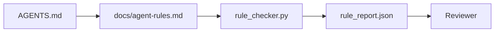

# 将 Agent 指令转化为可执行约束

> 以散文形式编写的指令只是愿望。以约束形式编写的指令才是测试。工作台会把每条规则转化为 Agent 可在运行时检查、审查者可在事后验证的内容。

**Type:** Build
**Languages:** Python (stdlib)
**Prerequisites:** Phase 14 · 32（最小工作台）
**Time:** ~50 分钟

## 学习目标

- 将路由说明与操作规则分开。
- 将启动规则、禁止操作、完成定义、不确定性处理和审批边界表达为机器可检查的约束。
- 实现一个规则检查器，根据规则集对一次运行进行评分。
- 使规则集便于 diff，让审查者可以看清发生了哪些变化。

## 问题

典型的 `AGENTS.md` 读起来像入职文档。它告诉 Agent 要“谨慎”“充分测试”以及“如果不确定就询问”。三天后，Agent 交付了一个没有测试的变更，写入了禁止目录，而且从未询问，因为它根本不知道边界在哪里。

当指令具备可操作性时，它们很强大；当指令只表达愿望时，它们很薄弱。解决办法是编写工作台能够解释、审查者能够评分的规则。

## 概念

规则应放在 `docs/agent-rules.md` 中，与简短的根路由器分离。每条规则都有名称、类别和检查方式。



### 覆盖大多数规则的五个类别

| 类别 | 规则回答的问题 | 示例 |
|----------|---------------------------|---------|
| 启动 | 工作开始前必须满足什么条件？ | “状态文件存在且为最新” |
| 禁止 | 哪些事情绝不能发生？ | “不要编辑 `scripts/release.sh`” |
| 完成定义 | 什么能够证明任务已经完成？ | “pytest 以 0 退出且验收行通过” |
| 不确定性 | Agent 不确定时该怎么做？ | “创建问题记录，而不是猜测” |
| 审批 | 哪些操作需要人工审批？ | “任何新依赖、任何生产环境写入” |

无法归入这五类之一的规则，通常应该拆成两条规则。强制进行拆分。

### 规则可由机器读取

每条规则都有一个 slug、一个类别、一行描述，以及一个用于指定 `rule_checker.py` 中函数名称的 `check` 字段。添加规则就意味着添加检查；检查器会与工作台一起扩展。

### 规则便于 diff

每条规则在单个 Markdown 文件中各占一个标题。重命名在 diff 中清晰可见。新规则放在所属类别的顶部。过时规则应直接删除，而不是注释掉，因为工作台才是事实来源，而不是记录团队上个季度感受的聊天日志。

### 规则与框架护栏

框架护栏（OpenAI Agents SDK guardrails、LangGraph interrupts）在运行时层面执行规则。本课中的规则集是一份可供人类阅读和审查的契约，这些护栏正是对该契约的实现。两者缺一不可：运行时会在执行过程中捕获违规行为，规则集则能证明运行时执行的是正确规则。

### 渐进式披露：提供地图，而不是百科全书

`AGENTS.md` 不断膨胀，是因为每次事故都会增加一条规则，却没有任何事故会移除规则。一年后，文件达到两千行，Agent 只读了第一屏，耗尽 Attention 预算，然后仅根据收到的一小部分指令采取行动。庞大的指令文件会失败，与四十页的入职文档会失败是同一个原因：读者只会匆匆浏览一次，再也不会回到真正重要的部分。

解决办法并不是缩短文件，而是对文件进行分层。根路由器应保持足够简短，以便每个会话都能完整读取，并且其中只包含指针。详细内容放在主题文件中，只有任务涉及相关主题时，Agent 才加载这些文件。给 Agent 一张地图，而不是整本百科全书，然后让它走到所需的页面。

```text
AGENTS.md                  # 路由器，少于 50 行：此 repo 是什么、去哪里查找、5 条硬性规则
docs/
  agent-rules.md           # 完整规则集（本课）
  architecture.md          # 任务涉及模块边界时加载
  testing.md               # 任务编写或运行测试时加载
  deploy.md                # 仅在发布工作中加载，并受审批规则约束
feature_list.json          # backlog（Phase 14 · 36）
```

| 层级 | 所在位置 | 读取时机 | 大小预算 |
|------|----------|-----------|-------------|
| 路由器 | `AGENTS.md` | 每个会话，始终读取 | 少于约 50 行 |
| 规则 | `docs/agent-rules.md` | 每个会话，启动时读取 | 每个类别一屏 |
| 主题文档 | `docs/<topic>.md` | 仅当任务涉及该主题时 | 按需要深入 |

有两个测试可以确保分层名副其实。第一个是可达性测试：Agent 应该最多经过两跳就能从路由器到达任何规则，因此路由器必须通过路径链接每个主题文档，而不是用散文描述它。第二个是新鲜度测试：路由器应足够简短，使审查者能在每个 PR 中重新阅读它，这是阻止它悄然膨胀回原来那本百科全书的唯一方式。无法解析的指针比缺失的规则更加糟糕，因此路由器中的失效链接本身就是一项启动检查违规。

```figure
wb-rule-checkoff
```

## 动手构建

`code/main.py` 提供：

- 一个 `agent-rules.md` 解析器，用于将规则加载到 dataclass 中。
- `rule_checker.py` 风格的检查函数，每个 `check` 引用对应一个函数。
- 一次违反两条规则的演示 Agent 运行，以及能够捕获这些违规行为的检查流程。

运行：

```bash
python3 code/main.py
```

输出：解析后的规则集、运行跟踪、每条规则的通过/失败结果，以及保存在脚本旁边的 `rule_report.json`。

## 生产环境中的实践模式

有三种模式可以区分一套能够维持一个季度的规则集和一套一周内就会腐化的规则集。

**编写时标记严重级别。** 每条规则都带有 `severity`：`block`、`warn` 或 `info`。检查器会报告全部三个级别；运行时只会因为 `block` 而拒绝继续。大多数团队一开始会夸大严重程度，随后在截止日期压力下悄悄放宽规则；在编写时进行标记，会迫使团队预先完成校准。可以将其与验证门（Phase 14 · 38）结合，由验证门把对任何 `block` 规则的覆盖签名记录到 `overrides.jsonl` 审计日志中。

**将规则过期作为强制机制。** 每条规则都带有 `expires_at` 日期（默认为编写后的 90 天）。如果一条尚未过期的规则连续 60 天没有发生任何违规，检查器就会发出警告；下一次季度审查必须决定是为保留它提供理由、将其降级为 `info`，还是删除它。Cloudflare 的生产环境 AI Code Review 数据（2026 年 4 月，30 天内覆盖 5,169 个 repo，共执行 131,246 次审查）显示，具有明确过期机制的规则集能让每个 repo 的规则数量保持在 30 条以内；没有过期机制的规则集会增长到 80 条以上，而且其中大多数规则从未触发。

**以 Markdown 为源，以 JSON 为缓存。** `agent-rules.md` 是编写源文件；`agent-rules.lock.json` 是检查器在热路径中读取的缓存。该 lock 文件由 pre-commit hook 重新生成。Markdown diff 便于审查；每次运行都无须进行 JSON 解析。其结构与 `package.json` / `package-lock.json` 和 `Cargo.toml` / `Cargo.lock` 相同。

## 投入使用

在生产环境中：

- Claude Code、Codex、Cursor 在会话启动时读取规则，并在拒绝操作时引用规则。检查器会在 CI 中重新运行这些规则，以捕获无声漂移。
- OpenAI Agents SDK guardrails 将相同的检查注册为输入和输出 guardrails。Markdown 是文档界面；SDK 是运行时界面。
- 当执行中的节点违反规则时，LangGraph interrupts 会触发。interrupt handler 读取规则、询问人类，然后恢复执行。

这套规则集可以在三者之间移植，因为它本质上只是 Markdown 加函数名。

## 交付成果

`outputs/skill-rule-set-builder.md` 会访谈项目负责人，将其现有的散文式指令归入五个类别，并生成带版本的 `agent-rules.md` 和检查器 stub。

## 练习

1. 如果你的产品确实需要第六个类别，请添加它。说明为什么它不能归入现有五类之一。
2. 扩展检查器，使规则能够携带严重级别（`block`、`warn`、`info`），并让报告据此聚合结果。
3. 将检查器接入 CI：如果最近一次 Agent 运行中有任何 `block` 级规则失败，则使构建失败。
4. 为每条规则添加一个“expiry”字段。如果一条规则连续 90 天没有检查失败，则将其列入审查范围。
5. 找一个真实的 `AGENTS.md`，将其重写为五类规则。其中有多少行具备可操作性？又有多少行只是表达愿望？

## 关键术语

| 术语 | 人们通常怎么说 | 它的实际含义 |
|------|----------------|------------------------|
| 操作规则 | “一条真正的指令” | 工作台可以在运行时检查的规则 |
| 愿望式规则 | “要谨慎” | 没有检查方式的规则；应将其删除或升级 |
| 完成定义 | “验收” | 由文件支持、能够客观证明任务完成的证据 |
| `block` 严重级别 | “硬性规则” | 违规会终止运行；没有操作人员介入就不能忽略 |
| 规则过期 | “清理过时规则” | 一条规则在 N 天内没有失败记录时，就应考虑停用 |

## 延伸阅读

- [OpenAI Agents SDK guardrails](https://openai.github.io/openai-agents-python/guardrails/)
- [LangGraph interrupts](https://langchain-ai.github.io/langgraph/how-tos/human_in_the_loop/breakpoints/)
- [Anthropic：构建有效 Agent](https://www.anthropic.com/research/building-effective-agents)
- [Rick Hightower，Agent RuleZ：确定性策略引擎](https://medium.com/@richardhightower/agent-rulez-a-deterministic-policy-engine-for-ai-coding-agents-9489e0561edf) — 生产环境中的 `block`/`warn`/`info` 严重级别
- [Cloudflare：大规模编排 AI Code Review](https://blog.cloudflare.com/ai-code-review/) — 13.1 万次审查运行与规则组合经验
- [microservices.io，GenAI 开发平台——第 1 部分：guardrails](https://microservices.io/post/architecture/2026/03/09/genai-development-platform-part-1-development-guardrails.html) — 规则与 CI 之间的纵深防御
- [类型检查合规性：确定性 Guardrails（arXiv 2604.01483）](https://arxiv.org/pdf/2604.01483) — 使用 Lean 4 展示“规则即检查”的能力上限
- [logi-cmd/agent-guardrails](https://github.com/logi-cmd/agent-guardrails) — merge gate 实现：范围、变异测试、违规预算
- Phase 14 · 32 — 此规则集接入的最小工作台
- Phase 14 · 38 — 使用规则报告的验证门
- Phase 14 · 39 — 对规则合规性进行评分的审查 Agent
