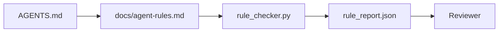

# Agent 指令作为可执行约束

> 用散文写成的指令是愿望。用约束写成的指令是测试。工作台会把每条规则变成 Agent 可在运行时检查、评审者可在事后验证的东西。

**类型：** 构建
**语言：** Python (stdlib)
**前置要求：** Phase 14 · 32 (Minimal Workbench)
**时间：** 约 50 分钟

## 学习目标

- 将路由说明与操作规则分离。
- 将启动规则、禁止操作、完成定义、不确定性处理和审批边界表达为机器可检查的约束。
- 实现一个规则检查器，用规则集对一次运行进行评分。
- 让规则集便于 diff，以便评审能看清发生了什么变化。

## 问题

典型的 `AGENTS.md` 读起来像入职文档。它告诉 Agent 要“谨慎”和“充分测试”，以及“不确定就询问”。三天后，Agent 交付了一个没有测试的变更，写入了被禁止的目录，而且从未询问，因为它根本不知道边界在哪里。

当指令是可操作的，它们就很强；当指令只是愿景式的，它们就很弱。修复方法是编写工作台可以解释、评审者可以评分的规则。

## 概念

规则应该放在 `docs/agent-rules.md` 中，远离简短的根路由器。每条规则都有名称、类别和检查项。



### 覆盖大多数规则的五个类别

| 类别 | 规则回答的问题 | 示例 |
|----------|---------------------------|---------|
| Startup | 工作开始前必须满足什么？ | “state file exists and is fresh” |
| Forbidden | 什么事情绝对不能发生？ | “do not edit `scripts/release.sh`” |
| Definition of done | 什么能证明任务已完成？ | “pytest exits 0 and acceptance line passes” |
| Uncertainty | Agent 不确定时该做什么？ | “open a question note instead of guessing” |
| Approval | 什么需要人工审批？ | “any new dependency, any prod write” |

无法归入这五类之一的规则，通常应该拆成两条规则。强制拆分。

### 规则是机器可读的

每条规则都有一个 slug、一个类别、一行描述，以及一个 `check` 字段，指向 `rule_checker.py` 中的某个函数。添加规则意味着添加检查；检查器会随着工作台一起增长。

### 规则便于 diff

规则在一个 Markdown 文件中，每条规则占一个 heading。重命名在 diff 中可见。新规则放在其类别的顶部。过时规则应删除，而不是注释掉，因为工作台才是真相来源，不是团队上个季度感受如何的聊天记录。

### 规则与框架 guardrails

框架 guardrails（OpenAI Agents SDK guardrails、LangGraph interrupts）在运行时层面执行规则。本课中的规则集是这些 guardrails 所实现的人类可读、可评审的契约。两者都需要：运行时会在一个 turn 中捕获违规，而规则集会证明运行时正在做正确的事。

### Progressive disclosure：地图，而不是百科全书

`AGENTS.md` 会不断变长，是因为每次 incident 都会新增一条规则，却很少有 incident 会删除一条规则。一年之后，这个文件可能有两千行；agent 读完第一屏就耗尽注意力预算，只能执行其中一小部分。巨大的 instruction 文件失败的原因，与四十页 onboarding 文档失败的原因相同：读者扫一遍，然后再也不会回到真正重要的那一页。

修复方式不是写一个更短的文件，而是写一个分层的文件。根 router 要小到每个 session 都能读完，并且只保存指针。深度内容放在 topic files 里，只有当任务触及对应主题时 agent 才加载。给 agent 一张地图，而不是整本百科全书，让它自己走到需要的页面。

```text
AGENTS.md                  # router，少于 50 行：这个 repo 是什么、去哪里看、5 条硬规则
docs/
  agent-rules.md           # 完整规则集（本课）
  architecture.md          # 任务触及 module boundaries 时加载
  testing.md               # 任务编写或运行 tests 时加载
  deploy.md                # 只在 release 工作中加载，并受 approval rule 保护
feature_list.json          # backlog（Phase 14 · 36）
```

| Tier | 存放位置 | 读取时机 | 大小预算 |
|------|----------|----------|----------|
| Router | `AGENTS.md` | 每个 session，始终读取 | 少于约 50 行 |
| Rules | `docs/agent-rules.md` | 每个 session 启动时 | 每个 category 一屏 |
| Topic docs | `docs/<topic>.md` | 只有任务触及该主题时 | 需要多深就多深 |

两个测试能让分层保持诚实。第一个是 reachability test：agent 应该能从 router 出发，最多两跳抵达任何规则，所以 router 必须按 path 链接每个 topic doc，而不是用 prose 模糊描述。第二个是 freshness test：router 足够短，reviewer 会在每个 PR 里重读它，这是防止它悄悄长回百科全书的唯一办法。指针失效比缺一条规则更糟，所以 router 中的 broken link 本身就是 startup-check violation。

## 构建它

`code/main.py` 提供：

- `agent-rules.md` parser，将规则加载到 dataclass 中。
- `rule_checker.py` 风格的检查函数，每个 `check` 引用对应一个。
- 一个 demo Agent 运行，它违反两条规则，以及一次能捕获这些违规的检查通过。

运行它：

```
python3 code/main.py
```

输出：解析后的规则集、运行 trace、每条规则的 pass/fail，以及保存在脚本旁边的 `rule_report.json`。

## 生产中的模式

有三种模式能把一个能持续一个季度的规则集，与一个一周内就衰退的规则集区分开。

**编写时标注严重性。** 每条规则都带有 `severity`：`block`、`warn` 或 `info`。检查器会报告三者；运行时只会在 `block` 上拒绝。大多数团队早期会高估严重性，然后在截止日期压力下悄悄削弱它；在编写时标注会迫使团队提前校准。与 verification gate（Phase 14 · 38）配合使用，它会把任何对 `block` 规则的 override 签入 `overrides.jsonl` audit log。

**规则过期作为强制机制。** 每条规则都带有 `expires_at` 日期（默认是编写后 90 天）。当某条未过期规则连续 60 天没有任何违规时，检查器会发出 warning；下一次季度评审要么说明保留它的理由，要么将其削弱为 `info`，要么删除它。Cloudflare 的生产 AI Code Review 数据（2026 年 4 月，30 天内跨 5,169 个 repo 运行 131,246 次 review）显示，带有明确过期机制的规则集能保持在每个 repo 30 条规则以内；没有过期机制的规则集会增长到 80+，且大多数从不触发。

**Markdown 作为 source，JSON 作为 cache。** `agent-rules.md` 是作者维护的文件；`agent-rules.lock.json` 是检查器在 hot path 中读取的 cache。lock 由 pre-commit hook 重新生成。Markdown diff 便于评审；JSON parsing 不会进入每个 turn。形态与 `package.json` / `package-lock.json` 和 `Cargo.toml` / `Cargo.lock` 相同。

## 使用它

在生产中：

- Claude Code、Codex、Cursor 在 session 开始时读取规则，并在拒绝操作时引用它们。检查器会在 CI 中重新运行这些规则，以捕获无声漂移。
- OpenAI Agents SDK guardrails 将同样的检查注册为 input 和 output guardrails。Markdown 是 docs 表面；SDK 是运行时表面。
- LangGraph interrupts 会在正在执行的 node 违反规则时触发。interrupt handler 读取规则，询问人类，然后恢复。

这个规则集可在三者之间移植，因为它只是 Markdown 加函数名。

## 交付它

`outputs/skill-rule-set-builder.md` 会访谈项目 owner，将他们现有的散文式指令分类到五个类别中，并输出一个带版本的 `agent-rules.md` 加一个检查器 stub。

## 练习

1. 如果你的产品确实需要第六个类别，就添加它。说明为什么它不能归并到这五类之一。
2. 扩展检查器，让规则可以携带严重性（`block`、`warn`、`info`），并让报告按严重性聚合。
3. 将检查器接入 CI：如果最新 Agent 运行中有 block-severity 规则失败，则让 build 失败。
4. 为每条规则添加一个“expiry”字段。90 天内没有 check fail 后，该规则进入评审。
5. 找一个真实的 `AGENTS.md`，并把它重写为五类别规则。其中有多少行是可操作的？有多少行是愿景式的？

## 关键术语

| 术语 | 人们的说法 | 它实际意味着什么 |
|------|----------------|------------------------|
| Operational rule | “一条真正的指令” | 工作台可在运行时检查的规则 |
| Aspirational rule | “谨慎一点” | 没有检查的规则；要么删除，要么升级 |
| Definition of done | “Acceptance” | 证明任务已完成的客观、基于文件的证据 |
| Block severity | “硬规则” | 违规会中止运行；没有 operator 不能静默处理 |
| Rule expiry | “过时规则清理” | 在 N 天内没有失败的规则可以考虑退役 |

## 延伸阅读

- [OpenAI Agents SDK guardrails](https://platform.openai.com/docs/guides/agents-sdk/guardrails)
- [LangGraph interrupts](https://langchain-ai.github.io/langgraph/how-tos/human_in_the_loop/breakpoints/)
- [Anthropic, Building Effective Agents](https://www.anthropic.com/research/building-effective-agents)
- [Rick Hightower, Agent RuleZ: A Deterministic Policy Engine](https://medium.com/@richardhightower/agent-rulez-a-deterministic-policy-engine-for-ai-coding-agents-9489e0561edf) — 生产中的 block/warn/info 严重性
- [Cloudflare, Orchestrating AI Code Review at Scale](https://blog.cloudflare.com/ai-code-review/) — 131k 次 review 运行，规则组合经验
- [microservices.io, GenAI development platform — part 1: guardrails](https://microservices.io/post/architecture/2026/03/09/genai-development-platform-part-1-development-guardrails.html) — 规则与 CI 之间的 defense in depth
- [Type-Checked Compliance: Deterministic Guardrails (arXiv 2604.01483)](https://arxiv.org/pdf/2604.01483) — Lean 4 作为 rule-as-check 的上限
- [logi-cmd/agent-guardrails](https://github.com/logi-cmd/agent-guardrails) — merge-gate 实现：scope、mutation testing、violation budgets
- Phase 14 · 32 — 该规则集所接入的 minimal workbench
- Phase 14 · 38 — 消费规则报告的 verification gate
- Phase 14 · 39 — 对规则合规性评分的 reviewer agent
