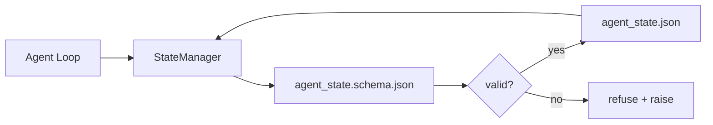

# Repo Memory 和 Durable State

> Chat history 是易失的。repo 是持久的。workbench 将 agent state 存储在带版本的文件中，这样下一个 session、下一个 agent、下一个 reviewer 都能从同一个 source of truth 读取。

**Type:** Build
**Languages:** Python (stdlib + `jsonschema` optional)
**Prerequisites:** Phase 14 · 32 (Minimal Workbench)
**Time:** ~60 minutes

## 学习目标
- 定义什么属于 repo memory，什么属于 chat history。
- 为 `agent_state.json` 和 `task_board.json` 编写 JSON Schemas。
- 构建一个 state manager，用于原子化地加载、验证、变更和持久化 state。
- 使用 schema 在坏写入破坏 workbench 之前拒绝它们。

## 问题
agent 完成了一个 session。chat 关闭了。下一个 session 打开并询问从哪里开始。model 说“让我检查文件”，读取过时的 notes，然后重复已经完成的工作。更糟的是，它会重写一个已完成的文件，因为没人告诉它这个文件已经完成。

workbench 的修复方式是 repo memory：state 存在 repo 中的 JSON 文件里，按 schema 写入，以原子方式持久化，并且在 code review 中对 diff 友好。Chat 是临时 feed；repo 是 system of record。

## 概念


### 什么属于 repo memory

| 属于 | 不属于 |
|---------|-----------------|
| Active task id | 原始 chat transcripts |
| 本 session 触碰过的文件 | Token-level reasoning traces |
| agent 做出的假设 | "The user seemed frustrated" |
| 未解决的 blockers | Sampled completions |
| 下一步 action | Vendor-specific model ids |

判断标准是持久性：三个月后在 CI 重新运行时，这还有用吗？如果有，放进 repo。如果没有，放进 telemetry。

### Schema-first state

JSON Schema 是契约。没有它，每个 agent 都会发明新字段，每个 reviewer 都要学习一种新形状，每个 CI script 都必须对过去的版本做 special-case。有了它，坏写入会被拒绝。

schema 覆盖：

- 必需 keys。
- 允许的 `status` values。
- 禁止的 values（例如 arrays 的 `null`）。
- Pattern constraints（task ids 匹配 `T-\d{3,}`）。
- 用于 migrations 的 version field。

### Atomic writes

State 写入需要能承受部分失败：写入 tempfile，fsync，然后 rename 覆盖 target。state file 是 source of truth；写到一半的 state file 比没有文件更糟。

### Migrations

当 schema 变化时，在 schema bump 旁边交付一个 migration script。state file 带有 `schema_version` field；manager 会拒绝加载它无法迁移的版本文件。

## 构建它
`code/main.py` 实现：

- `agent_state.schema.json` 和 `task_board.schema.json`。
- 一个仅使用 stdlib 的 validator（JSON Schema 子集：required、type、enum、pattern、items）。
- 带有 atomic temp-and-rename 写入的 `StateManager.load`、`StateManager.update`、`StateManager.commit`。
- 一个 demo：变更 state、持久化、重新加载，并证明 round-trip。

运行它：

```
python3 code/main.py
```

script 会写入 `workdir/agent_state.json` 和 `workdir/task_board.json`，跨两个 turns 变更它们，并在每一步打印经过验证的 state。

## 真实场景中的生产模式

四种模式能把本课的 minimum 变成 multi-agent monorepo 可承受的东西。

**Atomic temp-and-rename 不是可选项。** 2026 年 3 月的一份 Hive project bug report 清晰记录了这种 failure mode：`state.json` 通过 `write_text()` 写入，并且 exceptions 被捕获后静默忽略。部分写入让 sessions 在没有信号的情况下基于损坏 state 恢复。修复永远是：在与 target 相同的目录中使用 `tempfile.mkstemp`，写入，`fsync`，`os.replace`（在 POSIX 和 Windows 上都是 atomic rename）。本课的 `atomic_write` 正是这样做的。

**每个非幂等 tool call 都要有 idempotency keys。** 如果 agent 在调用 tool 之后、checkpoint 结果之前崩溃，恢复过程会重试该 tool call。对 reads 安全；对 emails、DB inserts、file uploads 危险。模式是：在执行前将每个 tool call ID 记录到 `pending_calls.jsonl`。重试时检查该 ID；如果存在，跳过调用并使用 cached result。Anthropic 和 LangChain 都在 2026 guidance 中指出了这一点；LangGraph 的 checkpointer 出于同样原因持久化 pending writes。

**将大型 artifacts 与 state 分离。** 不要把 CSVs、长 transcripts 或 generated files 存进 `agent_state.json`。将 artifact 保存为单独文件（或上传到 object storage），state 中只保留路径。Checkpoints 保持小而快；artifacts 独立增长。

**Event sourcing 用于 audit，snapshots 用于 resume。** 每次 mutation 都 append 到 event log（`state.events.jsonl`）；定期 snapshot 到 `state.json`。Resume 读取 snapshot，然后 replay snapshot timestamp 之后的所有 events。这会消耗更多磁盘，但允许你逐字 replay agent decisions，这对调试 long-horizon runs 至关重要。Postgres 内部用于 WAL 的也是同一种形状。

**Schema migrations，否则拒绝加载。** `schema_version` integer 是契约。当 manager 加载未知版本文件时，它会拒绝读取。在 schema bump 旁边交付 migration script；`tools/migrate_state.py` 在每次 startup 时幂等运行。

## 使用它
在 production 中：

- **LangGraph checkpointers。** 同一个想法，不同的 storage。checkpointer 将 graph state 持久化到 SQLite、Postgres 或 custom backend。本课讲的 schema 是当 checkpointer 失效、你需要手工读取 state 时会用到的东西。
- **Letta memory blocks。** 带 structured schemas 的 persistent blocks（Phase 14 · 08）。同样的纪律，作用域是 long-running personas。
- **OpenAI Agents SDK session store。** Pluggable backends，schema-aware。本课中的 state file 就是 local-file backend。

## 交付它
`outputs/skill-state-schema.md` 会生成一对 project-specific JSON Schema（state + board）、一个连接到 atomic writes 的 Python `StateManager`，以及一个 migration scaffold，确保下一次 schema bump 不会破坏 workbench。

## 练习
1. 添加一个 `last_human_touch` timestamp。拒绝 human edit 后五秒内的任何 agent write。
2. 扩展 validator 以支持 `oneOf`，这样 task 可以是 build task，也可以是 review task，并且两者拥有不同的 required fields。
3. 添加 `schema_version` field，并编写从 v1 到 v2 的 migration（将 `blockers` 重命名为 `risks`）。
4. 将 storage backend 从 local file 移到 SQLite。保持 `StateManager` API 不变。
5. 让两个 agents 以 50 ms write race 同时写入同一个 state file。会出什么问题？atomic rename 如何帮你？

## 关键术语
| Term | What people say | What it actually means |
|------|----------------|------------------------|
| Repo memory | "Notes file" | 按 schema 存储在 repo 的 tracked files 中的 state |
| Schema-first | "Validate inputs" | 先定义契约再写 writer，拒绝漂移 |
| Atomic write | "Just rename" | 写入 temp，fsync，rename，因此 partial failures 无法破坏 |
| Migration | "Schema bump" | 将 vN state 转换为 v(N+1) state 的 script |
| System of record | "Source of truth" | workbench 视为权威的 artifact |

## 延伸阅读
- [JSON Schema specification](https://json-schema.org/specification.html)
- [LangGraph checkpointers](https://langchain-ai.github.io/langgraph/concepts/persistence/)
- [Letta memory blocks](https://docs.letta.com/concepts/memory)
- [Fast.io, AI Agent State Checkpointing: A Practical Guide](https://fast.io/resources/ai-agent-state-checkpointing/) — schema-first checkpointing 与幂等性
- [Fast.io, AI Agent Workflow State Persistence: Best Practices 2026](https://fast.io/resources/ai-agent-workflow-state-persistence/) — concurrency control、TTL、event sourcing
- [Hive Issue #6263 — non-atomic state.json writes silently ignored](https://github.com/aden-hive/hive/issues/6263) — real project 中的 failure mode
- [eunomia, Checkpoint/Restore Systems: Evolution, Techniques, Applications](https://eunomia.dev/blog/2025/05/11/checkpointrestore-systems-evolution-techniques-and-applications-in-ai-agents/) — 来自 OS 历史、应用于 agents 的 CR primitives
- [Indium, 7 State Persistence Strategies for Long-Running AI Agents in 2026](https://www.indium.tech/blog/7-state-persistence-strategies-ai-agents-2026/)
- [Microsoft Agent Framework, Compaction](https://learn.microsoft.com/en-us/agent-framework/agents/conversations/compaction) — vendor checkpoint manager
- Phase 14 · 08 — memory blocks and sleep-time compute
- Phase 14 · 32 — 本课为其 schema 化的 three-file minimum
- Phase 14 · 40 — 从同一个 schema 读取的 handoff packets
