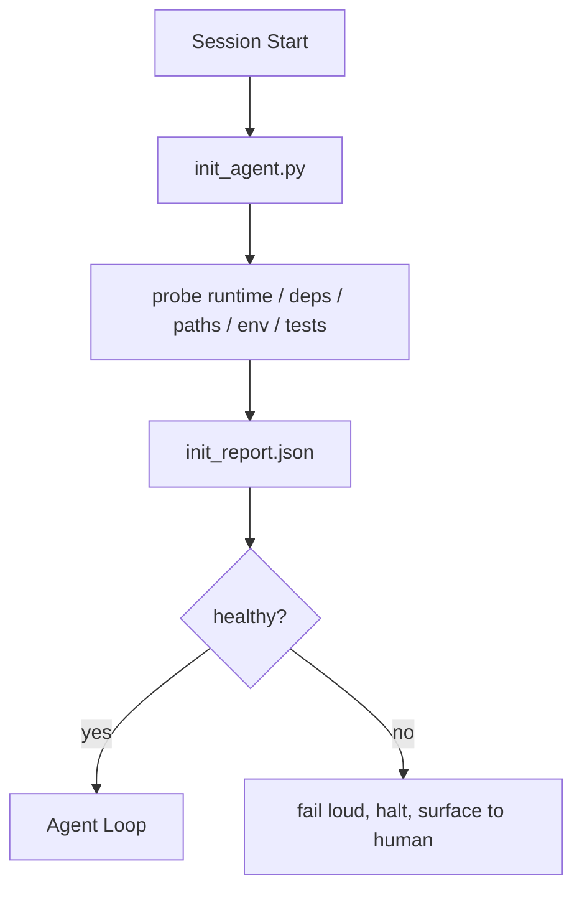

# Agent 的初始化脚本

> 每个冷启动的 session 都要付出代价。Agent 会读取同样的文件，重试同样的探查，并重新发现同样的路径。init script 只付一次代价，并把答案写入 state。

**Type:** Build
**Languages:** Python (stdlib)
**先修要求：** Phase 14 · 32 (Minimal Workbench), Phase 14 · 34 (Repo Memory)
**Time:** ~45 分钟

## 学习目标
- 识别 Agent 不应该在每个 session 中重复完成的工作。
- 构建一个确定性的 init script，用来探查 runtime、dependencies 和 repo health。
- 持久化探查结果，让 Agent 读取它，而不是重新运行检查。
- 当初始化失败时，要响亮、快速地失败，并提供唯一的排查位置。

## 问题
打开一个 session。Agent 猜测 Python version。猜测 test command。为了找到 entry point，列出 repo root 五次。尝试 import 一个尚未安装的 package。询问用户 config file 在哪里。等到它真正开始编辑时，已经有一万 Token 花在了本应由一个脚本完成的 setup work 上。

修复方式是使用一个 initialization script：它在 Agent 做任何事之前运行，并写入一个供 Agent 启动时读取的 `init_report.json`。

## 概念


### init script 探查什么

| Probe | 为什么重要 |
|-------|------------|
| Runtime versions | 错误的 Python 或 Node version 意味着悄无声息的错误版本 bug |
| Dependency availability | 缺失的 package 如果到后面才发现，成本会是现在捕获它的十倍 |
| Test command | Agent 必须知道如何 verify；如果 command 缺失，workbench 就坏了 |
| Repo paths | Hard-coded paths 会漂移；一次性解析并固定下来 |
| Environment variables | 缺失 `OPENAI_API_KEY` 是一个 failure surface，而不是 runtime mystery |
| State + board freshness | 崩溃 session 留下的陈旧 state 是一个 footgun |
| Last-known-good commit | 作为 session 结束时 handoff diff 的锚点 |

### 快速显式失败，并集中在一处失败

Probe 失败意味着停止并呈现给 human。不要说“Agent 会自己搞清楚”。init 的全部意义就是在 workbench 损坏时拒绝启动。

### Idempotent

连续运行两次。第二次除了刷新 timestamp 之外应该是 no-op。Idempotency 让你可以把脚本接入 CI、hooks 或 pre-task slash command。

### Init versus startup rules

Rules (Phase 14 · 33) 描述行动前必须满足什么。Init 是建立这些 rules 可被检查的脚本。没有 init 的 rules 会变成“要小心”。没有 rules 的 init 会变成精致的失败。

```figure
wb-init-probes
```

## 构建它
`code/main.py` 实现了 `init_agent.py`：

- 五个 probes：Python version、通过 `importlib.util.find_spec` 列出的 dependencies、test command resolvability、required env vars、state file freshness。
- 每个 probe 返回 `(name, status, detail)`。
- 脚本写入包含完整 probe set 的 `init_report.json`，并在任何 block-severity probe 失败时以非零状态退出。

运行它：

```
python3 code/main.py
```

脚本会打印 probes 表，写入 `init_report.json`，在 happy path 上以零状态退出，或在失败时以非零状态退出并列出 failed probes。

## 真实场景中的生产模式

三种模式能把有用的 init script 和仪式感区分开。

**Last-known-good commit anchoring.** 将当前 commit 与上次成功 merge 时写入的 `LKG` file 进行探查。如果 diff 超过预算（默认 50 个文件），拒绝启动，并要求 human 确认新的 baseline。这正是 Cloudflare 的 AI Code Review 用来限定 reviewer agents 作用域的方式：每个 review session 都锚定到同一个 last-known-good，绝不会跨 sessions 叠加 drift。

**Lock files with TTL.** 在第一次成功的 probe pass 之后写入 `prereqs.lock`。后续运行会在 N 小时内信任该 lock（默认 24h），并跳过昂贵的 probes。init script 会先读取 lock；如果它仍然 fresh，且 dependency manifest hash 匹配，就 short-circuit。这与 Docker 用于 layer caches 的模式相同：idempotent probe + content hash = skip。

**No network, no LLM, no surprises in the hot path.** Init probes 是确定性的 plumbing。调用 LLM 来 classify failure，或访问 external service 来检查 license 的 probe 不是 probe；它是 workflow。如果某个 probe 在 dry run 中超过三秒，就把它视为 workbench smell，并将它移出 init 或缓存其结果。

## 使用它
在 production 中：

- **Claude Code hooks.** `pre-task` hook 调用 init script，并在失败时拒绝启动 Agent。
- **GitHub Actions.** `setup-agent` job 运行 init script；agent job 依赖它。
- **Docker entrypoint.** Agent container 在 exec agent runtime 之前运行 init script；失败时呈现 logs。

init script 是可移植的，因为它不调用任何特定 framework。Bash、Make 或 tasks file 都可以包装它。

## 交付它
`outputs/skill-init-script.md` 会访谈 project，将其 setup work 分类为 probes，并产出项目特定的 `init_agent.py`，以及一个在任何 Agent step 之前运行它的 CI workflow。

## 练习
1. 添加一个 probe，用来 diff 当前 commit 和 last-known-good commit；如果变更超过 50 个文件，就拒绝启动。
2. 将脚本接入，让它写入 `prereqs.lock` file，并在 lock 超过七天时拒绝启动。
3. 添加一个 `--fix` flag，自动安装缺失的 dev dependencies，但未经批准绝不修改 runtime dependencies。
4. 将 probes 从 hardcoded functions 移到 YAML registry。为这个 trade-off 辩护。
5. 为每个 probe 添加 timing budget。运行超过三秒的 probe 是一种 workbench smell。

## 关键术语
| Term | 人们会怎么说 | 它实际意味着什么 |
|------|--------------|------------------|
| Probe | “一个 check” | 返回 `(name, status, detail)` 的确定性函数 |
| Init report | “Setup output” | 与 state 放在一起、写有 probe results 的 JSON |
| Idempotent | “可以安全重新运行” | 连续两次运行会生成除 timestamp 外完全相同的 reports |
| Fail loud | “不要吞掉” | 停止并呈现给 human；没有 silent fallback |
| Setup tax | “Bootstrap cost” | Agent 每个 session 为重新发现显而易见信息所花费的 Token |

## 延伸阅读
- [Anthropic, Effective harnesses for long-running agents](https://www.anthropic.com/engineering/effective-harnesses-for-long-running-agents)
- [GitHub Actions, composite actions for setup](https://docs.github.com/en/actions/sharing-automations/creating-actions/creating-a-composite-action)
- [microservices.io, GenAI 开发平台：guardrails](https://microservices.io/post/architecture/2026/03/09/genai-development-platform-part-1-development-guardrails.html) — pre-commit + CI 检查作为 init
- [Augment Code, How to Build Your AGENTS.md (2026)](https://www.augmentcode.com/guides/how-to-build-agents-md) — init expectations
- [Codex Blog, Codex CLI Context Compaction](https://codex.danielvaughan.com/2026/03/31/codex-cli-context-compaction-architecture/) — session start as compaction-aware init
- Phase 14 · 33 — 此脚本启用的 rule set
- Phase 14 · 34 — 此脚本播种的 state file
- Phase 14 · 38 — init script 供给的 verification gate
- Phase 14 · 40 — 消费 init report 的 last-known-good 的 handoff
