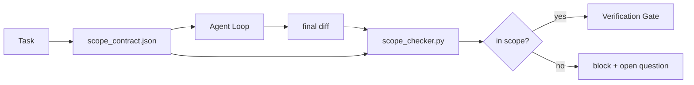

# Scope Contract 与任务边界

> model 不知道工作在哪里结束。scope contract 是一个 per-task file，用来说明工作从哪里开始、在哪里结束，以及一旦越界该如何 rollback。这个 contract 把“stay in scope”从愿望变成检查。

**类型:** Build
**语言:** Python (stdlib)
**先修:** Phase 14 · 32 (Minimal Workbench), Phase 14 · 33 (Rules as Constraints)
**时间:** ~50 分钟

## 学习目标

- 编写一个 scope contract，让 agent 在任务开始时读取，并让 verifier 在任务结束时读取。
- 指定 allowed files、forbidden files、acceptance criteria、rollback plan 和 approval boundaries。
- 实现一个 scope checker，将 diff 与 contract 比较并标记 violation。
- 让 scope creep 可见、自动化且可 review。

## 问题

Agent 会 creep。任务是“修复 login bug”。diff 触碰了 login route、email helper、database driver、README 和 release script。每一次触碰在当时都有一个看似合理的理由。合在一起，它们已经变成了与原先 review 的内容不同的 change。

Scope creep 是 agent 工作中最缺乏监控的 failure mode，因为 agent 会真诚地叙述每一步。修复办法不是更严格的 prompt。修复办法是在磁盘上放一个 contract，说明承诺了什么，并用一个 check 将结果与承诺对比。

## 概念



### scope contract 中包含什么

| Field | Purpose |
|-------|---------|
| `task_id` | 链接到 board 上的 task |
| `goal` | reviewer 可以验证的一句话 |
| `allowed_files` | agent 可以写入的 globs |
| `forbidden_files` | agent 即使意外也不得触碰的 globs |
| `acceptance_criteria` | 证明完成的 test commands 或 assertion lines |
| `rollback_plan` | 如果需要 halt，operator 可以执行的一段说明 |
| `approvals_required` | scope 外需要明确 human sign-off 的 actions |

没有 `forbidden_files` 的 contract 是不完整的。负空间是 contract 的一半。

### 使用 globs，而不是 raw paths

真实 repo 会移动文件。把 contract 固定到 globs（`app/**/*.py`, `tests/test_signup*.py`），这样 session 之间发生 refactor 时不会让 contract 失效。

### Rollback 是 scope 的一部分

列出如何 rollback 会迫使 contract author 思考可能出什么问题。无法 rollback 的 contract 是不应被批准的 contract。

### Scope check 是 diff check

agent 写出 diff。checker 读取 diff、allowed globs、forbidden globs，以及任何已运行 acceptance commands 的列表。每个 violation 都是一个带 tag 的 finding，verification gate 可以拒绝它。

### Scope 的两种高度：feature list 和 task contract

scope contract 约束的是一个 task。它不约束整个 project。agent 可以在修复登录问题时完美留在 contract 内，但下一轮又决定 project 还需要 settings page、dark mode toggle，以及 router 重写。contract 从来没有被问过“这个 project 的范围是什么”，它只回答“这个 task 的哪些文件在范围内”。

第二个高度需要自己的 primitive：一个 session 启动时读取的 `feature_list.json`。它是 project backlog 的机器可读、有序文件。agent 精确选择一个 `status` 为 `todo` 的 feature，把它的 `id` 写入 active scope contract，并被禁止在同一个 session 中启动第二个 feature。“一次只做一个 feature” 不再是 prompt 里 agent 可以绕过去的一句话，而是一个写在磁盘上的值，也是 gate 可以执行的检查。

```json
{
  "project": "knowledge-base",
  "active": "import-pdf",
  "features": [
    { "id": "import-pdf", "status": "in_progress", "goal": "import a PDF into the library", "done_when": "pytest tests/test_import.py && a sample PDF appears in the library view" },
    { "id": "full-text-search", "status": "todo", "goal": "search document text and rank hits", "done_when": "query returns ranked results with snippets" },
    { "id": "cite-answers", "status": "todo", "goal": "answers carry source citations", "done_when": "every answer renders at least one clickable citation" }
  ]
}
```

| Field | Purpose |
|-------|---------|
| `active` | 当前 session 唯一允许触及的 feature；为空时表示选择一个并设置它 |
| `features[].id` | scope contract 的 `task_id` 指向的稳定 slug |
| `features[].status` | `todo`、`in_progress`、`done`、`blocked`；同一时间最多一个 `in_progress` |
| `features[].goal` | reviewer 能验证的一句话 |
| `features[].done_when` | 将 `in_progress` 翻转为 `done` 的 acceptance line |

两条规则让这个 list 成为承重结构，而不是装饰。第一，`at most one in_progress` 这个 invariant 本身就是 startup check（Phase 14 · 33）：如果 list 里出现两个，session 会拒绝启动，直到 human 解决。第二，feature list 是文件，不是 chat message，因为 chat 会滚出 context，而文件会跨 sessions、跨 agents 持久存在。handoff（Phase 14 · 40）会把完成的 feature status 写回 `done`，所以下一个 session 打开时看到的是准确 board，而不是重新推导剩下什么。

contract 与 list 通过 least privilege 组合，方式与下文描述的 merge 相同：task contract 的 `allowed_files` 必须落在 active feature 所触及的范围之内，不能越界。

## 构建它

`code/main.py` 实现：

- `scope_contract.json` schema（JSON Schema 的子集，glob arrays）。
- 一个 diff parser，将 touched files 列表和 run commands 列表转换为 `RunSummary`。
- 一个 `scope_check`，根据 contract 返回 `(violations, in_scope, off_scope)`。
- 两个 demo runs：一个保持 in scope，另一个发生 creep。checker 会用精确文件和原因标记 creep。

运行：

```
python3 code/main.py
```

输出：contract、两个 runs、每个 run 的 verdict，以及保存的 `scope_report.json`。

## 真实生产中的 patterns

一位运行 “specsmaxxing”（在调用 agent 前使用 YAML scope contracts）的 practitioner 报告说，在没有更换 agent 的情况下，rabbit-hole rate 在三周内从 52% 降到 21%。起作用的是 contract，不是 model。有三个 patterns 让收益持续。

**Violation budgets，而不是 binary failures。** `agent-guardrails`（Claude Code、Cursor、Windsurf、Codex 经由 MCP 使用的 OSS merge gate）为每个 task 提供 `violationBudget`：预算内的轻微 scope slips 会作为 warnings 暴露；只有超过预算时，merge gate 才会拒绝。搭配 `violationSeverity: "error" | "warning"` 使用。这个 budget 决定了 gate 是会被采用，还是会被讨厌它的团队禁用。

**按 path family 做 severity asymmetry。** 对 `docs/**` 的 off-scope writes 通常是 `warn`；对 `scripts/**`、`migrations/**`、`config/prod/**` 的 off-scope writes 总是 `block`。这种 asymmetry 必须存在于 contract 中，而不是 runtime 中，因为它是 project-specific 的，并且每个 task 都会变化。

**Time 和 network budgets 与 file budgets 并列。** `time_budget_minutes` field 约束 wall clock；runtime 在没有 re-approval 的情况下拒绝继续超过它。hostnames 上的 `network_egress` allowlist 防止 agent 悄悄访问不属于任务的 external API。这些也是 scope 维度；file globs 是必要的，但不充分。

**Multi-contract merge semantics（least privilege）。** 当两个 scope contracts 同时适用时（例如 project-wide contract 加 task-specific contract），merge 规则是：**intersect** `allowed_files`（两个 contract 都必须允许该 path），**union** `forbidden_files`（任意一个可以禁止），`time_budget_minutes` 取最严格值（min），`approvals_required` 累积。`network_egress` 中，`None` 表示不 enforcement，`[]` 表示 deny-all，`[...]` 表示 allowlist；merge 时，`None` 让位于另一侧，两个列表取交集，deny-all 保持 deny-all。把这一点写进 contract schema，这样 merge 就是机械且可 review 的。

## 使用它

Production patterns：

- **Claude Code slash commands.** `/scope` command 写入 contract，并将其固定为 session context。Subagents 在行动前读取 contract。
- **GitHub PRs.** 将 contract 作为 JSON file 推送到 PR body 中，或作为 checked-in artifact。CI 会针对 merge diff 运行 scope checker。
- **LangGraph interrupts.** scope violation 触发 interrupt；handler 询问 human 是需要扩大 contract，还是 agent 需要后退。

contract 随 task 流转。当 task 关闭时，contract 会归档到 `outputs/scope/closed/`。

## 交付它

`outputs/skill-scope-contract.md` 会为 task description 生成一个 scope contract，以及一个能感知 glob、并在 CI 中针对每个 agent diff 运行的 checker。

## 练习

1. 添加一个 `network_egress` field，列出允许的 external hosts。拒绝触碰其他 hosts 的 runs。
2. 扩展 checker，让它对 `docs/**` 软失败、对 `scripts/**` 硬失败。说明这种 asymmetry 的理由。
3. 使用 static rule set（不使用 LLM）让 contract 从 `goal` field 推导 `allowed_files`。第一个 edge case 会出什么问题？
4. 添加 `time_budget_minutes`，并在 wall clock 超过它后拒绝继续。
5. 对同一个 diff 运行两个 contracts。当两者都适用时，正确的 merge semantics 是什么？

## 关键术语

| Term | What people say | What it actually means |
|------|----------------|------------------------|
| Scope contract | “任务 brief” | per-task JSON，列出 allowed/forbidden files、acceptance、rollback |
| Scope creep | “它还 touched 了...” | 同一 task 中发生了 contract 外的文件变更 |
| Rollback plan | “我们可以 revert” | 用于 halt 的一段 operator runbook |
| Approval boundary | “需要 sign-off” | contract 中列出的、需要明确 human approval 的 action |
| Diff check | “Path audit” | 将 touched files 与 contract globs 比较 |

## 延伸阅读

- [LangGraph human-in-the-loop 中断](https://langchain-ai.github.io/langgraph/concepts/human_in_the_loop/)
- [OpenAI Agents SDK tool approval policies](https://platform.openai.com/docs/guides/agents-sdk)
- [logi-cmd/agent-guardrails — merge gates 与 scope validation](https://github.com/logi-cmd/agent-guardrails) — violation budgets、severity tiers
- [Dev|Journal, Preventing AI Agent Configuration Drift with Agent Contract Testing](https://earezki.com/ai-news/2026-05-05-i-built-a-tiny-ci-tool-to-keep-ai-agent-configs-from-drifting-in-my-repo/) — 无 external deps 的 `--strict` mode
- [Agentic Coding Is Not a Trap (production logs)](https://dev.to/jtorchia/agentic-coding-is-not-a-trap-i-answered-the-viral-hn-post-with-my-own-production-logs-33d9) — specsmaxxing receipts：52% → 21%
- [OpenCode permission globs](https://opencode.ai/docs/agents/) — 细粒度 per-permission scope
- [Knostic, AI Coding Agent Security: Threat Models and Protection Strategies](https://www.knostic.ai/blog/ai-coding-agent-security) — 作为 least privilege 一部分的 scope
- [Augment Code, AI Spec Template](https://www.augmentcode.com/guides/ai-spec-template) — 三层 boundary system（must/ask/never）
- Phase 14 · 27 — 与 scope locks 配套的 prompt injection defenses
- Phase 14 · 33 — 这个 contract 针对每个 task 专门化的 rule set
- Phase 14 · 38 — checker 汇报进入的 verification gate
