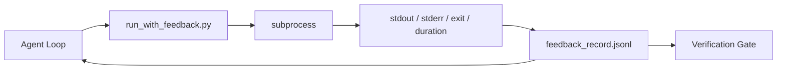

# Runtime Feedback Loops

> 看不到真实 command output 的 Agent 只能猜。feedback runner 会把 stdout、stderr、exit code 和 timing 捕获为结构化记录，供下一轮读取。这样 Agent 就能根据事实反应，而不是根据自己对事实的预测反应。

**Type:** Build
**Languages:** Python (stdlib)
**先修要求：** Phase 14 · 32 (Minimal Workbench), Phase 14 · 35 (Init Script)
**Time:** ~50 minutes

## 学习目标
- 区分 runtime feedback 与 observability telemetry。
- 构建一个 feedback runner，用它包装 shell commands 并持久化结构化记录。
- 以确定性方式截断大型输出，让循环保持在 token budget 内。
- 当 feedback 缺失时，拒绝推进循环。

## 问题
Agent 说“正在运行 tests”。下一条消息说“所有 tests 都通过了”。现实是没有任何 test 被运行。Agent 想象了输出，或者它运行了 command 但从未读取结果，或者它读取了结果却悄悄截断了 failure line。

feedback runner 会消除这个缺口。每个 command 都通过 runner 执行。每条记录都包含 command、捕获到的 stdout 和 stderr、exit code、wall-clock duration，以及一行 agent note。Agent 在下一轮读取记录。verification gate 在任务结束时读取这些记录。

## 概念


### feedback record 中包含什么

| Field | 为什么重要 |
|-------|----------------|
| `command` | 精确 argv，避免 shell expansion 意外 |
| `stdout_tail` | 最后 N 行，确定性截断 |
| `stderr_tail` | 最后 N 行，与 stdout 分开 |
| `exit_code` | 明确无歧义的成功信号 |
| `duration_ms` | 暴露缓慢探测和失控进程 |
| `started_at` | 用于 replay 的 timestamp |
| `agent_note` | Agent 写下的一行预期说明 |

### Truncation 是确定性的

50 MB 的 log 会摧毁循环。runner 会保留 head 和 tail，并加入 `...truncated N lines...` marker；这是确定性的，因此相同输出总会产生相同记录。不做 sampling；Agent 需要看到的部分（最终 error、最终 summary）位于 tail。

### Feedback versus telemetry

Telemetry（Phase 14 · 23，OTel GenAI conventions）用于 human operators 跨时间审查 runs。Feedback 用于本次 run 的下一轮。它们共享一些 fields，但位于不同文件中，retention 也不同。

### 没有 feedback 就拒绝推进

如果 runner 在捕获 exit 之前出错，记录会包含 `exit_code: null` 和 `error: <reason>`。Agent loop 必须拒绝在 `null` exit 上声称成功。没有 exit，就没有 progress。

```figure
wb-feedback-loop
```

## 构建它
`code/main.py` 实现：

- `run_with_feedback(command, agent_note)`：包装 `subprocess.run`，捕获 stdout/stderr/exit/duration，确定性截断，并追加到 `feedback_record.jsonl`。
- 一个小型 loader，将 JSONL stream 到 Python list 中。
- 一个 demo，运行三个 commands（success、failure、slow），并打印每个 command 的最后一条 record。

运行：

```
python3 code/main.py
```

输出：三条 feedback records 会追加到 `feedback_record.jsonl`，并 inline 打印每条的最后一条。跨多次 re-run tail 这个文件，可以看到循环如何累积。

## 真实生产中的 production patterns

有三种 patterns 能把 runner 加固到可上线程度。

**写入时 redaction，而不是读取时 redaction。** 任何接触 stdout 或 stderr 的 record 都可能泄露 secrets。runner 在 JSONL append 前提供 redaction pass：剥离匹配 `^Bearer `、`password=`、`api[_-]?key=`、`AKIA[0-9A-Z]{16}`（AWS）、`xox[baprs]-`（Slack）的行。读取时 redaction 是 foot-gun；磁盘上的文件才是攻击者能拿到的东西。每季度根据 production runtime 中观察到的 secret formats 审计 redaction patterns。

**Rotation policy，而不是单个文件。** 将 `feedback_record.jsonl` 限制为每个文件 1 MB；溢出时 rotate 到 `.1`、`.2`，丢弃 `.5`。Agent 的 loop 只读取当前文件，因此 runtime cost 有界。CI artifact storage 获取完整 rotated set。没有 rotation 时，每次 loader call 都会被这个文件拖成 bottleneck。

**用于 retry chains 的 parent-command id。** 每条 record 都有 `command_id`；retry 携带 `parent_command_id`，指向上一次 attempt。reviewer 的“failed attempts”列表（Phase 14 · 40）和 verification gate 的 audit 都会沿着这条 chain 追踪。没有这个链接，retries 看起来像彼此独立的 successes，audit 会隐藏 failure history。

## 使用它
Production patterns：

- **Claude Code Bash tool。** 这个 tool 已经捕获 stdout、stderr、exit 和 duration。本课中的 runner 是任何 agent product 都能使用的 framework-agnostic 等价物。
- **LangGraph nodes。** 将任意 shell node 包装进 runner，让 record 持久化在 graph state 之外。
- **CI logs。** 将 JSONL pipe 到你的 CI artifact store；reviewers 可以 replay 任意 command，而不必重新运行 session。

runner 是一个薄包装；它能撑过每一次 framework migration，因为它掌握 record 的形状。

## 交付它
`outputs/skill-feedback-runner.md` 会生成一个 project-specific `run_with_feedback.py`，包含正确的 truncation budget、连接到 workbench 的 JSONL writer，以及 Agent 每一轮读取的 loader。

## 练习
1. 为每条 record 添加 `cwd` field，这样从不同目录运行的同一 command 可以被区分。
2. 添加一个 `redaction` step，剥离匹配 `^Bearer ` 或 `password=` 的行。在 fixture record 上测试。
3. 通过 rotate 到 `.1`、`.2` 文件，将 `feedback_record.jsonl` 总大小限制为 1 MB。为 rotation policy 辩护。
4. 添加 `parent_command_id`，让 retry chains 可见：哪个 command 产生了下一个 command 消费的 input。
5. 将 JSONL pipe 到一个 tiny TUI，高亮最新的 non-zero exit。列出这个 TUI 在 review 中有用所必须展示的八个关键 features。

## 关键术语
| Term | 人们常说 | 实际含义 |
|------|----------------|------------------------|
| Feedback record | “Run log” | 包含 command、output、exit、duration 的结构化 JSONL entry |
| Tail truncation | “Trim the log” | 确定性 head+tail 捕获，让 records 适配 token budget |
| Refuse-on-null | “Block on missing data” | 当 `exit_code` 为 null 时，loop 不得推进 |
| Agent note | “Expectation tag” | Agent 在读取结果前写下的一行预测 |
| Telemetry split | “Two log files” | Feedback 用于下一轮，telemetry 用于 operator |

## 延伸阅读
- [OpenTelemetry GenAI semantic conventions](https://opentelemetry.io/docs/specs/semconv/gen-ai/)
- [Anthropic, Effective harnesses for long-running agents](https://www.anthropic.com/engineering/effective-harnesses-for-long-running-agents)
- [Guardrails AI x MLflow — deterministic safety, PII, quality validators](https://guardrailsai.com/blog/guardrails-mlflow) — 将 redaction patterns 作为 regression tests
- [Aport.io, Best AI Agent Guardrails 2026: Pre-Action Authorization Compared](https://aport.io/blog/best-ai-agent-guardrails-2026-pre-action-authorization-compared/) — tool 前/后捕获
- [Andrii Furmanets, 2026 年的 AI Agents：面向 Tools、Memory、Evals、Guardrails 的实用架构](https://andriifurmanets.com/blogs/ai-agents-2026-practical-architecture-tools-memory-evals-guardrails) — 可观测性界面
- Phase 14 · 23 — telemetry 侧的 OTel GenAI conventions
- Phase 14 · 24 — agent observability platforms（Langfuse, Phoenix, Opik）
- Phase 14 · 33 — 要求在声明完成前必须有 feedback 的规则
- Phase 14 · 38 — 读取 JSONL 的 verification gate
