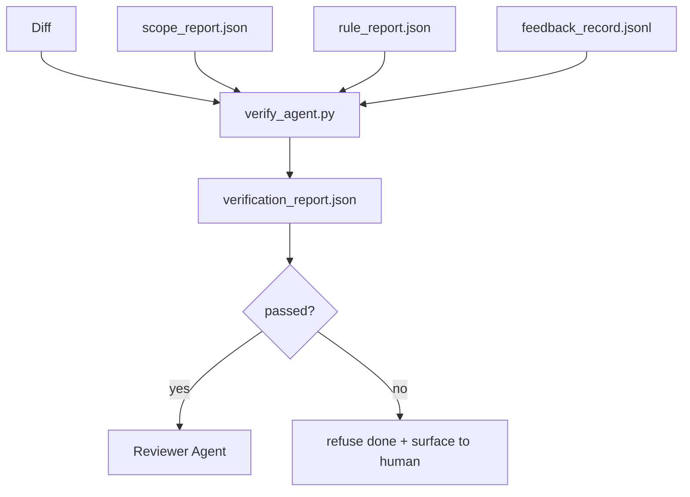

# Verification Gates

> agent 不能把自己的工作标记为完成。verification gate 会读取 scope contract、feedback log、rule report 和 diff，并回答一个问题：这个任务真的完成了吗？如果 gate 说没有，那么无论聊天里怎么说，任务都没有完成。

**Type:** Build
**Languages:** Python (stdlib)
**Prerequisites:** Phase 14 · 33 (Rules), Phase 14 · 36 (Scope), Phase 14 · 37 (Feedback)
**Time:** ~55 分钟

## 学习目标
- 将 verification gate 定义为作用于 workbench artifacts 的确定性函数。
- 将 rule report、scope report、feedback records 和 diff 合并成一个 verdict。
- 输出 reviewer agent 和 CI 都能读取的 `verification_report.json`。
- 只要存在任何 block-severity failure，就无例外拒绝推进任务。

## 问题
Agents 太容易宣称成功。三种失败形态最常见：

- “看起来不错。”model 读取了自己的 diff，然后认定它是正确的。
- “测试通过了。”说得很自信。但没有测试实际运行的记录。
- “满足 acceptance。”acceptance criteria 被解释得足够宽松，以至于“任何像是完成的东西”都算完成。

workbench 的修复方式是一个 verification gate，它读取 agent 已经生成的 artifacts 并作出判断。gate 是确定性的。gate 受 version control 管理。gate 接入 CI。agent 无法贿赂它。

## 概念


### gate 检查什么

| Check | Source artifact | Severity |
|-------|-----------------|----------|
| 所有 acceptance commands 都已运行 | `feedback_record.jsonl` | block |
| 所有 acceptance commands 都以零退出码结束 | `feedback_record.jsonl` | block |
| Scope check 没有 forbidden writes | `scope_report.json` | block |
| Scope check 没有 off-scope writes | `scope_report.json` | block or warn |
| 所有 block-severity rules 都通过 | `rule_report.json` | block |
| feedback 中没有 `null` exit codes | `feedback_record.jsonl` | block |
| Touched files 匹配 `scope.allowed_files` | both | warn |

`warn` finding 会给 verdict 添加注释；`block` finding 会阻止 `passed: true`。

### 确定性，而不是概率性

对于相同的 artifact set，gate 每次都必须生成相同 verdict。不要 LLM judges。LLM judges 属于 reviewer 侧（Phase 14 · 39），那里的目标是定性评估，而不是状态判断。

### 一个 report，一个 path

每次 task close-out，gate 都会输出一个 `verification_report.json`，写入 `outputs/verification/<task_id>.json`。CI 消费同一个 path。使用不同 paths 的多个 gates 会分叉 truth source。

### 无例外拒绝

Block-severity findings 不能由 agent override。它们只能由 human override，并且必须记录 `override_reason` 和 `overridden_by` user id。override 是一次签名变更，不是 agent 决策。

## 构建它
`code/main.py` 实现：

- 每个输入 artifact 的 loader，全部在本地 stub，使本课自包含。
- 一个 `verify(task_id, artifacts) -> VerdictReport` pure function。
- 一个 printer，展示每项 check 的结果和最终 pass/fail。
- 三个 task scenarios 的 demo：clean pass、scope creep、missing acceptance。

运行它：

```
python3 code/main.py
```

输出：三个 verdict reports，每个都保存到脚本旁边。

## 真实场景中的生产模式

四种 patterns 会把 gate 从“另一个 lint job”提升为“deciding edge”。

**Defense-in-depth，而不是 single gate。** Pre-commit hook → CI status check → pre-tool authz hook → pre-merge gate。每一层都是确定性的，因此一层中的 failure 会被下一层捕获。microservices.io 的 2026 年 3 月 playbook 明确指出：pre-commit hook 是不可绕过的，因为与 model-side skill 不同，它不依赖 agent 遵循指令。verification gate 位于 CI / pre-merge 层。

**通过确定性 check 做 defense，model-judge 只处理细微差别。** Anthropic 的 2026 Hybrid Norm pairing：可验证 rewards（unit tests、schema checks、exit codes）回答“code 是否解决了问题？”——LLM rubrics 回答“code 是否可读、安全、符合风格？”gate 运行第一类；reviewer（Phase 14 · 39）运行第二类。混用它们会让信号坍塌。

**签名 override log，而不是 Slack threads。** 每次 override 都会在 `outputs/verification/overrides.jsonl` 中输出一行，包含：timestamp、finding code、reason、signing user、current HEAD commit。runtime 会拒绝任何缺少 signature 的 override；audit trail 由 git 跟踪。这是 override policy 与 override theater 之间的界线。

**将 coverage floor 作为一等 check。** `coverage_report.json` 会输入一个 `coverage_floor`（默认 80%）check。如果测得的 coverage 低于 floor，或比上一次 merge 的 floor 低超过 1 个百分点，gate 就会 fail。没有这个 check，agents 会悄悄删除失败的 tests，而 verification reports 仍然保持绿色。

**`--strict` mode 会将 warns 提升为 blocks。** 对于 release branches、ship-blocking PRs 或 post-incident triage，`--strict` 会让每个 warning 都变成 hard fail。该 flag 按 branch opt-in；不是全局默认，因为 strict-on-everything 会腐蚀日常 flow。

## 使用它
Production patterns：

- **CI step。** `verify_agent` job 会针对 agent 的最终 artifacts 运行 gate。没有 `passed: true`，merge protection 会拒绝。
- **Pre-handoff hook。** agent runtime 在生成 handoff doc 前调用 gate。没有绿色 verdict，就没有 handoff。
- **Manual triage。** 当 agent 声称成功而 human 怀疑时，operators 会读取 report。

gate 是 workbench flow 中的 deciding edge。其他所有 surface 都位于它的上游。

## 交付它
`outputs/skill-verification-gate.md` 将 gate 接入一个具体项目：哪些 acceptance commands 会输入它，哪些 rules 是 block-severity，哪些 off-scope writes 被容忍，override audit log 如何存储。

## 练习
1. 添加一个 `coverage_floor` check：test command 必须生成 coverage report，且至少达到 80%。决定哪个 artifact 携带 floor。
2. 支持 `--strict` mode，将每个 `warn` 提升为 `block`。记录 strict mode 适合作为默认值的场景。
3. 让 gate 除了 JSON 之外还生成 Markdown summary。论证哪些 fields 应属于 summary。
4. 添加一个 `time_since_last_human_touch` check：human keystroke 后 60 秒内编辑过的任何文件，都免于 off-scope flags。
5. 在你的产品中的真实 agent diff 上运行 gate。多少 findings 是真实的，多少是 noise？gate 需要在哪里成长？

## 关键术语
| Term | What people say | What it actually means |
|------|----------------|------------------------|
| Verification gate | “阻止事情的 check” | 作用于 workbench artifacts 的确定性函数，生成 pass/fail verdict |
| Block severity | “Hard fail” | 会阻止 `passed: true` 并要求签名 override 的 finding |
| Override log | “我们为什么放行它” | 带有 reason 和 user id 的签名条目，由 review 审计 |
| Acceptance command | “证明” | 一个 shell command，其零退出码就是 `done` 的含义 |
| One report path | “Source of truth” | `outputs/verification/<task_id>.json`，由 CI 和 humans 共同消费 |

## 延伸阅读
- [Anthropic, Harness design for long-running application development](https://www.anthropic.com/engineering/harness-design-long-running-apps)
- [OpenAI Agents SDK guardrails](https://platform.openai.com/docs/guides/agents-sdk/guardrails)
- [microservices.io, GenAI dev platform: guardrails](https://microservices.io/post/architecture/2026/03/09/genai-development-platform-part-1-development-guardrails.html) — pre-commit 与 CI 之间的 defense in depth
- [ICMD, The 2026 Playbook for Agentic AI Ops](https://icmd.app/article/the-2026-playbook-for-agentic-ai-ops-guardrails-costs-and-reliability-at-scale-1776661990431) — approval-gate 阶梯（draft → approval → auto under thresholds）
- [Type-Checked Compliance: Deterministic Guardrails (arXiv 2604.01483)](https://arxiv.org/pdf/2604.01483) — Lean 4 作为 deterministic gating 的上界
- [logi-cmd/agent-guardrails — merge gate 规范](https://github.com/logi-cmd/agent-guardrails) — scope + mutation-testing gates
- [Guardrails AI x MLflow](https://guardrailsai.com/blog/guardrails-mlflow) — deterministic validators 作为 CI 评分器
- [Akira, Real-Time Guardrails for Agentic Systems](https://www.akira.ai/blog/real-time-guardrails-agentic-systems) — tool 调用前/后的 gates
- Phase 14 · 27 — prompt injection defenses（gate 的 adversarial pair）
- Phase 14 · 36 — 此 gate enforce 的 scope contract
- Phase 14 · 37 — 此 gate score 的 feedback log
- Phase 14 · 39 — gate hand off 到的 reviewer agent
