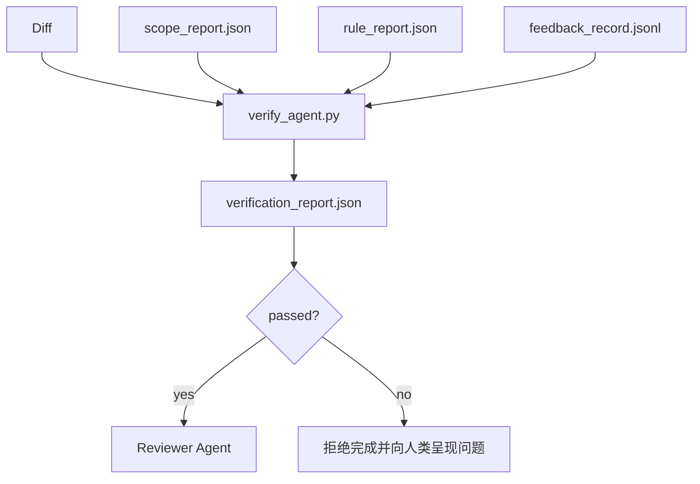

# 验证门

> Agent 无权将自己的工作标记为完成。验证门会读取范围契约、反馈日志、规则报告和 diff，然后回答一个问题：这项任务真的完成了吗？如果验证门给出的答案是否定的，那么无论聊天记录怎么说，任务都没有完成。

**Type:** Build
**Languages:** Python (stdlib)
**Prerequisites:** Phase 14 · 33（规则）、Phase 14 · 36（范围）、Phase 14 · 37（反馈）
**Time:** ~55 分钟

## 学习目标

- 将验证门定义为作用于工作台产物的确定性函数。
- 将规则报告、范围报告、反馈记录和 diff 合并为单一结论。
- 生成一份审查 Agent 和 CI 都能读取的 `verification_report.json`。
- 只要出现任何 `block` 级失败，就拒绝推进任务，不设例外。

## 问题

Agent 太容易宣告成功。最常见的是以下三种失败形式：

- “看起来不错。”Model 阅读自己的 diff 后，判定它是正确的。
- “测试已通过。”说得信心十足，却没有任何实际运行测试的记录。
- “已满足验收条件。”对验收标准的解释宽松到“只要看起来像完成了”即可。

工作台的解决方案是设置一个统一的验证门，由它读取 Agent 已经生成的产物并作出判定。验证门是确定性的。验证门受版本控制。验证门接入 CI。Agent 无法贿赂它。

## 概念



### 验证门检查什么

| 检查 | 来源产物 | 严重级别 |
|-------|-----------------|----------|
| 所有验收命令都已运行 | `feedback_record.jsonl` | `block` |
| 所有验收命令都以零状态码退出 | `feedback_record.jsonl` | `block` |
| 范围检查中没有禁止写入 | `scope_report.json` | `block` |
| 范围检查中没有范围外写入 | `scope_report.json` | `block` 或 `warn` |
| 所有 `block` 级规则都通过 | `rule_report.json` | `block` |
| 反馈中没有 `null` 退出码 | `feedback_record.jsonl` | `block` |
| 涉及的文件与 `scope.allowed_files` 匹配 | 两者 | `warn` |

`warn` 发现会为结论添加注释；`block` 发现会阻止 `passed: true`。

### 确定性，而非概率性

对于同一组产物，验证门每次都必须生成相同的结论。不要使用 LLM judge。LLM judge 应放在审查者侧（Phase 14 · 39），因为那里的目标是定性评估，而不是确定状态。

### 一份报告，一个路径

验证门会为每次任务收尾生成一份 `verification_report.json`，写入 `outputs/verification/<task_id>.json`。CI 使用同一路径。使用不同路径的多个验证门会导致事实来源分裂。

### 无条件拒绝

Agent 无权覆盖 `block` 级发现。只有人类能够覆盖，而且必须记录 `override_reason` 和 `overridden_by` 用户 ID。覆盖是一项经过签名的变更，而不是 Agent 的决定。

```figure
wb-gate-sequence
```

## 动手构建

`code/main.py` 实现：

- 每种输入产物的加载器。所有产物均在本地提供 stub，使本课能够独立运行。
- 一个纯函数 `verify(task_id, artifacts) -> VerdictReport`。
- 一个用于展示各项检查结果及最终通过/失败状态的打印器。
- 三种任务场景的演示：完全通过、范围蔓延、缺少验收。

运行：

```bash
python3 code/main.py
```

输出：三份结论报告，每份都保存在脚本旁边。

## 生产环境中的实践模式

有四种模式可以将验证门从“另一个 lint job”提升为“最终决定环节”。

**纵深防御，而不是单一验证门。** Pre-commit hook → CI 状态检查 → Tool 调用前的 authz hook → merge 前验证门。每一层都是确定性的，因此某一层漏掉的失败会被下一层捕获。microservices.io 在 2026 年 3 月的实践手册中明确指出：pre-commit hook 不可绕过，因为与 Model 侧 Skill 不同，它不依赖 Agent 遵循指令。验证门位于 CI / merge 前这一层。

**用确定性检查进行防御，只让 Model judge 处理细微判断。** Anthropic 在 2026 年提出的 Hybrid Norm 组合方式是：可验证奖励（单元测试、schema 检查、退出码）回答“代码是否解决了问题？”；LLM rubric 回答“代码是否可读、安全并符合风格？”验证门运行第一类检查；审查者（Phase 14 · 39）运行第二类检查。将二者混合会破坏信号。

**使用签名覆盖日志，而不是 Slack thread。** 每次覆盖都在 `outputs/verification/overrides.jsonl` 中生成一行记录，其中包含：时间戳、发现代码、原因、签名用户、当前 HEAD commit。运行时会拒绝任何缺少签名的覆盖；审计轨迹由 git 跟踪。这正是覆盖策略与覆盖表演之间的分界线。

**将覆盖率下限作为一等检查。** `coverage_report.json` 会为 `coverage_floor` 检查提供输入，其默认值为 80%。如果测得的覆盖率低于该下限，或比上一次 merge 的下限下降超过 1 个百分点，验证门就会失败。没有这项检查时，Agent 会悄悄删除失败的测试，而验证报告仍会保持绿色。

**`--strict` 模式将 `warn` 提升为 `block`。** 对于发布分支、阻塞发布的 PR 或事故后的分类处理，`--strict` 会把每个警告都转化为硬失败。该标志按分支选择启用，不作为全局默认值，因为对所有工作都启用 strict 模式会侵蚀日常工作流。

## 投入使用

生产环境模式：

- **CI 步骤。** `verify_agent` job 针对 Agent 的最终产物运行验证门。如果没有 `passed: true`，merge protection 就会拒绝合并。
- **交接前 hook。** Agent 运行时会在生成交接文档前调用验证门。没有绿色结论，就不允许交接。
- **人工分类处理。** 当 Agent 声称成功但人类有所怀疑时，操作人员会读取报告。

验证门是工作台流程中的最终决定环节。其他所有界面都位于它的上游。

## 交付成果

`outputs/skill-verification-gate.md` 会将验证门接入具体项目：哪些验收命令向其提供输入、哪些规则属于 `block` 级、哪些范围外写入可以容忍，以及如何存储覆盖审计日志。

## 练习

1. 添加一项 `coverage_floor` 检查：测试命令必须生成覆盖率至少为 80% 的报告。确定由哪个产物携带这个下限。
2. 支持一种 `--strict` 模式，将每个 `warn` 提升为 `block`。记录在哪些情况下 strict 模式适合作为默认设置。
3. 除 JSON 外，让验证门再生成一份 Markdown 摘要。说明哪些字段应出现在摘要中。
4. 添加一项 `time_since_last_human_touch` 检查：在人类按键后的 60 秒内编辑的任何文件，都不受范围外标记影响。
5. 针对你产品中的一个真实 Agent diff 运行验证门。其中有多少发现是真实问题，又有多少是噪声？验证门还需要在哪些方面扩展？

## 关键术语

| 术语 | 人们通常怎么说 | 它的实际含义 |
|------|----------------|------------------------|
| 验证门 | “阻止事情继续的检查” | 作用于工作台产物、生成通过/失败结论的确定性函数 |
| `block` 严重级别 | “硬失败” | 阻止 `passed: true` 并要求签名覆盖的发现 |
| 覆盖日志 | “我们为什么允许它通过” | 包含原因和用户 ID、由审查流程审计的签名记录 |
| 验收命令 | “证据” | 其零退出状态正是 `done` 含义的 shell 命令 |
| 单一报告路径 | “事实来源” | `outputs/verification/<task_id>.json`，由 CI 和人类共同使用 |

## 延伸阅读

- [Anthropic：面向长期应用开发的 Harness 设计](https://www.anthropic.com/engineering/harness-design-long-running-apps)
- [OpenAI Agents SDK guardrails](https://openai.github.io/openai-agents-python/guardrails/)
- [microservices.io，GenAI 开发平台：guardrails](https://microservices.io/post/architecture/2026/03/09/genai-development-platform-part-1-development-guardrails.html) — pre-commit 与 CI 之间的纵深防御
- [ICMD，2026 年 Agentic AI Ops 实践手册](https://icmd.app/article/the-2026-playbook-for-agentic-ai-ops-guardrails-costs-and-reliability-at-scale-1776661990431) — 审批门阶梯（草稿 → 审批 → 阈值内自动执行）
- [类型检查合规性：确定性 Guardrails（arXiv 2604.01483）](https://arxiv.org/pdf/2604.01483) — 使用 Lean 4 展示确定性验证门的能力上限
- [logi-cmd/agent-guardrails — merge gate 规范](https://github.com/logi-cmd/agent-guardrails) — 范围 + 变异测试验证门
- [Guardrails AI x MLflow](https://guardrailsai.com/blog/guardrails-mlflow) — 将确定性验证器用作 CI 评分器
- [Akira：Agentic 系统的实时 Guardrails](https://www.akira.ai/blog/real-time-guardrails-agentic-systems) — Tool 调用前后的验证门
- Phase 14 · 27 — Prompt injection 防御（验证门的对抗性搭档）
- Phase 14 · 36 — 此验证门执行的范围契约
- Phase 14 · 37 — 此验证门评分的反馈日志
- Phase 14 · 39 — 验证门交接给的审查 Agent
