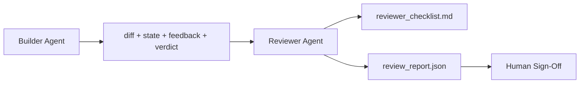

# Reviewer Agent: 将 Builder 与 Marker 分离

> 写代码的 agent 不能给它打分。reviewer 是第二个循环，使用不同的 system prompt、不同的目标，并且对 builder 产出的所有内容只有只读访问权限。builder 与 reviewer 之间的间隔，是大部分可靠性所在。

**Type:** Build
**Languages:** Python (stdlib)
**Prerequisites:** Phase 14 · 38 (Verification Gate)
**Time:** ~55 分钟

## 学习目标
- 说明为什么同一个 agent 不能可靠地审查自己的工作。
- 构建一个 reviewer agent 循环，它消费 builder artifacts，并输出结构化 review report。
- 编写一个 reviewer rubric，按具体维度评分，而不是凭感觉。
- 将 reviewer 接入 workbench，让人工 review 步骤从真实 artifact 开始。

## 问题
你让 agent 修复一个 bug。它编辑了四个文件，运行了测试，并报告完成。verification gate（Phase 14 · 38）确认 acceptance 已运行且 scope 保持不变。gate 显示 `passed: true`。你合并了。两天后你发现，这个修复解决的是 bug 的另一半，而不是正确的那一半。

Acceptance 是必要的，但不充分。reviewer 会问 acceptance 无法提出的问题：这是否解决了正确的问题？它是否在没有说明的情况下扩大了 scope？它是否记录了本应被质疑的 assumptions？它是否让 workbench 处于下一个 session 可以接手的状态？

## 概念


### Reviewer rubric

五个维度，每个维度评分 0 到 2。

| Dimension | Question |
|-----------|----------|
| Problem fit | 这个变更是否解决了任务所陈述的问题，而不是相近的问题？ |
| Scope discipline | 编辑是否限制在 contract 内，或者 contract 的扩展是否是有意为之？ |
| Assumptions | 所有隐藏 assumptions 是否都写在了某个可 review 的地方？ |
| Verification quality | acceptance command 是否真的证明了目标，还是只证明了一个更弱的版本？ |
| Handoff readiness | 下一个 session 是否能从当前状态干净地接手？ |

总分 10 分。低于 7 分是 soft fail；低于 5 分是 hard fail。

### reviewer 是独立角色，不是独立模型

你可以用与 builder 相同的 model 运行 reviewer。关键约束是角色分离：不同的 system prompt、不同的输入、对 diff 没有写权限。姿态的变化就是信号的变化。

### reviewer 不能编辑 diff

reviewer 读取 diff、state、feedback、verdict。它写一份 report。它不 patch diff。如果 report 说“修复这个”，下一轮 builder turn 去做修复；reviewer 回到 review。混合角色会破坏这段间隔。

### Reviewer rubric 与 verification gate 对比

gate（Phase 14 · 38）检查确定性事实：acceptance 是否运行、规则是否通过、scope 是否保持。reviewer 做定性判断：这是否是正确的工作、是否有文档记录、handoff 是否可用。两者都需要。

## 构建它
`code/main.py` 实现：

- 一个 `ReviewerInputs` dataclass，用来打包 reviewer 读取的 artifacts。
- 一个 rubric scorer，每个维度一个函数。每个函数都是确定性的，并且为了课程使用 stub-grade；真实实现会调用 LLM。
- 一个 `review_report.json` writer，包含五个分数、总分和 verdict（`pass`、`soft_fail`、`hard_fail`）。
- 两个 demo case：一个干净的变更，以及一个“测试正确，问题错误”的变更。

运行：

```
python3 code/main.py
```

输出：两份 review report 写入磁盘，并在 console 中显示一张维度分数表。

## 真实场景中的生产模式

证据如下：Cloudflare 在 2026 年 4 月的 AI Code Review system，在 30 天内跨 5,169 个 repos、48,095 个 merge requests 运行了 131,246 次 review。review 完成时间中位数为 3 分 39 秒。最多七个 specialist reviewers（security、performance、code quality、docs、release management、compliance、Engineering Codex）在 Review Coordinator 下并行运行，由 coordinator 去重 findings 并判断 severity。顶级 model 仅保留给 coordinator；specialists 运行在更便宜的 tiers 上。

四种 pattern 让它能规模化运作。

**Specialist pool, not one big reviewer.** 对 solo repos 来说，一个带 5 维 rubric 的 reviewer 足够。一旦 codebase 有 security-critical、performance-critical 和 docs surfaces，就拆分成 prompts 更小的 specialists。coordinator 做去重；specialists 从不运行完整 rubric。model-tier separation 也自然形成：便宜的 specialists，昂贵的 coordinator。

**Bias mitigation as design requirement, not optimization.** LLM judges 会表现出四类稳定 biases（Adnan Masood，2026 年 4 月）：position bias（GPT-4 在 (A,B) 与 (B,A) 排序上约 40% 不一致）、verbosity bias（更长输出约有 15% score inflation）、self-preference（judges 偏好同一 model family 的输出）、authority（judges 会高估对知名作者的引用）。缓解方式：同时评估两种排序，只计算一致获胜；使用明确奖励简洁性的 1-4 scales；跨 model families 轮换 judges；评分前移除作者姓名。

**Calibration set, not vibes.** 准备一个包含 10-20 个历史任务、且有已知正确 verdicts 的集合。每次修改 prompt 后都运行 reviewer。如果与历史记录的一致性低于 80%，rubric 在发布 reviewer 前需要修订。每个团队最终都会重新发现这一点；最好一开始就这样做。

**Hybrid norm with the gate.** Verification gate（Phase 14 · 38）处理确定性检查（acceptance 是否运行、tests 是否通过、scope 是否保持）。Reviewer 处理语义检查（这是否是正确的工作、assumptions 是否有记录、handoff 是否可用）。Anthropic 的 2026 guidance 明确强调了这种拆分：不要让 reviewer 重做 gate 已经证明的事情。

## 使用它
Production patterns：

- **Claude Code subagents.** reviewer subagent 在 builder 关闭任务后运行。它在 PR 上发布带有 rubric scores 的 comment。
- **OpenAI Agents SDK handoffs.** Builder 在任务完成时 hand off 给 Reviewer。Reviewer 可以带着 findings list 交回，或上交给 human。
- **Two-model pairing.** Builder 运行在更快、更便宜的 model 上。Reviewer 运行在更强的 model 上，使用更小 context，专注 judgment。

reviewer 是当 humans 无法亲自完成每次 review 时，workbench 长出的第二双眼睛。

## 交付它
`outputs/skill-reviewer-agent.md` 生成一个项目专用 reviewer rubric、一个接入 builder artifacts 的 reviewer agent stub，以及与 verification gate 的 integration，让人工 review 从书面 report 开始，而不是从空白页开始。

## 练习
1. 添加第六个与你的 product domain 相关的维度。说明为什么它没有被现有五个维度吸收。
2. 用两种不同的 system prompts（terse、verbose）运行 reviewer。哪一种会产生 human 更可能阅读的 report？
3. 为每个维度添加 `confidence` field。当最低维度的 confidence 低于 0.6 时，拒绝发布 report。
4. 构建一个 calibration set：10 个带有已知正确 verdicts 的历史 task close-outs。对它们运行 reviewer。它在哪里与历史记录不一致？
5. 添加一个“request more evidence” affordance：reviewer 可以在评分前要求 builder 运行某个特定 test。合适的 back-off 是什么，才能避免循环？

## 关键术语
| Term | What people say | What it actually means |
|------|----------------|------------------------|
| Reviewer rubric | “Checklist” | 五维 0-2 评分，每个维度都有一个书面问题 |
| Soft fail | “Needs revisions” | 总分低于 7；builder 获得需要处理的 findings |
| Hard fail | “Reject” | 总分低于 5，或任一维度为 0；暂停并呈现给 human |
| Role separation | “Different prompt” | 同一个 model 可以承担两个角色；关键约束是 inputs 和 posture |
| Confidence floor | “Don't ship low-signal reports” | 当 rubric 不确定时，拒绝输出 verdict |

## 延伸阅读
- [OpenAI Agents SDK handoffs](https://platform.openai.com/docs/guides/agents-sdk/handoffs)
- [Anthropic Claude Code subagents](https://docs.anthropic.com/en/docs/agents-and-tools/claude-code/sub-agents)
- [Cloudflare, Orchestrating AI Code Review at Scale](https://blog.cloudflare.com/ai-code-review/) — 7 个 specialist + coordinator 架构，30 天 131k 次 runs
- [Agent-as-a-Judge: Evaluating Agents with Agents (OpenReview / ICLR)](https://openreview.net/forum?id=DeVm3YUnpj) — DevAI benchmark，366 hierarchical solution requirements
- [Adnan Masood, Rubric-Based Evaluations and LLM-as-a-Judge: Methodologies, Biases, Empirical Validation](https://medium.com/@adnanmasood/rubric-based-evals-llm-as-a-judge-methodologies-and-empirical-validation-in-domain-context-71936b989e80) — 4 种 biases 与缓解方式
- [MLflow, LLM-as-a-Judge Evaluation](https://mlflow.org/llm-as-a-judge) — 用于分离 builder/evaluator 的 production tooling
- [LangChain, How to Calibrate LLM-as-a-Judge with Human Corrections](https://www.langchain.com/articles/llm-as-a-judge) — calibration-set workflow
- [Evidently AI, LLM-as-a-judge: a complete guide](https://www.evidentlyai.com/llm-guide/llm-as-a-judge)
- [Arize, LLM as a Judge — Primer and Pre-Built Evaluators](https://arize.com/llm-as-a-judge/)
- Phase 14 · 05 — Self-Refine and CRITIC（single-agent self-review baseline）
- Phase 14 · 30 — Eval-driven agent development（calibration set generator）
- Phase 14 · 38 — reviewer 读取的 verification gate
- Phase 14 · 40 — reviewer report 输入的 handoff packet
