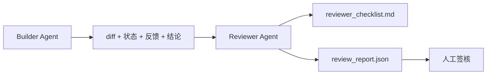

# Reviewer Agent：将构建者与评分者分开

> 编写代码的 Agent 不能为代码评分。审查者是第二个循环，拥有不同的 system prompt、不同的目标，并且对构建者生成的一切内容只有只读权限。构建者与审查者之间的间隔，承载了系统的大部分可靠性。

**Type:** Build
**Languages:** Python (stdlib)
**Prerequisites:** Phase 14 · 38（验证门）
**Time:** ~55 分钟

## 学习目标

- 说明为什么同一个 Agent 无法可靠地审查自己的工作。
- 构建一个 Reviewer Agent 循环，使用构建者产物并生成结构化审查报告。
- 编写一套针对具体维度评分、而不是凭感觉评分的审查 rubric。
- 将审查者接入工作台，使人工审查步骤从真实产物开始。

## 问题

你要求 Agent 修复一个 bug。它编辑了四个文件、运行测试，然后报告任务完成。验证门（Phase 14 · 38）确认验收已经运行且范围没有失控。验证门给出 `passed: true`。你完成 merge。两天后，你发现这个修复只解决了 bug 中错误的那一半。

验收是必要条件，但不是充分条件。审查者会提出验收无法回答的问题：这是否解决了正确的问题？它是否在没有标记的情况下扩大了范围？它是否记录了本应受到质疑的假设？它是否让工作台保持在下一个会话能够继续接手的状态？

## 概念



### 审查 rubric

五个维度，每个维度的得分为 0 到 2。

| 维度 | 问题 |
|-----------|----------|
| 问题匹配度 | 变更是否解决了任务所陈述的问题，而不是一个相近的问题？ |
| 范围纪律 | 编辑是否限制在契约内，或者契约是否经过有意扩展？ |
| 假设 | 所有隐藏假设是否都记录在某个可审查的位置？ |
| 验证质量 | 验收命令是否真正证明了目标，还是只证明了一个更弱的版本？ |
| 交接就绪度 | 下一个会话能否从当前状态顺利接手？ |

总分为 10 分。低于 7 分属于软失败；低于 5 分属于硬失败。

### 审查者是独立角色，而不一定是独立 Model

审查者可以使用与构建者相同的 Model。关键纪律在于角色分离：使用不同的 system prompt、不同的输入，并且没有 diff 写入权限。姿态的变化会带来信号的变化。

### 审查者不能编辑 diff

审查者读取 diff、状态、反馈和结论，并编写一份报告。它不会 patch diff。如果报告指出“修复此问题”，下一轮由构建者进行修复；审查者随后重新开展审查。混合角色会破坏这种间隔。

### 审查 rubric 与验证门

验证门（Phase 14 · 38）检查确定性事实：验收是否运行、规则是否通过、范围是否受控。审查者进行定性判断：工作方向是否正确、是否有文档记录、交接是否可用。二者缺一不可。

```figure
wb-builder-marker
```

## 动手构建

`code/main.py` 实现：

- 一个 `ReviewerInputs` dataclass，用于封装审查者读取的产物。
- 一个 rubric 评分器，每个维度对应一个函数。为了教学，每个函数都是确定性的 stub 级实现；真实实现会调用 LLM。
- 一个 `review_report.json` 写入器，记录五项得分、总分和结论（`pass`、`soft_fail`、`hard_fail`）。
- 两个演示案例：一个干净的变更，以及一个“测试正确、问题错误”的变更。

运行：

```bash
python3 code/main.py
```

输出：写入磁盘的两份审查报告，以及显示各维度得分的控制台表格。

## 生产环境中的实践模式

以下是实际数据：Cloudflare 在 2026 年 4 月的 AI Code Review 系统中，于 30 天内跨 5,169 个 repo、48,095 个 merge request 执行了 131,246 次审查。审查完成时间的中位数为 3 分 39 秒。最多七个专业审查者（安全、性能、代码质量、文档、发布管理、合规性、Engineering Codex）会并行运行，由 Review Coordinator 对发现去重并判断严重程度。顶级 Model 仅供协调者使用；专业审查者运行在成本较低的层级上。

有四种模式可以让这种方式大规模运作。

**使用专业审查者池，而不是一个庞大的审查者。** 对于个人 repo，一个配备五维 rubric 的审查者已经足够。一旦代码库包含安全关键、性能关键和文档界面，就应拆分为使用更小 Prompt 的专业审查者。协调者负责去重；专业审查者绝不运行完整 rubric。Model 层级自然随之分离：低成本的专业审查者，加上高成本的协调者。

**将偏差缓解视为设计要求，而不是优化项。** LLM judge 会表现出四种稳定偏差（Adnan Masood，2026 年 4 月）：位置偏差（GPT-4 在 (A,B) 与 (B,A) 排序中约有 40% 的结果不一致）、冗长偏差（对较长输出的评分膨胀约 15%）、自我偏好（judge 更偏爱相同 Model 家族的输出）、权威偏差（judge 会高估引用知名作者的内容）。缓解措施包括：评估两种排序，只统计结果一致的胜出；使用明确奖励简洁性的 1-4 分制；轮换不同 Model 家族的 judge；评分前移除作者姓名。

**使用校准集，而不是凭感觉。** 准备一个包含 10-20 项历史任务、并且已知正确结论的数据集。每次修改 Prompt 时，都让审查者在其上运行。如果与历史记录的一致率低于 80%，就必须先修订 rubric，才能发布审查者。每个团队最终都会重新发现这一点；最好从一开始就这样做。

**与验证门组成 Hybrid Norm。** 验证门（Phase 14 · 38）负责确定性检查（验收是否运行、测试是否通过、范围是否受控）。审查者负责语义检查（工作方向是否正确、假设是否有记录、交接是否可用）。Anthropic 在 2026 年的指南中明确建议进行这种拆分：不要让审查者重复验证门已经证明的内容。

## 投入使用

生产环境模式：

- **Claude Code subagents。** 构建者结束任务后，一个审查 subagent 开始运行。它会在 PR 上发布一条包含 rubric 得分的评论。
- **OpenAI Agents SDK handoffs。** Builder 在任务完成后 handoff 给 Reviewer。Reviewer 可以携带发现列表交还给 Builder，或向上交给人类。
- **双 Model 配对。** Builder 使用速度更快、成本更低的 Model。Reviewer 使用能力更强的 Model，配合更小且专注于判断的 Context。

当人类无法亲自完成每次审查时，审查者就是工作台增加的第二双眼睛。

## 交付成果

`outputs/skill-reviewer-agent.md` 会生成项目专用的审查 rubric、一个接入构建者产物的 Reviewer Agent stub，以及与验证门的集成，使人工审查从一份书面报告开始，而不是从空白页面开始。

## 练习

1. 添加第六个与你的产品领域相关的维度。说明为什么它不能被现有五个维度吸收。
2. 使用两个不同的 system prompt（简洁、详细）运行审查者。哪一个生成的报告更有可能被人类阅读？
3. 为每个维度添加一个 `confidence` 字段。当最低得分维度的 confidence 低于 0.6 时，拒绝交付报告。
4. 构建一个校准集：10 个具有已知正确结论的历史任务收尾记录。让审查者在这些记录上运行。它在哪些地方与历史记录不一致？
5. 添加一个“请求更多证据”的操作：审查者可以要求构建者在评分前运行一项特定测试。怎样设置合理的退避策略，才能避免形成循环？

## 关键术语

| 术语 | 人们通常怎么说 | 它的实际含义 |
|------|----------------|------------------------|
| 审查 rubric | “检查清单” | 对五个维度进行 0-2 分评分，每个维度都有一个书面问题 |
| 软失败 | “需要修改” | 总分低于 7；构建者会收到需要处理的发现 |
| 硬失败 | “拒绝” | 总分低于 5 或任一维度得分为 0；停止流程并呈现给人类 |
| 角色分离 | “不同的 Prompt” | 同一个 Model 可以承担两个角色；关键纪律在于输入和姿态 |
| Confidence 下限 | “不要交付低信号报告” | 当 rubric 无法确定时，拒绝生成结论 |

## 延伸阅读

- [OpenAI Agents SDK handoffs](https://openai.github.io/openai-agents-python/handoffs/)
- [Anthropic Claude Code subagents](https://code.claude.com/docs/en/sub-agents)
- [Cloudflare：大规模编排 AI Code Review](https://blog.cloudflare.com/ai-code-review/) — 7 个专业审查者 + 协调者架构，30 天内运行 13.1 万次
- [Agent-as-a-Judge：使用 Agent 评估 Agent（OpenReview / ICLR）](https://openreview.net/forum?id=DeVm3YUnpj) — DevAI benchmark，366 项分层解决方案要求
- [Adnan Masood：基于 Rubric 的 Evaluation 与 LLM-as-a-Judge——方法、偏差和实证验证](https://medium.com/@adnanmasood/rubric-based-evals-llm-as-a-judge-methodologies-and-empirical-validation-in-domain-context-71936b989e80) — 四种偏差及缓解措施
- [MLflow，LLM-as-a-Judge Evaluation](https://mlflow.org/llm-as-a-judge) — 用于分离构建者与评估者的生产工具
- [LangChain：如何使用人工纠正校准 LLM-as-a-Judge](https://www.langchain.com/articles/llm-as-a-judge) — 校准集工作流
- [Evidently AI，LLM-as-a-judge：完整指南](https://www.evidentlyai.com/llm-guide/llm-as-a-judge)
- [Arize，LLM as a Judge——入门与预构建 Evaluator](https://arize.com/llm-as-a-judge/)
- Phase 14 · 05 — Self-Refine 与 CRITIC（单 Agent 自我审查基线）
- Phase 14 · 30 — Eval 驱动的 Agent 开发（校准集生成器）
- Phase 14 · 38 — 审查者读取的验证门
- Phase 14 · 40 — Reviewer 报告所输入的交接包
