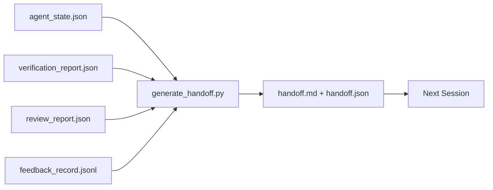

# Multi-Session Handoff

> Session 要结束了。工作还没有结束。handoff packet 是一种 artifact，它把“Agent 工作了一个小时”转化为“下一个 session 在第一分钟就能产出”。要有意设计它，而不是事后补救。

**类型:** Build
**语言:** Python (stdlib)
**先修:** Phase 14 · 34 (Repo Memory), Phase 14 · 38 (Verification), Phase 14 · 39 (Reviewer)
**时间:** ~50 分钟

## 学习目标

- 识别每个 handoff packet 都需要的七个字段。
- 从 workbench artifacts 生成 handoff，而不是手写说明文字。
- 将大型 feedback logs 裁剪成适合 handoff 的摘要。
- 让下一个 session 的第一个动作具有确定性。

## 问题

Session 结束。Agent 说“很好，我们取得了进展。”下一个 session 打开。下一个 Agent 问“我们上次停在哪里？”第一个 Agent 的答案已经不见了。下一个 Agent 重新发现问题，重新运行相同的命令，重新向 human 询问相同的问题，并花掉三十分钟，只为恢复上一个 session 最后三十秒的信息。

糟糕 handoff 的成本，会在任务生命周期内的每个 session 中持续支付。修复方式是在 session 结束时自动生成一个 packet：改了什么、为什么改、尝试过什么、什么失败了、还剩什么、下次首先做什么。

## 概念



### 每个 handoff 都携带的七个字段

| Field | 它回答的问题 |
|-------|---------------------|
| `summary` | 一段话说明完成了什么 |
| `changed_files` | 一眼看清 diff |
| `commands_run` | 实际执行过什么 |
| `failed_attempts` | 尝试过什么，以及为什么没有成功 |
| `open_risks` | 下个 session 可能踩到什么坑，附 severity |
| `next_action` | 下个 session 采取的第一个具体步骤 |
| `verdict_pointer` | 指向 verification + review reports 的路径 |

`next_action` 字段是承重字段。一个包含所有内容但缺少 `next_action` 的 handoff 是 status report，而不是 handoff。

### Handoff 是生成的，不是写出来的

手写 handoff，就是在困难日子里会被跳过的 handoff。Generator 读取 workbench artifacts 并输出 packet。Agent 的职责是让 workbench 处于 generator 可以总结的状态，而不是亲自写 summary。

### 两种形式：human-readable 和 machine-readable

`handoff.md` 供 human 阅读。`handoff.json` 供下一个 Agent 加载。两者来自同一批 source artifacts。如果它们出现分歧，以 JSON 为准。

### Feedback log 裁剪

完整的 `feedback_record.jsonl` 可能有数百条记录。handoff 只携带最后 K 条，以及每条非零 exit 的记录。下一个 session 如果需要，可以加载完整 log，但 packet 保持小巧。

### 留下干净状态

handoff 描述工作；clean state 让工作可恢复。它们不是同一件事。如果下一个 session 打开时面对的是半截 diff、agent 忘掉的 temp file、游离 branch，以及尚未真正运行就报错的 tests，那么再完美的 `handoff.md` 也没有价值。下一个 agent 会先花十分钟清理上一个 session 留下的东西，而不是继续构建；这个成本会在任务生命周期里的每个 session 复利增长。

所以 session 不是在 feature 能跑通时结束，而是在 workbench 处于 generator 可以总结、下一个 session 可以信任的状态时结束。Cleanup 是自己的阶段，在 handoff 之前运行；它是 check，不是习惯，因为习惯恰恰是在困难日子里最容易被跳过的东西。

| Check | Clean means | Dirty blocks because |
|-------|-------------|----------------------|
| Working tree | 每个变更都已 commit，或明确 stash 并附带说明 | 半截 diff 会被下一个 agent 看成有意图的工作 |
| Temp artifacts | 没有 `*.tmp`、scratch dirs、debug prints 或留下的注释块 | 游离文件会污染 diff 和下一个 agent 的 mental model |
| Tests | 绿色，或红色但在 `open_risks` 中命名了失败 | 沉默的红色 test 是下一个 session 会踩进去的陷阱 |
| Feature board | `feature_list.json` status 反映真实状态（Phase 14 · 36） | 过期 board 会把下一个 session 派去做已经完成的工作 |
| Branch | 位于预期 branch，没有 detached HEAD，没有 orphan branches | 错误 branch 会让下一个 session 的第一个 commit 落到错误位置 |

cleanup 阶段会产出一个 `clean_state.json`，其中列出 blocking issues；空列表是 handoff generator 写 packet 前要断言的前置条件。建立在 dirty tree 上的 handoff 不是 handoff，而是转发混乱。两个 artifacts 成对出现：cleanup 证明 workbench 可以安全离开，handoff 证明下一个 session 知道从哪里开始。

## 构建它

`code/main.py` 实现了：

- 一个 loader，将 state、verdict、review 和 feedback 汇总进单个 `WorkbenchSnapshot`。
- 一个 `generate_handoff(snapshot) -> (markdown, payload)` 函数。
- 一个 filter，选出最后 K 条 feedback entries 加上所有非零 exits。
- 一个 demo run，在脚本旁边写入 `handoff.md` 和 `handoff.json`。

运行它：

```
python3 code/main.py
```

输出：打印出的 handoff body，以及磁盘上的两个文件。

## 真实生产中的模式

Codex CLI、Claude Code 和 OpenCode 各自提供了不同的 compaction 方案；结构化 handoff packet 位于这三者之上。

**Compaction 策略各不相同；packet schema 不变。** Codex CLI 的 POST /v1/responses/compact 是一个 server-side opaque AES blob（OpenAI models 的快速路径）；fallback 是一个本地 “handoff summary”，作为 `_summary` user-role message 追加。Claude Code 在 context 达到 95% 时运行五阶段 progressive compaction。OpenCode 使用基于 timestamp 的 message hiding 加上 5-heading LLM summary。三种不同机制，同一个需求：把压缩后保留下来的内容序列化成可移植 artifact。packet 就是这个 artifact。

**Fresh-session handoff 不是 compaction。** Compaction 延长一个 session；handoff 干净地关闭一个 session，并启动下一个。Hermes Issue #20372 的框架（2026 年 4 月）是对的：当 in-place compression 开始降低质量时，Agent 应该写一个 compact handoff，结束 session，并在 fresh context 中恢复。packet 让这种转换变得便宜。错误做法是一直压缩到质量崩塌；修复方式是为早期、干净的 handoff 预留预算。

**每个 branch 和 topic 只保留一个 active handoff。** Multi-agent coordination 崩溃更多是因为 stale handoffs，而不是糟糕的模型输出。始终包含 `branch`、`last_known_good_commit`，以及 `active | superseded | archived` 之一的 `status`。Stale handoffs 会被 archived；只有 active 的那个驱动下一个 session。这就是 handoff-as-notes 与 handoff-as-state 的区别。

**在 50-75% context 之前收尾，不要等到撞墙。** 手写模式 playbook（CLAUDE.md + HANDOVER.md）报告说，当 session 在 context budget 的 50-75% 结束，而不是 95% 时，效果最好。packet generator 会在 compression artifacts 污染 source state 之前干净运行。context 完整时写入成本低；模型已经找不到位置时，成本高。

## 使用它

生产模式：

- **Session-end hook。** runtime 在用户关闭 chat 时触发 generator。packet 写入 `outputs/handoff/<session_id>/`。
- **PR template。** generator 的 markdown 也可以作为 PR body。Reviewer 无需打开另外五个文件就能阅读。
- **Cross-agent handoff。** 用一个产品构建（Claude Code），用另一个继续（Codex）。packet 是通用语。

packet 小、规则、生成成本低。节省下来的成本会随着每个 session 复利增长。

## 发布它

`outputs/skill-handoff-generator.md` 会生成一个适配项目 artifact paths 的 generator、一个运行它的 end-of-session hook，以及下一个 Agent 启动时读取的 `handoff.json` schema。

## 练习

1. 添加一个 `assumptions_to_validate` 字段，暴露构建者记录过、但 reviewer 评分没有超过 1 的每个 assumption。
2. 对 failing runs 和 passing runs 使用不同方式裁剪 feedback summary。为这种不对称辩护。
3. 加入一个 “questions for the human” 列表。一个问题进入 packet，而不是进入 chat message 的阈值是什么？
4. 让 generator 具备 idempotent：运行两次会产生相同的 packet。要成立，需要哪些内容保持稳定？
5. 添加一个 “next session prereqs” section，精确列出下一个 session 在行动前必须加载的 artifacts。

## 关键术语

| Term | 人们常说 | 实际含义 |
|------|----------------|------------------------|
| Handoff packet | “Session summary” | 携带七个字段的生成 artifact，同时包含 markdown 和 JSON |
| Next action | “首先做什么” | 启动下一个 session 的一个具体步骤 |
| Feedback trim | “Log summary” | 最后 K 条 records 加上每个非零 exit |
| Status report | “我们做了什么” | 缺少 `next_action` 的文档；有用，但不是 handoff |
| Verdict pointer | “Receipt” | 指向 verification + review reports 的路径，用于 traceability |

## 延伸阅读

- [Anthropic，面向 long-running agents 的有效 harnesses](https://www.anthropic.com/engineering/effective-harnesses-for-long-running-agents)
- [OpenAI Agents SDK handoffs](https://platform.openai.com/docs/guides/agents-sdk/handoffs)
- [Codex Blog，Codex CLI Context Compaction：架构、配置、管理长会话](https://codex.danielvaughan.com/2026/03/31/codex-cli-context-compaction-architecture/) — POST /v1/responses/compact 和 local fallback
- [Justin3go，Shedding Heavy Memories：Context Compaction in Codex, Claude Code, OpenCode](https://justin3go.com/en/posts/2026/04/09-context-compaction-in-codex-claude-code-and-opencode) — 三家 vendor 的 compaction 对比
- [JD Hodges，Claude Handoff Prompt：如何跨 Sessions 保持 Context (2026)](https://www.jdhodges.com/blog/ai-session-handoffs-keep-context-across-conversations/) — CLAUDE.md + HANDOVER.md，50-75% context budget
- [Mervin Praison，Managing Handoffs in Multi-Agent Coding Sessions：Fresh Context Without Losing Continuity](https://mer.vin/2026/04/managing-handoffs-in-multi-agent-coding-sessions-fresh-context-without-losing-continuity/) — distributed-systems 视角
- [Hermes Issue #20372 — compression 变得有风险时自动 fresh-session handoff](https://github.com/NousResearch/hermes-agent/issues/20372)
- [Hermes Issue #499 — Context Compaction Quality Overhaul](https://github.com/NousResearch/hermes-agent/issues/499) — Codex CLI 中面向 handoff 的 prompts
- [Microsoft Agent Framework，Compaction](https://learn.microsoft.com/en-us/agent-framework/agents/conversations/compaction)
- [OpenCode，Context Management and Compaction](https://deepwiki.com/sst/opencode/2.4-context-management-and-compaction)
- [LangChain，Context Engineering for Agents](https://www.langchain.com/blog/context-engineering-for-agents)
- Phase 14 · 34 — generator 读取的 state file
- Phase 14 · 38 — packet 指向的 verification verdict
- Phase 14 · 39 — 打包进 packet 的 reviewer report
