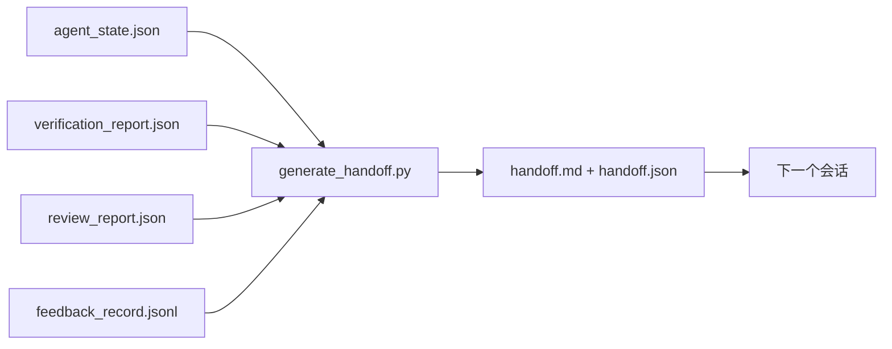

# 多会话交接

> 会话即将结束，工作却没有结束。交接包是一项产物，它能把“Agent 工作了一个小时”转化为“下一个会话从第一分钟起就富有成效”。请有意识地构建它，不要事后才想起来。

**Type:** Build
**Languages:** Python (stdlib)
**Prerequisites:** Phase 14 · 34（Repo 记忆），Phase 14 · 38（验证），Phase 14 · 39（审查器）
**Time:** ~50 分钟

## 学习目标

- 识别每个交接包所需的七个字段。
- 根据工作台产物生成交接包，无需手写说明。
- 将大型反馈日志裁剪为适合交接包的摘要。
- 让下一个会话的首个操作具有确定性。

## 问题

会话结束了。Agent 说：“很好，我们取得了进展。”下一个会话打开了。下一个 Agent 问：“我们上次做到哪里了？”第一个 Agent 的回答已经消失。下一个 Agent 重新发现情况、重新运行相同命令、重新向人类询问相同问题，并花费三十分钟来恢复上一个会话最后三十秒的内容。

只要任务还在进行，每个会话都要为糟糕的交接付出代价。解决办法是在会话结束时自动生成一个交接包：改了什么、为什么改、尝试过什么、什么失败了、还剩什么、下次首先要做什么。

## 概念



### 每个交接包携带的七个字段

| 字段 | 它回答的问题 |
|-------|---------------------|
| `summary` | 用一段话说明完成了什么 |
| `changed_files` | 一眼查看 diff |
| `commands_run` | 实际执行了什么 |
| `failed_attempts` | 尝试过什么，以及为什么没有奏效 |
| `open_risks` | 下一个会话可能遇到什么问题，以及严重程度 |
| `next_action` | 下一个会话要采取的第一个具体步骤 |
| `verdict_pointer` | 验证报告和审查报告的路径 |

`next_action` 是承担核心作用的字段。除 `next_action` 外什么都有的交接包只是一份状态报告，而不是交接包。

### 交接包由系统生成，而不是手写

手写交接包意味着在艰难的一天里它很可能会被跳过。生成器读取工作台产物并输出交接包。Agent 的职责是让工作台保持在生成器能够总结的状态，而不是亲自撰写摘要。

### 两种形式：人类可读和机器可读

`handoff.md` 供人类阅读。`handoff.json` 由下一个 Agent 加载。二者均来自相同的源产物。如果二者出现分歧，以 JSON 为准。

### 裁剪反馈日志

完整的 `feedback_record.jsonl` 可能包含数百条记录。交接包只携带最后 K 条记录，以及退出码非零的所有记录。下一个会话可以在需要时加载完整日志，但交接包本身保持精简。

### 留下干净状态

交接包描述工作，而干净状态使工作可以恢复。二者并不是一回事。如果下一个会话打开时看到的是只应用了一半的 diff、Agent 忘记删除的临时文件、游离分支，以及尚未真正运行就报错的测试，那么再完美的 `handoff.md` 也毫无价值。下一个 Agent 不得不先花十分钟清理上一个 Agent 留下的问题，而不是继续构建；只要任务还在进行，这项成本就会在每个会话中不断累积。

因此，会话不会在 Feature 正常工作时结束。只有当工作台处于生成器能够总结、下一个会话能够信任的状态时，会话才算结束。清理是一个独立阶段，要在交接前运行；它是一项检查，而不是一种习惯，因为习惯正是在艰难的一天里最容易被跳过的东西。

| 检查项 | 干净意味着 | 脏状态会造成阻塞，因为 |
|-------|-------------|----------------------|
| 工作树 | 每项更改都已提交，或已明确 stash 并附带说明 | 只应用了一半的 diff 在下一个 Agent 看来会像是有意保留的工作 |
| 临时产物 | 没有遗留 `*.tmp`、草稿目录、调试打印或被注释掉的代码块 | 游离文件会污染 diff 和下一个 Agent 的认知模型 |
| 测试 | 全部通过；若未通过，则故障已在 `open_risks` 中指明 | 未说明的失败测试是下一个会话会踩中的陷阱 |
| Feature 面板 | `feature_list.json` 状态反映真实情况（Phase 14 · 36） | 过时的面板会把下一个会话引向已经完成的工作 |
| 分支 | 位于预期分支，没有 detached HEAD，也没有孤立分支 | 分支错误意味着下一个会话的首次提交会落到错误位置 |

清理阶段会输出一个包含阻塞问题的 `clean_state.json`；空列表是交接生成器在写入交接包之前断言的前置条件。建立在脏工作树上的交接包并不是交接包，而是被转交出去的一团混乱。这两项产物需要配合使用：清理证明工作台可以安全离开，交接包则证明下一个会话知道从哪里开始。

```figure
wb-handoff-packet
```

## 动手构建

`code/main.py` 实现：

- 一个加载器，将状态、判定结果、审查结果和反馈汇集到单个 `WorkbenchSnapshot` 中。
- 一个 `generate_handoff(snapshot) -> (markdown, payload)` 函数。
- 一个筛选器，选择最后 K 条反馈记录以及退出码非零的所有记录。
- 一个演示运行，在脚本旁写入 `handoff.md` 和 `handoff.json`。

运行：

```
python3 code/main.py
```

输出：打印出的交接包正文，以及写入磁盘的两个文件。

## 实际生产环境中的模式

Codex CLI、Claude Code 和 OpenCode 各自提供了不同的 Context 压缩方案；结构化交接包位于这三者之上。

**Context 压缩策略各不相同，但交接包 schema 保持不变。** Codex CLI 的 POST /v1/responses/compact 是服务器端不透明的 AES blob（适用于 OpenAI Model 的快速路径）；回退方案则是将本地“交接摘要”作为 `_summary` user-role 消息追加。Claude Code 在 Context 使用率达到 95% 时运行五阶段渐进式压缩。OpenCode 使用基于时间戳的消息隐藏，再加上一份包含 5 个标题的 LLM 摘要。三种不同机制面对的是同一种需求：把压缩后必须保留的内容序列化为可移植产物。交接包就是这项产物。

**新会话交接不等于 Context 压缩。** Context 压缩用于延长一个会话；交接则干净地结束一个会话并启动下一个会话。Hermes Issue #20372（2026 年 4 月）的表述是正确的：当原地压缩开始导致质量下降时，Agent 应当写入精简交接包、结束会话，然后在全新 Context 中恢复。交接包让这种转换成本很低。错误做法是持续压缩，直到质量崩溃；正确做法是为提前、干净的交接预留预算。

**每个分支和主题只能有一个活跃交接包。** Multi-Agent 协作更常因过时的交接包而失效，而不是因为糟糕的 Model 输出。始终包含 `branch`、`last_known_good_commit`，以及值为 `active | superseded | archived` 的 `status`。过时的交接包应归档；只有活跃交接包能驱动下一个会话。这就是“作为笔记的交接”和“作为状态的交接”之间的区别。

**在 Context 使用率达到 50-75% 之前收尾，不要等到触及上限。** 手写模式操作手册（CLAUDE.md + HANDOVER.md）报告称，在 Context 预算达到 50-75% 时结束会话，而不是等到 95%，效果最好。交接包生成器会在压缩产物污染源状态之前干净地运行。Context 完整时写入成本很低；等到 Model 已经开始失去头绪时，成本就会变得很高。

## 实际使用

生产模式：

- **会话结束 hook。** 用户关闭聊天时，runtime 触发生成器。交接包会进入 `outputs/handoff/<session_id>/`。
- **PR 模板。** 生成器输出的 Markdown 也可作为 PR 正文。审查者无需打开另外五个文件即可阅读。
- **跨 Agent 交接。** 使用一个产品（Claude Code）开始构建，再用另一个产品（Codex）继续。交接包是两者之间的通用语言。

交接包体积小、格式稳定且生成成本低。每进行一个会话，节省的成本都会继续累积。

## 交付成果

`outputs/skill-handoff-generator.md` 会生成一个针对项目产物路径进行调整的生成器、一个运行该生成器的会话结束 hook，以及一个供下一个 Agent 在启动时读取的 `handoff.json` schema。

## 练习

1. 添加 `assumptions_to_validate` 字段，用于显示构建者记录但审查者评分未超过 1 的每项假设。
2. 对失败运行和通过运行采用不同的反馈摘要裁剪方式。说明这种不对称设计的理由。
3. 加入“需要向人类询问的问题”列表。一个问题进入交接包而不是作为聊天消息发送的阈值是什么？
4. 使生成器具备幂等性：运行两次会生成相同的交接包。要满足这一点，哪些内容必须保持稳定？
5. 添加“下一个会话的前置条件”章节，准确列出下一个会话在采取行动前必须加载的产物。

## 关键术语

| 术语 | 人们常说 | 它的实际含义 |
|------|----------------|------------------------|
| 交接包 | “会话摘要” | 携带七个字段的生成产物，同时提供 Markdown 和 JSON |
| 下一步操作 | “首先要做什么” | 启动下一个会话的一个具体步骤 |
| 反馈裁剪 | “日志摘要” | 最后 K 条记录，以及退出码非零的每条记录 |
| 状态报告 | “我们做了什么” | 缺少 `next_action` 的文档；很有用，但不是交接包 |
| 判定结果指针 | “凭据” | 指向验证报告和审查报告的路径，用于实现可追溯性 |

## 延伸阅读

- [Anthropic, Effective harnesses for long-running agents](https://www.anthropic.com/engineering/effective-harnesses-for-long-running-agents)
- [OpenAI Agents SDK handoffs](https://openai.github.io/openai-agents-python/handoffs/)
- [Codex Blog, Codex CLI Context Compaction: Architecture, Configuration, Managing Long Sessions](https://codex.danielvaughan.com/2026/03/31/codex-cli-context-compaction-architecture/) — POST /v1/responses/compact 和本地回退方案
- [Justin3go, Shedding Heavy Memories: Context Compaction in Codex, Claude Code, OpenCode](https://justin3go.com/en/posts/2026/04/09-context-compaction-in-codex-claude-code-and-opencode) — 三家供应商的 Context 压缩对比
- [JD Hodges, Claude Handoff Prompt: How to Keep Context Across Sessions (2026)](https://www.jdhodges.com/blog/ai-session-handoffs-keep-context-across-conversations/) — CLAUDE.md + HANDOVER.md，50-75% Context 预算
- [Mervin Praison, Managing Handoffs in Multi-Agent Coding Sessions: Fresh Context Without Losing Continuity](https://mer.vin/2026/04/managing-handoffs-in-multi-agent-coding-sessions-fresh-context-without-losing-continuity/) — 分布式系统视角
- [Hermes Issue #20372 — automatic fresh-session handoff when compression becomes risky](https://github.com/NousResearch/hermes-agent/issues/20372)
- [Hermes Issue #499 — Context Compaction Quality Overhaul](https://github.com/NousResearch/hermes-agent/issues/499) — Codex CLI 中面向交接的 Prompt
- [Microsoft Agent Framework, Compaction](https://learn.microsoft.com/en-us/agent-framework/agents/conversations/compaction)
- [OpenCode, Context Management and Compaction](https://deepwiki.com/sst/opencode/2.4-context-management-and-compaction)
- [LangChain, Context Engineering for Agents](https://www.langchain.com/blog/context-engineering-for-agents)
- Phase 14 · 34 — 生成器读取的状态文件
- Phase 14 · 38 — 交接包所指向的验证判定结果
- Phase 14 · 39 — 打包进交接包的审查报告
