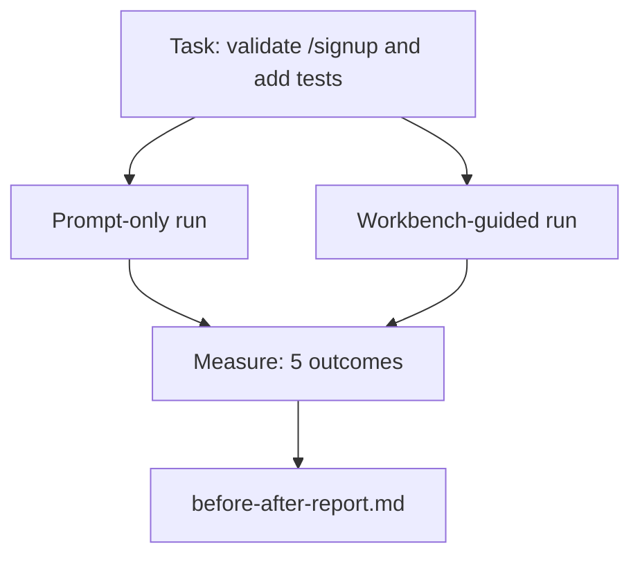

# 在真实 Repo 上使用 Workbench

> 十一节关于 surface 的课程，如果无法经受真实 codebase 的检验，就毫无价值。本课会在一个小型 sample app 上将同一个任务运行两遍：prompt-only 与 workbench-guided。让数字来说话。

**Type:** Build
**Languages:** Python (stdlib)
**Prerequisites:** Phases 14 · 32 to 14 · 40
**Time:** ~60 minutes

## 学习目标
- 将七个 workbench surface 汇集到一个小型 application 中。
- 将同一个任务运行两遍（prompt-only 和 workbench-guided），并衡量五个 outcome。
- 阅读 before/after report，并判断哪些 surface 提供了最大杠杆。
- 面对“但我的 model 已经足够好”的反驳时，为 workbench 辩护。

## 问题
在 toy task 上做 demo 说服不了任何人。workbench 的价值要在一个有真实感的 repo 上完成一个有真实感的任务时体现出来：更少 failure、更少 revert，并且产出一个下一次 session 可以使用的 packet。

本课提供这个有真实感的 repo，并让同一个任务走过两条 pipeline。结果是一份你可以交给怀疑者的 before/after report。

## 概念


### The sample app

`sample_app/` 中的一个最小 FastAPI 风格 handler：

- `app.py`，包含 `/signup`（尚无 validation）。
- `test_app.py`，包含一个 happy-path test。
- `README.md` 和 `scripts/release.sh`，作为 forbidden-zone bait。

### The task

> 为 `/signup` 添加 input validation：拒绝短于 8 个字符的 password，返回带 typed error envelope 的 422。添加一个 test 来证明新行为。

### The two pipelines

Prompt-only：

1. 阅读 README。
2. 阅读 `app.py`。
3. 编辑文件。
4. 声称完成。

Workbench-guided：

1. 运行 init script（Lesson 35）。
2. 阅读 scope contract（Lesson 36）。
3. 读取 state（Lesson 34）。
4. 只编辑允许的文件。
5. 通过 feedback runner 运行 acceptance command（Lesson 37）。
6. 运行 verification gate（Lesson 38）。
7. 运行 reviewer（Lesson 39）。
8. 生成 handoff（Lesson 40）。

### 衡量的五个结果

| Outcome | Why it matters |
|---------|----------------|
| `tests_actually_run` | 大多数“tests passed”声明都无法验证 |
| `acceptance_met` | 证明目标达成的 test 必须就是实际运行过的 test |
| `files_outside_scope` | Scope creep 是主要的静默 failure |
| `handoff_quality` | 下一次 session 会为此付出代价或从中受益 |
| `reviewer_total` | 在 gate 之上的定性判断 |

## 构建它
`code/main.py` 针对同一个 sample app fixture 编排两条 pipeline。两条 pipeline 都是 scripted（loop 中没有 LLM），因此 measurement 可复现。该 script 会将 comparison 写入 `before-after-report.md` 和 `comparison.json`。

运行：

```
python3 code/main.py
```

输出：按 pipeline 展示 outcome 的 console table，保存到 script 旁边的 markdown report，以及给想做图的人使用的 JSON。

## 真实生产中的 production patterns

怀疑者的问题是：“workbench 到底有多大帮助？”2026 年的数字比解释更有说服力。

**Terminal Bench Top-30 到 Top-5，使用同一个 model。** LangChain 的 *Anatomy of an Agent Harness*（2026 年 4 月）：一个 coding agent 仅通过改变 harness，就从 Terminal Bench 2.0 的 30 名开外跃升到第 5 名。同一个 model。不同的 surface。25 个名次的差距。

**Vercel 通过删除 tools 从 80% 到 100%。** Vercel 报告称，删除其 agent 的 80% tools 后，success rate 从 80% 提升到 100%。更小的 tool surface、更清晰的 scope、更少的失败路径。负空间获胜。

**Harvey 仅靠 harness 实现 2x accuracy。** Legal agents 通过 harness optimization 将 accuracy 提升到两倍以上，没有更换 model。

**88% 的企业 AI agent projects 未能进入 production。** preprints.org 的 *Harness Engineering for Language Agents* paper（2026 年 3 月）将 failure 归因于 runtime，而不是 reasoning：stale state、脆弱的 retry、过度膨胀的 context、对中间错误的恢复能力差。

**Long-context collapse。** WebAgent baseline 40-50% success 在 long-context 条件下跌至 10% 以下，主要原因是 infinite loops 和 goal loss。Ralph Loop 与 handoff packet 就是为了吸收这些问题而存在的。

**False negatives 仍然存在。** Single-step factual tasks、one-line lints、formatter runs、任何 model 已逐字记住的内容，这些用 prompt-only 会更快。benchmark 应该诚实地列出它们，这样 workbench 才不会被描述成过度设计。

结论不是“harness 永远获胜”。Models 会随着时间吸收 harness tricks。结论是：今天，engineering load 落在这七个 surface 上，而数字证明了这一点。

## 使用它
当出现以下情况时，可以引用本课作为 case file：

- 有人问为什么每个 PR 都带有 `agent-rules.md` 和 scope contract。
- 团队想“就这个 sprint”去掉 verification gate。
- 一个新的 agent product 发布，而你需要一个 portable benchmark 来判断它是否真的节省时间。

数字比解释传播得更远。

## 交付它
`outputs/skill-workbench-benchmark.md` 是一个 portable evaluation harness，可以让任意 agent product 在某个 project 自己的 sample app 上跑过两条 pipeline，并报告五个 outcome。

## 练习
1. 添加第六个 outcome：time-to-first-meaningful-edit。如何干净地衡量它？
2. 在你 codebase 中的一个真实 second-day task 上运行 comparison。workbench 的数字在哪里下滑？
3. 添加一个 “false negative” pass：列出 prompt-only 本会更快、workbench overhead 是真实成本的任务。然后为继续保留 workbench 辩护。
4. 将 scripted “agent” 替换为真实 LLM call。哪些 outcome 会变得更 noisy？
5. 写一页面向非工程师的 summary。哪些内容能保留下来？

## 关键术语
| Term | What people say | What it actually means |
|------|----------------|------------------------|
| Sample app | “Toy repo” | 足够小，但也足够现实，能够演练全部七个 surface |
| Pipeline | “Workflow” | agent 遵循的 surface read/write 有序序列 |
| Before/after report | “The receipts” | 你交给怀疑者的 artifact |
| False negative | “Workbench overkill” | prompt-only 更快的任务；诚实列出它们很有用 |
| Workbench benchmark | “Reliability score” | 在你的 codebase 上运行 comparison 的 portable harness |

## 延伸阅读
- [LangChain, The Anatomy of an Agent Harness](https://blog.langchain.com/the-anatomy-of-an-agent-harness/) — Terminal Bench Top-30 到 Top-5 的证据
- [MongoDB, The Agent Harness: Why the LLM Is the Smallest Part of Your Agent System](https://www.mongodb.com/company/blog/technical/agent-harness-why-llm-is-smallest-part-of-your-agent-system) — Vercel + Harvey 数字
- [preprints.org, Harness Engineering for Language Agents](https://www.preprints.org/manuscript/202603.1756) — 88% 企业 failure rate、runtime root causes
- [HN: Improving 15 LLMs at Coding in One Afternoon. Only the Harness Changed](https://news.ycombinator.com/item?id=46988596) — 在 15 个 models 上复现
- [Cloudflare, Orchestrating AI Code Review at Scale](https://blog.cloudflare.com/ai-code-review/) — production 中 30 天 / 131k review runs
- [Anthropic, Building Effective Agents](https://www.anthropic.com/research/building-effective-agents)
- Phases 14 · 32 to 14 · 40 — 本课端到端演练的 surface
- Phase 14 · 19 — SWE-bench、GAIA、AgentBench，作为本课补充的 macro benchmarks
- Phase 14 · 30 — eval-driven agent development，同一个 harness 可以接入其中
