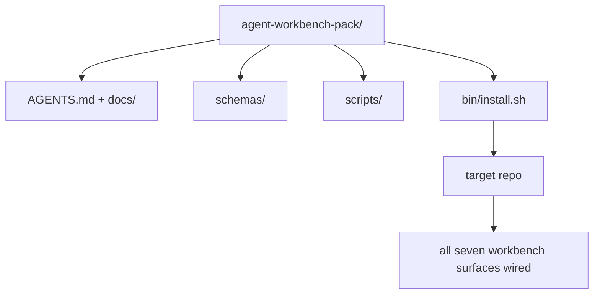

# Capstone：交付一个可复用的 Agent Workbench Pack

> 这个 mini-track 以一个可以放进任何 repo 的 pack 结束。十一节课里的 surface 被压缩进一个目录，你可以 `cp -r`，然后第二天早上就让 agent 稳定工作。这个 capstone 就是本课程真正交付的 artifact。

**类型：** Build
**语言：** Python (stdlib)
**前置要求：** Phases 14 · 31 到 14 · 41
**时间：** ~75 分钟

## 学习目标

- 将七个 Workbench surface 打包成一个可直接放入的目录。
- 固定 schema、script 和 template，让新 repo 获得一个已知可用的 baseline。
- 添加一个 installer script，用幂等方式放置这个 pack。
- 决定哪些内容留在 pack 里、哪些内容留在外面，并为每个取舍辩护。

## 问题

一个存在于 Google Doc、聊天历史和三个只被模糊记得的 script 里的 Workbench，是一个每季度都会被重建的 Workbench。解决办法是一个带版本的 pack：一个 repo 或目录，其中包含 surface、schema、script，以及一个一条命令即可运行的 installer。

本课结束时，你会在磁盘上交付 `outputs/agent-workbench-pack/`，以及一个可以把它放进任意目标 repo 的 `bin/install.sh`。

## 概念



### Pack layout

```
outputs/agent-workbench-pack/
├── AGENTS.md
├── docs/
│   ├── agent-rules.md
│   ├── reliability-policy.md
│   ├── handoff-protocol.md
│   └── reviewer-rubric.md
├── schemas/
│   ├── agent_state.schema.json
│   ├── task_board.schema.json
│   └── scope_contract.schema.json
├── scripts/
│   ├── init_agent.py
│   ├── run_with_feedback.py
│   ├── verify_agent.py
│   └── generate_handoff.py
├── bin/
│   └── install.sh
└── README.md
```

### 什么留下，什么放在外面

留下：

- Surface schema。它们就是 contract。
- 上面的四个 script。它们就是 runtime。
- 四份 doc。它们就是 rule 和 rubric。

放在外面：

- 项目特定任务。任务属于目标 repo 的 board，不属于 pack。
- 供应商 SDK 调用。这个 pack 与 framework 无关。
- Onboarding 文案。这个 pack 放在团队已有 onboarding 旁边，而不是放在其中。

### Installer

一个简短的 `bin/install.sh`（或 `bin/install.py`）：

1. 没有 `--force` 时，拒绝覆盖安装到已有 pack 上。
2. 将 pack 复制进目标 repo。
3. 如果存在 `.github/workflows/`，则接入 CI。
4. 打印后续步骤：填写 board、设置 acceptance command、运行 init script。

### 版本管理

这个 pack 携带一个 `VERSION` 文件。需要 migration 的 schema bump 和 script 变更会 bump major。仅 doc 的变更会 bump patch。目标 repo 的 `agent_state.json` 记录它初始化时对应的 pack version。

## 构建它

`code/main.py` 会把 pack 组装到本课旁边的 `outputs/agent-workbench-pack/` 中，并用这个 mini-track 前面课程里的 schema 和 script，以及你已经写过的 doc 作为种子。

运行它：

```
python3 code/main.py
```

这个 script 会复制并固定 surface，写入 README，打印 pack tree，然后以 zero 退出。重复运行是幂等的。

## 真实生产中的模式

一个 pack 只有在能够经受 fork、update 和不友好的 upstream 时才有价值。四个模式可以做到这一点。

**`VERSION` 是 contract，不是 marketing。** Major bump 需要 state migration。Minor bump 需要重新运行 checker。Patch bump 只用于 doc。Installer 每次安装都会把 `.workbench-version` 写入目标 repo；如果目标的 lock 与 pack 的 `VERSION` 不一致，`lint_pack.py` 会拒绝交付。这就是 `npm`、`Cargo` 和 `pyproject.toml` 能经受 10 年 churn 的方式；agent 不会改变这些规则。

**跨工具分发的单一来源。** Nx 提供一个 `nx ai-setup`，从单个 config 放置 `AGENTS.md`、`CLAUDE.md`、`.cursor/rules/`、`.github/copilot-instructions.md` 和一个 MCP server。这个 pack 也应该这样做；installer 输出 symlink（`ln -s AGENTS.md CLAUDE.md`），让单一事实来源分发到每个 coding agent。为了支持某个工具而 fork 这个 pack，是一种 failure mode。

**`uninstall.sh` 会在存在非平凡 state 时拒绝执行。** 卸载这个 pack 不能删除用户的 `agent_state.json`、`task_board.json` 或 `outputs/`。Uninstaller 会删除 schema、script、doc 和 `AGENTS.md`（带 `--keep-agents-md` opt-out），并且如果 state file 有任何未提交变更，就拒绝继续。State 属于用户；pack 并不拥有它。

**Skill-as-publishable。SkillKit-style 分发。** 这个 pack 作为 SkillKit skill 交付：`skillkit install agent-workbench-pack` 会从单一来源把它放置到 32 个 AI agent 中。Pack repo 是事实来源；SkillKit 是分发渠道。Vendor lock-in 会消失；七个 surface 保持不变。

## 使用它

Pack 会在三个地方交付：

- **作为一个你放进 repo 的目录。** `cp -r outputs/agent-workbench-pack /path/to/repo`。
- **作为一个公开 template repo。** Fork-and-customize，并用 `VERSION` 控制 drift。
- **作为一个 SkillKit skill。** 接入你的 agent 产品，让一条命令完成放置。

Pack 是 recipe。每次 install 是一份 serving。

## 交付它

`outputs/skill-workbench-pack.md` 会生成一个针对项目调优的 pack：rule 会根据团队历史变得更清晰，scope glob 会匹配 repo，rubric dimension 会扩展一个领域特定条目。

## 练习

1. 决定哪一份可选的第五 doc 值得提升进 canonical pack。为这个取舍辩护。
2. 用 Python 重写 installer，并添加 `--dry-run` flag。将 ergonomics 与 bash 对比。
3. 添加一个 `bin/uninstall.sh`，安全移除 pack，并在 state file 有非平凡历史时拒绝执行。什么算非平凡？
4. 添加一个 `lint_pack.py`，当 pack 偏离 `VERSION` 时失败。把它接入 pack 自身 repo 的 CI。
5. 写一份从手工 Workbench 迁移到这个 pack 的 runbook。什么操作顺序可以最小化 downtime？

## 关键术语

| 术语 | 人们常说 | 它实际含义 |
|------|----------------|------------------------|
| Workbench pack | “starter kit” | 一个带版本的目录，携带全部七个 surface |
| Installer | “Setup script” | 以幂等方式放置 pack 的 `bin/install.sh` |
| Pack version | “VERSION” | schema/script 变更使用 major bump，仅 doc 变更使用 patch |
| Drop-in pack | “cp -r and go” | Pack 在第一天无需按 repo 定制即可工作 |
| Forkable template | “GitHub template” | GitHub 的 “Use this template” 可以从中 clone 的公开 repo |

## 延伸阅读

- Phases 14 · 31 到 14 · 41 — 这个 pack 打包的每个 surface
- [SkillKit](https://github.com/rohitg00/skillkit) — 在 32 个 AI agent 中安装这个 skill
- [Nx Blog, Teach Your AI Agent How to Work in a Monorepo](https://nx.dev/blog/nx-ai-agent-skills) — 跨六种工具的单一来源 generator
- [agents.md — the open spec](https://agents.md/) — 你的 pack 的 router 必须实现的内容
- [HKUDS/OpenHarness](https://github.com/HKUDS/OpenHarness) — pack-equivalent 的参考实现
- [andrewgarst/agentic_harness](https://github.com/andrewgarst/agentic_harness) — 带 eval suite 的 Redis-backed 参考实现
- [Augment Code, A good AGENTS.md is a model upgrade](https://www.augmentcode.com/blog/how-to-write-good-agents-dot-md-files) — pack doc 的质量门槛
- [Anthropic, Effective harnesses for long-running agents](https://www.anthropic.com/engineering/effective-harnesses-for-long-running-agents)
- [Anthropic, Harness design for long-running application development](https://www.anthropic.com/engineering/harness-design-long-running-apps)
- Phase 14 · 30 — 消费这个 pack 的 verification gate 的 eval-driven agent development
- Phase 14 · 41 — 这个 pack 要改进的 before/after benchmark
