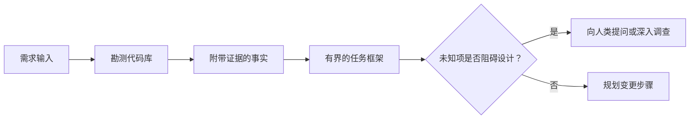

# 在 Agent 写代码前框定任务

> 编码智能体（Coding Agent）能极其迅速地实现一个清晰的任务。它同样能极其迅速地实现一个模糊的任务。两者的速度完全一样，但代价却天差地别。

**Type:** Learn + Build
**Languages:** Python (stdlib)
**Prerequisites:** Phase 14 第 31 课与第 36 课
**Time:** ~60 分钟

## 学习目标

- 在修改代码之前，将原始需求转化为有明确边界的任务框架（Task Frame）。
- 将代码库的客观事实与主观假设、待决问题清晰剥离开来。
- 明确定义允许修改的路径、禁止触碰的路径以及验收证据。
- 判断何时代码勘测（Reconnaissance）已经充分，可以正式开展工作。

## 代价高昂的失败

“增加重复邮箱防护”听起来非常明确，但实际上并非如此。这种唯一性校验究竟应该放在 API 层、领域服务层还是数据库层？邮箱比较是否区分大小写？对外公开的错误响应结构是什么？是否允许引入数据库迁移？哪一个测试能够证明该行为？

一个能力很强的智能体会用看起来合情合理的选择填补这些空白。而这正是最危险的情况：它的代码实现可能整洁优雅、单测全过，但依然与整个系统格格不入。

因此，编码智能体开展工作的第一单元绝不是直接修改代码，而是建立一份由代码库真实证据支撑的任务框架。

## 任务框架（Task Frame）

一个实用的任务框架包含六个核心要素：

| 字段 | 核心问题 |
|---|---|
| 目标（Goal） | 必须改变哪些可观测的行为？ |
| 代码库事实（Repository facts） | 你在代码、测试、配置或历史提交中验证了什么？ |
| 允许修改路径（Allowed paths） | 变更允许落在哪些位置？ |
| 禁止触碰路径（Forbidden paths） | 哪些文件与目录必须保持原样？ |
| 验收证据（Acceptance evidence） | 哪些具体命令或观测现象能证明目标已达成？ |
| 未知项（Unknowns） | 哪些决策仍需补充证据或依赖人类判断？ |

事实必须附带确凿的凭据（Receipts）。“API 遇到重复项返回 409”并不是事实，直到你明确指出已有的测试用例或请求处理函数位置。一个具体的文件路径和行号即可；而当涉及动态行为时，提供命令执行结果更为稳妥。



## 勘测旨在寻找约束

不要试图通读整个代码库。你应该搜寻的是能对本次变更构成约束的各种边界表面（Surfaces）：

1. 当前的行为表现及其调用方。
2. 最贴近的既有测试用例。
3. 公共契约或序列化后的数据结构。
4. 管辖该路径的项目规范与指令。
5. 构建与验证命令。
6. 以往完成的类似变更，从中提炼局部代码模式。

当计划中的每个决策都已有客观证据支撑、已明确授权代理决断，或已被列为已知未知项时，勘测即可停止。超过这个节点继续泛读代码，往往只是一种逃避动手的拖延。

## 未知项并非工作失误

未知项是受控的信息空白；而未经验证的“假设”则是对该空白未受控制的臆测。

将每个未知项分类：

- **可探查的（Discoverable）：** 代码库本身或运行中的系统能够给出答案。
- **可自决的（Decidable）：** 任务契约已授予智能体自主选择的权限。
- **需人类判断的（Human）：** 该选择会改变产品行为、成本、系统风险或外部兼容性。
- **延后处理的（Deferred）：** 该选择超出了当前切片的范围，属于非目标（Non-goals）。

智能体应当自主处理可探查和已授权自决的未知项；但遇到需要人类判断的未知项时，必须在决策被固化到代码之前主动暂停并确认。

## 实现之前先定验收标准

在编写补丁之前，先写出完成证明。验收证明可以是：

- 一条针对性的单元测试或集成测试命令；
- 一次指定视口与预期状态的端到端浏览器操作流程；
- 一次网络请求及完全吻合的响应契约；
- 一项达到特定阈值的性能度量；
- 一项确认没有无关文件被改动的范围检查。

“测试通过”并不是一份有效的证明方案。必须明确指明具有裁决权的测试用例及其证明的主张。

## 构建它

本课的实验将创建一个 `TaskFrame` 对象，校验其边界与证据的有效性，并输出 `outputs/task-frame.md`。

在当前课程目录下运行：

```bash
python3 code/main.py
python3 -m unittest discover code/tests -v
```

尝试通过四种方式故意破坏示例：删除目标、删除事实凭证、制造允许路径与禁止路径的重叠，以及删除验收命令。校验器应当针对不同原因分别拒绝这些任务框架。

## 在真实代码库中使用

在要求智能体修改代码之前：

1. 将目标表述为具体行为，而非某个文件修改。
2. 记录两到三条带有确凿凭证的代码库事实。
3. 指定最小的允许修改路径集合。
4. 明确写出禁止触碰的“负空间”（Negative space）。
5. 编写能够宣告任务闭环的验证命令或观测手段。
6. 列出你当前尚未查清且不具备决定权的决策项。

任务框架应该能在一屏之内完整展示。如果超出一屏，说明该任务很可能包含了多个可以独立验证的变更，应当予以拆分。

## 练习

1. 为你某个代码库中的真实 Bug 框定一份任务框架，且整个过程不提出任何具体解决方案。
2. 找出任务框架中一条实际上只是“主观假设”的主张，用客观证据替换它。
3. 增加一个会改变外部公开契约、因而必须由人类决策的未知项。
4. 将一个范围过宽的允许修改路径拆分为最小的安全路径集。
5. 在验收证据中加入一项用于防范越界修改的范围凭据（Scope receipt）。

## 延伸阅读

- [Nuseibeh and Easterbrook, Requirements Engineering: A Roadmap](https://www.cs.toronto.edu/~sme/papers/2000/ICSE2000.pdf)：探讨如何将软件实现锚定于真实世界目标与不断演化的约束条件。
- [Yang et al., SWE-agent: Agent-Computer Interfaces Enable Automated Software Engineering](https://arxiv.org/abs/2405.15793)：证明了编码智能体周围的接口与约束系统对其工作成效具有决定性影响。

## 交付物与沉淀

请妥善保留生成的 `outputs/task-frame.md`。它是下一节课的直接输入，在那里该框架将转化为一份由证据支撑的执行计划。
