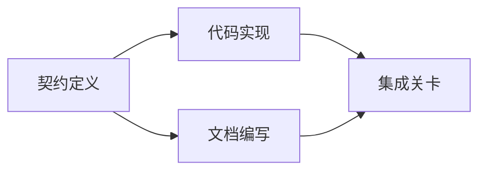

# 构建基于证据的执行计划

> 计划绝不是一份更美观的待办清单（To-do list）。它是一张依赖图：其中的每一项改动都有理有据，每一个终端节点都有明确的验证证明。

**Type:** Learn + Build
**Languages:** Python (stdlib)
**Prerequisites:** Phase 14 第 43 课
**Time:** ~65 分钟

## 学习目标

- 将任务框架转化为带有客观证据与验证证明的工作项。
- 将执行顺序建模为依赖关系图，而非散文式的线性步骤。
- 在修改代码之前检测缺失的事实、未知的依赖以及循环依赖。
- 区分哪些步骤可以并行执行，哪些步骤必须按序等待。

## 为什么智能体的计划常常失败

脆弱的计划只是用将来时态把用户需求复述一遍：

1. 更新 API。
2. 添加测试。
3. 更新文档。

这串清单中没有说明发现了什么代码事实、为什么修改这些文件是正确的、哪份契约需要优先修改，也没有说明哪些工作可以并发进行。智能体就算百分之百照做，最终依然可能导致大量返工。

一份扎实的计划对每个工作项（Work Item）都做出五项承诺：

| 承诺要素 | 核心作用 |
|---|---|
| 标识符（Identifier） | 用于依赖声明与会话交接（Handoff）的稳定引用 |
| 变更内容（Change） | 最小颗粒度的行为或契约改动 |
| 事实证据（Evidence） | 证明该变更合情合理且必要据实的代码库证据 |
| 前置依赖（Dependencies） | 必须率先完成并成立的前置工作项 |
| 验收证明（Proof） | 能够确凿宣告该工作项闭环的检查手段 |

## 在具体实现之前先规划契约

当多个不同的代码表面依赖同一种行为时，必须优先定义该行为契约。这样一来，测试、实现、文档与集成就可以共享同一份契约，而不是各自臆造出四种互不兼容的版本。



这张依赖图清晰揭示了安全并发的可能性：在契约固定之后，代码实现与文档编写可以并行推进，而最终的集成阶段则等待两者全部就绪。

## 事实证据应当具备改变计划的能力

代码库事实绝非可有可无的点缀，它必须能够切实影响工作规划：

- 发现已存在的辅助函数，从而取消原本计划新建的抽象层。
- 兼容性测试的存在，迫使计划中必须增加一步数据迁移。
- 部署环境的约束，将模式（Schema）变更拆分到另一个独立任务中。
- 公共响应类型的格式，改变了代码实现与文档编写的先后顺序。

如果一份所谓的证据根本无法改变你的计划，那它很可能根本不是支撑该决策的有效证据。

## 面向会话中断而设计

编码智能体的会话往往会毫无预警地中断。一个具备可恢复性（Resumable）的计划，其工作项粒度足够细致，使得另一个会话接入时能够立即判断：

- 哪项工作已经完成；
- 哪项验收证明已经跑通；
- 哪些产物文件已被修改；
- 哪些依赖项现已解除阻塞；
- 下一个可以安全执行的工作项是什么。

切勿把执行状态仅仅存放在聊天窗口里的勾选框中。务必将计划与工作成果一同保存在工作区磁盘中。

## 计划有效性校验

在正式执行前，若出现以下情况应直接拒绝计划：

- 存在重复的工作项标识符；
- 某个工作项缺乏事实证据支撑；
- 某个工作项缺乏验收证明；
- 依赖项指向了一个不存在的工作项；
- 依赖图中存在循环依赖（Cycle）；
- 在相关不确定性尚未消除之前，就安排了第一个不可逆操作。

前五项检查可以通过程序机械化自动完成；最后一项则需要工程判断力，应当在评审中明确强调。

## 构建它

`code/main.py` 建模了工作项，校验其证据凭证，通过拓扑排序计算执行波次（Execution Waves），并将结果写入 `outputs/evidence-plan.json`。

运行命令：

```bash
python3 code/main.py
python3 -m unittest discover code/tests -v
```

本示例会生成三个执行波次：首先执行契约定义；随后代码实现与文档编写并发运行；最后运行集成关卡。

## 配合编码智能体使用

在允许智能体修改代码文件之前，要求它先输出这份计划。从三个维度评审计划：

1. 每一个路径和行为主张是否都有具体的代码库凭证支撑。
2. 每一个工作项是否都有一个清晰单一的完工证明。
3. 依赖图是否将昂贵或不可逆的工作推迟到其依赖的不确定性消除之后。

审批的是具体清晰的计划，而不是一句空洞的“我会小心行事”。

## 练习

1. 添加一个需要显式人类批准的数据库迁移工作项。
2. 构造一个循环依赖，并解释它背后隐藏的产品分歧。
3. 拆分一个包含两条不同证明命令的工作项。
4. 添加一个可以在第二波次运行、且不触碰任何既有分支的工作项。
5. 将计划渲染为 Markdown 格式展示，同时保持 JSON 作为单一事实来源。

## 延伸阅读

- [Nuseibeh and Easterbrook, Requirements Engineering: A Roadmap](https://www.cs.toronto.edu/~sme/papers/2000/ICSE2000.pdf)：探讨目标、规范、共识与演化之间的迭代关系。
- [Barry Boehm, A Spiral Model of Software Development and Enhancement](https://dl.acm.org/doi/10.1145/12944.12948)：阐述如何围绕风险化解（而非僵化的线性序列）来组织研发过程。

## 交付物与沉淀

请妥善保留生成的 `outputs/evidence-plan.json`。它将作为下一节课中任务委托的契约依据。
