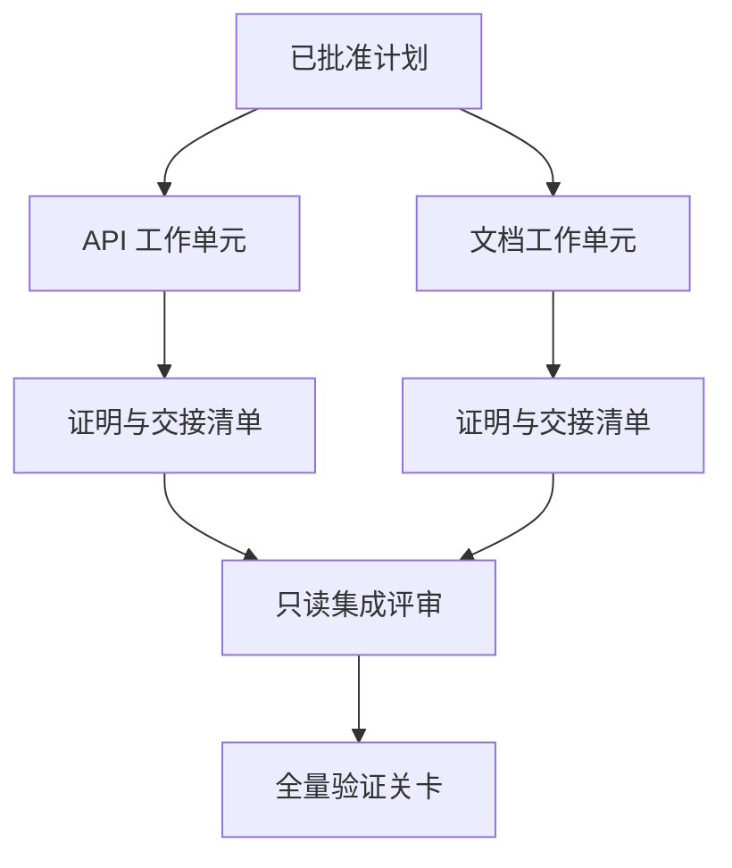

# 带隔离与合并契约的 Agent 委托

> 并行智能体只有在工作真正相互独立时才能节省物理时间。否则，它们只会把一个清晰的任务变成协调成本更高、失败速度更快的协同灾难。

**Type:** Learn + Build
**Languages:** Python (stdlib)
**Prerequisites:** Phase 14 第 39 课与第 44 课
**Time:** ~70 分钟

## 学习目标

- 依据真正的独立性判断任务委托与并行是否合理。
- 为每个工作单元（Worker）赋予排他的文件修改权限与显式完工证明。
- 基于依赖关系计算安全的执行波次（Execution Waves）。
- 设计合并契约（Merge Contract）以安全融合多个智能体的工作产物。

## 并行性检验标准

不要仅仅因为有更多智能体可用就盲目进行任务委托。只有当满足以下至少一项条件时，委托才具备合理性：

- 两项调查能够独立解答不同的未知问题；
- 两项代码实现拥有互不重叠的文件路径与契约接口；
- 评审智能体（Reviewer）能够在不修改产物的前提下独立进行检查；
- 耗时较长的外部检查可以在本地工作推进的同时后台运行。

当多个智能体需要修改相同的文件、依赖同一个未解决的决策，或依赖同一个易变的可变环境时，必须坚持串行执行。

## 工作单元就是一份契约

每个被委托的工作单元都需要明确规定：

| 字段 | 含义 |
|---|---|
| 目标（Goal） | 单一可观测的结果 |
| 负责人（Owner） | 单一负责执行的工作智能体 |
| 路径（Paths） | 排他的写入所有权 |
| 前置依赖（Dependencies） | 启动前必须已完工的前置单元 |
| 证明（Proof） | 返回给集成者的确凿验证证据 |
| 交接清单（Handoff） | 已修改的文件、已做出的决策以及残留风险 |

“处理后端逻辑”不是合格的工作单元。“在 `app/accounts.py` 中实现重复项检查并通过针对账户的专项测试进行证明”才是合格的工作单元。

## 隔离的三层体系

1. **文件系统隔离（Filesystem isolation）：** 独立的工作树（Worktrees）或沙箱，防止发生意外的并发共享写入。
2. **所有权隔离（Ownership isolation）：** 严格的契约限制，防止两个智能体故意修改同一路径。
3. **状态隔离（State isolation）：** 独立的日志与输出目录，防止一个智能体覆盖另一个智能体沉淀的证据。

文件系统隔离无法解决设计所有权问题。两个干干净净的工作树依然可能产出彼此冲突的架构设计。合并契约必须在工作开始之前就彻底厘清共享接口。



## 集成者不负责重构代码

集成者（Integrator）的职责应当是：

1. 确认每个交接成果均严格落在其分配的范围之内；
2. 认真审查验证证明的输出，而不是仅仅盲信工作智能体自己写的摘要；
3. 按照依赖关系的时序依次合并改动；
4. 运行覆盖跨单元的全量验证关卡；
5. 坚决拒绝任何隐蔽的范围蔓延（Scope expansion）；
6. 将冲突记录为需要解决的新决策，而不是私下默默顺手修改。

如果集成阶段需要重写某个工作智能体的大部分代码产物，说明最初的任务分解本身就是错误的。

## 人类与智能体的角色分工

任务委托并不意味着摒弃人类判断力。人类依然牢牢掌握着那些会改变系统外部行为、风险等级、安全权限或带来不可逆成本的核心决策。智能体则负责在有界范围内开展调查、实现、验证与审查。

这就是**校准型自主（Calibrated Autonomy）**：系统在证据充分且容易回滚的地方给予智能体高度自由，在后果严重的关键环节则强制设立人类检查关卡。

## 构建它

本课的实验程序将检查路径重叠、验证依赖关系、计算安全的执行波次，并将结果输出到 `outputs/delegation-plan.json`。

运行命令：

```bash
python3 code/main.py
python3 -m unittest discover code/tests -v
```

尝试修改文档单元，让它拥有 `app/` 目录的所有权。由于该父路径与 API 单元存在重叠，计划应当被自动拦截并报错。

## 练习

1. 将一项真实的业务变更拆分为两个独立的子工作单元和一个集成者角色。
2. 找出一个表面看似独立但实际上耦合的并行拆分方案，明确指出它们共享的隐性决策。
3. 增加一个只读的研究型智能体（Research Worker），其产物为一份事实表格。
4. 增加一个合并关卡（Merge Gate），对照所有工作单元契约检查最终修改的文件集合。
5. 为工作单元定义取消规则：当其前置依赖失效时，及时中止后续执行。

## 延伸阅读

- [Reid Smith, The Contract Net Protocol](https://doi.org/10.1109/TC.1980.1675516)：分布式任务分配与结果汇报的早期形式化经典研究。
- [Eric Horvitz, Principles of Mixed-Initiative User Interfaces](https://dl.acm.org/doi/10.1145/302979.303030)：探讨自动化机制何时应当自主行动、何时应当将控制权交还给人类。

## 交付物与沉淀

请妥善保留生成的 `outputs/delegation-plan.json`。它记录了拆分方案为何安全、每个路径归谁所有，以及集成必须验收何种证明。
