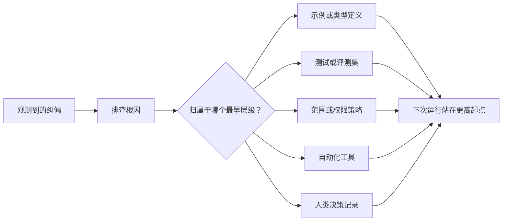

# 将每次 Agent 纠偏转化为系统改进

> 仅停留在聊天记录里的纠偏只能修好当前这一次运行。而沉淀进测试、边界策略、示例或工具中的控制机制，则能让每一次后续运行都变得更好。

**Type:** Learn + Build
**Languages:** Python (stdlib)
**Prerequisites:** Phase 14 第 37 至 41 课
**Time:** ~65 分钟

## 学习目标

- 将针对智能体的临时纠偏转化为长效持久的系统控制机制。
- 将每个控制机制安放在能够防止问题复发的最早层级（Earliest layer）。
- 使用稳定的指纹特征对重复吸取的教训进行去重。
- 及时退役那些不再对应现实风险的陈旧控制规则。

## 纠偏本身就是宝贵的证据

当你对智能体说“不要编辑那个文件”时，你实际上已经发现：现有的范围边界（Scope boundary）缺乏可执行的约束。当你指出“这个输出格式错误”时，你实际上发现缺少了标准示例或自动化测试。当环境配置再次报错时，你意识到环境初始化知识应当沉淀进自动化脚本中。

应当把对智能体的纠偏视为对工作系统本身缺陷的观测洞察，而不是当成写 Prompt 时的单次语法失误。

## 提升沉淀到最早的有效层级

遵循以下控制优先级：

| 频发故障类型 | 长效沉淀去处 |
|---|---|
| 错误计算结果或代码回归 | 自动化测试或评测集（Test / Evaluation） |
| 超范围越界或不安全操作 | 范围契约或权限策略（Scope / Permission Policy） |
| 重复出现的环境配置或命令错误 | 自动化脚本或专用工具（Automation / Tool） |
| 重复出现的输出格式错误 | 标准规范示例外加数据校验器（Canonical Example + Validator） |
| 模糊不清的本地工程惯例 | 附带具体场景检查的指令（Instruction + Scenario Check） |
| 产品层面的分歧与争议 | 人类决策记录（Human Decision Record） |

越早生效的控制机制成本越低。一个从类型系统层面杜绝无效状态的类型定义，远比后续代码评审时的批评提醒更坚固；一个针对性的单元测试，也远比在 Prompt 里苦口婆心写一段长篇大论要求智能体“牢记”有效得多。



## 反馈棘轮记录（The Ratchet Record）

完整的记录应当包含：

- 故障表象（Symptom）；
- 根因分析（Root cause）；
- 造成的后果（Consequence）；
- 重复出现次数（Recurrence count）；
- 所选的控制机制（Chosen control）；
- 该控制机制的验证方式（Verification）；
- 责任人（Owner）；
- 审查或退役日期（Review / Retire date）。

不要将每一次临时的个人偏好都永久固化。只有当问题的复发频率或潜在后果严重性足以证明增加长期维护复杂度的合理性时，才将其提升为永久控制机制。

## 区分根因与表象

“智能体修改了 README”只是表象。其背后的根因可能有：

- 任务框架允许修改整个代码库根目录；
- 文档文件被默认为总是可以安全编辑的；
- 执行计划将功能实现与文档编写捆绑在了一起；
- 两个工作智能体存在重叠的文件所有权。

不同的根因对应完全不同的控制手段。如果仅仅机械地写一条照抄表象的禁令，当下一次同类问题以稍微变换的形式出现时，系统依然会再度失守。

## 控制规则同样会衰退

陈旧的控制规则会产生冲突、膨胀上下文窗口，并固化那些早已不复存在的旧系统包袱。每一条被提升沉淀的规则都需要定期的退役检查。在以下情况下应果断删除或重写：

- 底层架构已经发生改变；
- 出现了更强大的可执行控制机制将其取代；
- 在相当长的时间窗口内该故障从未复发；
- 该规则造成的阻碍与摩擦已经超过了它所防范的风险本身。

工程的目标绝不是写出最冗长的指令文件，而是用最小化的系统机制守护住那些来之不易的工程判断力。

## 构建它

本课的实验程序将对纠偏进行分类、将其提升为控制机制、为重复项生成指纹去重，并将成果写入 `outputs/feedback-ratchet.json`。

运行命令：

```bash
python3 code/main.py
python3 -m unittest discover code/tests -v
```

尝试输入两条表述不同但根因相同的纠偏记录。持续优化归一化逻辑，直到它们能够合并为一个统一的控制机制，同时又不误合并无关的故障。

## 练习

1. 从最近的编码会话中挑出五条纠偏反馈，分析并归纳它们真正的落脚层级。
2. 将一条散文式的文本规则重构为一个可执行的自动化测试。
3. 增加后果权重（Consequence weighting）评估，使严重的高危首发错误也能被立即提升为常设控制。
4. 在实验输出中为每条控制机制补充负责人与退役时间。
5. 审查现有的一条智能体指令，并在证明已有更强控制机制存在的前提下将其删除。

## 延伸阅读

- [Basili, Caldiera, and Rombach, The Goal Question Metric Approach](https://www.cs.toronto.edu/~sme/CSC444F/handouts/GQM-paper.pdf)：探讨如何将高阶目标转化为问题与可操作的度量指标。
- [Shinn et al., Reflexion](https://arxiv.org/abs/2303.11366)：介绍如何利用反馈追踪提升后续决策质量，而无需微调模型权重。
- [Madaan et al., Self-Refine](https://arxiv.org/abs/2303.17651)：在任务闭环内部实施迭代式反馈与自我修正。

## 交付物与沉淀

请妥善保留生成的 `outputs/feedback-ratchet.json`。它是智能体辅助工程路径的长效收尾成果，也是未来进一步演化 Workbench 的核心输入。
