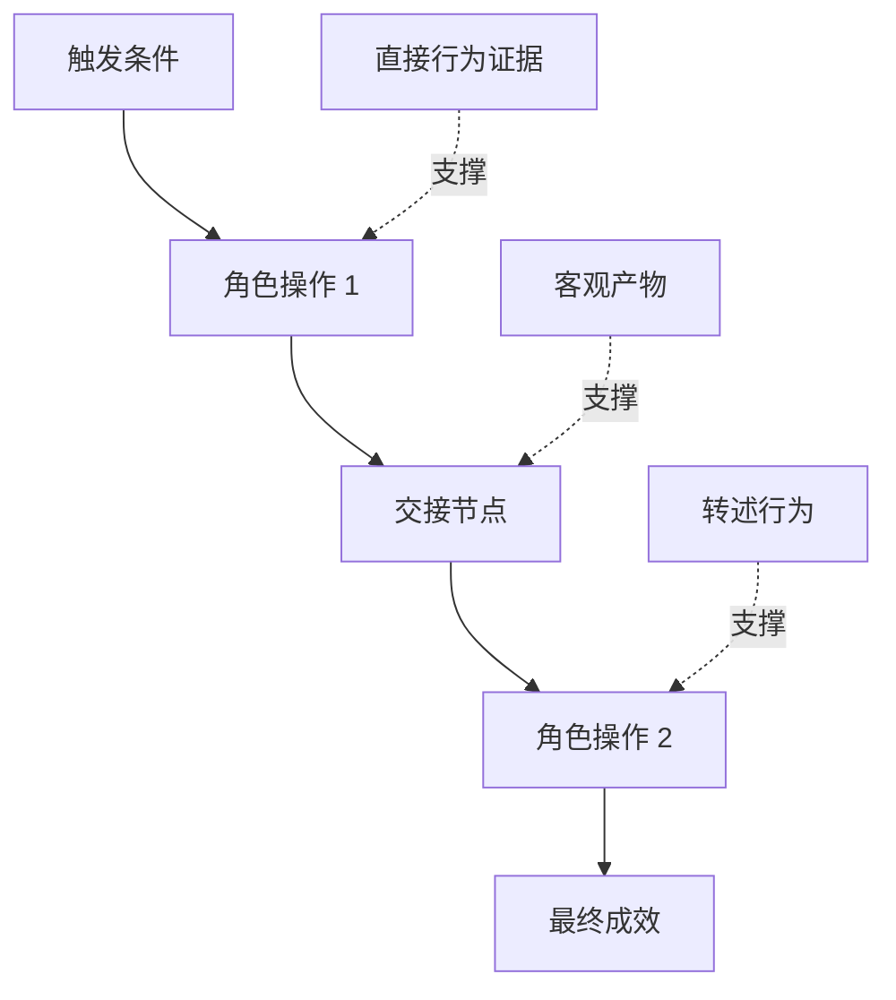

# 发掘人们真正执行的工作流

> 真实的需求从来不会老老实实坐在会议室里等你来“收集”。它们零散散落于人们的实际动作、变通手段、历史记录以及各种分歧之中。

**Type:** Learn + Build
**Languages:** Python (stdlib)
**Prerequisites:** Phase 14 第 47 课
**Time:** ~70 分钟

## 学习目标

- 将现有工作流建模为由确凿证据支撑的有序动作序列。
- 严格区分直接观测到的事实与转述的或推断出的行为。
- 定位流程中的摩擦阻力（Friction）、交接节点（Handoffs）、审批权限（Authority）以及隐性状态（Hidden state）。
- 保持不确定主张的显式可见性，而非轻率地将其直接转变为硬性需求。

## 从现有系统出发

切勿一开始就询问用户“想要什么功能”。你应该做的是还原现在究竟发生了什么。

针对工作流中的每一个步骤，记录以下字段：

| 字段 | 示例 |
|---|---|
| 执行角色（Actor） | 值班工程师 |
| 触发条件（Trigger） | 生产环境告警到达 |
| 具体操作（Action） | 打开告警详情，随后在监控看板中搜索 |
| 输入信息（Input） | 告警 Payload 与发布记录 |
| 产出结果（Output） | 疑似故障服务及责任人 |
| 摩擦阻力（Friction） | 在三个不同运维工具之间来回切换上下文 |
| 审批权限（Authority） | 事故指挥官批准执行写入操作 |
| 支撑证据（Evidence） | 屏幕录像、事故复盘日志、运维手册 |

真实的工作流远比屏幕上看到的界面更广阔。它包括了等待时间、复制粘贴、线下私聊、审批流程、错误恢复，以及那些人们早已习以为常甚至注意不到的琐碎动作。

## 证据是有强弱层级的

建立简单的证据阶梯（Evidence Ladder）：

1. **直接行为（Direct behavior）：** 现场观测、系统调用追踪（Trace）、屏幕录屏或系统事件日志。
2. **客观产物（Artifact）：** 工单记录、运维手册、审计日志、表单或已完成的成果文件。
3. **转述行为（Reported behavior）：** 人们口头描述他们通常做什么。
4. **主观推断（Inference）：** 团队推断“大概率会发生什么”。

这四种信息来源都有价值，但只有前两者能直接证实当前的实际行为。必须给后两者打上显式标签，防止团队对事实的盲目自信被悄悄放大。



## 重点搜寻四大要素

- **摩擦阻力（Friction）：** 重复的繁琐劳动、无谓的等待延迟、数据的重复录入或繁琐的故障恢复。
- **隐性状态（Hidden state）：** 仅留存于员工脑海、即时通讯聊天记录或个人私人笔记中的信息事实。
- **审批权限（Authority）：** 有权做出高后果重大决定的具体人员或受控系统。
- **异常分支（Exceptions）：** 正常流程发生中断、不再按部就班运作的边缘情况。

AI 功能之所以经常在交接与异常处理时崩溃，往往是因为最初仅仅针对“一切顺利的理想路径（Happy path）”进行了设计。

## 切勿通过“求平均”抹杀分歧

两个用户采用截然不同的操作流程，往往有极其正当的理由。在充分理解其深层成因之前，应当完整保留这些分支变体，因为它们可能代表着：

- 不同的组织角色与权责；
- 不同的风险容忍等级；
- 遗留旧流程与当前新流程的交替；
- 专业经验与熟练度的差异；
- 真正的业务策略与治理分歧。

一个被强行“平均化”折中的工作流，往往无法描述任何一个真实的人。

## 构建它

本课的实验程序为工作流的每一步记录证据凭据，校验执行顺序与置信度，计算直接证据占比（Direct-evidence ratio），并将结果写入 `outputs/workflow-evidence.json`。

运行命令：

```bash
python3 code/main.py
python3 -m unittest discover code/tests -v
```

尝试增加一条“部署记录缺失”的异常分支路径。保持主流程顺序不变，并清晰记录该分支的起点位置。

## 练习

1. 不访谈任何人员，仅凭一份系统运行日志还原出一个完整的工作流。
2. 访谈一位真实用户，标注出其主张中所有仍缺乏直接客观证据支撑的陈述。
3. 增加一处权限审批边界（Authority boundary）和一步故障恢复流程。
4. 针对同一场景建模出两种不同的流程变体，而不将它们强行合并。
5. 找出某个提议的新功能：它虽然表面上消除了一步可见操作，但完全没有触及背后的隐性工作。

## 延伸阅读

- [Nuseibeh and Easterbrook, Requirements Engineering: A Roadmap](https://www.cs.toronto.edu/~sme/papers/2000/ICSE2000.pdf)：尤其重点参考其关于需求获取是“诠释、建模与验证”而非简单“信息抓取”的深刻论述。
- [Gotel and Finkelstein, An Analysis of the Requirements Traceability Problem](https://doi.org/10.1109/ICRE.1994.292398)：剖析了维护需求与其源头依据之间追踪关系的严峻挑战。

## 交付物与沉淀

请妥善保留生成的 `outputs/workflow-evidence.json`。在下一节课中，它将把所观测到的摩擦阻力与不确定性转化为一份假设图谱（Assumption map）。
