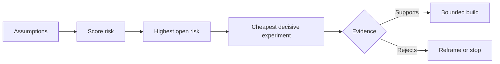

# 梳理假设并优先化解最高风险

> 产品路线图（Roadmap）往往把不确定性掩盖在功能列表之中；而假设图谱（Assumption Map）则会揭示：在这些功能值得被构建之前，必须先证实哪些前提条件成立。

**Type:** Learn + Build
**Languages:** Python (stdlib)
**Prerequisites:** Phase 14 lesson 48
**Time:** ~65 minutes

## 学习目标

- 将拟议的工作拆解并转化为明确、显式的假设（Assumptions）。
- 分别对影响程度（Impact）、不确定性（Uncertainty）和不可逆性（Irreversibility）进行多维独立评分。
- 根据风险排序选择下一个实验，而非凭主观热情驱动。
- 用实证和确定的决策结论替换已测试的假设。

## 每次构建本质上都是一场押注

一套故障排查工具（Incident Tool）的价值，可能取决于下列每一项前置假设是否全部成立：

- 警报上下文包含足够的信息来识别故障服务；
- 工程师信任他们并非亲手推导得出的推荐结果；
- 预期的响应时间在运维层面上确实至关重要；
- 可以在不引入不安全权限（Unsafe Authority）的前提下访问所需数据；
- 该工作流的发生频率足够高，能够证明维护该系统的成本是合理的。

这些都不是单纯的代码实现任务（Implementation Tasks），而是让构建变得有价值（Valuable）、可用（Usable）、可行（Feasible）和安全（Safe）的前提条件。

## 假设的类别

| 类别 | 核心问题 |
|---|---|
| 价值（Value） | 产出的最终结果是否足够重要？ |
| 可用性（Usability） | 用户能否理解并据此采取行动？ |
| 可行性（Feasibility） | 现有系统能否利用可获取的数据和约束产出该结果？ |
| 存续性（Viability） | 组织能否长期承受其成本、归属权与运维负担？ |
| 安全性（Safety） | 系统出现故障时是否不会造成无法接受的后果？ |

将假设写成可证伪的陈述（Falsifiable Statements）。所谓“可证伪”，是指假设在逻辑上能够被明确的观测事实所推翻。“该功能很有用”无法被测试；而“10 位值班工程师中有 8 位能够借助只读分析结果更快定位到正确服务”则是可证伪、可检验的。

## 风险并非单一维度的数字

本实验从 1 到 5 分评估三个维度：

- **影响（Impact）：** 若该假设不成立，对系统或业务造成的破坏程度。
- **不确定性（Uncertainty）：** 当前掌握证据的薄弱程度。
- **不可逆性（Irreversibility）：** 在做出重大承诺或投入后才发现错误的返工成本。

示例评分将影响与不确定性相乘，再加上不可逆性。该公式并非放之四海皆准的标准，其目的是迫使团队清晰阐明为什么某项未知必须优先于另一项未知化解。



## 设计实验，而非确认仪式

一个真正有价值的实验具有以下要素：

- 一个可能被证伪的主张；
- 真实的受众群体或具有代表性的采样样本；
- 一项可观测的客观结果；
- 在看到结果前就预先敲定的评判阈值；
- 针对通过、失败和模糊证据各自明确的下一步决策路径。

避免设计那种仅仅用来证明团队“有能力把这个想法做出来”的确认仪式型测试。

## 可逆性会改变构建顺序

后果严重且不可逆的选择需要更早获得证据支持。只读重放（Read-only Replay）应当先于生产环境集成；临时适配器可以先于大规模数据迁移；经人工审批的建议应当先于全自动执行。

系统构建的推进节奏，应当与不确定性化解的节奏保持一致。

## 动手实现

本实验对假设进行排序，区分已验证与未决的断言，挑选出风险最高的未决假设，并生成 `outputs/assumption-map.json`。

```bash
python3 code/main.py
python3 -m unittest discover code/tests -v
```

修改最高风险假设上的证据状态，观察系统推荐的下一个实验将如何动态调整。

## 课后练习

1. 为你正准备构建的一个功能写出五个关键假设。
2. 补充一条你原本的功能列表中遗漏的安全性假设。
3. 设定一个会让你果断终止本次构建的硬性阈值。
4. 将一个原本庞大的验证实验替换为成本更低且具备决定性的测试。
5. 对比风险优先级与原本的产品路线图优先级，并解释二者为何存在错位。

## 延伸阅读

- [Barry Boehm, A Spiral Model of Software Development and Enhancement](https://dl.acm.org/doi/10.1145/12944.12948)，探讨在进行更深层次投入前化解不确定性的风险驱动开发循环。
- [Dardenne, van Lamsweerde, and Fickas, Goal-Directed Requirements Acquisition](https://doi.org/10.1016/0167-6423(93)90021-G)，探讨在逐步暴露障碍和约束的同时精炼系统目标。

## 交付物沉淀

保留 `outputs/assumption-map.json`。下一节课将借助该文件选择能够产出决定性证据的最小切片。
