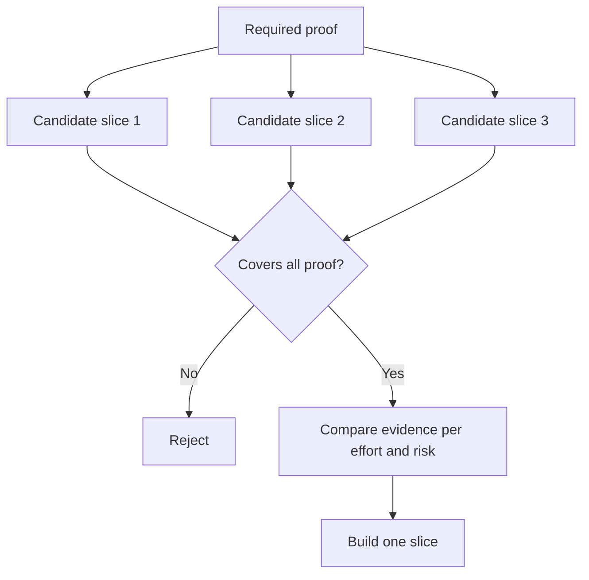

# 选择能够改变决策的最小切片

> 只有当“小”能够证明关键问题时，精简才具备价值。一个无法改变下一步决策的微小构建，充其量只是个半成品。

**Type:** Learn + Build
**Languages:** Python (stdlib)
**Prerequisites:** Phase 14 lesson 49
**Time:** ~65 minutes

## 学习目标

- 依据切片所能证明的核心假设来定义切片（Slice）。
- 权衡结果价值（Outcome Value）、不确定性化解、研发投入与潜在后果。
- 优先选择可逆的实证证据，而非过早做出生产环境承诺。
- 果断否决那些刻意回避工作流高风险环节的伪切片。

## 垂直切片意味着端到端的实证

垂直切片（Vertical Slice）是指跨越观测某一结果所需的最小真实工作流。它在用户数量、数据规模、运行周期和功能范围上可以非常狭窄，但绝不能为了偷懒而剔除你恰恰需要测试的核心不确定性。

示例：

- 基于 10 起真实故障的只读重放（Read-only Replay），能够检验服务识别准确度与操作员的信任度。
- 基于合成数据搭建的精美仪表盘，或许能检验界面理解度，却完全无法测试数据获取的可行性。
- 生产环境下的全自动故障修复器，试图一次性测试所有环节，却带来了无法承受的巨大破坏风险。

## 先明确必要证据集

提取风险最高的未决假设，将其转化为“必要证据集（Required Proof Set）”。候选切片只有在完全覆盖该证据集时，才具备入选资格（Eligibility）。

随后在合格的切片之间进行对比评估：

| 评估维度 | 期望方向 |
|---|---|
| 产出价值（Outcome value） | 越大越好 |
| 化解的不确定性（Uncertainty reduced） | 越多越好 |
| 研发投入（Effort） | 越小越好 |
| 潜在后果（Consequence） | 越轻越好 |
| 可逆性（Reversibility） | 越高越好 |

本实验采用的评分模型刻意保持简单，因为资格准入门槛（Eligibility Gate）远比数字运算本身更重要。



## 常见的伪极小值陷阱

- **纯界面极小值（UI-only minimum）：** 避开了最关键的数据获取与运维不确定性。
- **纯基础设施极小值（Infrastructure-only minimum）：** 证明了技术可行性，却无法检验用户价值。
- **纯顺境极小值（Happy-path minimum）：** 刻意省略了构成大部分风险的异常边界处理。
- **演示极小值（Demo minimum）：** 产出了极具说服力的演示产物，却无法提供可复现的量化评估。
- **平台化极小值（Platform minimum）：** 在单个工作流尚未证实其价值之前，就过早构建通用复用组件。

## 预先设定停止规则

在着手实现之前，必须提前书面写明如果该切片测试失败将采取的对策（Stop Rule）：

- 放弃该预期结果；
- 更换目标用户群体或业务场景；
- 测试替代的技术机制；
- 收集质量更高的底层证据；
- 进一步收窄系统的执行权限。

如果每种测试结果最终都导向“继续构建”，那么该切片根本就不是一个真正的实验。

## 动手实现

本实验根据必要证据集过滤候选切片，对合格切片进行评分，并输出 `outputs/slice-decision.json`。

```bash
python3 code/main.py
python3 -m unittest discover code/tests -v
```

尝试添加一个成本更低但仅能验证单项必要假设的候选切片。观察它即使数值总分极高，为何依然会直接被资格门禁拦截。

## 课后练习

1. 针对同一预期成果，设计三个对应不同后果风险等级的验证切片。
2. 在对候选切片评分之前，清晰列出其必要证据集。
3. 尝试裁撤一项功能，同时确保能够保留关键决定性证据。
4. 为试点方案补充一条切实可行的停止规则。
5. 找出某个理应推迟到切片验证之后再启动的通用平台组件。

## 延伸阅读

- [Barry Boehm, A Spiral Model of Software Development and Enhancement](https://dl.acm.org/doi/10.1145/12944.12948)，探讨如何使每个开发迭代循环与当前必须化解的风险相匹配。
- [Lenarduzzi and Taibi, MVP Explained: A Systematic Mapping Study on the Definitions of Minimal Viable Product](https://arxiv.org/abs/1609.07592)，剖析软件工程实践中对“最小”与“可行”界定的模糊性。

## 交付物沉淀

保留 `outputs/slice-decision.json`。该文件记录了该切片之所以是能够改变决策的最小切片的论证依据。
