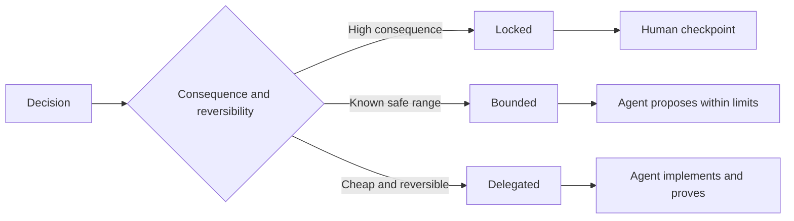

# 编写保留自主裁量权的任务规范

> 有价值的规范应当固定不变量与验证证据，同时对可逆的实现选择保持开放。它是决策的边界契约，而不是按部就班的剧本。

**Type:** Learn + Build
**Languages:** Python (stdlib)
**Prerequisites:** Phase 14 lesson 50
**Time:** ~75 minutes

## 学习目标

- 将预期产出、不变量（Invariants）、范例、非目标（Non-goals）与验证证据清晰分层。
- 将决策划分为锁定（Locked）、受限（Bounded）与委派（Delegated）三种模式。
- 在选择成本低且高度可逆的环节，充分保留 Agent 的自主裁量权。
- 在涉及严重后果或破坏公共行为的节点，强制设置人工审核检查点（Human Checkpoints）。

## 两种糟糕的极端

规范不足（Underspecified）的任务迫使 Agent 凭空猜测系统行为；而过度规范（Overspecified）的任务则让 Agent 机械照抄可能本身就存在缺陷的具体设计。

行之有效的折中方案是**可执行契约（Executable Contract）**：

| 规范要素 | 核心作用 |
|---|---|
| 预期产出（Outcome） | 可直接观测的最终交付结果 |
| 不变量（Invariants） | 必须始终严格成立的前置与后置约束 |
| 范例（Examples） | 能够直观展现真实意图的具体用例 |
| 非目标（Non-goals） | 明确刻意排除在外的周边行为 |
| 决策策略（Decision policy） | 标明哪些选择属于锁定、受限或完全委派 |
| 验证证据（Proof） | 任务验收前必须提供的测试或观测实据 |

## 三种决策模式

- **锁定（Locked）：** 严禁 Agent 擅自抉择。适用于公共兼容性、写权限、安全红线、不可逆成本或核心产品承诺。
- **受限（Bounded）：** 允许 Agent 在明确界定的安全区间内自主选择。适用于搜索预算、重试次数上限、白名单依赖库或既定接口族。
- **委派（Delegated）：** 授权 Agent 全权裁量并附带解释说明。适用于局部代码结构、命名规范、可逆重构及内部实现细节。



## 通过具体范例界定行为

用具体范例传递意图，远比堆砌形容词高效得多。“友好的”、“健壮的”、“生产就绪的”都不是可执行的标准。一组精炼的常规样例、边缘样例、故障样例和严禁样例，能为开发者和校验器提供清晰明确的依据。

范例无法替代不变量：单次通过的成功用例，不能证明通用的全局安全规则得到保证。

## 验证证据必须与声明级别匹配

- 单元测试（Unit Test）用于证明局部函数契约。
- 传输协议测试（Wire Test）用于证明序列化与网络通信行为。
- 浏览器旅程（Browser Journey）用于证明端到端的用户界面路径。
- 重放测试集（Replay Set）用于证明系统在代表性场景中的整体表现。
- 审计日志（Audit Log）用于证明系统的权限边界始终生效。

绝不要将低层级的测试作为高层级声明的验收证据。

## 刻意保留合理的未知空间

规范可以明确声明：“具体实现可任选满足时延预算的任意只读数据源。”这绝非含糊其辞，而是一项带有清晰边界与证据约束的显式委派决策。

随着认知证据的累积，规范应当与时俱进。记录锁定与受限选择背后的底层原因，后续团队才能在无需“代码考古”的情况下清晰调整决策。

## 动手实现

本实验校验规范契约的每个维度，检查决策模式的合法性，并生成 `outputs/executable-specification.json`。

```bash
python3 code/main.py
python3 -m unittest discover code/tests -v
```

尝试将生产环境写权限从“锁定”调整为“委派”。分析为什么数据 Schema 能够通过校验，而产品层面的风险控制却坚决不允许这种变更。

## 课后练习

1. 将一个遗留的待办工单转换为规范契约的六大维度。
2. 用一条不变量规则加两个典型范例，替换掉三条繁琐的指令描述。
3. 标注任务中的每项决策，并为每处锁定或受限的选择说明理由。
4. 为规范中的每条不变量补充对应的验证证据凭据。
5. 找出一条既无实据支撑又无论据依据的冗余约束并将其删除。

## 延伸阅读

- [Nuseibeh and Easterbrook, Requirements Engineering: A Roadmap](https://www.cs.toronto.edu/~sme/papers/2000/ICSE2000.pdf)，论述目标、精确规范、验证、共识演进之间的系统关系。
- [Zave and Jackson, Four Dark Corners of Requirements Engineering](https://doi.org/10.1145/237432.237434)，深入剖析环境假设、系统需求与技术规范三者的本质区别。
- [Gotel and Finkelstein, An Analysis of the Requirements Traceability Problem](https://doi.org/10.1109/ICRE.1994.292398)，探讨如何保留需求产生的原因及其可追溯性。

## 交付物沉淀

保留 `outputs/executable-specification.json`。它将成为 Coding Agent 与人类评审人员共同遵循的协作契约。
