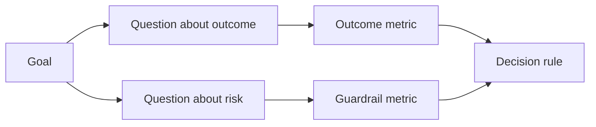

# 在结果产生前设计成功指标

> 度量指标应当服务于行动决策，而非仅仅作为仪表盘的装饰。从目标出发推导核心问题，进而挑选能够解答这些问题的最小指标集。

**Type:** Learn + Build
**Languages:** Python (stdlib)
**Prerequisites:** Phase 14 lessons 47 and 51
**Time:** ~70 minutes

## 学习目标

- 从预期成果目标推导出核心问题与度量指标。
- 在观测到实际结果前，预先敲定阈值、时间窗口、数据来源和优化方向。
- 将产出指标与护栏指标（Guardrails）及制衡指标（Counter-metrics）结对设计。
- 使评估证据与本次构建所需支撑的具体决策相匹配。

## 目标、问题与指标（GQM）

从目标（Goal）出发：

> 缩短定位受影响服务所需的时间，同时不增加任何不安全操作。

推导出问题（Question）：

- 定位正确服务的速度有多快？
- 定位出的服务准确率有多高？
- 诊断过程是否始终保持纯只读？
- 该工作流是否导致了警报被频繁忽略或操作员负担加重？

随后挑选将这些问题操作化（Operationalize）的指标（Metric）。



## 每个指标都需要规范契约

每一个指标都必须具备：

| 契约字段 | 示例 |
|---|---|
| 指标名称（Name） | `median_identification_seconds` |
| 方向（Direction） | 至多不超过（at most） |
| 阈值（Threshold） | 120 |
| 窗口（Window） | 10 次故障事件重放 |
| 数据源（Source） | 重放事件日志 |
| 统计样本（Population） | 参与试点的在岗工程师 |
| 类别（Kind） | 成果指标（outcome）或护栏指标（guardrail） |

若缺少数据来源与统计窗口，任何数字都无法复现；若缺少预设阈值，指标就无法驱动明确的决策。

## 成果指标、护栏指标与制衡指标

- **成果指标（Outcome metric）：** 期望改善的状态是否真正提升？
- **护栏指标（Guardrail）：** 固定的安全红线与约束条件是否始终守住？
- **制衡指标（Counter-metric）：** 局部的优化是否将隐性成本或破坏转移到了其他环节？

对于故障排查工作流，光快是不够的。准确率、生产写操作拦截、操作员工作负荷与警报遗漏率，共同构成了防止“迅速得出灾难性错误结论”的安全屏障。

## 离线证据与在线证据

离线重放（Offline Replay）非常适合检验可复现性与边缘场景覆盖率；受控试点（Bounded Pilot）则擅长检验真实人类行为、信任度建立与工作流上下游影响。二者互为补充，不可相互替代。

始终选择能够支撑当前决策的最低成本证据。绝不能仅仅因为“代码已经写好”就贸然将真实用户暴露给未知风险。

## 先于度量定决策

在看到统计结果之前，必须先书面确定通过、失败和模糊场景下的行动路径。否则，团队极易通过临时修改阈值来为既有的构建成果开脱。

示例规则：

- 通过（Pass）：服务定位准确率不低于 0.9，且定位耗时中位数不超过 120 秒；
- 失败（Fail）：出现任何非法的生产写操作，或定位准确率低于 0.75；
- 模糊（Ambiguous）：性能虽有微幅提升但方差极大，需要扩大重放样本集重新测试。

## 动手实现

本实验校验度量计划的完整性，评估包含边界的阈值，记录缺失指标，并输出 `outputs/measurement-report.json`。

```bash
python3 code/main.py
python3 -m unittest discover code/tests -v
```

尝试删除度量计划中的护栏指标，观察为什么即使成果指标依然存在，整个计划依然会被系统判定为非法。

## 课后练习

1. 从同一个成果目标出发，推导出三个不同侧重点的问题。
2. 补充一条能够捕获因当前优化而导致其他角色负担加重的制衡指标。
3. 为每个指标明确其数据源、统计样本群体与时间窗口。
4. 在生成实际数值之前，预先写下通过、失败和模糊三种情况下的决断。
5. 找出一个容易统计但根本无法改变任何决策的鸡肋指标，并将其剔除。

## 延伸阅读

- [Basili, Software Modeling and Measurement: The Goal/Question/Metric Paradigm](https://drum.lib.umd.edu/items/8119803a-362b-42ec-b6ce-2311713e7236)，介绍如何从明确的目标推导出可执行的度量体系（GQM 范式）。
- [Basili, Caldiera, and Rombach, The Goal Question Metric Approach](https://www.cs.toronto.edu/~sme/CSC444F/handouts/GQM-paper.pdf)，阐述将该方法作为闭环反馈与持续改进系统的实践。

## 交付物沉淀

保留 `outputs/measurement-report.json`。它将成为进入原型（Prototype）、试点（Pilot）或生产（Production）阶段的关键证据门禁。
