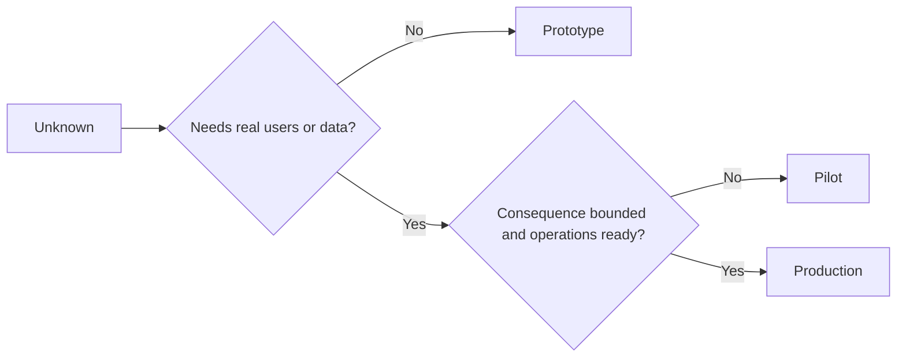

# 审慎抉择原型、试点还是生产

> 它们代表着截然不同的认知环境，而非单纯的精致度差异。选择能够以最低无谓代价解答当前未知的阶段。

**Type:** Learn + Build
**Languages:** Python (stdlib)
**Prerequisites:** Phase 14 lessons 50 to 52
**Time:** ~70 minutes

## 学习目标

- 依据未知类型、受众范围、数据敏感度、破坏后果与运维成熟度，审慎选择构建阶段。
- 制定各个阶段专属的管控措施（Controls）与退出准则（Exit Criteria）。
- 防止原型系统在无人担责的情况下悄悄演变为生产系统。
- 在证据和运维保障充分就绪之前，推迟授予系统真实的生产权限。

## 三个截然不同的核心问题

| 阶段 | 核心问题 |
|---|---|
| 原型（Prototype） | 该技术机制到底能不能产生预期的实证结果？ |
| 试点（Pilot） | 在受控真实受众与真实工况下，它能否安全稳定运行？ |
| 生产（Production） | 组织能否按照既定的可靠性与风险承诺，持续对该系统承担长期责任？ |

一个技术上极其完备的原型，仍然可以被设计为用后即弃的废弃物；一个试点可以使用真实生产数据，但其受众规模和操作权限必须严格受限；而只有当组织正式接盘并承担长效责任时，生产阶段才真正拉开序幕。

## 原型阶段

当需要解答的未知假设无需引入真实用户或真实生产数据时，采用原型阶段。保持原型：

- 随时可废弃（Discardable）；
- 严格隔离（Isolated）；
- 功能边界狭窄（Narrow in behavior）；
- 核心验证问题显式明确（Explicit about the learning question）；
- 不作虚假的运维稳定性承诺。

在机制本身尚未证明其值得进入下一阶段之前，不要过早优化整体系统架构。

## 试点阶段

当未知假设必须依赖真实操作行为、真实数据或真实工作流才能检验，但破坏后果或运维成熟度尚不足以支撑全面发布时，采用试点阶段。

一个合格的试点必须具备：

- 指定的试点受众；
- 明确的人类负责人；
- 严格受限的运行周期与操作权限；
- 审计追溯与快速回滚方案；
- 成果指标与护栏指标阈值；
- 明确针对扩容、修订或彻底终止的退出准则。

## 生产阶段

生产阶段绝不仅仅等同于将代码完成部署：

- 明确的服务等级目标（SLO）；
- 值班排班与故障事件处理责任人；
- 安全与隐私专项审查；
- 成本上限与吞吐容量管控；
- 完备的回滚与容灾恢复机制；
- 7x24 小时全天候监控；
- 清晰的退役与下线路径。



## 阶段漂移陷阱

当原型代码在尚未建立长效运维责任制的情况下，悄然获取了真实用户、敏感数据或核心操作权限时，就会变得极其危险。这种现象被称为**阶段漂移（Stage Drift）**。必须在系统配置、权限控制、遥测指标以及架构文档中强制划定原型与试点的硬性边界——单纯在界面上挂一个“测试版警告横幅”是远远不够的。

系统所处的阶段，应当能够在系统运行状态本身中直接被观测和校验。

## 动手实现

本实验根据决策上下文自动推荐合适阶段，返回各阶段所需的必要管控措施，并输出 `outputs/stage-decisions.json`。

```bash
python3 code/main.py
python3 -m unittest discover code/tests -v
```

将试点示例修改为“低破坏后果且具备运维成熟度”。思考并解释还需要补充哪些认知证据，才足以证明其能够正式晋级生产阶段。

## 课后练习

1. 按照认知探索阶段（而非单纯的代码部署状态），对你手头的三个现有项目进行重新归类。
2. 编写一份包含“果断终止”决断选项的试点退出准则。
3. 增加一项技术控制措施，从根本上防止原型代码触碰生产环境数据。
4. 找出第一项标志着系统真正转为生产级责任的运维职责。
5. 为受限试点设计一套完备的回滚操作凭证。

## 延伸阅读

- [Barry Boehm, A Spiral Model of Software Development and Enhancement](https://dl.acm.org/doi/10.1145/12944.12948)，探讨如何使每次迭代的资源投入与已化解的风险程度相匹配。
- [Fagerholm et al., Building Blocks for Continuous Experimentation](https://doi.org/10.1145/2601248.2601276)，剖析持续开展工程实验所需的组织流程与技术前提。

## 交付物沉淀

保留 `outputs/stage-decisions.json`。它记录了为何选择各个阶段的论证理由，以及进入下一阶段前必须落实的各项管控措施。
