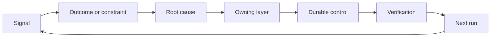

# 构建具备归属与退役机制的反馈棘轮

> 代码发布结束了当期的构建循环，同时开启了长期的学习循环。认知实证必须能够改变系统，否则它就只是无人认领的无用遥测。

**Type:** Learn + Build
**Languages:** Python (stdlib)
**Prerequisites:** Phase 14 lessons 46 and 53
**Time:** ~75 minutes

## 学习目标

- 将故障事件、评测数据、用户行为和纠偏反馈转化为具有责任归属的行动项。
- 将不同信号精准路由至上下文、评测集、安全策略、运行时或需求待办项。
- 根据严重程度与复现频次对复发风险进行优先级排序。
- 为每一处系统控制机制设定明确的退役条件（Retirement Condition）。

## 反馈本身也是基础设施

一个团队可以收集大量的系统链路追踪（Traces）、评测记录、支持工单和故障日志，却完全没有从中汲取任何认知教训。这其中缺失的关键机制是**晋级通道（Promotion）**：即从观测事实，通向具备明确责任人、验证证据的持久化系统变更的固定路径。

反馈棘轮（Feedback Ratchet）的闭环是：

1. 观测到具体的实测信号；
2. 将其关联至预期的产出结果、约束条件或前置假设；
3. 识别出对该诱因承担归属责任的最底层系统层级；
4. 实施受控的持久化改进；
5. 验证该故障复发的概率已被切实降低；
6. 定期复审该控制机制是否应当继续保留。

## 精准路由至对应责任层级

| 信号类型 | 归属目的地 |
|---|---|
| 误报、功能倒退、错误输出结果 | 评测集（Evaluation）或自动化测试 |
| 上下文缺失、重复劳动、过时事实 | 上下文数据源或检索路由策略 |
| 不安全操作或越权漏洞 | 安全策略（Policy）或权限硬边界 |
| 超时、重试风暴、依赖服务不可用 | 运行时控制（Runtime Control） |
| 新的产品需求或尚未决断的权衡取舍 | 经过规范成型（Shaped）的待办项 |

在能够从根本上解决问题的最底层进行修复。当自动化测试或硬性权限足以让错误彻底无法发生时，绝不要在 Prompt 中又追加一段唠叨的提示词。



## 责任归属本身就是控制机制的一部分

每一项棘轮行动项都必须明确具备：

- 唯一的人类责任人（Owner）；
- 基于破坏后果与复发频率综合评定的优先级；
- 拟修改的目标系统组件（Artifact）；
- 证明该修改切实生效的验证方案；
- 复审或自动失效窗口；
- 明确的退役条件（Retirement Condition）。

一项无人认领的所谓“改进方案”，充其量只是一段排版略微美观的观测废话。

## 果断退役过时的控制机制

反馈沉淀系统会不断累积策略与控制项。久而久之，这些规则可能会变得自相矛盾且成本高昂。在下列情况下应当主动复审并退役控制机制：

- 系统架构或业务工作流发生了根本性变迁；
- 底层的不变量机制已经彻底替代了上层的文字指令；
- 在预设的时间窗口内，被防范的故障从未再次出现；
- 该控制规则阻碍正常业务推进的频率，已经超过了其防范危害带来的收益。

退役控制项同样需要实证支撑，绝不能仅仅因为“看起来年头太久”就随手删除。

## 打通产品构建与 Coding Agent 的反馈闭环

同一个棘轮机制能够同时服务于产品业务与智能体研发两条轨道：

- 产品业务实证驱动预期产出框架、假设图谱、最小切片或度量计划的演进；
- Coding Agent 的运行纠偏驱动自动化测试、上下文加载、操作作用域、自动化脚本或交接机制的优化；
- 线上真实故障既能促成产品功能边界的调整，也能推动 Agent 工作台的加固。

这也是为什么“任务框架梳理”绝非在编码前就宣告结束的阶段，它贯穿于每一次被系统接纳的变更之中。

## 动手实现

本实验对实测信号进行分类，创建附带责任归属的棘轮行动项，按优先级排序，并输出 `outputs/feedback-backlog.json`。

```bash
python3 code/main.py
python3 -m unittest discover code/tests -v
```

尝试添加一个运行时超时信号，验证它会被正确路由至运行时控制层，而非泛化混入通用需求待办列表。

## 课后练习

1. 将一起近期故障和一条用户真实投诉，分别转化为具体的棘轮行动项。
2. 指明能够从根本上防止其再次复发的最底层系统层级。
3. 为实验输出的行动项补充切实可行的自动化验证命令或观测指标。
4. 为一条既有的安全策略规则制定清晰的退役条件。
5. 将一条被系统接纳的纠偏教训，反向追踪并融入至下一个任务框架之中。

## 延伸阅读

- [Basili, Caldiera, and Rombach, The Goal Question Metric Approach](https://www.cs.toronto.edu/~sme/CSC444F/handouts/GQM-paper.pdf)，探讨如何通过目标导向的度量机制实现组织级的持续认知沉淀。
- [Fagerholm et al., Building Blocks for Continuous Experimentation](https://doi.org/10.1145/2601248.2601276)，剖析将实证实据与产品持续研发相连接的技术与组织闭环。
- [Nuseibeh and Easterbrook, Requirements Engineering: A Roadmap](https://www.cs.toronto.edu/~sme/papers/2000/ICSE2000.pdf)，阐释将需求视为贯穿整个系统生命周期动态演进的工程视角。

## 交付物沉淀

保留 `outputs/feedback-backlog.json`。它是“产品判断力与交付（Product Judgment and Delivery）”学习路径的收束产物，也是开启下一个预期产出框架的输入起点。
