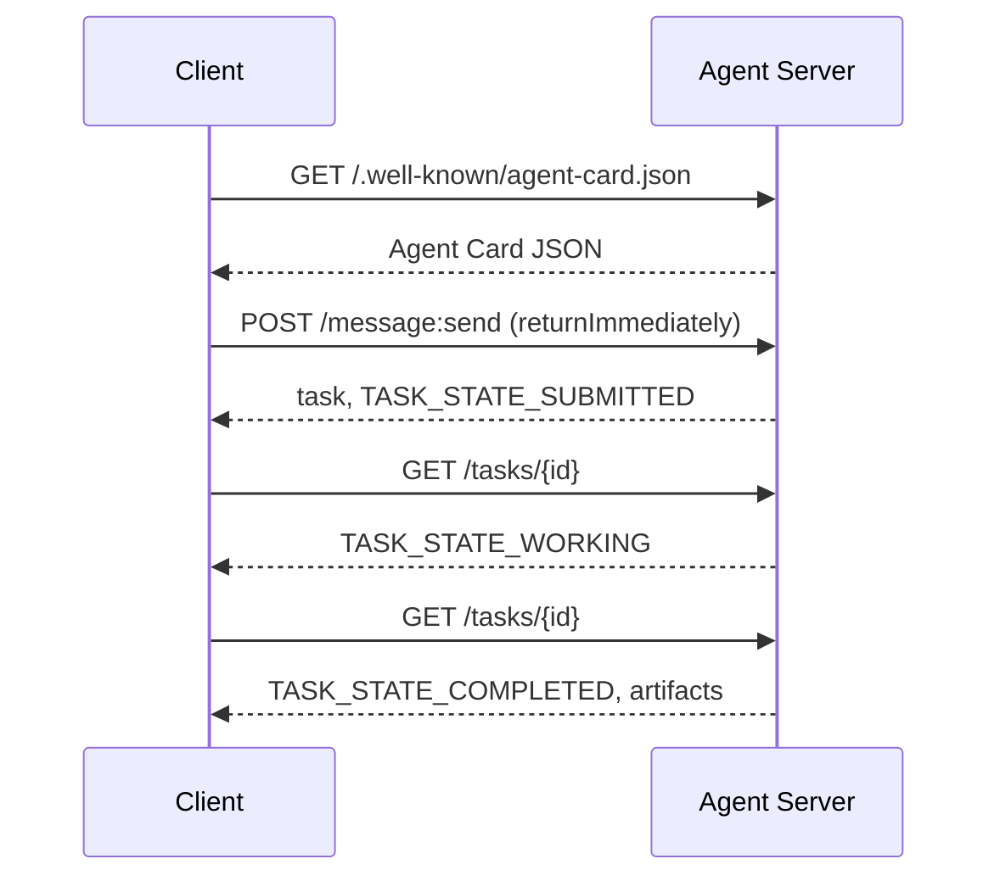

# A2A — 智能体间通信协议（Agent-to-Agent Protocol）

> Google 于 2025 年 4 月发布 A2A；到 2026 年 4 月，官方规范已演进至 1.0.1，并获得包括 AWS、Microsoft、Salesforce 等 150+ 机构的支持。A2A 是 MCP 的横向互补协议：MCP 聚焦纵向（Agent ↔ Tools），而 A2A 聚焦横向点对点（Agent ↔ Agent）。它定义了 Agent Card（用于发现）、携带产物（文本、结构化数据、多模态媒体）的 Tasks、不透明的任务生命周期以及多重认证机制。在生产级系统中，MCP 与 A2A 正日益广泛地结合使用。

**Type:** Learn + Build
**Languages:** Python (stdlib, `http.server`, `json`)
**Prerequisites:** Phase 16 · 04（原语模型）
**Time:** ~75 分钟

## 问题背景

当你的 Agent 需要调用部署在另一套系统或另一个组织内的 Agent 时，应该如何通信？你固然可以暴露一个专有 HTTP 端点，定义定制的 JSON Schema，并期望对方能按你的规则调用。但这样一来，每一对 Agent 之间的协作都会沦为高成本的一次性定制集成。

A2A 为这种跨系统调用提供了通用的线路协议（Wire Protocol）。它定义了标准的服务发现、标准的任务抽象、标准的传输绑定以及标准的输出产物，如同为智能体量身定制的 HTTP+REST 基础架构。

## 核心概念

### 四大核心要素

**Agent Card（智能体名片）。** 存放在 `/.well-known/agent-card.json` 的 JSON 文档，用于全面描述 Agent：名称、Skills、`supportedInterfaces`（端点 URL、协议绑定、协议版本）、默认输入与输出媒体类型，以及鉴权要求（`securitySchemes` 与 `securityRequirements`）。对端通过读取名片完成动态发现。

```http
GET /.well-known/agent-card.json HTTP/1.1
Host: agent.example.com
```

```json
{
  "name": "code-review-agent",
  "description": "审查 Python 与 TypeScript 代码。",
  "version": "1.0.0",
  "supportedInterfaces": [
    {
      "url": "https://agent.example.com",
      "protocolBinding": "HTTP+JSON",
      "protocolVersion": "1.0"
    }
  ],
  "capabilities": {"streaming": false, "pushNotifications": false},
  "securitySchemes": {
    "bearer": {"httpAuthSecurityScheme": {"scheme": "Bearer"}}
  },
  "securityRequirements": [{"schemes": {"bearer": {"list": []}}}],
  "defaultInputModes": ["text/plain", "application/json"],
  "defaultOutputModes": ["application/json"],
  "skills": [
    {
      "id": "review-python",
      "name": "审查 Python 代码",
      "description": "审查传入的 Python 源码并给出改进建议。",
      "tags": ["code-review", "python"]
    },
    {
      "id": "review-typescript",
      "name": "审查 TypeScript 代码",
      "description": "审查传入的 TypeScript 源码并给出类型与逻辑改进建议。",
      "tags": ["code-review", "typescript"]
    }
  ]
}
```

**Task（任务）。** 基本工作委托单元。一个具有生命周期的异步有状态对象：`TASK_STATE_SUBMITTED` → `TASK_STATE_WORKING` → `TASK_STATE_COMPLETED` / `TASK_STATE_FAILED` / `TASK_STATE_CANCELED`。Client 发送消息，Server 创建 Task，随后 Client 通过轮询或流式订阅获取更新。

**Artifact（产物）。** Task 执行完毕产出的结构化结果。支持文本、结构化 JSON、图像、视频、音频等多模态媒体。Artifacts 是严格类型化的：每个 Part 携带 `text`、`raw`、`url` 或 `data` 之一并可指明其 `mediaType`。

**不透明生命周期（Opaque Lifecycle）。** A2A 绝不规定远程 Agent *内部*如何完成任务。Client 仅观察状态转换与最终产物；被调用方完全自由选择任何底层模型与框架。

### MCP 与 A2A 的分工

- **MCP**：Agent ↔ Tool。Agent 借助 JSON-RPC 读写工具 Server，核心完全无状态。
- **A2A**：Agent ↔ Agent。对等协作协议，通信双方均为具备独立推理能力的完整智能体。

在生产多智能体系统中，两者协同运转：A2A 对端在自己侧调用本地配置的 MCP Tools。职责分离让架构清晰可维护。

### 发现与调用时序



上述路径遵循 HTTP+JSON 绑定规范，且每个请求均携带 `A2A-Version: 1.0` 请求头。默认情况下 `SendMessage` 会阻塞直到任务终结，因此轮询模式的 Client 设置 `configuration.returnImmediately` 以便立刻拿到任务对象。

对于流式传输：`POST /message:stream` 返回 Server-Sent Events（首先输出 `task`，随后陆续推送 `statusUpdate` 与 `artifactUpdate` 事件），而 `/tasks/{id}:subscribe` 则用于重新附加到运行中的任务。流在任务进入终态时正常关闭，报文中不包含单独的 `final` 标志。

### 身份认证与安全（Auth）

A2A 原生支持三种主流安全模式：

- **Bearer Token**：OAuth2 或不透明 Token（`httpAuthSecurityScheme` 或 `oauth2SecurityScheme`）。
- **mTLS**：双向 TLS 认证，组织间强证明身份（`mtlsSecurityScheme`）。
- **API Key**：位于请求头、URL 查询参数或 Cookie 中的密钥（`apiKeySecurityScheme`）。

认证规则在 Agent Card 中公布：`securitySchemes` 命名方案，`securityRequirements` 规定调用方必须满足的要求。

```figure
sw-agent-card-discovery
```

## 动手实践

`code/main.py` 基于 A2A 1.0 HTTP+JSON 绑定协议，纯使用 Python 标准库 `http.server` 与 `json` 实现了极简的 A2A Server 与 Client。Server 功能包括：

- 暴露 `/.well-known/agent-card.json`；
- 接受 `POST /message:send` 调用；
- 管理 Task 状态机转换；
- 在 `GET /tasks/{id}` 上返回产物。

Client 功能包括：

- 拉取并解析 Agent Card；
- 发送带有 `returnImmediately` 的消息创建任务；
- 持续轮询直至任务完成；
- 读取并验证最终 Artifact。

运行命令：

```bash
python3 code/main.py
```

脚本会在后台线程中启动 Server，然后由 Client 对其发起完整流程的调用，直观展示发现、提交、轮询与获取产物的全过程。

## 交付物

本课交付 `outputs/skill-a2a-integrator.md`。用于规划设计完整的 A2A 集成方案：Agent Card 内容、Task 校验契约、鉴权选型以及流式与轮询策略。

## 核心专业术语

| 术语 | 规范定义 |
|------|---------|
| A2A | 跨系统异构智能体间互相调用的对等开放协议 |
| Agent Card | 暴露于 `/.well-known/agent-card.json` 的元数据卡片，声明技能、端点与鉴权要求 |
| Task | 具备明确生命周期、完成时生成产物的异步工作单元 |
| Artifact | 任务产出的具名、带类型结果（文本、结构化 JSON、音视频媒体等） |
| 不透明生命周期 (Opaque lifecycle) | 内部解决过程对调用方隐藏，仅对外暴露状态流转与产物 |
| 服务发现 (Discovery) | 通过发起 `GET /.well-known/agent-card.json` 获取名片并了解支持能力 |
| MCP 对比 A2A | MCP 属于垂直的 Agent 与工具交互，A2A 属于水平的 Agent 间对等协作 |

## 延伸阅读

- [A2A 规范主站](https://a2a-protocol.org/latest/specification/) — 官方权威规范
- [A2A v1.0.1 源码发布](https://github.com/a2aproject/A2A/tree/v1.0.1) — 本课遵循的代码契约与规范定义
- [Google Developers Blog — A2A 发布说明](https://developers.googleblog.com/en/a2a-a-new-era-of-agent-interoperability/) — 官方设计背景
