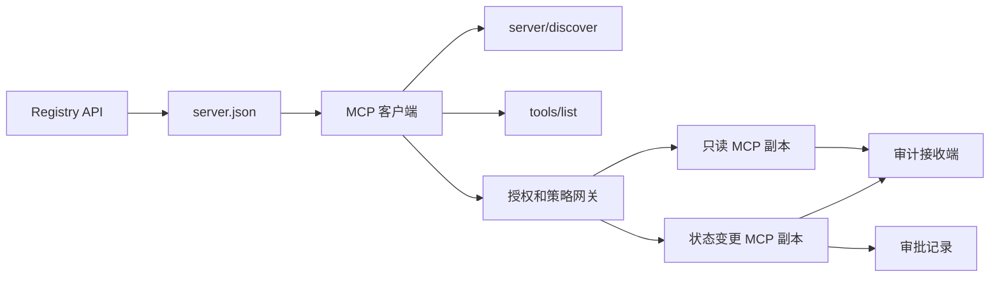

# Capstone 13：带 Registry 和治理机制的无状态 MCP Server

> 生产环境中的 MCP 并不是单个服务器进程，而是一条契约链：可发布的元数据、实时发现、无状态请求封装、授权、策略、审计和部署证据。

**Type:** Capstone
**Languages:** Python 和 TypeScript 参考 Model；任意生产语言
**Prerequisites:** Phase 11、Phase 13、Phase 14、Phase 17 和 Phase 18
**Required MCP deep dives:** [Lesson 28：Tool Contracts](../../../13-tools-and-protocols/28-mcp-tool-contracts-and-content/docs/en.md)、[Lesson 29：可靠性](../../../13-tools-and-protocols/29-mcp-reliability-cancellation-and-flow-control/docs/en.md)、[Lesson 30：Registry 供应链](../../../13-tools-and-protocols/30-mcp-registry-supply-chain-and-drift/docs/en.md)和[Lesson 31：一致性运维](../../../13-tools-and-protocols/31-mcp-conformance-versioning-and-operations/docs/en.md)
**Protocol target:** MCP `2026-07-28`
**Time:** 约 25 小时

## 学习目标

- 实现无状态 MCP 请求和结果封装。
- 将 Registry 元数据与实时 protocol 发现分开。
- 构建确定性的、可感知缓存的 Tool 发现机制。
- 对每次 Tool 调用强制执行 issuer、audience、scope 和审批策略。
- 部署不依赖 session affinity 的 Streamable HTTP。
- 在 wire、授权、策略、Registry 和审计边界证明系统行为。

## 必修 MCP 先修路径

在将本 Capstone 视为生产就绪之前，请按顺序完成 Phase 13 中链接的四节课程：

1. [Lesson 28](../../../13-tools-and-protocols/28-mcp-tool-contracts-and-content/docs/en.md) 定义此服务器必须公开的 Tool、schema、content、pagination、completion、routing 和错误契约。
2. [Lesson 29](../../../13-tools-and-protocols/29-mcp-reliability-cancellation-and-flow-control/docs/en.md) 定义取消竞态、deadline、idempotency、backpressure、retry 和 reconnect 行为。
3. [Lesson 30](../../../13-tools-and-protocols/30-mcp-registry-supply-chain-and-drift/docs/en.md) 定义 namespace、provenance、admission pin、Registry 状态、drift、ledger 和 rollback 证据。
4. [Lesson 31](../../../13-tools-and-protocols/31-mcp-conformance-versioning-and-operations/docs/en.md) 定义 golden 和 negative transcript、严格版本时代、SDK differential check、proxy 证明、redaction、health 和发布关卡。

本 Capstone 会集成这些产物，而不是用一次只覆盖正常路径的 SDK 测试替代它们。

## 问题

一个内部平台需要只读数据 Tool，以及少量会改变状态的 Tool。开发者必须能够发现服务器、了解如何连接、检查其实时能力，并且只能调用获准使用的操作。

难点不在于注册一个函数，而在于让六种不同的事实保持一致：

1. `server.json` 说明服务器可以从何处安装或访问。
2. `server/discover` 说明当前实时进程支持什么。
3. 每个请求都说明其使用的 protocol 修订版和客户端能力。
4. 授权将调用方绑定到正确的 issuer、resource 和 scope。
5. 策略决定这次具体操作能否运行。
6. 审计证据记录跨越边界的内容，同时不泄露 secret 或敏感 payload。

其中任何一项发生 drift，平台都可能列出无法访问的服务器、路由不兼容的客户端、接受为其他 resource 签发的 Token，或在缺少预期审核的情况下公开破坏性操作。

## 两层发现机制

Registry 和实时 MCP 服务器回答不同的问题。

| 层级 | 契约 | 它回答的问题 |
|---|---|---|
| 发布 | `server.json` 和 Registry API | 这是什么服务器、其 package 或远程 endpoint 在哪里，以及如何配置？ |
| 运行时 | `server/discover` | 此进程支持哪些 protocol 版本、能力、扩展和服务器身份？ |

官方 Registry 使用带版本的 `server.json` schema。远程条目可以指定一个 Streamable HTTP URL：

```json
{
  "$schema": "https://static.modelcontextprotocol.io/schemas/2025-12-11/server.schema.json",
  "name": "com.example/internal-readonly",
  "title": "内部只读 Tool",
  "description": "只读的事件和数据查询 Tool。",
  "version": "1.0.0",
  "remotes": [
    {
      "type": "streamable-http",
      "url": "https://mcp.internal.example.com/readonly"
    }
  ]
}
```

Registry schema 版本与 MCP protocol 修订版彼此独立。不要为了让一个日期匹配另一个日期而重写它们。应依据各自的契约验证每份文档。

schema 有效并不能证明 namespace 所有权。通过 `example.com` 验证的发布者应使用反向 DNS namespace `com.example/*`，或其子 namespace。Registry 身份验证流程会证明该所有权。按照通常顺序保留域名标签会指向另一个 namespace。

stdlib Model 中的 `validate_registry_document` 函数特意只实现了部分远程 profile 验证。它会检查官方要求的 `name`、`description` 和 `version` 字段、可选的 `title`、已发布的名称和长度约束、具体版本格式，以及每个 `streamable-http` 或 `sse` 远程项的 HTTP(S) URL 格式。它还要求 `remotes` 列表非空，因为本 Capstone 始终会实时探测一个远程 endpoint。`validate_publisher_namespace` 会单独根据已验证的发布者域名检查名称，而 `validate_runtime_alignment` 会将发布信息中的名称和版本与实时 `serverInfo` 进行比较。官方 schema 还支持仅包含 package 的记录以及更多远程字段。发布前，请使用固定版本的官方 JSON Schema 或 `mcp-publisher` 验证整份文档；不要将这个无依赖子集描述为完整的 schema 验证。

服务器必须实现 `server/discover`；客户端可以在调用其他方法前调用它。本 Capstone 客户端会在解析 endpoint 后调用该方法，并接收当前 protocol 修订版和实时能力：

```json
{
  "resultType": "complete",
  "supportedVersions": ["2026-07-28"],
  "capabilities": {
    "tools": {
      "listChanged": false
    }
  },
  "_meta": {
    "io.modelcontextprotocol/serverInfo": {
      "name": "com.example/internal-readonly",
      "version": "1.0.0"
    }
  },
  "ttlMs": 3600000,
  "cacheScope": "public"
}
```

私有 catalog 可以索引额外的所有权、审核或生命周期数据，但不得将这些数据虚构成 MCP wire 字段或 `server.json` 根字段。应将组织策略存储在已发布记录旁边。确实需要公开的自定义元数据时，请使用 Registry 的 `_meta.io.modelcontextprotocol.registry/publisher-provided` 扩展，并保持在其 4 KB 限制内。

## 无状态 MCP 核心

MCP 修订版 `2026-07-28` 移除了 protocol session，以及 `initialize` / `notifications/initialized` 握手。它还移除了 `Mcp-Session-Id`。

每个请求都在 `params._meta` 中携带 protocol Context：

```json
{
  "io.modelcontextprotocol/protocolVersion": "2026-07-28",
  "io.modelcontextprotocol/clientCapabilities": {},
  "io.modelcontextprotocol/clientInfo": {
    "name": "internal-platform-client",
    "version": "1.0.0"
  }
}
```

版本和能力是请求事实，而不是连接事实。负载均衡器可以将连续请求发送到不同的健康副本，因为任意副本都可以根据消息本身验证请求。

普通结果包含 `resultType: "complete"`。服务器应在每个结果的 `_meta.io.modelcontextprotocol/serverInfo` 中放置自身身份。缺失 protocol 版本或 protocol 版本不是字符串时，属于 invalid params `-32602`。错误 `-32022` 只适用于已提供但不受支持的字符串，其 data 必须严格为 `{"supported": ["2026-07-28"], "requested": "..."}`。

### 可缓存的发现结果

对于相同的有效 Tool 集，`tools/list` 必须是确定性的。结果包括：

- `ttlMs`，提供给客户端的新鲜度提示；
- `cacheScope`，值为 `public` 或 `private`；
- 稳定的 Tool 顺序，使相同列表能够复用 Prompt 缓存；
- `resultType: "complete"` 和服务器身份元数据。

按用户进行的授权通常应生成 `cacheScope: "private"`。不要将用户专属的 Tool 可见性放在共享公共缓存之后。

## Streamable HTTP

网络服务器公开一个接受 POST 的 MCP endpoint。每个 JSON-RPC 请求或通知都使用独立的 POST。

对于请求，服务器返回单个 JSON 对象，或限定在该请求范围内的 SSE stream。长时间运行的 `subscriptions/listen` 请求携带客户端选择接收的变更通知。当前 transport 中不存在独立的 GET stream、session DELETE、session header 或 `Last-Event-ID` replay。

每个请求包括：

- `MCP-Protocol-Version`，与 body 元数据一致；
- `Mcp-Method`，与 JSON-RPC method 一致；
- `Mcp-Name`，用于 `tools/call`、`resources/read` 和 `prompts/get`；
- `Accept: application/json, text/event-stream`。

对于不一致的镜像 header，使用指定的 `-32020` 错误拒绝请求。验证 `Origin`，将本地开发服务器绑定到 loopback，对远程客户端进行身份验证，并将请求范围内 SSE 响应的关闭视为取消。



```figure
cf-mcp-gate
```

## 授权和策略

transport 元数据并不等同于授权。必须验证每次调用的授权。

对于远程服务器：

1. 发现 protected-resource 元数据。
2. 为该 resource 选择授权服务器。
3. 优先使用 Client ID Metadata Documents 注册客户端。将 Dynamic Client Registration 视为兼容性支持。
4. 在授权过程中发送 resource indicator。
5. 根据为该流程记录的授权服务器验证返回的 `iss` 值。
6. 按 issuer 管理客户端凭据。绝不能跨 issuer 复用注册数据。
7. 在 MCP 服务器上验证 Token issuer、audience 或 resource、expiry 和 scope。
8. 针对具体 Tool 和参数应用第二层策略决策。

`readOnlyHint` 和 `destructiveHint` 等 Tool annotation 可以帮助客户端展示风险，但它们不是可信的授权控制。

### 审批是一条记录，而不是神奇的 scope

状态变更调用需要一条审批记录，该记录必须绑定 actor、Tool、规范化参数或其 digest、目标环境、expiry，以及单次或重复使用策略。仅有一条聊天消息不能作为审批证明。

Python Model 使用排序 key 后的规范 JSON 计算 hash，然后将该 digest 与 Token subject、Tool 名称、服务器 URL 和 expiry 绑定。只要修改一个参数，再次使用该记录就会在 handler 运行前失败。审批是独立证据，而不是添加到 access Token 中的 scope。

当这能显著缩小 blast radius 时，应将高风险 Tool 放在可单独审核的接口面上。只有凭据、策略、部署身份和审计控制也相互独立时，这种分离才有意义。

## 构建它

### 1. 建模发布元数据

创建并进行 schema 验证的 `server.json`。包含已通过发布者身份验证的 namespace 中的稳定名称，以及版本、描述、适用时的官方 `repository` 或 `packages` 元数据，以及远程或 stdio transport。将 secret 声明为环境变量输入，绝不能使用字面值。

### 2. 实现实时发现

先实现 `server/discover`，再实现任何功能 RPC。公布支持的 protocol 版本、能力、扩展和服务器身份。添加使用 `-32022` 的版本拒绝用例。

### 3. 实现无状态封装

要求每个请求都包含 protocol 版本和客户端能力。每个结果都返回 `resultType` 和服务器身份。移除初始化状态、连接范围内的能力缓存和 session identifier。

### 4. 构建 Tool 接口面

从两个只读 Tool 和一个状态变更 Tool 开始。为每个 Tool 提供有边界的 JSON Schema、精确描述、确定性的结果格式和真实准确的 annotation。当客户端依赖结构化结果时，添加 output schema。

### 5. 添加可感知缓存的列表

以稳定顺序返回 Tool，并包含 `ttlMs` 和 `cacheScope`。分别演练缓存过期和列表变更通知行为。

### 6. 添加授权和策略

验证 issuer、audience、expiry 和 scope。为每次 Tool 调用执行策略决策。将审批绑定到确切的高风险操作。在执行 handler 前拒绝缺失或过期的审批。

### 7. 分离 Registry 验证和运行时验证

验证静态 `server.json` 记录，然后使用 `server/discover` 探测远程 endpoint。当已发布的 remote、身份、版本或必需能力与实时进程不一致时报告 drift。

### 8. 添加审计证据

记录 actor、issuer、resource、Tool、策略决策、请求标识符、trace Context、延迟和结果。持久化前对敏感参数和结果进行脱敏或计算 digest。将审计接收端置于 Model 可见 Context 之外。

### 9. 演练水平扩展

在负载均衡器后放置两个无状态副本。发送至少 100 个并发请求。证明正确性不依赖 affinity。如果某个 Tool 需要跨调用状态，则创建显式 opaque handle，并将其存储到共享的持久化系统中。

### 10. 穿越真实 wire

对实际服务器二进制文件运行一致性检查。捕获请求 header 和 JSON body，而不只是 SDK 对象。演练错误版本、header 不一致、scope 缺失、audience 错误、参数格式错误、handler 失败、取消和缓存过期。

## 必需证据包

提交内容必须包含全部五类证据，否则视为不完整：

| 证据 | 最低证明要求 | 来源课程 |
|---|---|---|
| Wire | golden 和 negative 用例的脱敏原始 header 与 JSON-RPC body，包括元数据类型错误、header 不一致、不支持的版本、缺失或未知的 `resultType`、通知无响应和响应 ID 匹配 | [Lesson 31](../../../13-tools-and-protocols/31-mcp-conformance-versioning-and-operations/docs/en.md) |
| Proxy | 直接运行和通过已部署中间层运行同一个稳定用例，并提供 ingress、origin 和 egress 的状态与 body digest；证明 protocol 错误没有被归并为通用 500 响应，且 streaming 未被缓冲 | [Lessons 29](../../../13-tools-and-protocols/29-mcp-reliability-cancellation-and-flow-control/docs/en.md) 和 [31](../../../13-tools-and-protocols/31-mcp-conformance-versioning-and-operations/docs/en.md) |
| Admission | 已验证的发布者 namespace、不可变 Registry 记录 digest、产物或远程 provenance、实时 `server/discover` 身份和能力观测、descriptor pin、当前 Registry 状态和 admission-ledger 事件 | [Lesson 30](../../../13-tools-and-protocols/30-mcp-registry-supply-chain-and-drift/docs/en.md) |
| Retry | 取消与完成之间的竞态、显式 timeout、安全的读取 retry、变更操作的 idempotency key、reconnect refetch，以及证明请求取消不会悄然变成持久任务取消 | [Lesson 29](../../../13-tools-and-protocols/29-mcp-reliability-cancellation-and-flow-control/docs/en.md) |
| Rollback | 确切的上一版本、admission 和产物 digest、descriptor pin、有效 Registry 状态、当前 health window、路由恢复结果和脱敏决策证据 | [Lessons 30](../../../13-tools-and-protocols/30-mcp-registry-supply-chain-and-drift/docs/en.md) 和 [31](../../../13-tools-and-protocols/31-mcp-conformance-versioning-and-operations/docs/en.md) |

将脱敏证据包的 digest 与发布版本一同存储。只要缺少任何一类证据，就应暂停发布。不要根据进程内 dispatcher 推断 proxy 行为，不要根据 Registry 中存在记录推断 admission，不要根据新的 JSON-RPC id 推断 retry 安全性，也不要根据“上一部署”推断 rollback 准备情况。

## 本地参考 Model

Python Model 演示 Registry 元数据、反向 DNS 发布者 namespace 验证、发布信息到运行时身份检查、实时发现、确定性 Tool 列表、每请求元数据、可信 issuer、audience、expiry 和 scope 检查、绑定具体操作的审批、带文档说明的部分 Registry validator、策略和审计，并且不会打开网络 socket：

```bash
cd phases/19-capstone-projects/13-mcp-server-with-registry
python3 code/main.py
python3 -m unittest discover -s code/tests -v
```

TypeScript 项目不使用 MCP SDK，通过 stdio 公开无状态 JSON-RPC 格式。其 `tools/call` 路径强制执行与 `tools/list` 所公布内容相同的有边界输入 schema；已知 Tool 的无效参数会返回包含 `isError: true` 的完整结果，而不会调用 executor：

```bash
cd phases/19-capstone-projects/13-mcp-server-with-registry/code/ts
npm install
npm run typecheck
npm test
npm run demo
```

这些 Model 可以证明本地契约逻辑，但不能证明 HTTP header、OAuth exchange、Registry 发布、OPA 集成、负载均衡或 collector 接收情况。

## Wire 示例

```http
POST /mcp HTTP/1.1
Host: mcp.internal.example.com
Content-Type: application/json
Accept: application/json, text/event-stream
MCP-Protocol-Version: 2026-07-28
Mcp-Method: tools/call
Mcp-Name: postgres.readonly
Authorization: Bearer REDACTED

{
  "jsonrpc": "2.0",
  "id": 42,
  "method": "tools/call",
  "params": {
    "name": "postgres.readonly",
    "arguments": {"sql": "SELECT 1"},
    "_meta": {
      "io.modelcontextprotocol/protocolVersion": "2026-07-28",
      "io.modelcontextprotocol/clientCapabilities": {},
      "io.modelcontextprotocol/clientInfo": {
        "name": "internal-platform-client",
        "version": "1.0.0"
      }
    }
  }
}
```

## 交付它

交付一个包含以下内容的 repository：

- schema 有效的 `server.json`；
- 只读和状态变更服务器接口面；
- `server/discover`、确定性的 `tools/list` 和由策略把关的 `tools/call`；
- 包含两个可互换副本的 Streamable HTTP 部署；
- 授权和审批集成；
- Registry 发布器或私有 Registry API adapter；
- 策略定义和绑定具体操作的审批记录；
- 脱敏审计输出和 trace 传播；
- wire 和 proxy 故障证据；
- admission、retry、health 和 rollback 证据，以及脱敏证据包的 digest。

| 权重 | 标准 | 证据 |
|---:|---|---|
| 25 | Protocol 正确性 | 无状态请求元数据、发现、结果、header 和 negative 用例 |
| 20 | 授权 | issuer、audience、expiry、scope 和绑定具体操作的审批用例 |
| 15 | Registry 完整性 | 有效的 `server.json`、发布记录、实时发现探针和 drift 报告 |
| 15 | 策略和安全性 | 允许、拒绝、格式错误、过期审批和敏感数据用例 |
| 15 | 扩展性和可靠性 | 两个副本、不依赖 affinity、取消、timeout 和恢复 |
| 10 | 可审计性 | 接收端脱敏审计和 trace 证据 |

## 练习

1. 修改已发布的远程 URL，同时保持实时服务器不变。让 Registry 验证报告准确的 drift。
2. 使用相同输入发送两次 `tools/list`，并证明 Tool 顺序在字节层面保持稳定。然后让 `ttlMs` 过期并刷新。
3. 发送有效 body，但提供不同的 `MCP-Protocol-Version` header。返回 `-32020`，并且不要调用策略或 Tool。
4. 为只读服务器签发 Token，并将其提交给状态变更服务器。证明 audience 验证会在 handler 运行前失败。
5. 将审批绑定到一个规范化参数 digest。修改一个字段，并证明该审批无法 replay。
6. 将连续调用路由到交替的副本。凡是工作流需要持久化的地方，都使用显式共享 handle 替换隐藏的进程内存。
7. 中断请求范围内的 SSE 连接，并使用新的 JSON-RPC 请求 ID 进行 retry。验证没有使用任何 `Last-Event-ID` 恢复路径。

## 关键术语

| 术语 | 人们通常怎么说 | 它的实际含义 |
|---|---|---|
| Stateless MCP | “任何地方都没有状态” | 没有 protocol session；跨调用状态是显式的，并由服务器管理 |
| `server.json` | “Tool manifest” | 用于命名、打包、配置和 transport 的 Registry 元数据 |
| `server/discover` | “握手” | 用于获取实时版本和能力的普通必需 RPC，而不是 session initializer |
| Cache scope | “我可以缓存它吗？” | 可缓存结果是否适合共享或私有复用 |
| Policy decision | “Token 允许该操作” | 针对 actor、Tool、目标、参数和 Context 作出的独立决策 |
| Approval record | “有人点击了同意” | 在 expiry 策略下绑定到某个 actor 和某项重要操作的证据 |
| Explicit handle | “Session ID” | 用于具名服务器托管状态的普通应用数据，而不是 protocol 连接状态 |

## 延伸阅读

- [MCP 2026-07-28 关键变更](https://modelcontextprotocol.io/specification/2026-07-28/changelog)
- [Streamable HTTP](https://modelcontextprotocol.io/specification/2026-07-28/basic/transports/streamable-http)
- [服务器发现](https://modelcontextprotocol.io/specification/2026-07-28/server/discover)
- [MCP 授权](https://modelcontextprotocol.io/specification/2026-07-28/basic/authorization)
- [官方 Registry server.json 要求](https://github.com/modelcontextprotocol/registry/blob/main/docs/reference/server-json/official-registry-requirements.md)
- [官方 Registry OpenAPI 契约](https://registry.modelcontextprotocol.io/openapi.yaml)
