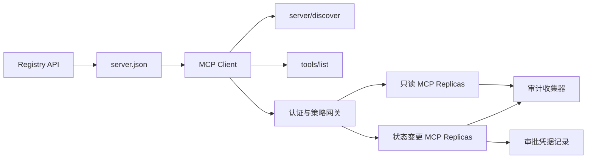

# 综合实战项目 13：带 Registry 与治理的无状态 MCP Server

> 生产级 MCP 绝不是单个简单的 Server 进程。它是一整套契约链条：可发布的元数据、实时服务发现、无状态请求 Envelope、身份认证与授权、细粒度策略决策、审计凭证以及部署证据。

**Type:** Capstone
**Languages:** Python 与 TypeScript 参考模型；支持任何生产级编程语言
**Prerequisites:** Phase 11, Phase 13, Phase 14, Phase 17 与 Phase 18
**必修 MCP 进阶课：** [Lesson 28: Tool Contracts](../../../13-tools-and-protocols/28-mcp-tool-contracts-and-content/docs/en.md), [Lesson 29: 可靠性与流控](../../../13-tools-and-protocols/29-mcp-reliability-cancellation-and-flow-control/docs/en.md), [Lesson 30: Registry 供应链](../../../13-tools-and-protocols/30-mcp-registry-supply-chain-and-drift/docs/en.md), 及 [Lesson 31: 一致性工程](../../../13-tools-and-protocols/31-mcp-conformance-versioning-and-operations/docs/en.md)
**目标协议规范：** MCP `2026-07-28`
**Time:** ~25 小时

## 学习目标

- 实现合规的无状态 MCP 请求与结果 Envelope。
- 将 Registry 静态元数据与运行时的实时协议发现严格区分。
- 构建具备确定性排序与缓存感知的工具发现体系。
- 对每次 Tool 调用强制执行签发者（Issuer）、受众（Audience）、作用域（Scope）及审批策略。
- 部署无 Session 亲和性绑定的 Streamable HTTP 集群。
- 在网络线路、授权、策略、Registry 与审计边界上提供完整的工程证据。

## 必修 MCP 前置路径

在将本项目视为生产就绪之前，必须依次完成 Phase 13 关联的四节进阶课程：

1. [Lesson 28](../../../13-tools-and-protocols/28-mcp-tool-contracts-and-content/docs/en.md)：定义本 Server 必须暴露的 Tool、Schema、结构化内容、分页、自动补全、路由及错误分类契约。
2. [Lesson 29](../../../13-tools-and-protocols/29-mcp-reliability-cancellation-and-flow-control/docs/en.md)：定义取消竞态、截止期限、幂等性、背压、重试与断线重连行为。
3. [Lesson 30](../../../13-tools-and-protocols/30-mcp-registry-supply-chain-and-drift/docs/en.md)：定义命名空间归属、来源追踪、准入锁定、Registry 状态、漂移检测、账本记录与回滚凭证。
4. [Lesson 31](../../../13-tools-and-protocols/31-mcp-conformance-versioning-and-operations/docs/en.md)：定义黄金标准与反向转录用例、严格版本时代、SDK 行为差异校验、代理网络凭证、敏感数据脱敏、健康门禁与发布阻断。

本项目负责将这些生产级要素紧密集成，绝不能用单个简单跑通的 SDK 测试敷衍了事。

## 问题背景

企业内部平台需要一套只读数据工具和少量具备状态变更能力的写操作工具。开发者必须能够发现该 Server、了解如何连接、检查其实时运行能力，并且只能调用其被明确授权访问的操作。

真正困难的从来不是写一个 Python 函数，而是如何让以下六套真相源保持高度一致、绝不漂移：

1. `server.json` 声明了 Server 在何处安装或通过什么网络端点访问；
2. `server/discover` 声明了当前运行的实时进程实际支持的能力；
3. 每个请求明确指明了其采用的协议版本与 Client 能力声明；
4. 授权系统将调用方与合法的签发者、资源指示器（Resource Indicator）和 Scope 绑定；
5. 策略引擎独立决策该特定操作与传入参数是否准予执行；
6. 审计日志忠实记录越过边界的每次交互，且绝不泄露敏感载荷或凭据密钥。

任何一个环节发生漂移，平台就可能展示无法连通的孤儿 Server、错误路由不兼容的 Client、误用为其他资源签发的 Token，或在未获批准的情况下执行高危破坏性操作。

## 两层发现机制（The Two Discovery Layers）

Registry 静态索引与实时的 MCP Server 回答的是完全不同维度的问题：

| 发现层次 | 交互契约 | 回答的核心问题 |
|---|---|---|
| 发布层 (Publication) | `server.json` 与 Registry API | 该 Server 是什么？其代码包或远程网络端点在哪里？如何进行配置？ |
| 运行时 (Runtime) | `server/discover` | 该运行进程当前实际支持哪些协议版本、能力特性、扩展及 Server 身份？ |

官方 Registry 采用带版本控制的 `server.json` Schema。一个远程条目可以声明 Streamable HTTP 地址：

```json
{
  "$schema": "https://static.modelcontextprotocol.io/schemas/2025-12-11/server.schema.json",
  "name": "com.example/internal-readonly",
  "title": "Internal Read-Only Tools",
  "description": "Read-only incident and data lookup tools.",
  "version": "1.0.0",
  "remotes": [
    {
      "type": "streamable-http",
      "url": "https://mcp.internal.example.com/readonly"
    }
  ]
}
```

Registry Schema 版本与 MCP 协议版本完全独立，切勿混为一谈。每个文档都必须对照其自身的契约进行严格校验。

具备合规 Schema 不代表拥有命名空间所有权。对 `example.com` 完成验证的发布者使用反向 DNS 命名空间 `com.example/*` 或其子命名空间。

Server 必须实现 `server/discover`；Client 可以在发起业务方法前主动调用它：

```json
{
  "resultType": "complete",
  "supportedVersions": ["2026-07-28"],
  "capabilities": {
    "tools": {
      "listChanged": false
    }
  },
  "_meta": {
    "io.modelcontextprotocol/serverInfo": {
      "name": "com.example/internal-readonly",
      "version": "1.0.0"
    }
  },
  "ttlMs": 3600000,
  "cacheScope": "public"
}
```

## 无状态 MCP 核心（Stateless MCP Core）

MCP `2026-07-28` 彻底移除了协议 Session、`initialize` 握手与 `Mcp-Session-Id`。每个请求均在 `params._meta` 中携带协议上下文：

```json
{
  "io.modelcontextprotocol/protocolVersion": "2026-07-28",
  "io.modelcontextprotocol/clientCapabilities": {},
  "io.modelcontextprotocol/clientInfo": {
    "name": "internal-platform-client",
    "version": "1.0.0"
  }
}
```

负载均衡器可以毫无顾虑地将连续请求分发给不同的健康 Replica，因为任何一个 Replica 都可以完全从报文自身验证并处理请求。

常规成功结果返回 `resultType: "complete"`，且 Server 应在 `_meta.io.modelcontextprotocol/serverInfo` 中标明身份。协议版本非法返回 Invalid Params 错误码 `-32602`；对于合法但不支持的版本，返回 `-32022` 并在 data 中准确回显 `supported` 与 `requested`。

### 可缓存的服务发现

`tools/list` 必须保证确定性排序，其结果包含：

- `ttlMs`：面向 Client 的新鲜度缓存提示；
- `cacheScope`：`public`（公共共享）或 `private`（上下文私有）；
- 严格稳定的工具排序，使相同列表能够极大复用模型端的 Prompt Cache；
- `resultType: "complete"` 与 Server 身份元数据。

针对特定用户的权限控制，通常应输出 `cacheScope: "private"`，绝不能将用户专属的工具可见性缓存在公共共享缓存中。

## Streamable HTTP 传输

面向网络的 Server 暴露单一的 POST 端点。每个 JSON-RPC 请求或通知均为独立的 POST。

针对请求，Server 返回单个 JSON 响应或针对该次请求开启的请求作用域 SSE 流。长周期的变更通知通过 `subscriptions/listen` 建立长连接流。

请求必须镜像指定 HTTP 请求头：

- `MCP-Protocol-Version`：与请求体元数据一致；
- `Mcp-Method`：与 JSON-RPC 方法名一致；
- `Mcp-Name`：在调用 `tools/call` 等方法时镜像工具名；
- `Accept: application/json, text/event-stream`。

头部与请求体不一致时立即返回 `-32020` 错误码。校验 `Origin` 防御 DNS 重绑定，并将请求作用域 SSE 流的被动断开视为请求取消。


```mermaid
flowchart LR
  R[Registry API] --> J[server.json]
  J --> C[MCP Client]
  C --> D[server/discover]
  C --> L[tools/list]
  C --> G[认证与策略网关]
  G --> RO[只读 MCP Replicas]
  G --> RW[状态变更 MCP Replicas]
  RO --> A[审计收集器]
  RW --> H[审批凭据记录]
  RW --> A
```

```figure
cf-mcp-gate
```

## 认证与策略决策

传输层元数据绝不等于权限凭证。每次调用均须严密鉴权：

1. 动态发现受保护资源元数据；
2. 为该资源选定对应的授权 Server；
3. 优先使用 Client ID Metadata Documents（CIMD）注册 Client；
4. 在授权流程中发送 Resource Indicator；
5. 验证返回的 `iss` 是否与记录的授权 Server 一致；
6. 按 Issuer 隔离存储 Client 凭据，绝不跨 Issuer 复用；
7. 在 MCP Server 侧验证 Token 的签发者、受众、过期时间与 Scopes；
8. 对具体的工具名称与实际参数执行二次策略决策。

### 人工审批是凭据记录，而非魔法 Scope

状态变更调用需要一份结构化的人工审批凭证（Approval Record），与操作者、工具名、规范化参数哈希值（Digest）、目标环境、过期时间及单次/多次使用策略深度绑定。单独的一条聊天消息绝不能充当审批凭证。

Python 模型会对排序键的规范化 JSON 计算哈希，并将该 Digest 与 Token Subject、工具名、Server URL 和过期时间签名绑定。篡改哪怕一个参数字段，该审批记录均无法被重放。审批记录是独立的证据凭证，而不是直接往 Access Token 里乱塞的 Scope。

## 动手构建步骤

1. **建模发布元数据**：编写并验证 `server.json`，确保命名空间符合反向 DNS 规范。
2. **实现实时服务发现**：在处理任何业务 RPC 前优先实现 `server/discover`。
3. **实现无状态 Envelope**：每个请求必填版本与能力元数据，移除所有底层 Session 状态。
4. **构建工具集**：提供只读与状态变更工具，配备封闭的 JSON Schema 与准确的提示注解。
5. **支持缓存感知的工具列表**：输出确定性排序的工具列表，并配置 `ttlMs` 与 `cacheScope`。
6. **接入认证与策略网关**：校验 Token，并在高危工具调用前强校验防重放的审批凭证。
7. **分离静态 Registry 与运行时校验**：对比 `server.json` 与实时的 `server/discover`，及时上报漂移。
8. **接入脱敏审计日志**：完整记录上下文，并对敏感参数执行哈希或脱敏落盘。
9. **验证水平扩展**：在负载均衡器后挂载两个无状态 Replica，发起并发请求验证无亲和性依赖。
10. **真实网络验证**：通过真实网络捕获请求头与 JSON 体，验证各种正向与反向异常用例。

## 必备证据包（Evidence Pack）

提交的代码必须附带以下五类工程证据：

| 证据类别 | 最低验证标准 | 来源课程 |
|---|---|---|
| 网络线路 (Wire) | 正反向用例中脱敏的原始 HTTP 头与 JSON-RPC 体，覆盖类型错误、头不匹配、不支持版本等 | [Lesson 31](../../../13-tools-and-protocols/31-mcp-conformance-versioning-and-operations/docs/en.md) |
| 代理网络 (Proxy) | 直连与经过代理转发的报文对比，证明协议错误未被粗暴折叠为 500 且流式传输未被缓冲 | [Lessons 29](../../../13-tools-and-protocols/29-mcp-reliability-cancellation-and-flow-control/docs/en.md) 与 [31](../../../13-tools-and-protocols/31-mcp-conformance-versioning-and-operations/docs/en.md) |
| 准入管理 (Admission) | 已验证的发布者命名空间、不可变 Registry 记录哈希、实时 `server/discover` 观察凭证与准入账本事件 | [Lesson 30](../../../13-tools-and-protocols/30-mcp-registry-supply-chain-and-drift/docs/en.md) |
| 重试与取消 (Retry) | 取消与完成的竞态测试、显式超时、安全只读重试、写操作幂等键、重连刷新机制 | [Lesson 29](../../../13-tools-and-protocols/29-mcp-reliability-cancellation-and-flow-control/docs/en.md) |
| 发布回滚 (Rollback) | 明确的先前版本哈希、描述符锁定、健康检查窗口、路由平滑切换结果与决策证据 | [Lessons 30](../../../13-tools-and-protocols/30-mcp-registry-supply-chain-and-drift/docs/en.md) 与 [31](../../../13-tools-and-protocols/31-mcp-conformance-versioning-and-operations/docs/en.md) |

## 本地参考模型运行

Python 模型演示了在不打开外部网络套接字的情况下，完成命名空间校验、实时发现、确定性列表、请求元数据校验、Token 鉴权、基于哈希的审批凭证及审计流程：

```bash
cd phases/19-capstone-projects/13-mcp-server-with-registry
python3 code/main.py
python3 -m unittest discover -s code/tests -v
```

TypeScript 项目展示了在不借助外部 MCP SDK 的情况下，通过原生 stdio 暴露无状态 JSON-RPC 接口并对非法参数返回 `isError: true`：

```bash
cd phases/19-capstone-projects/13-mcp-server-with-registry/code/ts
npm install
npm run typecheck
npm test
npm run demo
```

## 线路协议报文范例

```http
POST /mcp HTTP/1.1
Host: mcp.internal.example.com
Content-Type: application/json
Accept: application/json, text/event-stream
MCP-Protocol-Version: 2026-07-28
Mcp-Method: tools/call
Mcp-Name: postgres.readonly
Authorization: Bearer REDACTED

{
  "jsonrpc": "2.0",
  "id": 42,
  "method": "tools/call",
  "params": {
    "name": "postgres.readonly",
    "arguments": {"sql": "SELECT 1"},
    "_meta": {
      "io.modelcontextprotocol/protocolVersion": "2026-07-28",
      "io.modelcontextprotocol/clientCapabilities": {},
      "io.modelcontextprotocol/clientInfo": {
        "name": "internal-platform-client",
        "version": "1.0.0"
      }
    }
  }
}
```

## 核心专业术语

| 术语 | 行业俗称 | 规范真实定义 |
|---|---|---|
| 无状态 MCP (Stateless MCP) | “到处都没有状态” | 协议层不存在 Session；跨调用状态属于显式传递且由业务服务端持久化管理 |
| `server.json` | “工具清单清单” | Registry 静态元数据，用于定义发布命名、代码打包、配置项与传输端点 |
| `server/discover` | “传统握手” | 强制实现的常规业务 RPC，用于获取实时支持的版本与能力，而非建立会话 |
| 缓存作用域 (Cache scope) | “能不能缓存？” | 标识可缓存结果是否可以被跨上下文公共复用（`public`）或仅限当前上下文（`private`） |
| 策略决策 (Policy decision) | “Token 允许就能调” | 针对调用者主体、工具、操作目标、参数载荷及外部上下文的细粒度二次判定 |
| 审批凭证 (Approval record) | “人工在群里点了同意” | 绑定至具体操作者、确切参数哈希与过期时间的强防篡改凭据证据 |
| 显式句柄 (Explicit handle) | “Session ID” | 业务层具名状态的普通应用标识符，绝非底层传输连接会话 |

## 延伸阅读

- [MCP 2026-07-28 核心变更](https://modelcontextprotocol.io/specification/2026-07-28/changelog)
- [Streamable HTTP 传输规范](https://modelcontextprotocol.io/specification/2026-07-28/basic/transports/streamable-http)
- [MCP 服务发现](https://modelcontextprotocol.io/specification/2026-07-28/server/discover)
- [MCP 鉴权与授权规范](https://modelcontextprotocol.io/specification/2026-07-28/basic/authorization)
- [官方 Registry server.json 要求](https://github.com/modelcontextprotocol/registry/blob/main/docs/reference/server-json/official-registry-requirements.md)
