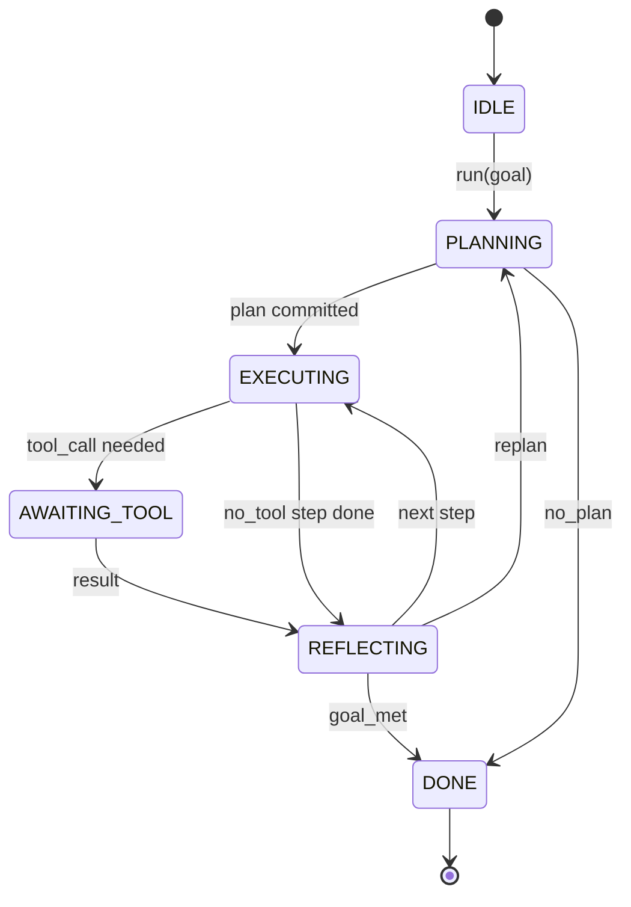

# Agent Harness Loop Contract

> harness 就是 agent。model 是 coprocessor。本课会冻结你可以接入任意 model 的 loop contract。

**Type:** Build
**Languages:** Python
**Prerequisites:** Phase 13 lessons 01-07, Phase 14 lesson 01
**Time:** ~90 minutes

## Learning Objectives
- 将 agent harness loop 规定为一个具有显式 transitions 的确定性 state machine。
- 实现十个 lifecycle hook topics，operators 可以把 policy、telemetry 和 guardrails 接入其中。
- 定义两个 pull points，loop 在这些位置把控制权交还给 caller，并在 fresh input 上恢复。
- 强制执行 per-session budgets（turns、tool calls、wall-clock），同时在超限时不泄漏 partial state。
- 发出包含十一种 event types 的 typed stream，让下游 UIs 和 tracers 无需直接检查 loop 即可订阅。

```figure
cf-loop-contract
```

## 框架

一个无人值守运行四十轮的 coding agent 不是 chat loop。它是一个 state machine，operator 可以拦截它的 nodes，也可以 audit 它的 edges。一旦你把 contract 写下来，替换 models、tools 或 policies 就不再是重构，而会变成一次 registration call。

本课构建的就是这个 contract。我们会命名六个 states、十个 hook topics、两个 pull points、十一种 event types，以及一个 budget envelope。harness 中的其他所有部分（tool registry、JSON-RPC transport、dispatcher、planner）都会插入这个形状。

## states

loop 有六个 states。五个是 active。一个是 terminal。



`IDLE` 是唯一合法的入口点。`DONE` 是唯一合法的出口。`AWAITING_TOOL` 是唯一会产生 pull point 的 state。其他所有 transitions 都是 internal。

这个 state machine 是确定性的。给定同一个 event log，harness 会重新进入同一个 state。这个性质让你可以 replay sessions 来调试，而无需重新调用 model。

## hook topics

Hooks 是 operator 接入 loop 的接口。harness 会触发十个 topics。每个 topic 可以接受任意数量的 subscribers。Subscribers 按 registration 顺序触发。一个 subscriber 可以 mutate payload、raise 来 abort 当前 turn，或者返回一个 sentinel 来跳过下一步。

```text
before_plan         after_plan
before_tool_call    after_tool_call
before_step         after_step
on_error
on_pause
on_budget_exceeded
on_complete
```

这个形状映射了 Claude Code、Cursor 和 OpenCode 到 2025 年中期都趋同采用的模式。名称是功能性的，而不是品牌化的。阻止 `rm -rf` 的 hook 放在 `before_tool_call`。发送 OpenTelemetry span 的 hook 放在 `after_step`。在 paused session 上恢复的 hook 放在 `on_pause`。

## pull points

loop 会两次让出控制权。第一次是在 `AWAITING_TOOL`，当它没有 tool result 就无法继续推进时。第二次是在 `on_pause`，当 budget 耗尽，或某个 hook 明确请求 human review 时。

pull point 不是 exception。它是一次 return。caller 检查 harness state，获取 harness 请求的内容，然后调用 `resume(payload)`。harness 会从停止的位置继续。这与 Python generator 的形状相同。pull point 上的 transport 由你选择。在 TUI 中它是 keypress。通过 MCP 时它是 `tools/call`。通过 queue 时它是 job poll。

## event stream

loop 会在 contract 中的特定位置把 events append 到 typed stream。这个 stream 是 append-only，subscribers 可以从任意 offset replay。已实现的十一种 event types 是：

- `session.start` — 调用 `run(goal)` 时发出一次
- `plan.draft` — planner 返回 draft plan 时发出
- `plan.commit` — draft 被提交为 active plan 后发出
- `step.start` — 每个 executing step 开始时发出
- `step.end` — 每个 executing step 结束时发出
- `tool.call` — 需要 tool 的 step 将控制权交给 caller 时发出
- `tool.result` — 使用 tool result 恢复时发出
- `tool.error` — 使用 error 恢复时，或 hook abort call 时发出
- `budget.warn` — 达到 budget limit 时发出
- `session.pause` — loop 因 pause（budget 或 hook）让出时发出
- `session.complete` — loop 到达 `DONE` 时发出一次

events 不复制 hook payloads。Hooks 是 imperative 的（mutate、abort）。Events 是 observational 的（record、ship）。把它们视为彼此正交。

## budget envelope

一个 session 携带三个 limits。turn count、tool call count、wall-clock seconds。每个 turn 会让 turns 加一。每个 tool call 会让 tool calls 加一。每次 state transition 都会检查 wall-clock。一旦达到任意 limit，loop 会触发 `on_budget_exceeded`，发出 `budget.warn`，然后在下一个 pull point 上 transition 到 `IDLE`，并附带 budget-exceeded reason。

budget 不是 kill switch。它是一次 yield。caller 决定是扩展 budget 并 resume，还是关闭 session。

## 本课不做什么

它不会调用 model。它不会 register real tools。它不会实现 transport。这些是接下来的四课。本课会钉牢 contract，这样后四课就能接入它，而不需要重写。

`main.py` 中的 deterministic planner 是替身。它返回一个 hardcoded 的三步 plan，其中两步需要 tool result。重点是 loop，而不是 plan。

## 如何阅读代码

`HarnessLoop` 是主类。它持有 state、触发 hooks、发出 events。`Budget` 跟踪 limits。`Event` 是 stream 上的 typed envelope。`HookRegistry` 是 dispatch table。`_transition` 是唯一会改变 state 的函数，所以 state machine invariants 都集中在一个地方。

从上到下阅读 `main.py`。然后阅读 `code/tests/test_loop.py`。tests 会固定每个 transition 和每个 hook firing order。

## 继续深入

在生产环境中构建 harness 最难的部分不是 state machine，而是让 contract 可强制执行。这个 contract 必须能承受 planner hot reload。它必须能承受返回 malformed JSON 的 tool。它必须能承受在四十轮 session 进行到三分之二时，某个 hook 在 `before_tool_call` 中 raise。 本课中的 tests 会覆盖这些 failure modes。运行它们。破坏它们。添加 cases。

下一课会添加 tool registry。再下一课是 JSON-RPC transport。再之后是 dispatcher。到第 24 课时，本文件里的 loop 将会针对真实 tools 运行真实 plan，并执行真实 budgets。
