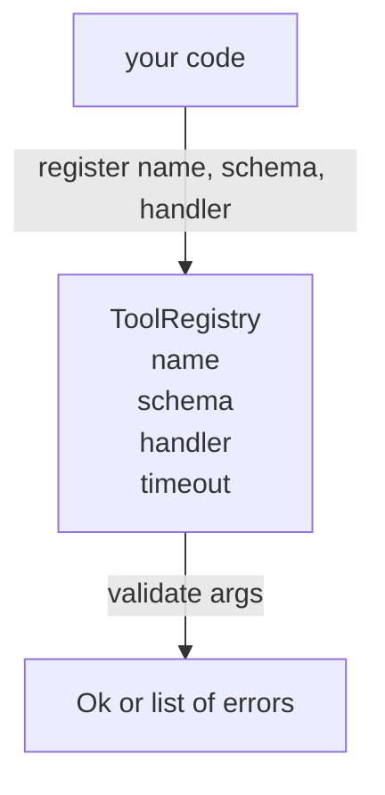

# 带 Schema Validation 的 Tool Registry

> agent 无法验证的 tool，就是 agent 无法调用的 tool。先构建 registry 和 schema checker，再构建 tools。

**Type:** Build
**Languages:** Python
**Prerequisites:** Phase 13 lessons 01-07, Phase 14 lesson 01
**Time:** ~90 minutes

## Learning Objectives
- 持有一个有类型的 registry，映射 tool name → schema → handler，让 dispatcher 只需查询一次，之后即可信任。
- 实现 JSON Schema 2020-12 的一个子集，覆盖百分之九十的 tool calls 实际使用的 keywords。
- 返回精确的、形如 json-pointer 的错误路径，让 model 可以在一次往返内自我修正。
- 在没有显式 override 的情况下拒绝重复注册，因为静默覆盖正是生产 tool catalogs 漂移的原因。
- 保持 validator 纯净（无 I/O、无时间、无 globals），这样它可以在 replay log 上重新运行。

```figure
cf-registry-validate
```

## 为什么 registry 要先于 tool

2026 年的 coding agent 拥有的 registered tools，比 model 能放进单个 context window 的还多。一个非平凡的 harness 会注册两百个 tools，并在任意一轮中暴露十到四十个。registry 是这些问题的唯一事实来源：“有哪些 tools 存在”、“它们的参数是什么形状”、“我应该调用哪个 handler”。一旦这三个答案被固定，harness 的其余部分就可以停止猜测。

我们要避免的错误，是发布没有 schemas 的 handlers，或发布没有 validation 的 schemas。两者都很常见。两者都会把下一层（第 twenty-three 课中的 dispatcher）变成猜谜游戏，而唯一的失败模式就是 handler 抛出的 stack trace。

## tool record 长什么样

```text
ToolRecord
  name        : str          (unique, lowercase alphanumeric and underscore segments separated by dots, e.g., snake_case.segment.case)
  description : str          (one line, shown to the model)
  schema      : dict         (JSON Schema 2020-12 subset)
  handler     : Callable     (async or sync, returns Any)
  idempotent  : bool         (dispatcher uses this for retry decisions)
  timeout_ms  : int          (override per-tool dispatcher default)
```

schema 是 validator 唯一会触碰的字段。handler 对它是不透明的。我们故意把二者分开。schema 是数据。handler 是代码。把它们混在一起，会诱使你把 validation logic 放进 handler，而这正是我们要阻止的 bug。

## JSON Schema 2020-12 子集

完整的 2020-12 spec 是一篇论文。我们需要八个 keywords。

```text
type           string / number / integer / boolean / object / array / null
properties     map of property name -> schema
required       list of property names
enum           list of allowed primitive values
minLength      integer, applies to strings
maxLength      integer, applies to strings
pattern        ECMA-262-compatible regex, applies to strings
items          schema applied to every array element
```

这足以覆盖 tool API 实际需要的内容。我们没有添加的 keywords（oneOf, anyOf, allOf, $ref, conditionals）在 production schemas 中是有效的，但会把 validator 变成一个带 cycles 的 tree walker。我们构建的是 registry，不是 JSON Schema engine。

## Json pointer 错误路径

validation 失败时，validator 返回一个 errors 列表。每个 error 都携带一个指向 input 内部的 json-pointer path。pointer 是一个以斜杠开头的序列，由 property names 和 array indices 组成。

```text
{"a": {"b": [1, 2, "x"]}}
                    ^
                    /a/b/2
```

model 读取 error paths 的能力强于读取句子的能力。如果 schema 要求 `args.user.email`，而 model 传入了一个 integer，error 应该是 `/user/email`，并带有 `expected_type: string`。model 会在下一次调用中修正它，不需要一轮自然语言说明。

## 注册与 override

`register(name, schema, handler, **opts)` 默认拒绝重复注册。调用方必须传入 `override=True` 才能替换。这是操作层面的卫生习惯。代码库的两个部分静默注册同一个 tool name，是那种会在 production 中花一周才能找到的 bug。

registry 暴露三个读取方法。`get(name)` 返回 record 或抛出异常。`validate(name, args)` 返回一个 `Ok` 或一组 errors。`names()` 按注册顺序返回 tool names。

## validator 是什么，不是什么

它是对 schema tree 的一次递归遍历。它是纯函数。它不调用 handlers。它不做类型强制转换（字符串 `"42"` 不会通过 number schema）。它不会静默截断。

它不是安全边界。validation 通过后，恶意 handler 仍然可能行为不当。第 twenty-three 课中的 dispatcher 会添加 timeout 和 sandbox 层。registry 添加的是形状。

## Shape



## 如何阅读代码

`code/main.py` 定义了 `ToolRegistry`、`ToolRecord`、`ValidationError`，以及八个 validator functions。validator 基于 `schema["type"]` dispatch（或把带有 `enum` 的 schema 当作 untyped enum check 处理）。每个 type validator 要么返回空列表，要么返回 `ValidationError` 列表。top-level walker 会拼接 errors，并在向下递归时前置 path segments。

`code/tests/test_registry.py` 覆盖 registration、override、validation success、带 paths 的 validation failure，以及该子集中的每个 keyword。

## 继续深入

这节课落地后，你会想要的两个 extensions 是：针对本地 definitions block 的 `$ref` resolution，以及用于严格形状的 `additionalProperties: false`。两者都很小。随着 tool catalog 增长到超过五十个 tools，两者都很常见。我们把它们留在本课之外，是为了让文件能在一次阅读中读完。

下一课（twenty-two）会构建 JSON-RPC stdio transport，把这个 registry 暴露给 model client。再下一课（twenty-three）会把二者包在一个带 timeouts 和 retries 的 dispatcher 后面。
