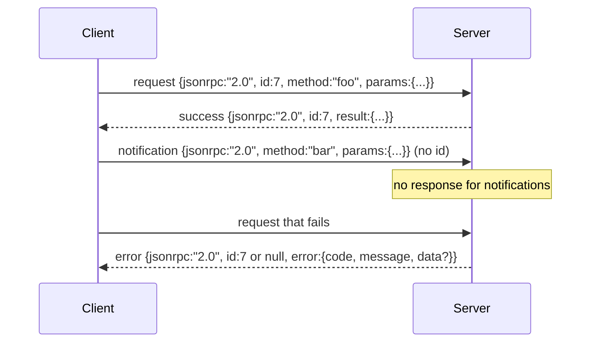

# 基于 Newline-Delimited Stdio 的 JSON-RPC 2.0

> model client 与 tool server 之间的 transport 是基于 stdio 的 JSON-RPC。手写一次它，会让你理解每一层 framing 都在付出什么成本。

**Type:** Build
**Languages:** Python
**Prerequisites:** Phase 13 lessons 01-07, Phase 14 lesson 01
**Time:** ~90 minutes

## Learning Objectives
- 使用通过 stdin 和 stdout 上的 newline-delimited JSON framing 的 JSON-RPC 2.0 通信。
- 映射五个标准 error codes（-32700, -32600, -32601, -32602, -32603），并以正确语义暴露它们。
- 区分 requests、responses、notifications 和 batches，而不发明新的 envelope keys。
- 每行处理一个 parse error，不污染 stream 的其余部分。
- 使用 io.BytesIO 构建一个会自行终止的 demo，让课程无需 spawn child process 即可运行。

```figure
cf-jsonrpc-frames
```

## 为什么 JSON-RPC 仍是 lingua franca

2026 年，一个 coding agent 在单个 session 中可能会和十二个 tool servers 通信。每个 server 都是一个独立 process 或 remote endpoint。wire format 自 2013 年以来一直相同。JSON-RPC 2.0 是两页 spec。它能存活下来，是因为替代方案（gRPC、每次调用一个 HTTP、自定义 binary）都会施加 JSON-RPC 没有的取舍：它们会在 streaming、batching 或 transport-coupling 中选择其一。JSON-RPC 在 stdio、sockets、websockets 和 HTTP 上是对称的，只要双方遵守 spec，client 就可以驱动一个从未见过的 server。

本课构建 stdio variant。Newline-delimited JSON。每个 request 是一行。每个 response 是一行。transport boundary 是 `\n`。

## wire shape

存在四种 envelope shapes。两种由 client 发出。两种由 server 发出。



notification 没有 `id`。server 不得响应它。如果 server 向 notification 返回 response，client 就没有办法把它关联到某个 call site。这个单一规则让 framing math 保持简单。

batch 是 requests 或 notifications 的 JSON array。server 返回一个 responses array，顺序任意，每个非 notification entry 对应一个 response。如果 batch 中的每个 entry 都是 notification，server 不发送任何内容。

## 五个 error codes

```text
-32700  Parse error      JSON could not be parsed
-32600  Invalid Request  Envelope shape is wrong
-32601  Method not found
-32602  Invalid params
-32603  Internal error
```

-32000 到 -32099 之间的 codes 保留给 server-defined errors。其他所有 code 都是 application-defined。本课只使用这五个。如果 handler 抛出异常，transport 会把它包装为 -32603，并在 `data.exception` 中放入 exception class name。

parse error 有一条特殊规则。response 中的 `id` 是 `null`，因为 request 尚未 parse 到足以提取 id 的程度。

## Newline framing 和 BytesIO demo

transport 一次读取一行。line 是直到并包括 `\n` 的 bytes。如果某一行无法 parse，transport 会写入一个带 `id: null` 的 -32700 response 并继续。stream 不会被污染。下一行会重新 parse。

本课中，我们把一对 `io.BytesIO` 包装成 stdin 和 stdout。server 读取 requests 直到 EOF，为每个 request 写入 responses，然后返回。client 再读回 responses。没有 process spawn。没有 timeouts。transport 行为与真实 subprocess pipe 完全相同，因为 Python 的 `io` interface 提供了同样的 `.readline()` 和 `.write()` contract。

## Method dispatch

transport 不知道有哪些 methods 存在。它把工作交给 harness 提供的 callable `handler(method, params)`。handler 返回 result 或抛出异常。三个 exception classes 暴露 specific codes。

```text
MethodNotFound -> -32601
InvalidParams  -> -32602
Anything else  -> -32603 with exception name in data
```

transport 永远不会看到 tool registry。registry 位于 handler 后面。这正是我们想要的 layering。transport 说 JSON-RPC。registry 说 tool shapes。dispatcher（第 twenty-three 课）把它们缝合在一起。

## errors 上的 stream 行为

```text
client writes              server reads             server writes
---------------            -----------              -------------
{...valid request...}      parses ok                {...response, id matches...}
{...broken json...         parse fails              {id:null, error: -32700}
{...valid request...}      parses ok                {...response, id matches...}
{...missing method...}     invalid envelope         {id:X, error: -32600}
```

一行 broken JSON 不会停止 loop。缺少 `method` field 不会停止 loop。handler exception 不会停止 loop。transport 会持续读取直到 EOF。

## Notifications 和非对称 flows

notification 是 fire-and-forget。harness 使用 notifications 表示 progress events、cancellation signals 和 log lines。notifications 让 long-running tool 可以 stream status updates，而不必每条都 round-trip 一次。

本课实现一个 outbound notification helper，`write_notification`。server 在 request 进行中用它发出 progress。demo 展示了这个 pattern：一个 request 进来，handler 发出两条 progress notifications，然后写入最终 response。

## 如何阅读代码

`code/main.py` 定义了 `StdioTransport`、parse helper（`parse_request`）、三个 write helpers（`write_response`、`write_error`、`write_notification`），以及 dispatch loop `serve`。error code constants 位于 module scope。

`code/tests/test_transport.py` 覆盖五个 error codes、notifications（不写 response）、batches（array in, array out, 跳过 notifications）、broken JSON（parse error 后继续），以及 handler 在调用中途写入 notification 的 asymmetric flow。

## 继续深入

这个 transport 足以支撑后续课程。production transports 会添加三件事。一个能在 forwarding 后继续存在的 correlation id field（你的 `id` 已经是这个，但在 mesh 中你还需要一个 outer trace id）。一个 cancellation channel（类似 `$/cancelRequest` 的 notification，携带 in-flight call 的 id）。以及一个 content-type negotiation handshake，让同一个 socket 可以同时说 JSON-RPC 和 Streamable HTTP。这些都不会改变 wire。它们只会添加 metadata。
