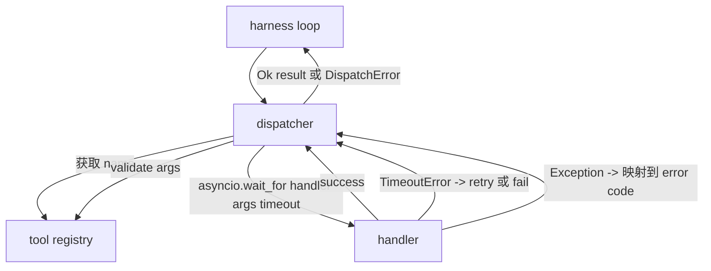
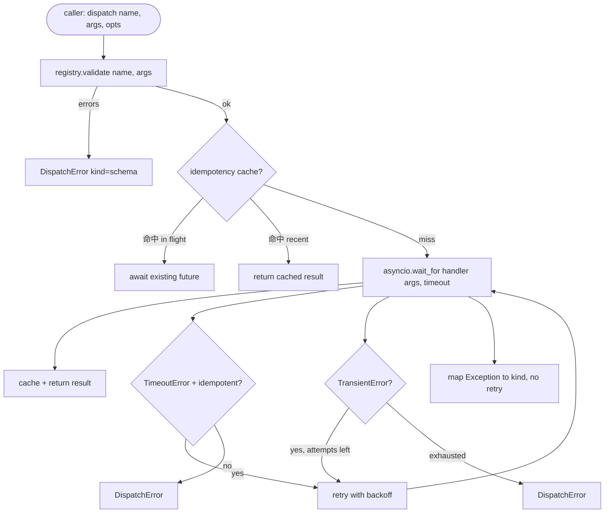

# Function Call Dispatcher

> dispatcher 是 harness 为 schema 做出的每个承诺买单的地方。Timeouts、retries、dedupe、error mapping。全部集中在一个接口边界上。

**Type:** Build
**Languages:** Python
**Prerequisites:** Phase 13 lessons 01-07, Phase 14 lesson 01
**Time:** ~90 minutes

## Learning Objectives
- 用 per-call timeout 包装 tool handler，使其返回 typed error，而不是让 loop 挂起。
- 应用带 jitter 和最大尝试次数的 exponential backoff retry。
- 基于 idempotency key 对 retries 去重，这样与缓慢 original call 竞争的 retry 不会运行两次。
- 将 handler exceptions 和 transport faults 映射到 harness loop 已经理解的单一 error envelope。
- 用 concurrency limit 约束 parallel dispatch，避免四十个 tool calls 的 fan-out 耗尽 event loop。

## Where the dispatcher sits

位于 harness loop（lesson twenty）和 tool registry（lesson twenty-one）之间。transport（lesson twenty-two）向 loop 输入。loop 把 tool call 交给 dispatcher。dispatcher 调用 registry，运行 handler，并返回 result 或 JSON-RPC 形状的 error envelope。



dispatcher 是唯一知道 timers、retries 和 idempotency 的层。loop 不知道。registry 不知道。handler 不知道。这种隔离就是重点。

## Timeouts

每个 tool 都有默认 timeout。registry record 携带 `timeout_ms`。当 harness 传入 per-call override 时，dispatcher 会用它覆盖默认值。我们使用 `asyncio.wait_for`。timeout 时，handler task 会被取消，dispatcher 返回 `DispatchError(kind="timeout")`。

对于 non-idempotent tools，timeout 默认不是 retryable error。一个超时的 `db.write` 可能已经提交，也可能没有。retry 会重复写入。dispatcher 遵循 registry record 中的 `idempotent` flag。Idempotent tools 会 retry。Non-idempotent tools 不会。

## Retries with exponential backoff

retry policy 最多三次尝试。Backoff 是带 jitter 的 exponential backoff。

```text
attempt 1  -> delay 0
attempt 2  -> delay 0.1s * (1 + random[0..0.5])
attempt 3  -> delay 0.4s * (1 + random[0..0.5])
```

只有 `timeout` 和 `transient` errors 会 retry。`schema` error、`not_found` 或 `internal` error 不会 retry。Schema errors 是确定性的。retry 不会改变结果，只会消耗 budget。

retry loop 会遵守 harness 给出的 budget。如果 caller 的 budget 剩余 tool calls 为零，dispatcher 会在第一次尝试时快速失败，并返回 `kind="budget_exceeded"`。

## Idempotency key dedupe

当 original call 仍在 in flight 时触发 retry，是一个真实的 production bug。第一次调用在四点九秒时挂起（刚好低于 timeout）。retry 在五秒时触发。现在两个 requests 竞态访问同一个 backend。如果 tool 是 `payments.charge`，你就扣款了两次。

dispatcher 接受可选的 `idempotency_key`。如果一个 call 到达时同一个 key 正在 in flight，dispatcher 会等待那个 in-flight future，并返回它的 result。cache 会在完成后保留 key 六十秒，以吸收迟到的 retries。

key 是 caller 的责任。harness 从 planner 派生它：`f"{step_id}:{tool_name}:{hash(args)}"`。dispatcher 不会发明 key，因为只从 arguments 派生 key 会让两个语义不同的 calls 看起来相同。

## Error envelope

失败的 dispatch 返回单一形状。

```text
DispatchError
  kind        : "timeout" | "transient" | "schema" | "not_found" | "internal" | "budget_exceeded"
  message     : str
  attempts    : int
  jsonrpc_code: int   （-32601、-32602、-32603 之一）
```

harness loop 将 `kind` 映射到下一个 state。`schema` 和 `not_found` 进入 `on_error` 并触发 replan。`timeout` 和 `transient` 进入 `on_error`，可能 replan，也可能不 replan，取决于 attempts。`budget_exceeded` 触发 `on_budget_exceeded`。

## Concurrency limit on fan-out

`gather(*calls)` 会同时运行所有 coroutines。四十个 tool calls 意味着四十个 open sockets 或四十个 subprocess pipes。大多数 backends 都不喜欢一个 client 发起四十个 parallel connections。

dispatcher 用 semaphore 包装 `gather`。默认 concurrency limit 是八。每个 call 在 dispatching 之前 acquire semaphore，并在完成时 release。caller 看到的是 `gather` 形状的 output，但实际 scheduling 是有界的。

## Flow for one call



## How to read the code

`code/main.py` 定义了 `Dispatcher`、`DispatchError` 和 `TransientError`。dispatcher 在构造时接收 registry。async `dispatch(name, args, ...)` 是唯一入口点。Per-attempt timeouts 在 `_run_with_retries` 内用 `asyncio.wait_for` inline 应用。`gather_bounded(calls)` 以 concurrency limit 运行多个 dispatches。

`code/tests/test_dispatcher.py` 覆盖 timeout 触发、transient 上的 retry、schema error 上不 retry、idempotency dedupe（两个带相同 key 的 concurrent calls 折叠为一次 handler invocation），以及 concurrency limiting（semaphore 生效）。

tests 使用 `asyncio.sleep(0)` 和基于 deterministic `Counter` 的 handlers，所以它们会在毫秒内完成，不依赖 wall-clock timing。

## Going further

production dispatchers 会添加两个扩展。第一，在每次 transition 上进行 structured logging（loop 的 event stream 已经提供这个能力，但 dispatcher 也应 emit `dispatch.attempt` 和 `dispatch.retry` events）。第二，circuit breakers：在一个窗口内发生 N 次失败后，tool 进入 cool-down period，dispatches 会立即返回 `kind="circuit_open"`，而不是尝试 handler。两者都可以加在这个 dispatcher 之上，而不改变 contract。

Lesson twenty-four 会把 dispatcher 粘合到 plan-and-execute agent，让你看到四个部分一起运转。
