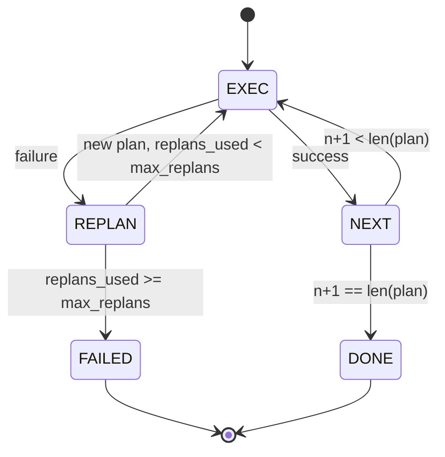

# Plan-Execute Control Flow

> 无法承受 failure 的 plan 是 script。能 replan 的 script 才是 agent。先构建 replanner。

**Type:** Build
**Languages:** Python
**Prerequisites:** Phase 13 lessons 01-07, Phase 14 lesson 01
**Time:** ~90 minutes

## Learning Objectives
- 将 plan 表示为 typed steps 的有序列表，让 executor 能推理 progress 和 outcome。
- 顺序执行 steps，并将 failure 受控地 handoff 回 planner。
- 从当前 cursor 开始 replan，并在 context 中带上 prior error，让下一个 plan 更有信息。
- 每次 revision 都 emit plan diff，让下游 tracer 或 UI 能展示 plan 为什么改变。
- 强制执行两个 budgets：硬性 step ceiling 和硬性 replan ceiling。

```figure
cg-plan-replan
```

## Plan-and-execute，而不是 chain-of-thought

chain-of-thought agent 会 emit tokens，并让 loop 猜测 tool call 在哪里结束。plan-and-execute agent 先 emit structured plan，然后确定性地执行每个 step。plan 是 harness 可以 introspect 的 data。execution 是 harness 通过 dispatcher 运行这些 data。

两个部分。一个 planner 产生 plan。一个 executor 运行 plan。真正有意思的是 executor 遇到 failure 时发生什么。三个选项：

```text
1. Abort         （返回 failed，暴露 error）
2. Skip          （将 step 标记为 failed，继续剩余部分）
3. Replan        （把 error 交给 planner，从 cursor 获取新 plan）
```

Replan 是把 script 变成 agent 的选项。

## Step 的形状

```text
Step
  id              : int           （在一个 plan revision 内单调递增）
  tool_name       : str
  args            : dict
  expected_outcome: str           （planner 声明的 success condition）
  result          : Any | None
  error           : str | None
```

`expected_outcome` 是 planner 与 step 一起 emit 的短句。executor 不会强制检查它。它有两个用途：replanner 在 revision plan 时读取它；event stream emit 它，让 tracer 能展示“这个 step 本来应该做 X”。

## Planner 的形状

```python
def planner(goal: str, history: list[Step], last_error: str | None) -> list[Step]:
    ...
```

一个 pure function。`goal` 是 user goal。`history` 是已经执行过的 steps（已填入 results 和 errors）。`last_error` 在第一次调用时是 None，在之后每次调用时是最近的 failure message。planner 返回从 cursor 开始的下一个 plan。

planner 不知道 executor。它不知道 retries。它不知道 timeouts。它只产生 plan。仅此而已。

## Executor

executor 是一个小型 state machine。每个 step 都通过 dispatcher 运行。outcome 有三种：success、failure-replannable、failure-fatal。Replannable failures 会 hand back 给 planner。Fatal failures（budget exceeded、replan ceiling hit）会返回 `FAILED` session result。



## Revision 时的 plan diff

当 planner 在 failure 后返回新 plan 时，executor 会 emit 一个包含三个字段的 `plan.diff` event。

```text
removed: 旧 plan 中存在但新 plan 中不存在的 step ids 列表
added  : 新 plan 中存在但旧 plan 中不存在的 step ids 列表
revised: tool_name 或 args 已改变的 step ids 列表
```

tracer 或 UI 可以把它渲染成 removed steps 的 strikethrough，以及 added ones 的 highlight。重点不是 diff format。重点是 revision 是一个可见 event，而不是静默 rewrite。

## 两个硬性 budget

`max_steps` 限制整个 session 中的总 step executions，包括 replans。默认是十二。一个线性的五步 plan，如果 replan 两次并且每次增加三个 steps，会达到十六次 executions，从而超过 budget。executor 会拒绝该 replan，并返回 FAILED。

`max_replans` 限制第一次 plan 之后 planner 被调用的次数。默认是五。这是更重要的 limit。一个连续五次返回同一个 broken plan 的 planner，否则会一直 loop，直到 step budget 捕获它。限制 replans 会让 failure 更快发生，原因也更清楚。

## 本课中的 deterministic planner

本 lesson 不调用 model。lesson 提供一个 deterministic planner，它根据 `last_error` 选择 plan。

```text
last_error is None    -> emit 一个 four-step plan
last_error matches X  -> emit 一个绕过 X 的 three-step plan
last_error matches Y  -> emit 一个优雅放弃的 two-step plan
otherwise             -> return []（表示没有内容可 replan）
```

这足以测试 executor 在每条 transition path 上的行为：success、replan-once、replan-twice、replan-exhaustion 和 step-budget exhaustion。

## Result 的形状

```text
SessionResult
  status      : "completed" | "failed"
  reason      : str     ("goal_met" | "step_budget" | "replan_budget" | "no_plan")
  history     : list[Step]
  revisions   : list[PlanDiff]
  events      : list[Event]
```

lesson twenty 中的 harness loop 可以直接读取它。lesson twenty-three 中的 dispatcher 执行每个 step。lesson twenty-one 中的 registry validate 每个 step 的 args。lesson twenty-two 中的 transport 会通过 JSON-RPC 将整个 flow 暴露给 model client。

## How to read the code

`code/main.py` 定义了 `PlanExecuteAgent`、`Step`、`PlanDiff`、`SessionResult` 和 deterministic planner。executor 是单个 `run(goal)` method，返回 `SessionResult`。plan diff 通过比较 step ids 和 `(tool_name, args)` tuples 计算。

`code/tests/test_agent.py` 覆盖 linear success、一次 mid-plan failure 后 replan、返回 `failed:replan_budget` 的 replan exhaustion、step-budget exhaustion，以及 plan-diff event format。

## Going further

连接到真实 model 后，你会需要两个扩展。第一，partial-plan caching：当一个 plan 的六个 steps 中前三个成功、之后失败时，你不想重新运行前三个。executor 已经保留 history；planner 只需要读取它。第二，parallel branches：当前 executor 是严格 sequential 的。emit independent branch（`gather_step` 而不是 `next_step`）的 planner 可以通过 dispatcher concurrent 运行两个 tool calls。

两者都会增加真实复杂度。在线性 executor 被固定之后，两者都更容易添加。这就是本 lesson 做的事。
