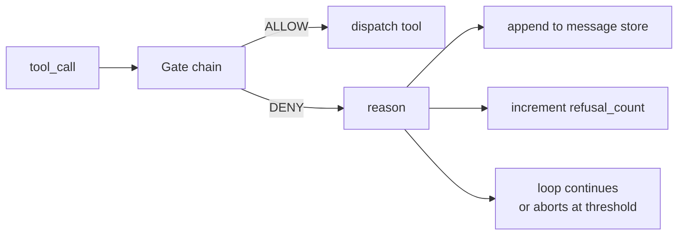
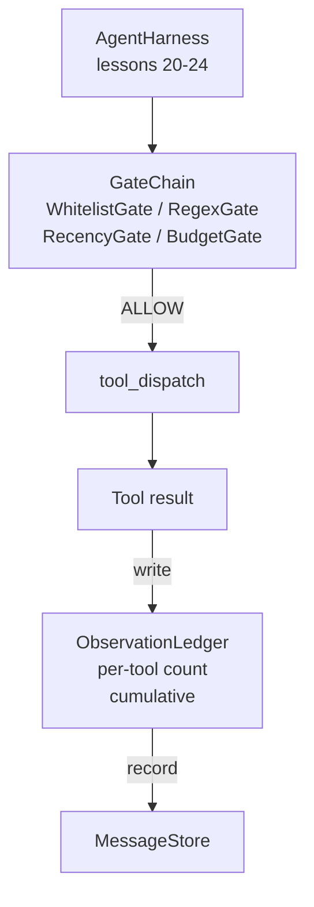

# Capstone 第 25 课：Verification Gates 与 Observation Budget

> 没有验证层的 agent harness，只是披着外套的愿望。本课会构建确定性的 gate chain，用来决定是否允许一次 tool call 触发、agent 可以看到多少输出，以及当 agent 已经读取太多内容时 loop 何时必须停止。这个 chain 由小型、具名的 gates 加上 observation ledger 组成；ledger 会追踪已经展示给模型的每一个 token。

**Type:** Build
**Languages:** Python (stdlib)
**Prerequisites:** Phase 19 · 20-24（Track A1：agent loop、tool registry、message store、prompt builder、model router），Phase 14 · 33（instructions as constraints），Phase 14 · 36（scope contracts），Phase 14 · 38（verification gates）
**Time:** ~90 minutes

## Learning Objectives

- 构建带有确定性 `evaluate(call)` 方法的 `VerificationGate` protocol。
- 将 budget、recency、whitelist 和 regex gates 组合成具有 short-circuit 语义的 chain。
- 通过按 tool 和 turn 建索引的 `ObservationLedger` 追踪每一次 observation。
- 当累计 observation budget 将被超出时，拒绝一次 tool call。
- 暴露结构化的 `GateDecision` record，供下游 observability 摄取。

## 问题

当 agent harness 允许模型自由调用 tools 时，真实使用的第一个小时内就会出现三类 bug。

第一类是无界 observation。对一个 20 万行 repo 执行 grep，会把 50 万 token 的输出倒进下一轮。模型每千字节只看到一个匹配，其余 context 全被浪费。token 账单很高，而 agent 在任务上的表现反而变差了。

第二类是 stale recency。一个长时间运行的任务会累积 50 次 tool calls。模型会把第三轮的第一个 read_file 当作实时状态重新读取。第四十七轮做出的 edits 没有出现，因为 prompt builder 先序列化了最早的 observations。

第三类是 privilege creep。一个研究任务从调用 `web_search` 开始，随后不知怎么就运行了 `shell`，因为模型编造了一个 tool name，而 harness 默认宽松。等有人读取 trace 时，/tmp 里已经放着一个垃圾文件，并且一次 curl 已经打到了私有 API。

Verification gate 是 harness 中负责说“不”的组件。它不是模型。它不是 judge。它是 `(call, history, ledger)` 的确定性函数，返回 ALLOW 或 DENY，并附带 reason。reason 会被记录。模型会被告知。loop 会继续或中止。

## 概念



gate 是任何带有 `evaluate(call, ctx) -> GateDecision` 方法的对象。chain 是一个有序列表。evaluation 在第一次 deny 时 short-circuit。顺序很重要：便宜的结构性 gates 会先于昂贵的 token-counting gates 运行。

本课提供四个 gates：

- `WhitelistGate`。允许的 tool names 是一个显式集合。集合外的任何内容都会被 deny。这是最便宜的 gate，会最先运行。
- `RegexGate`。Tool arguments 会与 regex 匹配。适合拒绝包含 `rm -rf` 的 shell calls，或发往内部 IP 的 HTTP calls。它只依赖 call payload。
- `RecencyGate`。模型只能看到最近 N 轮的 observations。更旧的 observations 会被遮蔽。该 gate 会拒绝其结果会扩展一个已经过期的 observation window 的 tool call。
- `BudgetGate`。模型在整个 session 中累计读取的 tokens 有一个上限。当 ledger 表明已经达到上限时，后续每一次 tool call 都会被 deny。

observation ledger 负责记账。每一次成功的 tool call 都会写入一行：tool name、turn、tokens emitted、cumulative。ledger 回答两个问题：模型总共看到了多少，以及它看到了 tool X 的多少。budget gate 读取第一个。per-tool budget gate 是你的练习内容，它会读取第二个。

```figure
cg-gate-chain
```

## 架构



harness 会询问 chain。chain 要么点头，要么拒绝。如果它点头，tool 会运行，ledger 会计数，结果会被追加到 message store。如果它拒绝，模型会以 system message 的形式拿到 refusal，然后 loop 决定是重试还是中止。

## 你将构建什么

实现是一个 `main.py` 加 tests。

1. `Observation` 和 `ToolCall` dataclasses 定义 wire shapes。
2. `ObservationLedger` 记录 `(turn, tool, tokens)` rows，并回答 `cumulative()` 和 `per_tool(name)`。
3. `GateDecision` 携带 `(allow, reason, gate_name)`。
4. `VerificationGate` 是 protocol。每个 gate 都实现 `evaluate(call, ctx)`。
5. `GateChain` 包装一个有序列表。它会调用每个 gate，返回第一个 deny；如果所有 gate 都通过，则返回 allow。
6. demo 运行一个很小的 synthetic agent loop。三轮。第三轮触发 budget gate，loop 会报告一次干净的 refusal，并带有非零 refusal count。

token counter 有意采用很粗糙的 `len(text) // 4` heuristic。本课重点是 gate plumbing，而不是 tokenizer。生产环境中请替换为真正的 tokenizer。

## 为什么 chain 顺序重要

一次 deny 比一次 allow 更便宜。`WhitelistGate` 运行 O(1) hash lookup。`RegexGate` 运行 O(pattern * argv)。`RecencyGate` 读取 message store 的一个小 slice。`BudgetGate` 读取整个 ledger。你需要按成本升序排列它们，这样被 deny 的 call 就能在执行昂贵工作前 short-circuit。

你还要按 blast radius 排序。Whitelist 是最强的主张：这个 tool 不在 contract 中。regex gate 其次：这个 argument 不在 contract 中。Recency 在后面：harness 仍然关心，但 call 在结构上是合法的。Budget 放在最后，因为按照定义，它只会在其他所有检查都通过后触发。

## 它如何与 Track A 的其余部分组合

之前的课程已经给了你 loop、tool registry、message store、prompt builder 和 model router。本课添加模型与 tools 之间的层。第 26 课会提供 sandbox，当 gate chain 返回 ALLOW 后，dispatcher 会把 tool call 交给它。第 27 课会提供 eval harness，把 refusal counts 作为质量信号记录下来。第 28 课会把 gate decisions 接入 OpenTelemetry spans。第 29 课会把这些内容拼接成一个可工作的 coding agent。

## 运行方式

```bash
cd phases/19-capstone-projects/25-verification-gates-observation-budget
python3 code/main.py
python3 -m pytest code/tests/ -v
```

demo 会打印逐轮 trace，其中包括每一个 gate decision，并以零退出。tests 覆盖 ledger、每个独立 gate、chain short-circuit，以及端到端 synthetic loop。
