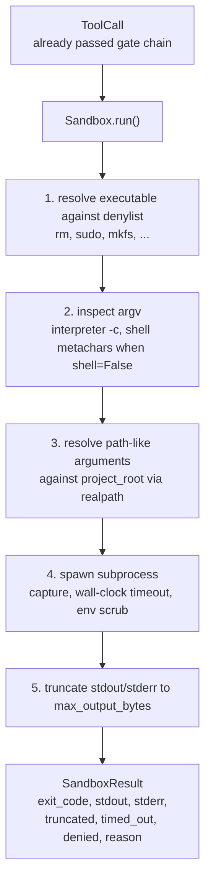
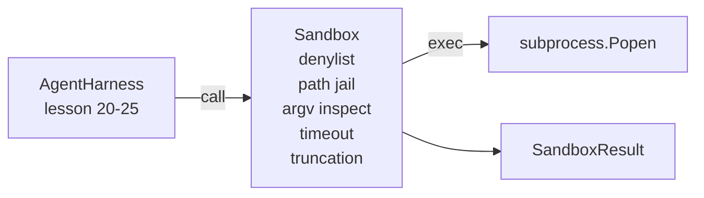

# Capstone 第 26 课：带 Denylist 与 Path Jail 的 Sandbox Runner

> verification gate 决定一次 tool call 是否应该运行。sandbox 决定它运行时会发生什么。本课提供一个 subprocess runner，它会拒绝危险的 executables，拒绝危险的 argv shapes，将每个 file path 限制在 project root 内，截断超大输出，并在 wall-clock timeout 时杀死 runaway processes。它是位于模型和 operating system 之间的两个层中的第二层。

**Type:** Build
**Languages:** Python (stdlib)
**Prerequisites:** Phase 19 · 25（verification gates and observation budget），Phase 14 · 33（instructions as constraints），Phase 14 · 38（verification gates）
**Time:** ~90 minutes

## Learning Objectives

- 构建一个包装 `subprocess.run` 的 `Sandbox` class，带有 timeout、capture 和 truncation。
- 按名称通过 denylist、按结构通过 argv inspector 拒绝 command。
- 拒绝任何解析到声明的 project root 之外的 path argument。
- 在 shell mode 关闭时拒绝 shell metacharacters。
- 返回结构化的 `SandboxResult`，供下游 observability 和 eval harness 摄取。

## 问题

能够 shell out 的 coding agent 可以在一个 turn 内安装 backdoors、外泄 keys、损坏开发者 laptop，并产生 cloud bill。成本最低的防御是不给它 shell。成本第二低的是一个会对精确 pattern list 说“不”的 sandbox。

agent traces 中反复出现三类 failure。

第一类是危险 executables。一个在修复 path 问题上承压的模型会尝试 `sudo`、`chmod -R 777`、`rm -rf`、`mkfs`、`dd`。这些都不属于 agent run。denylist 会按名称和 alias 捕获它们。

第二类是 argv tricks。一个被告知不能用 shell 的模型，会通过 interpreter 管道化攻击：`python3 -c "import os; os.system('rm -rf /')"`、`bash -c '...'`、`node -e '...'`、`perl -e '...'`。sandbox 需要知道，任何带有类似 `-c` flag 的 interpreter run，其实就是多了几步的 shell call。

第三类是 path escape。模型被要求读取 `./src/main.py`，却读取了 `../../etc/passwd`。sandbox 会通过 `os.path.realpath` 解析每个 path argument，并断言其 prefix，从而将它们限制在 jail 内。

这个 sandbox 不是 operating system 意义上的 security boundary。一个拥有 code execution 的坚定攻击者仍然可以逃逸。这个 sandbox 是 development-time guardrail：它让常见 failure modes 变得显眼，并阻止 agent 因单纯的笨拙而造成破坏。

## 概念



sandbox 有四个 refusal axes：name、argv、path、structure。每个 axis 都是 call 的纯函数，此时还没有 subprocess。只有所有 axis 都通过后，subprocess 才会 spawn。

`SandboxResult` exit codes 使用惯例值：0 表示 success，非零表示 failure，另外有三个 sentinel codes：denied (-100)、timed_out (-101) 和 truncated（exit code 是真实值，同时设置 flag）。下游课程会读取这个结构化 result，而不是解析 stderr。

## 架构



denylist 是 executable basenames 的 frozenset。aliases（`/bin/rm`、`/usr/bin/rm`）都会解析到相同的 basename。argv inspector 了解 interpreter shape：任何 argv[0] 是 interpreter 且后续任一 arg 以 `-c` 或 `-e` 开头的 argv 都会被 deny。当 call 没有显式请求 shell 时，shell metacharacters（`;`、`|`、`&`、`>`、`<`、backticks、`$()`）会导致 refusal。

path jail 是最微妙的部分。sandbox 在构造时接受 `project_root`。任何看起来像 path 的 argument（包含 `/` 或匹配现有文件）都会通过 `os.path.realpath` 归一化，然后与 project root 的 realpath 比较。如果解析后的 target 不在 root 下，则 refusal。Symlink escape attempts（project root 中指向外部的 symlink）会被检查 realpath 阻止，而不是检查字面路径。

## 你将构建什么

实现是 `main.py` 加一个 tests 目录。

1. `SandboxResult` dataclass：exit_code、stdout、stderr、truncated、timed_out、denied、reason、duration_ms。
2. `SandboxConfig` dataclass：project_root、max_output_bytes、timeout_seconds、denylist、interpreter_block。
3. `Sandbox` class：`run(argv, *, shell=False, cwd=None)` 返回 `SandboxResult`。
4. 内部 refusal helpers：`_check_executable_denylist`、`_check_argv_interpreter`、`_check_shell_metachars`、`_check_path_jail`。
5. output truncation，带清晰的 `truncated` flag 和 captured stream 中的 marker line。
6. 底部 demo：一系列合法与 adversarial calls。每个 call 都会显示其 result。

sandbox 默认使用 `subprocess.run` 且 `shell=False`、`capture_output=True`。wall-clock timeout 使用 `timeout` argument；在 `TimeoutExpired` 时，sandbox 会杀死 process group 并合成一个 SandboxResult。

## 为什么这不是真正的 sandbox

本课的 sandbox 不使用 namespaces、cgroups、seccomp、gVisor、Firecracker 或任何 kernel-level isolation。subprocess 能做的任何事情，sandbox 都能做。保护是结构性的：agent 会被拒绝执行最常见的危险 invocations，而显眼的 refusal 会进入 observability，而不是静默运行。

对于生产 agents，你需要在其上叠加：在 unprivileged Docker container 中运行、在 microVM 中运行、drop capabilities、将 project root 挂载为 read-only 并将 scratch dir 挂载为 read-write、对 memory 和 CPU 设置 ulimit、将 environment 清理为已知安全的 whitelist。第 29 课会做其中一部分。operating-system isolation 不在本课范围内。

## 运行方式

```bash
cd phases/19-capstone-projects/26-sandbox-runner-denylist
python3 code/main.py
python3 -m pytest code/tests/ -v
```

demo 会创建一个 temp directory，放入一个干净文件，然后运行一组 calls。合法 calls 会成功。被 deny 的 calls 会返回带有 `denied=True` 和 reason 的 SandboxResult。Timeouts 会返回 `timed_out=True`。Truncation 会设置 `truncated=True`。demo 会打印 outcomes 的 JSON table，并以零退出。

## 它如何与 Track A 的其余部分组合

第 25 课产出了 gate chain。第 26 课是在 gate ALLOW 之后运行的 executor。第 27 课的 eval harness 会把 sandbox results 与每个 task 期望的 exit-code 进行比较。第 28 课会围绕每次 `Sandbox.run` 调用发出一个 `gen_ai.tool.execution` span。第 29 课的端到端 demo 会把一个真实 coding agent 接入这两层。
